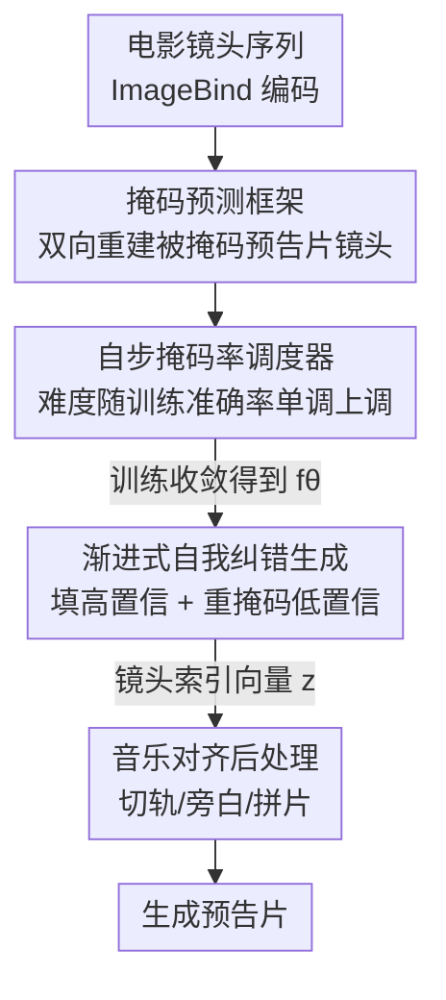

# Self-Paced and Self-Corrective Masked Prediction for Movie Trailer Generation

**会议**: CVPR 2026  
**论文**: [CVF Open Access](https://openaccess.thecvf.com/content/CVPR2026/html/Zhu_Self-Paced_and_Self-Corrective_Masked_Prediction_for_Movie_Trailer_Generation_CVPR_2026_paper.html)  
**代码**: https://github.com/Dixin-Lab/SSMP （有）  
**领域**: 视频理解  
**关键词**: 电影预告片生成, 掩码预测, 自步学习, 自我纠错, 双向上下文建模

## 一句话总结
把电影预告片生成重新表述成「以电影镜头为 prompt、对预告片镜头序列做掩码重建」的任务，用一个 Transformer 编码器配合自步调度的掩码率与迭代式重掩码（self-correction）生成预告片，在 F1 和排序准确率上显著超过 selection-then-ranking 与自回归方法。

## 研究背景与动机
**领域现状**：自动预告片生成要从一部完整电影里挑出关键镜头并重新排序成一段吸引人的短片。主流做法是「先选后排」（selection-then-ranking）：先用某种打分（视觉吸引力、镜头情绪强度、与字幕/剧情的相关性等）选出候选镜头，再借助音乐-视频一致性或大模型叙事辅助对它们排序。近期也有工作把它当成序列到序列问题，用自回归（AR）逐个镜头预测。

**现有痛点**：「先选后排」把本来强耦合的「选」和「排」拆成两步，模型无法联合推理镜头之间的语义相关性与时序连续性，第一步的选择错误会直接传播到排序阶段。自回归方法虽然把两步合一，但严格按从左到右的顺序生成、缺乏回头修改早期决策的能力——一旦前面某个镜头选错，后面只能将错就错。

**核心矛盾**：两类范式都缺少**自我纠错**机制，而这恰恰是人类剪辑师的核心工作方式——专业剪辑师会反复打磨，在不同位置上来回替换镜头，而不是一次定稿。缺少这种回环，模型就会受困于不可避免的误差传播。

**本文目标**：（1）建一个具备双向上下文建模、能逐步自我纠错的预告片生成器；（2）让训练任务难度能自适应模型当前水平，提升训练效率与稳定性。

**切入角度**：作者借鉴 BERT/LLaDA 的掩码预测思路——双向掩码重建天然允许模型综合全局上下文、且能反复重掩码低置信位置，正好对应剪辑师「反复挑选替换」的工作流。

**核心 idea**：把预告片生成表述成「条件掩码预测」——以电影镜头序列为 prompt，把预告片镜头序列随机掩码后让模型重建；训练时用**自步掩码率调度**让任务难度跟着模型走，生成时每步只填高置信位置、重掩码其余位置形成**渐进式自我纠错**。

## 方法详解

### 整体框架
SSMP 把电影 $\mathcal{M}=\{m_i\}_{i=1}^{I}$ 和预告片 $\mathcal{V}=\{v_j\}_{j=1}^{J}$ 都用 TransNet-v2 切成镜头序列，每个镜头当作一个 token，用冻结的 ImageBind 提取 $D=1024$ 维特征。因为预告片镜头必然来自电影镜头（$\mathcal{V}\subset\mathcal{M}$），任务本质是「为每个预告片位置从电影镜头里挑一个」。模型主体是一个四层 Transformer 编码器 $f_\theta$（mask predictor）：训练时把电影特征（prompt，保持不变）和被掩码的预告片特征拼接送入，让它双向重建被掩码位置；生成时从「全掩码」的预告片序列出发，迭代地填高置信镜头、重掩码低置信镜头，直到所有位置填满，最后按音乐节拍做后处理拼成成片。

### 关键设计

**1. 掩码预测框架：用双向重建替代「先选后排」与自回归**

针对两步式与自回归无法联合建模、且无法回头修改的痛点，作者把预告片生成改写成 BERT 式的条件掩码重建。先用余弦相似度为每个预告片镜头确定它「最像哪个电影镜头」，得到 0/1 的对齐真值矩阵 $G=[g_{j,i}]$：$s_{j,i}=\frac{\langle v_j,m_i\rangle}{\|v_j\|\|m_i\|}$，$g_{j,\ell}=1$ 当且仅当 $\ell=\arg\max_i s_{j,i}$。训练时把目标镜头按比例 $t$ 随机替换成可学习的 mask placeholder $\mathrm{MP}$，得到部分掩码序列 $V^t$，再把 $[\mathcal{M};V^t]$ 喂给 $f_\theta$ 双向预测所有被掩码位置的特征 $\hat{V}^t$。预测特征与全部电影镜头比余弦相似度并 softmax，得到「把第 $i$ 个电影镜头放到第 $j$ 个预告片位置」的条件概率：

$$\hat{s}^t_{j,i}=\frac{\langle \hat{v}^t_j, m_i\rangle}{\|\hat{v}^t_j\|_2\|m_i\|_2},\quad P^t=\mathrm{Softmax}(\hat{S}^t).$$

训练目标是只在被掩码位置 $\mathcal{J}'$ 上的交叉熵（按掩码率 $\frac{1}{t}$ 归一）：$\min_\theta -\mathbb{E}\big[\frac{1}{t}\sum_i\sum_{j\in\mathcal{J}'} g_{j,i}\log p_{j,i}\big]$。这种双向建模让「选」和「排」一次性联合完成，且天然支持后续的重掩码纠错，这是它优于单向自回归的根本原因。

**2. 自步掩码率调度器：让任务难度跟着模型能力走**

掩码率 $t$ 直接决定重建难度——太低任务太简单、训不出能力；太高任务太难、模型不收敛。作者不固定也不随机设置 $t$，而是按训练准确率动态调度。每个优化步先算这一批的训练准确率 $a_n$（被掩码位置上 $\arg\max_i p_{j,i}$ 命中真值的比例），再用动量式更新：

$$b_{n+1}=\mu_a a_n+(1-\mu_a)b_n,$$
$$\tilde{t}_{n+1}=\mu_t t_n+(1-\mu_t)[t_{\min}+\Delta t\cdot\sigma_\beta(b_{n+1}-0.5)],\quad t_{n+1}=\max\{t_n,\tilde{t}_{n+1}\}.$$

其中 $b_{n+1}$ 是历史准确率的动量项，$\sigma_\beta$ 是带温度 $\beta$ 的 sigmoid，把准确率平滑映射到 $[t_{\min},t_{\max}]=[0.1,1]$：准确率高就把掩码率往 $t_{\max}$ 推、准确率低就维持。第三行的 $\max$ 强制掩码率**单调不减**——一旦在当前难度做得好就不再降低难度，避免模型退回到容易任务而停滞。动量项还能在准确率剧烈波动时稳住更新，不让掩码率乱跳。

**3. 渐进式自我纠错生成：每步只锁高置信、其余重掩码**

针对「早期决策无法修改」的痛点，生成阶段从全掩码序列 $V_0=[\mathrm{MP}]$ 出发迭代填充。引入累积置信向量 $q=[q_j]\in[0,1]^J$（初始为 0）记录每个位置的填充信心：每轮预测后，对每个位置取候选镜头 $i^*_j=\arg\max_{i\in\mathcal{I}_k} p_{j,i}$ 并累加置信 $q_j=\min\{q_j+p_{j,i^*_j},1\}$，然后按 $\tau\sim\mathrm{Bernoulli}(q_j)$ 随机决定这一轮是否锁定该位置——$\tau=1$ 就把候选镜头填进去、从候选集和位置集里移除，$\tau=0$ 就把它重新掩码留到下一轮。这样每轮只稳定地确定一部分高置信镜头，低置信位置被反复重掩码、在越来越可靠的上下文下重新预测。累积置信 $q$ 起到平滑噪声、识别「持续高置信」位置的作用；因为 $q_j$ 单调增、最终都会趋于 1，所以过程能在有限轮内收敛、所有位置必被填满。这正是对人类剪辑师「来回替换镜头」的模仿，从机制上抑制了误差传播。

### 损失函数 / 训练策略
训练用式 (4) 的交叉熵损失（消融显示 CE 显著优于 MSE，因为 MSE 在高维特征上受维度灾难影响、缺少判别 margin）。优化器 AdamW，学习率 $10^{-4}$ + cosine 调度 + 0.1 warmup，weight decay 0.1，$\beta_2=0.95$。调度器超参 $\beta=10,\mu_a=0.98,\mu_t=0.1$。模型 4 层 Transformer、每层 4 个注意力头、hidden size 1024、FFN 2048；在单张 H100 上训练 500 epoch、batch size 5。生成的预告片镜头数 $J$ 由 Ruptures 检测的音乐段数决定，后处理沿用 MMSC：按音乐切轨对齐镜头时长，用 DeepSeek-V3 选关键字幕做旁白、MiniCPM-V2.6 给每个镜头生成一句描述，再用 CLIP 文本相似度 + 动态规划对齐旁白位置。

## 实验关键数据

数据集基于 CMTD（500 部电影、922 个预告片）扩展，含 Test-8 / Test-74 两个测试集；另收集 2024 年新上映的 30 对电影-预告片组成 Test-2024 验证泛化；三者合并为 Test-ALL 用于消融。指标：选片用 Precision/Recall/F1，排序用 Levenshtein Distance（LD，越低越好）和 Pairwise Agreement Accuracy（AA，越高越好）。

### 主实验

| 测试集 | 方法 | F1↑ | LD↓ | AA↑ |
|--------|------|------|------|------|
| Test-8 | MMSC（先选后排 SOTA） | 0.1391 | 99.25 | 0.58 |
| Test-8 | TGT（自回归） | 0.1153 | 103.87 | 0.48 |
| Test-8 | **SSMP（本文）** | **0.1618** | **99.50** | **0.68** |
| Test-74 | MMSC | 0.1991 | 82.48 | 0.50 |
| Test-74 | TGT | 0.1326 | 88.29 | 0.43 |
| Test-74 | **SSMP（本文）** | **0.2373** | **81.87** | **0.67** |
| Test-2024 | MMSC | 0.1506 | 93.91 | 0.52 |
| Test-2024 | TGT | 0.1601 | 103.25 | 0.46 |
| Test-2024 | **SSMP（本文）** | **0.1759** | **93.29** | **0.60** |

F1 在两个主测试集上分别超过 MMSC 2.27% 和 3.82%，AA 分别大涨 10% 和 17%——排序准确率的大幅提升正是双向上下文 + 自我纠错的直接体现。在 2024 新片上同样领先，说明泛化稳健。25 人用户研究从主题/节奏/吸引力/贴近度四个维度打分（1–7），SSMP 在雷达图上全面领先。

### 消融实验

| 配置 | F1↑（Test-ALL） | AA↑ | 说明 |
|------|------|------|------|
| 随机掩码率 | 0.1377 | 0.64 | 难度不随模型变 |
| 线性递减 | 0.1760 | 0.66 | 由难到易 |
| 线性递增 | 0.1915 | 0.66 | 由易到难（已不错） |
| **自步调度** | **0.1996** | **0.68** | 跟着准确率走，最好且收敛更快 |
| 贪心生成（只填最高置信位） | 0.1958 | 0.67 | 无重掩码纠错 |
| **自我纠错生成** | **0.1996** | **0.68** | 低置信位可反复重估 |
| MSE 损失 | 0.1211 | 0.56 | 高维距离无判别 margin |
| **CE 损失** | **0.1996** | **0.68** | 拉高正确镜头、压低其余 |

### 关键发现
- **「递增 > 递减/随机」验证了课程式难度的价值**：线性递增已能到 0.1915 F1，说明从易到难的顺序本身就重要；自步调度在此基础上再按模型实时表现微调，拿到最佳 0.1996，且达到 0.95 准确率所需步数最少。
- **掩码率动量 $\mu_t$ 鲁棒**：$\mu_t=0.1$ 最好（F1 0.1996），但在 $[0.1,0.9]$ 区间内性能都稳定，说明调度器对超参不敏感。
- **自我纠错的增益主要体现在排序**：相比贪心，F1 +0.0038、AA 从 0.67 升到 0.68、LD 从 92.60 降到 91.19——累积置信让低置信位置在更可靠上下文下被重估，抑制了误差传播。
- **放宽位置容忍 R 后指标大涨**（R=0→2 时 Test-8 的 F1 从 0.16 升到 0.63），印证「相邻镜头常属同一场景、轻微错位仍合理」，也说明严格逐位匹配低估了真实质量。

## 亮点与洞察
- **把 BERT 式掩码预测搬到「镜头级离散选择」任务上**，且用「预测特征 vs 电影镜头特征的余弦相似度 + softmax」把重建变成对电影镜头的分类，巧妙绕开了直接回归高维视觉特征的困难（消融里 MSE 远差于 CE 就是佐证）。
- **「生成即重掩码」的自我纠错**是最 "啊哈" 的点：用一个累积置信向量 $q$ + 伯努利采样，就把「人类剪辑师反复替换镜头」这件事形式化成一个能保证有限步收敛的迭代过程，比自回归的一锤定音更贴近真实剪辑。
- **自步掩码率调度可迁移**：任何「掩码比例 = 任务难度」的掩码重建任务（视频/音频/多模态 token 重建）都能套用「按训练准确率动量调度、单调不减」这套调度器来加速收敛。

## 局限与展望
- **依赖镜头来自电影这一强假设**（$\mathcal{V}\subset\mathcal{M}$）：真实预告片可能含特效字幕卡、跨片素材或重新调色镜头，纯「从电影镜头里挑」的表述覆盖不了这类创作。
- **预告片长度 $J$ 由音乐段数外部决定**而非模型自主决策，意味着节奏其实被预设的音乐轨绑定，弱化了「生成」的自主性。
- **评测对位置错位敏感**：R=0 的严格匹配会大幅低估质量（R=2 时 F1 翻数倍），主指标可能并不能完全反映观感；可探索更贴近人类感知的软对齐指标。
- **真值对齐靠 ImageBind 余弦相似度的硬 argmax 构造**，若编码器对某些镜头区分度不足，监督信号本身就含噪，可能限制上限。

## 相关工作与启发
- **vs 先选后排（IPOT / MMSC）**：它们把选片和排序解耦、分两阶段打分，第一步误差会传到第二步；SSMP 用双向掩码重建一次联合完成「选 + 排」，AA 大幅领先（Test-74 上 0.67 vs 0.50），证明联合建模对时序排序更有利。
- **vs 自回归（TGT）**：TGT 严格从左到右逐镜头预测、无法回头改；SSMP 每步只锁高置信位、其余重掩码，可在全局上下文下反复修正，F1/AA 全面超过 TGT。
- **vs BERT / LLaDA**：本文继承了「掩码重建 + 双向上下文」的思想，但 LLaDA 等用随机/固定掩码率，本文首次引入**自步、单调递增**的掩码率调度，并把掩码预测从文本/像素 token 迁移到「电影镜头选择」这一离散结构化输出。

## 评分
- 新颖性: ⭐⭐⭐⭐ 首次把预告片生成表述为掩码预测，并配自步调度 + 生成期重掩码自我纠错，范式确实新。
- 实验充分度: ⭐⭐⭐⭐ 三测试集 + 用户研究 + 四组消融（掩码调度/动量/自纠错/损失）覆盖到位，但缺更大规模和跨数据集对比。
- 写作质量: ⭐⭐⭐⭐ 动机-机制-公式衔接清晰，算法伪代码完整；部分符号（如生成阶段相似度下标）略有笔误。
- 价值: ⭐⭐⭐⭐ 在预告片生成上刷新 SOTA 且代码开源，自步掩码调度可迁移到其他掩码重建任务。

<!-- RELATED:START -->

## 相关论文

- [\[CVPR 2026\] Exploring Adaptive Masked Reconstruction for Self-Supervised Skeleton-Based Action Recognition](exploring_adaptive_masked_reconstruction_for_self-supervised_skeleton-based_acti.md)
- [\[CVPR 2026\] Self-Critical Distillation Network for Video-based Commonsense Captioning](self-critical_distillation_network_for_video-based_commonsense_captioning.md)
- [\[CVPR 2026\] Boosting Self-Supervised Tracking with Contextual Prompts and Noise Learning](boosting_self-supervised_tracking_with_contextual_prompts_and_noise_learning.md)
- [\[CVPR 2026\] MoVie: Broaden Your Views with Human Motion for Action Detection](movie_broaden_your_views_with_human_motion_for_action_detection.md)
- [\[CVPR 2026\] Video-CoE: Reinforcing Video Event Prediction via Chain of Events](video-coe_reinforcing_video_event_prediction_via_chain_of_events.md)

<!-- RELATED:END -->
