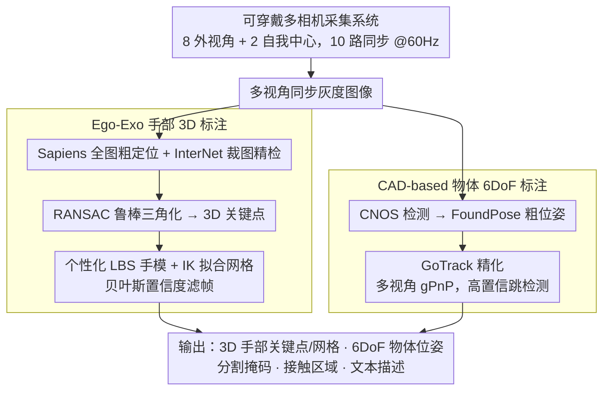

# SHOW3D: Capturing Scenes of 3D Hands and Objects in the Wild

**会议**: CVPR 2026  
**arXiv**: [2603.28760](https://arxiv.org/abs/2603.28760)  
**代码**: [https://show3d-dataset.github.io/](https://show3d-dataset.github.io/)  
**领域**: 视频理解  
**关键词**: 手物交互数据集, 野外3D标注, 多相机采集, 自我中心视觉, 手部姿态估计

## 一句话总结

提出首个真正野外环境下具有精确3D标注的手-物体交互数据集SHOW3D，通过设计轻便可穿戴多相机背包系统和ego-exo融合标注pipeline，采集430万帧多视角数据，手部和物体均达到亚厘米级标注精度，跨数据集实验验证其训练模型的泛化优势。

## 研究背景与动机

1. **领域现状**：手-物体交互的3D理解对AR/VR和机器人至关重要，现有数据集（GigaHands、HOT3D、ARCTIC等）主要在室内工作室中用动捕系统或固定多相机阵列采集。
2. **现有痛点**：工作室环境限制了场景多样性和真实性——固定设备限制移动自由，标记点（marker）影响手和物体的视觉外观。另一极端如Ego-Exo4D环境多样但缺乏精确3D标注。
3. **核心矛盾**：环境真实性与3D标注精度之间存在根本性权衡。要么有精确标注但环境受限，要么环境多样但缺乏标注。
4. **本文目标**：打破这个权衡——在真正野外环境中获取精确的手和物体3D标注。
5. **切入角度**：设计约8公斤的背包式多相机系统，无需marker，用先进的2D检测+多视角三角化实现无标记的自动3D标注。
6. **核心 idea**：用可穿戴多相机系统+ego-exo自动标注pipeline在野外获取与工作室可比的3D手物标注精度。

## 方法详解

### 整体框架

系统由三部分构成：(1) 背包式多相机采集系统（8个外视角+2个头戴设备自我中心相机，共10个同步鱼眼相机@60Hz），(2) ego-exo 3D手部姿态标注pipeline，(3) CAD-based 3D物体位姿标注pipeline。输入为多视角同步灰度图像，由采集系统分出手部、物体两条并行标注支路，最后汇合输出3D手部关键点/网格、6DoF物体位姿、分割掩码、接触区域和文本描述。

### 关键设计

**1. 可穿戴多相机采集系统：在不绑住用户手脚的前提下拿到多角度同步影像**

工作室的精度来自固定相机阵列，而野外采集恰恰不能把人钉在固定装置里——这是环境真实性与标注精度矛盾的物理根源。SHOW3D 的答案是把相机阵列「穿」在身上：8 个灰度鱼眼相机（1024×1280，152°×116° FOV）呈半球形装在背包架上，再加 Meta Quest 3 的 2 个自我中心相机，共 10 路硬件同步、@60Hz。背包整机约 8 公斤，轻到不会明显干扰自然走动、蹲下、伸手等动作，于是采集可以发生在花园、走廊、餐厅、户外座位区。鱼眼镜头是为了用尽量少的相机把手和物体可能出现的空间全覆盖；而头盔特意不固定死在背包上、改由 5 个 MoCap 相机跟踪头盔光学标记来实时解算头盔-背包相对位姿，这样头可以自由转动而系统仍知道每路相机的精确外参。关键在于整个参考坐标系跟着人一起移动——精度不再依赖「相机不动」，而依赖「相机之间的相对关系时刻已知」，从而把工作室级的多视角几何搬到了户外。

**2. Ego-Exo 手部 3D 标注：无 marker 也能逼出亚厘米精度的手部关键点和网格**

野外不能贴标记点（marker 会污染手的真实外观），所以 3D 标注只能从纯图像几何里抠出来，难点是单个检测器很难既覆盖全图又看清小小的手。SHOW3D 用两级检测互补：先用 Sapiens 在全图上检出 21 个手部关键点做粗定位，再用 InterNet 在裁出的透视小图上精检，前者覆盖全、后者分辨率高，正好补上对方的短板。两组 2D 关键点经 RANSAC 鲁棒三角化融合成 3D 关键点——RANSAC 在这里专门对付某些视角被遮挡或检测出错的离群点。拿到 3D 关键点后，再用个性化的线性混合蒙皮（LBS）手模通过逆运动学（IK）拟合出完整手部网格。最后一道闸是贝叶斯置信度估计，把关键点/三角化误差和 IK 残差合成一个置信度分数，自动滤掉低质量帧。自我中心那 2 路相机在这里尤其有用：它们从手的「第一人称」视角补上 8 个外视角常被身体或物体挡住的盲区。

**3. CAD-based 物体 6DoF 标注：靠多视角几何把任意有 CAD 模型的物体姿态标出来**

物体姿态同样不能靠贴标记，且单视角下遮挡一多就崩。SHOW3D 走一条三阶段、全部基于 DINOv2 特征、无需对物体专门训练的 pipeline——CNOS 做 2D 物体检测、FoundPose 给粗位姿、GoTrack 精化到 6DoF。三个阶段都从单视角扩展到多视角输入，核心是用多视角 gPnP 替代标准 PnP：多路相机同时约束同一个物体姿态，从根本上抬高了精度和置信度的可靠性，也天然抗遮挡。为了省算力，当前帧置信度够高时就跳过检测和粗估、直接用上一帧结果初始化只跑精化阶段，相当于把逐帧检测退化成跟踪。「基于 DINOv2、不需物体特定训练」这一点让 pipeline 对任何拿得到 CAD 模型的新物体都能即插即用，这也是它能扩展到 21 类日常物体的前提。

### 损失函数 / 训练策略

标注pipeline本身不涉及端到端训练，而是2D检测 + 几何三角化/优化的组合。对于手部，置信度由贝叶斯公式估计（关键点检测/三角化误差 + IK残差）；对于物体，使用GoTrack精化器的多视角置信度作为过滤阈值。

## 实验关键数据

### 主实验

3D手部姿态估计跨数据集泛化（MKPE mm↓）：

| 训练集 | 测试集 | MKPE(mm) |
|--------|--------|----------|
| UmeTrack | SHOW3D | 22.2 (+55%) |
| HOT3D | SHOW3D | 19.6 (+37%) |
| UmeTrack+HOT3D | SHOW3D | 16.4 (+15%) |
| SHOW3D | SHOW3D | 15.5 (+8%) |
| All three | SHOW3D | **14.3** |
| HOT3D | HOT3D | 14.0 (+14%) |
| All three | HOT3D | **12.3** |

### 消融实验

交互场估计跨数据集泛化（ADE mm↓）：

| 训练集 | 测试集 | ADE(mm) | ACC(m/s²) |
|--------|--------|---------|-----------|
| SHOW3D | HOT3D | 14.70 | 4.05 |
| HOT3D | HOT3D | 11.29 | 3.21 |
| HOT3D+SHOW3D | HOT3D | **8.80** | **2.16** |
| HOT3D | SHOW3D | 22.57 | 5.61 |
| SHOW3D | SHOW3D | 13.82 | 3.79 |

文本驱动6DoF物体轨迹预测（平均平移误差 mm↓）：

| 预测帧数 | 无文本 | 有文本 | 提升 |
|----------|--------|--------|------|
| 30帧 | 42.7 | 30.4 | -29% |
| 60帧 | 46.7 | 35.0 | -25% |

### 关键发现

- **泛化不对称性**：在SHOW3D上训练的模型测HOT3D仅14.70mm ADE，反过来HOT3D训练测SHOW3D高达22.57mm（+54%），证实野外数据覆盖的分布更广
- **联合训练收益不对称**：加SHOW3D训练使HOT3D测试提升22%（11.29→8.80），但HOT3D对SHOW3D仅提升2%（13.82→13.50），说明SHOW3D已基本涵盖工作室环境分布
- 文本条件对mustard物体的轨迹预测改进最大（72%），对mug改进34%，表明语义上下文在消歧相似轨迹中的真实价值
- UMAP可视化显示SHOW3D在特征空间中跨越GigaHands、HOT3D、ARCTIC三个工作室数据集的紧凑聚类之间

## 亮点与洞察

- **工程设计与科学验证并重**：不仅是一个采集系统，论文花大量篇幅量化验证标注精度——手部和物体都与MoCap金标准对比达到亚厘米级，这在野外数据集论文中极为少见
- **打破权衡的实用方案**：8公斤背包+Quest 3组合，让真正的户外采集变得实际可操作（花园、走廊、餐厅、户外座位区等），同时保持10个同步相机@60Hz的标注能力
- **文本标注的创新价值**：通过LLM从操作说明生成多样化语义描述，文本条件轨迹预测实验证实了这些标注在下游任务中的实际用途，而非仅仅增加数据集丰富度

## 局限与展望

- 仅21个日常物体，相比GigaHands的417个物体种类有限
- 仍需高端计算工作站（放在移动推车上跟随用户），部署成本较高
- 灰度图像缺少颜色信息，对依赖外观的任务（如物体识别）可能不利
- 个性化手部模型需要高分辨率手部扫描，限制了大规模被试招募
- 未来可集成触觉传感和深度相机，扩展数据模态

## 相关工作与启发

- **vs GigaHands**: 51个RGB相机、工作室设置、3.7M帧、417个物体。SHOW3D环境多样性远超GigaHands但物体数量少且缺少RGB
- **vs HOT3D**: 同样用Meta Quest 3，但HOT3D用MoCap+marker做标注限制在工作室，SHOW3D用无标记pipeline实现野外采集
- **vs Ego-Exo4D**: 野外采集、大规模，但仅有稀疏手部标注无物体标注。SHOW3D证明在野外可以做到密集3D标注

## 评分

- 新颖性: ⭐⭐⭐⭐ 首个野外3D手物交互数据集，系统设计实用性强
- 实验充分度: ⭐⭐⭐⭐⭐ 三个下游任务验证+标注精度量化评估+跨数据集泛化分析
- 写作质量: ⭐⭐⭐⭐⭐ 清晰展示动机、系统设计、标注pipeline和实验，数据集论文的典范
- 价值: ⭐⭐⭐⭐⭐ 对自我中心视觉和手物交互领域有直接而重大的推动作用

<!-- RELATED:START -->

## 相关论文

- [\[NeurIPS 2025\] EAG3R: Event-Augmented 3D Geometry Estimation for Dynamic and Extreme-Lighting Scenes](../../NeurIPS2025/video_understanding/eag3r_event-augmented_3d_geometry_estimation_for_dynamic_and_extreme-lighting_sc.md)
- [\[CVPR 2026\] Temporally Consistent Long-Term Memory for 3D Single Object Tracking](chronotrack_temporally_consistent_long_term_memory_for_3d_single_object_tracking.md)
- [\[ICML 2026\] AVTrack: Audio-Visual Tracking in Human-centric Complex Scenes](../../ICML2026/video_understanding/avtrack_audio-visual_tracking_in_human-centric_complex_scenes.md)
- [\[ECCV 2024\] SemTrack: A Large-Scale Dataset for Semantic Tracking in the Wild](../../ECCV2024/video_understanding/semtrack_a_large-scale_dataset_for_semantic_tracking_in_the_wild.md)
- [\[ECCV 2024\] Benchmarks and Challenges in Pose Estimation for Egocentric Hand Interactions with Objects](../../ECCV2024/video_understanding/benchmarks_and_challenges_in_pose_estimation_for_egocentric_hand_interactions_wi.md)

<!-- RELATED:END -->
