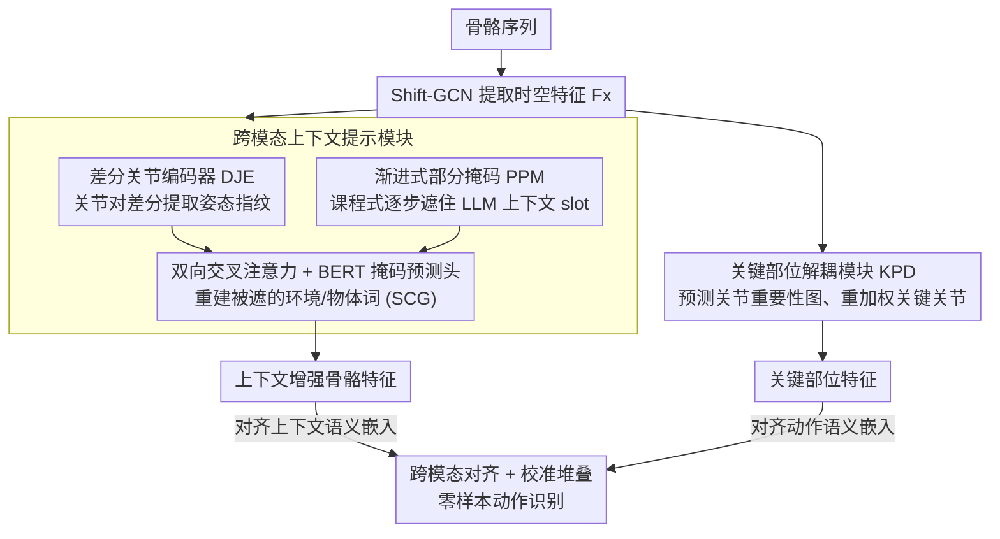

# SkeletonContext: Skeleton-side Context Prompt Learning for Zero-Shot Skeleton-based Action Recognition

**会议**: CVPR 2026  
**arXiv**: [2603.29692](https://arxiv.org/abs/2603.29692)  
**代码**: [https://github.com/NingWang2049/skeletoncontext](https://github.com/NingWang2049/skeletoncontext)  
**领域**: 视频理解 / 动作识别  
**关键词**: 零样本动作识别, 骨骼序列, 上下文提示学习, 跨模态对齐, 关键部位解耦

## 一句话总结

提出SkeletonContext框架，通过跨模态上下文提示模块从预训练语言模型重建骨骼数据缺失的环境和物体上下文语义，并用关键部位解耦模块增强运动关键关节的判别力，在NTU-60/120和PKU-MMD上的零样本和广义零样本设置中达到SOTA。

## 研究背景与动机

1. **领域现状**：零样本骨骼动作识别（ZSSAR）通过将骨骼特征与文本嵌入在共享空间中对齐来识别未见类别。现有方法主要关注更好的骨骼编码器、数据增强或外部知识增强。
2. **现有痛点**：骨骼序列只有关节坐标，不包含物体、环境等上下文线索。"在键盘上打字"和"在纸上写字"的骨骼运动高度相似，但缺少"键盘"和"纸"的上下文就无法区分。
3. **核心矛盾**：骨骼模态天然缺乏上下文信息，而语义描述中包含丰富的上下文，两者之间存在本质的语义鸿沟，直接对齐效果有限。
4. **本文目标**：为骨骼表示注入语言驱动的上下文语义，弥合跨模态对齐的语义鸿沟。
5. **切入角度**：用LLM生成结构化的上下文描述（环境+使用物体+目标物体），然后训练模型从骨骼运动中"重建"这些上下文，让骨骼编码器自身获得上下文感知能力。
6. **核心 idea**：让骨骼编码器通过掩码重建学会从运动模式推断上下文语义（如交互物体和环境）。

## 方法详解

### 整体框架

这篇论文要解决的是：骨骼序列里只有关节坐标、没有物体和环境信息，导致"在键盘上打字"和"在纸上写字"这类骨骼运动几乎一样的动作无法区分。它的思路是让骨骼编码器自己学会"脑补"出缺失的上下文。

整体流程是：骨骼序列先经 Shift-GCN 提取特征，然后分两路走。一路是**跨模态上下文提示模块**——骨骼特征先过差分关节编码器拿到细粒度表示，再和 BERT 处理过的、被掩码的上下文提示做双向交叉注意力，由 BERT 的掩码预测头反推出被遮住的上下文词（环境、物体），从而得到"上下文增强骨骼特征"。另一路是**关键部位解耦模块**，预测关节重要性图、突出真正承载动作的关键关节。最后两路特征分别与各自对应的语义嵌入做对比对齐。

### 关键设计

**1. 跨模态上下文提示模块：让骨骼编码器自己学会推断交互物体和环境**

骨骼模态天生缺上下文，而以往工作（SCoPLe、Neuron）的做法是去增强文本编码器，让文本更好地"迁就"骨骼——本质上没补上骨骼侧的信息缺口。本文反其道而行：直接往骨骼编码器里灌上下文语义。具体做法是先用 LLM（ChatGPT-4）为每类动作生成结构化描述，格式固定为 "In [环境], [身体部位] uses [物体] to [子动作] on [目标物体]"，每类生成 10 条。训练时把其中环境、使用物体、目标物体三个 slot 用 `[MASK]` 遮住，骨骼特征通过双向交叉注意力与 BERT 的 token 表示交互，再由 BERT 的掩码预测头去重建这些被遮住的上下文词，用重建损失 $\mathcal{L}_{ccr}$ 监督。这个"交叉注意力 + 掩码重建"的核心机制即论文所称的语义上下文锚定（Semantic Context Grounding, SCG，也就是消融表里的 SCG 列）。只有当骨骼特征真的蕴含了"这是在键盘上、用手指打字"这类信息时，BERT 才能把缺失的词填对——于是上下文语义被反向压进了骨骼表示里。

**2. 差分关节编码器（DJE）：从关节对之间的差异里挖出姿态指纹**

要让骨骼特征携带上下文，光有粗粒度的全局特征不够，关键信息往往藏在关节之间的细微相对关系里。这个模块先把骨骼特征池化到拓扑级，投影成 query 和 key，再计算所有关节对之间的差分拓扑表示：

$$A^{diff} = \phi(\mathcal{T}_1(H_x^Q) - \mathcal{T}_2(H_x^K))$$

得到的差异矩阵随后被用来对原特征加权聚合，输出拓扑增强嵌入 $F_x^{diff}$。之所以用"差分"而不是直接编码绝对坐标，是因为不同姿态的辨识线索恰恰藏在关节对的相对差异中——"弯腰"这一关节差异模式暗示桌面场景，"抬手到头部"暗示头部交互。差分编码等于把这些隐含的上下文线索显式提取出来，喂给后面的重建任务。

**3. 渐进式部分掩码（PPM）：用课程学习把"太难的重建"拆成由易到难**

直接让模型一上来就遮住全部三个 slot、纯靠骨骼把整句上下文重建出来太难了——而且结构化提示的格式（带方括号 slot）和 BERT 预训练见过的自然语言差异很大，全掩码会让训练直接崩掉。这里引入一个随训练步数线性增长的掩码比例：

$$r_t = \min(1, t/T)$$

训练初期 $r_t$ 很小，只遮少量 slot（比如先只掩环境），重建任务相对简单，模型还能靠 BERT 的语言先验兜底；随训练推进掩码比例升到 1，所有 slot 全遮，逼模型完全从骨骼运动加语言先验去推断完整上下文。这条由易到难的课程桥接了"结构化提示分布"和"BERT 自然语言分布"之间的鸿沟，让重建训练稳定收敛。

**4. 关键部位解耦模块（KPD）：给没有物体交互的动作补一条判别力**

上下文重建对"打字""喝水"这类有明确物体交互的动作很灵，但像"挥手""鞠躬"这类几乎不涉及外部物体、纯靠局部运动定义的动作，重建上下文帮不上忙、甚至会引入噪声。KPD 这一路就是为这类"上下文无关"动作兜底：给定骨骼特征 $F_x$，用两层线性层加 softmax 预测一张关节重要性图 $K_{out}$，再逐元素重加权得到部位级特征 $F_x^p = K_{out} \odot F_x$，把真正承载动作的关键关节突出出来。为了让重要性图学得准，本文从 LLM 结构化描述里的 `[身体部位]` 字段抽出先验重要性分布 $K_{gt}$，用校准损失 $\mathcal{L}_{kpd} = \sum_t \lVert K_{out,t} - K_{gt} \rVert_2$ 拉近预测与先验。虽然这个先验只来自已见类，但 KPD 学到的是"手-物""头-身"这类与类别无关的通用运动-部位关系，因而能自然迁移到结构相似的未见类。最后这条部位级特征与动作语义嵌入对齐，和上下文增强特征那一路并行、推理时再聚合两路预测。

### 一个完整示例：重建"在键盘上打字"的上下文

以一条"打字"骨骼序列为例走一遍。LLM 先给出它的结构化描述，如 "In [office], [hands] use [keyboard] to [type] on [document]"。训练早期（$r_t$ 小）只把 `[office]` 这个环境 slot 换成 `[MASK]`，BERT 看到 "In [MASK], hands use keyboard to type on document"——光凭 keyboard/type 就容易猜出 office，骨骼特征只需提供一点辅助。随着训练推进掩码比例升高，环境、使用物体、目标物体三处全被 `[MASK]` 遮住，BERT 看到的几乎是 "In [MASK], hands use [MASK] to type on [MASK]"，这时它必须依赖差分关节编码器送来的骨骼特征——手指快速小幅敲击、双手平放的姿态指纹——才能把 keyboard、document 这些词填回去。整个过程不需要任何视觉输入，骨骼运动模式被逐步逼着去"承载"上下文语义；推理阶段同样无需文本，模型已能从一段陌生动作的骨骼直接推断出它对应的交互物体。

### 损失函数 / 训练策略

总损失$\mathcal{L} = \mathcal{L}_{align} + \mathcal{L}_{ccr} + \mathcal{L}_{kpd}$：
- $\mathcal{L}_{align}$：对比交叉熵损失，分别对齐上下文增强骨骼特征与上下文语义嵌入、以及关键部位特征与动作语义嵌入
- $\mathcal{L}_{ccr}$：掩码上下文重建损失，监督BERT恢复被掩码的上下文词
- $\mathcal{L}_{kpd}$：关节重要性校准损失，用LLM生成的身体部位先验$K_{gt}$引导关节权重学习

推理时使用校准堆叠（calibrated stacking）缓解GZSL中的域偏移，聚合上下文分支和部位分支的预测。

## 实验关键数据

### 主实验

ZSL准确率（%）：

| 方法 | NTU-60 55/5 | NTU-60 48/12 | NTU-120 110/10 | NTU-120 96/24 |
|------|-------------|--------------|----------------|---------------|
| STAR (ACMM24) | 81.4 | 45.1 | 63.3 | 44.3 |
| Neuron (CVPR25) | 86.9 | 62.7 | 71.5 | 57.1 |
| FS-VAE (ICCV25) | 86.9 | 57.2 | 74.4 | 62.5 |
| **Ours** | **89.6** | **64.4** | 74.2 | 60.1 |

GZSL调和均值H（%）：

| 方法 | NTU-60 55/5 | NTU-60 48/12 | NTU-120 110/10 | NTU-120 96/24 |
|------|-------------|--------------|----------------|---------------|
| ScoPLe (CVPR25) | 70.8 | 57.9 | 52.2 | 52.2 |
| Neuron (CVPR25) | 71.4 | 59.1 | 63.3 | 53.6 |
| FS-VAE (ICCV25) | 75.7 | 52.1 | 63.3 | 54.7 |
| **Ours** | **77.1** | **61.1** | 63.1 | **56.1** |

### 消融实验

| DJE | SCG | PPM | KPD | NTU60-ZSL | NTU120-GZSL |
|-----|-----|-----|-----|-----------|-------------|
| ✗ | ✗ | ✗ | ✗ | 79.4 | 49.4 |
| ✓ | ✗ | ✗ | ✗ | 81.4 | 51.4 |
| ✓ | ✓ | ✗ | ✗ | 83.9 | 55.4 |
| ✓ | ✓ | ✓ | ✗ | 87.4 | 55.9 |
| ✓ | ✓ | ✓ | ✓ | **89.6** | **56.1** |

### 关键发现

- **上下文重建是主要贡献**：SCG引入带来最大跳跃（81.4→83.9 ZSL），PPM进一步稳定化提升到87.4
- 在困难相似类上（Hard Level），本方法GZSL达55.8%，比Neuron高12.0个点、比FS-VAE高5.1个点，验证上下文推断在细粒度区分中的关键作用
- 去掉$\mathcal{L}_{ccr}$（即去掉上下文重建监督）ZSL从89.6降至86.4，证实LLM上下文对跨模态对齐的必要性
- 对象相关slot（Use Object + Target Object）比环境slot贡献更大（87.0 vs 84.4），因为骨骼动作主要由手物交互定义
- 在PKU-MMD上GZSL调和均值达71.4%，比第二名Neuron高2.2个点

## 亮点与洞察

- **反向思维——增强骨骼而非文本**：之前的方法（SCoPLe、Neuron）主要增强文本编码器以更好地匹配骨骼，但SkeletonContext反过来增强骨骼表示使其携带上下文语义。这从根本上解决了信息不对称的问题
- **掩码重建作为跨模态知识转移的桥梁**：借鉴VL-BEiT等视觉-语言预训练的掩码重建思路，但创新性地用于无视觉的骨骼模态，让BERT的语言知识"流入"骨骼编码器
- **定性分析有说服力**：推理时无需任何文本输入就能从骨骼推断出"键盘"或"笔/纸"等上下文物体，直观展示了模型确实学到了运动-上下文映射

## 局限与展望

- 依赖ChatGPT-4生成描述质量和结构化模板的合理性，不同LLM可能产生不同效果
- 仅用三个slot（环境、使用物体、目标物体），未考虑细粒度的身体部位交互方式
- Shift-GCN作为骨骼编码器已非最新选择，用更强的编码器（如CTR-GCN、InfoGCN）可能进一步提升
- 在NTU-120 110/10 split上未超过FS-VAE（74.2 vs 74.4），说明在较多已见类的场景下上下文增强的边际收益可能减少

## 相关工作与启发

- **vs SCoPLe (CVPR25)**: 通过联合调整文本和骨骼提示实现数据驱动语义对齐，但未引入额外上下文信息。SkeletonContext通过重建从根本上补全了骨骼的信息缺失
- **vs Neuron (CVPR25)**: 使用多轮LLM生成的side information动态引导骨骼-语义协同，但仍在对齐层面操作。SkeletonContext直接在骨骼编码器侧注入上下文
- **vs FS-VAE (ICCV25)**: 频率-语义建模分解骨骼运动为高低频组件，是互补方向——可以将频率分解与上下文注入结合

## 评分

- 新颖性: ⭐⭐⭐⭐ 将掩码重建用于骨骼-语言跨模态上下文注入是新颖的视角
- 实验充分度: ⭐⭐⭐⭐⭐ 三个数据集多个split、GZSL+ZSL、相似类实验、充分消融
- 写作质量: ⭐⭐⭐⭐ 逻辑清晰，但部分公式符号稍显冗余
- 价值: ⭐⭐⭐⭐ 对零样本骨骼动作识别有明确推动，"增强骨骼侧而非文本侧"的思路值得推广

<!-- RELATED:START -->

## 相关论文

- [\[ICCV 2025\] Frequency-Semantic Enhanced Variational Autoencoder for Zero-Shot Skeleton-based Action Recognition](../../ICCV2025/video_understanding/frequency-semantic_enhanced_variational_autoencoder_for_zero-shot_skeleton-based.md)
- [\[ECCV 2024\] SA-DVAE: Improving Zero-Shot Skeleton-Based Action Recognition by Disentangled Variational Autoencoders](../../ECCV2024/video_understanding/sa-dvae_improving_zero-shot_skeleton-based_action_recognition_by_disentangled_va.md)
- [\[CVPR 2026\] Exploring Adaptive Masked Reconstruction for Self-Supervised Skeleton-Based Action Recognition](exploring_adaptive_masked_reconstruction_for_self-supervised_skeleton-based_acti.md)
- [\[CVPR 2026\] Metadata-Aware Multi-Prompt Reasoning for Zero-Shot Accident Understanding](metadata-aware_multi-prompt_reasoning_for_zero-shot_accident_understanding.md)
- [\[CVPR 2026\] Protect to Adapt: Orthogonal Subspace Control with Ranked Negative-Prompt Curriculum for Few-Shot Action Recognition](protect_to_adapt_orthogonal_subspace_control_with_ranked_negative-prompt_curricu.md)

<!-- RELATED:END -->
