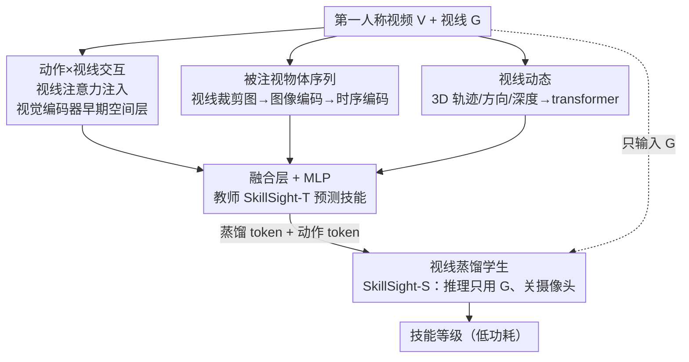

# SkillSight: Efficient First-Person Skill Assessment with Gaze

**会议**: CVPR 2026  
**论文**: [CVF Open Access](https://openaccess.thecvf.com/content/CVPR2026/html/Wu_SkillSight_Efficient_First-Person_Skill_Assessment_with_Gaze_CVPR_2026_paper.html)  
**代码**: 无  
**领域**: 视频理解  
**关键词**: 第一人称视角, 技能评估, 视线/注视, 知识蒸馏, 智能眼镜功耗

## 一句话总结
SkillSight 用第一人称视频 + 视线（gaze）联合建模技能水平，先训一个看「视频+视线」的教师模型拿 SOTA，再蒸馏出一个推理时**只看视线、关掉摄像头**的学生模型，在三个跨领域数据集上以 14~73 倍更低功耗逼近甚至超过重型视频方法。

## 研究背景与动机
**领域现状**：在智能眼镜上做「技能评估」（判断一个人做某项活动有多熟练）被认为能带来即时指导、进步追踪、薄弱点定位等价值。但主流技能评估都依赖**第三人称视角**——预先在环境里架好相机拍人的身体姿态。

**现有痛点**：第三人称方案离不开布置场地，没法跟着人走进真实世界（球场、攀岩墙、舞台）。而少数第一人称（egocentric）工作又有两个硬伤：① 头戴相机看不到佩戴者的全身，桌面以外的动态场景可见性很差；② 连续录视频极其耗电，与「实时交互式技能学习」的应用需求直接冲突。

**核心矛盾**：要么用高功耗的连续视频换准确率，要么省电但丢掉判别技能所需的细粒度信息——准确率和功耗之间存在 trade-off。已有的省电方案（音频触发采帧、IMU + 稀疏帧）仍要周期性开摄像头，开关相机有启动延迟和瞬时功耗尖峰。

**切入角度**：作者押注一个假设——**技能不只体现在「怎么做」（视频），也体现在「怎么分配注意力」（视线）**。认知科学早有证据：专家与新手的注视模式截然不同（排球专家更早盯住击球点、足球高手更多扫视周围、外科/驾驶/演奏里都有「安静眼」的稳定凝视特征）。而眼动相机比 RGB 相机省电得多，且只拍眼睛、保护隐私。

**核心 idea**：用「视频+视线」训教师，再把视觉知识**蒸馏进视线**，让学生模型推理时只靠视线就能推断技能水平——在保留视频里动作语义的同时彻底关掉耗电的摄像头。

## 方法详解

### 整体框架
SkillSight 是一个**两阶段多模态框架**。第一阶段训练教师 SkillSight-T：同时吃第一人称视频 $V$ 和视线 $G$，用三个互补组件分别建模「动作×视线的交互」「被注视物体的序列」「视线本身的时序动态」，把三路特征拼起来过融合层做技能分类。第二阶段训练学生 SkillSight-S：只用视线 $G$ 作输入，通过**知识蒸馏**把教师的视觉特征压进视线表征里，推理时摄像头全程关闭。

任务形式化为：数据集 $E=\{(V,G,S)\}$，每条样本含第一人称视频 $V$、视线信号 $G$（含 3D 注视点、3D 视线方向、视线在画面上的 2D 投影 $g_{2d}$、视线深度、眼镜的平移与四元数旋转）、技能等级标签 $S$。两种设定：Video+Gaze 学 $F_v(V,G)\to S$（=教师），Gaze-only 学 $F_g(G)\to S$（=学生，训练时用视频、推理只用视线）。

### 关键设计

**1. 动作×视线交互：把视线注意力注入视觉编码器的最早空间层**

这一组件针对「相机只知道看到了什么、不知道在看哪」的痛点。作者用 2D 视线坐标 $g_{2d}^t$ 在第 $t$ 帧上定位被注视区域，并把它做成一张高斯注意力图注入 TimeSformer 的**第一层空间编码器** $f_{V,0}$。具体地，把每帧切成 $p^2$ 个 $L\times L$ patch，以注视点对应的 patch 中心 $c^t=\lfloor g_{2d}^t/L\rfloor$ 为中心构造高斯核 $A_g^t[m,n]=\exp(-d_c^t(m,n)/2\sigma^2)$（归一化后，$d_c^t(m,n)=\|(m,n)-c^t\|_2$），再把它叠加到原始注意力图上：$A_m^t=\sigma(A_v^t+\beta_c A_g^t)$，其中 $\beta_c$ 是按场景（篮球、足球等）可学习的权重，最终得到嵌入 $e_v=f_V(V,g_{2d})$。

与以往「在后期特征上池化视线」的视线-动作识别方法不同，这里强调在**最早的空间编码阶段**就突出视线区域，让模型从一开始就语义性地高亮注视点，捕捉「视觉焦点与动作」的关联。

**2. 被注视物体序列：用视线裁剪图反映专家/新手看的东西不同**

作者观察到一个判别性很强的现象：不同技能水平的人**注视的物体分布显著不同**——新手钢琴家盯着手的频率（77%）远高于专家（45%），而专家更多看谱；攀岩专家视线深度更大（1.4m vs 1.1m，在分析更上方的下一步动作）。于是把每帧按 $g_{2d}^t$ 裁出注视区域 $v_c^t$，作为「被注视物体」的代理。

关键处理是：作者**不把裁剪图序列当视频处理**，因为这些 crop 来自每帧不同位置、帧间没有空间对齐。改用预训练图像编码器 $f_I$（DINOv2）先抽每帧 crop 的语义嵌入，再用时序编码器 $f_T$ 建模序列级关系，得到 $e_c=f_T([f_I(v_c^1),\dots,f_I(v_c^T)])$。这样既保留了「看了哪些物体、怎么切换」的语义，又规避了空间不对齐的问题。

**3. 视线动态：显式编码注视频率/扫视速度/3D 位置变化**

前两个组件主要回答「在看什么」，但不显式反映**视线怎么动**——注视频率、扫视速度、视线在 3D 环境里的位移，而这些恰恰在不同技能水平间差异巨大。$G_i$ 里本就含主体轨迹、视线方向、视线深度的丰富 3D 信息，作者用一个 transformer 编码器 $f_g$ 处理它，得到 $e_g=f_g(G)$。为避免「主体朝向」这类偏置，所有视线信号都**相对第一帧做归一化**。三路特征拼接后过融合层 $f_m$（3 层 MLP）得到教师预测 $\hat S=f_m([e_v,e_c,e_g])$，用标准交叉熵 $L_{CE}$ 训练。

**4. 视线-only 蒸馏学生：把视觉知识压进视线，推理关掉摄像头**

这是省电的核心。作者论证「视频线索能被嵌进视线信号」是合理的：人在观察特定物体/执行特定动作时有一致的注视模式，而技能场景里动作、环境、相关物体高度对齐（做菜=厨房+锅铲，投篮=球馆+篮筐），让视线天然携带了大量视觉相关信息。学生 $f_s$ 是 transformer 编码器，只吃 $G$，但用多分支 token 设计：$\hat e_s,\hat S,\hat a=f_s([t_{cls},t_{dis},t_{act},G])$，其中蒸馏 token $t_{dis}$ 对齐教师特征、动作识别 token $t_{act}$ 预测子任务（如运球、罚球），用动作上下文辅助技能判断。蒸馏损失为 $L_{dis}=\|f_p(\hat e_s)-f_t([e_v,e_c,e_g])\|_1$，两个投影层 $f_p,f_t$ 分别对齐学生特征、过滤学生学不到的模态专属教师信号；总损失 $L_{student}=L_{CE}+\lambda_{dis}L_{dis}+\lambda_{act}L_{act}$。学生单样本推理仅 1.6ms。

### 损失函数 / 训练策略
教师用 SGD 训 15 epoch（lr $5\times10^{-3}$，batch 8），学生用 AdamW 训 10 epoch（lr $1\times10^{-4}$，batch 32），8 卡 RTX 6000。视频按 EgoExo4D 协议切 10 段、段级预测平均；教师/学生都按 2 FPS 处理 16 帧 clip。$f_V$=EgoVLPv2 预训练的 TimeSformer，$f_I$=DINOv2，$f_s/f_g$ 为 4 层 768 维 transformer。

## 实验关键数据

三个数据集：Ego-Exo4D（足球/篮球/攀岩/舞蹈/音乐/烹饪，4 级技能）、Multi-Sense Badminton（羽毛球，3 级）、Expert-Novice Soccer（足球动作，2 级；无视频，教师改用身体关节运动+视线训练）。准确率指标（%）。

### 主实验

| 方法 | 模态 | 功耗(mW) | EgoExo4D Overall | MSB |
|------|------|---------|------------------|-----|
| TimeSformer | V | 697.5 | 45.5 | 50.5 |
| Skillformer | V | 697.5 | 42.4 | 44.0 |
| EgoExoLearn | V+G | 141.4 | 42.3 | 31.7 |
| Beholder | V+G | 132.4 | 34.1 | 30.6 |
| **SkillSight-T** | V+G | 943 | **50.1** | **53.1** |
| X3D-XS | V | 88 | 34.2 | 42.7 |
| EgoDistill | V+I | 16.5 | 42.6 | 43.4 |
| EgoTrigger | V+A | 9.9 | 34.1 | — |
| Gaze-only | G | 9.5 | 37.0 | 42.3 |
| **SkillSight-S** | G | 9.5 | **44.4** | 47.0 |

教师 SkillSight-T 在所有场景准确率均为最佳，EgoExo4D 上比之前最好的视频方法 TimeSformer 高 5%（相对 10%）。学生 SkillSight-S 仅用视线、9.5mW 功耗，整体准确率 44.4%，超过**所有省电基线**、并在 7 个场景中的 5 个领先；即使和重型视频方法比也排第二，却省电 14~73 倍。在 Expert-Novice Soccer 上，SkillSight-S 同时超过 Gaze-only（66.0）和需要佩戴 IMU 的 Body-motion-only 基线。

### 消融 / 分析

| 配置 / 对比 | 关键结果 | 说明 |
|------|---------|------|
| SkillSight-T vs 朴素端到端模型 | +8% | 三组件融合显著优于直接端到端 |
| SkillSight-S vs Gaze-only 基线 | 37.0→44.4 | 蒸馏把教师视觉知识有效压进视线（+7.4%） |
| SkillSight-S vs TimeSformer | 功耗↓73×，准确率仅↓1.1% | 省电与准确率的最优 trade-off |
| SkillSight-S vs EgoDistill（最佳省电基线） | 功耗再降 43% | 同时准确率更高 |

功耗用智能眼镜硬件实测参数估算：$P=\omega N/T+\rho B/T+\sum_m \vartheta_m\varsigma_m$（$\omega$=4.6pJ/MAC 计算能耗、$\rho$=80pJ/byte 访存、$\vartheta_{rgb}$=35mW vs $\vartheta_{eye}$=7.8mW 传感触发），把关掉 RGB 相机的省电效果量化出来。

### 关键发现
- **视线本身就是高度浓缩的技能信号**：仅靠视线的学生能逼近重型视频方法，说明视线把「看什么+怎么动注意力」编码得很充分；纯视觉省电方法（X3D-XS、EgoDistill 单帧、EgoTrigger 音频触发）反而学不到跨场景一致的技能模式。
- **早期空间层注入视线 > 后期池化**：在第一层空间编码器就高亮注视区，比以往在后期特征上 pool 视线更能捕捉「视觉焦点-动作」关联。
- **裁剪图当语义序列而非视频**：因为 crop 帧间不对齐，先 DINOv2 抽语义再时序建模，规避了把它硬当视频处理的对齐问题。
- **失败案例**：切菜这类靠细微手部动作、视线无法反映技能的场景，gaze 会失灵（论文图 4 右下明确标出）。

## 亮点与洞察
- **「关掉摄像头还能判技能」的蒸馏视角很巧**：核心论点是「技能场景里动作-环境-物体高度对齐，使视频信息可被压进视线」，这把一个省电工程问题转成了一个有认知科学支撑的表征学习问题。
- **可迁移的 trick**：高斯视线注意力注入早期空间层、用蒸馏 token + 动作 token 的多分支学生、把变位置 crop 当「语义序列」而非视频——这三招都能搬到其他第一人称（注视引导的动作识别、注意力预测）任务。
- **模型反哺心理学**：SkillSight-S 预测的专家/新手在篮球（看篮筐 vs 看球）、攀岩（更长的动作相关凝视）、钢琴（谱-手切换更频繁）上的注视差异，与既有心理学发现一致甚至更细，提供了数据驱动的新洞察。

## 局限与展望
- **视线对「细微手部动作」无能为力**：作者自承切菜这类场景 gaze 不反映技能，是 gaze-only 方案的固有上限。
- **依赖高质量视线传感**：方法吃 3D 注视点、深度、眼镜位姿等丰富信号，需要带眼动相机/IR/IMU 的智能眼镜；MSB 只有 2D 视线时信息更弱（其 MSB 上学生仍弱于教师约 6%）。⚠️ Body-motion-only 在 Soccer 上的具体数值缓存里被截断，以原文为准。
- **分类而非回归**：任务设成离散技能等级分类（对齐现有标注），细粒度连续技能打分留待后续。
- **教师推理仍重**：SkillSight-T 943mW 比纯视频方法还高，省电完全靠学生；蒸馏带来的 gap（44.4 vs 50.1）仍存在改进空间。

## 相关工作与启发
- **vs EgoExoLearn / Beholder（V+G）**：它们把处理限制在视线周围的视觉区域，视线落在手上时有效，但视线移开身体时丢掉了关键上下文（如攀岩看墙）；SkillSight 显式建模视线动态+被注视物体序列，不会因视线离身就失效。
- **vs [37]（唯一用 gaze 估技能的视觉工作）**：它只在主体静止的桌面任务（烹饪、实验室）上验证；SkillSight 把视线技能评估扩展到主体大幅移动的动态野外场景，并显式建模 gaze-action 交互。
- **vs EgoDistill（V+I）/ EgoTrigger（V+A）等省电方法**：它们仍周期性依赖视觉输入（单帧+头旋/音频），有开关相机的启动延迟与功耗尖峰，且单帧难分辨细微动作；SkillSight 推理彻底不用相机，且准确率更高、功耗更低。

## 评分
- 新颖性: ⭐⭐⭐⭐⭐ 首次系统性把视线作为跨领域、省电、保隐私的第一人称技能评估信号，蒸描视角新颖
- 实验充分度: ⭐⭐⭐⭐ 三数据集、多基线、功耗量化、定性+心理学分析齐全，但部分消融在正文外（Supp.）
- 写作质量: ⭐⭐⭐⭐ 动机与认知科学衔接清晰，方法三组件层次分明
- 价值: ⭐⭐⭐⭐⭐ 为智能眼镜上可落地的实时技能学习铺路，省电 14~73 倍极具实用意义

<!-- RELATED:START -->

## 相关论文

- [\[CVPR 2026\] Affordance-First Decomposition for Continual Learning in Video–Language Understanding](affordance-first_decomposition_for_continual_learning_in_video-language_understa.md)
- [\[CVPR 2026\] MDS-VQA: Model-Informed Data Selection for Video Quality Assessment](mds-vqa_model-informed_data_selection_for_video_quality_assessment.md)
- [\[CVPR 2026\] Enhancing Accuracy of Uncertainty Estimation in Appearance-based Gaze Tracking with Probabilistic Evaluation and Calibration](enhancing_accuracy_of_uncertainty_estimation_in_appearance-based_gaze_tracking_w.md)
- [\[ACL 2026\] VISTA: Verification In Sequential Turn-based Assessment](../../ACL2026/video_understanding/vista_verification_in_sequential_turn-based_assessment.md)
- [\[ICCV 2025\] Multi-modal Multi-platform Person Re-Identification: Benchmark and Method](../../ICCV2025/video_understanding/multi-modal_multi-platform_person_re-identification_benchmark_and_method.md)

<!-- RELATED:END -->
