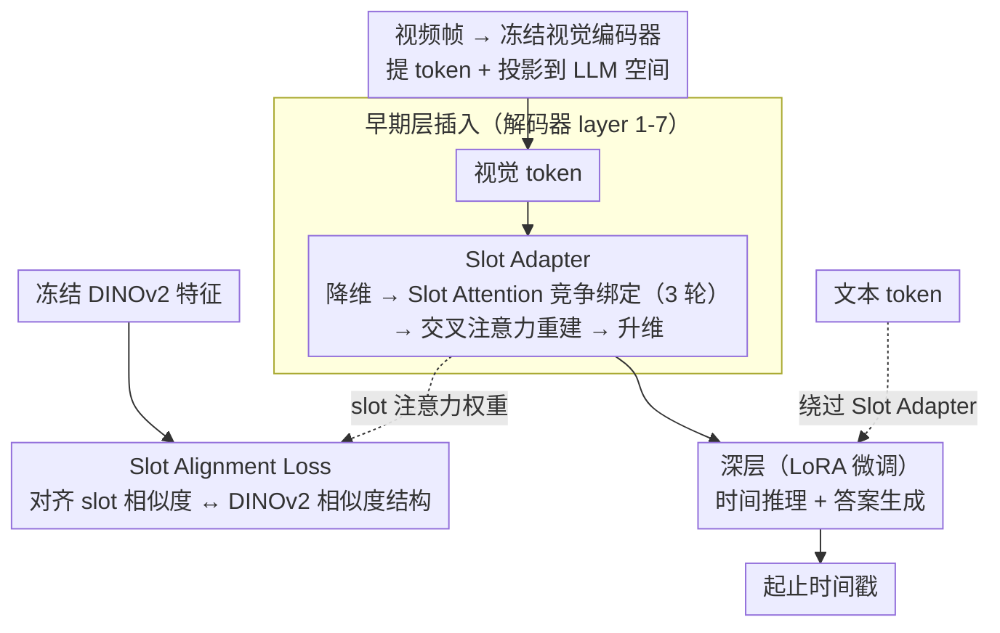

# SlotVTG: Object-Centric Adapter for Generalizable Video Temporal Grounding

**会议**: CVPR 2026  
**arXiv**: [2603.25733](https://arxiv.org/abs/2603.25733)  
**代码**: 无  
**领域**: 视频理解 / 时序定位  
**关键词**: 视频时序定位, 对象中心学习, Slot Attention, 域外泛化, 多模态大模型

## 一句话总结

提出SlotVTG框架，通过在MLLM解码器早期层插入轻量级Slot Adapter将视觉token分解为对象级slot表示，辅以DINOv2先验的Slot Alignment Loss引导语义一致的slot形成，显著提升视频时序定位的域外泛化性能（OOD R1@0.5最大提升+4.3），同时仅增加约0.25%的可训练参数。

## 研究背景与动机

1. **领域现状**：多模态大语言模型（MLLM）已成为视频时序定位（VTG）的主流方案，但需要在特定数据集上微调才能获得精细的时间理解能力。
2. **现有痛点**：VTG标注需要精确的起止时间戳，大规模数据收集极其昂贵，导致训练数据有限。微调在有限数据上会记忆数据集特有的快捷方式（时间位置偏差、查询文本偏差、外观偏差等），导致域外（OOD）测试性能严重下降。
3. **核心矛盾**：模型在域内（ID）表现优秀但OOD大幅退化——在Charades-STA训练后ID达63.4 R1@0.5但OOD仅43.6（-31.2%）。噪声扰动实验证实OOD时模型不再关注目标视觉内容。
4. **本文目标**：让微调后的MLLM真正基于视觉内容进行grounding，而非依赖域特定模式，从而提升OOD泛化。
5. **切入角度**：对象中心学习将场景分解为实体级表示，本质上提取了域不变的视觉特征。测量表明slot表示的MMD域间距离比基线降低49.6%。
6. **核心 idea**：用Slot Attention瓶颈强制视觉信息经过对象级分解再流入LLM，抑制域特定关联。

## 方法详解

### 整体框架

这篇论文要解决的是一个很具体的痛点：MLLM 在视频时序定位上微调后，域内（ID）很强但域外（OOD）大幅退化，根因是模型学会了走数据集特有的捷径而不再真正看视觉内容。SlotVTG 的整体思路是给视觉信息的流动加一道"对象级瓶颈"——视频帧先经冻结视觉编码器提取 token 并投影到 LLM 解码器空间，在早期解码器层插入一个轻量 Slot Adapter，把密集视觉 token 压成少数几个抽象 slot 再重建回原序列；重建后的 token 才进入更深的层（用 LoRA 微调）做时间推理和答案生成。文本 token 全程绕过 Slot Adapter，只有视觉信息被强制经过这道分解。重建阶段还借冻结 DINOv2 的物体先验，用 Slot Alignment Loss 把 slot 的分组对齐到真实物体边界。这样模型想 grounding 就只能依赖经过实体分解、域特定噪声已被滤掉的表示。

### 关键设计

**1. Slot Adapter：用竞争性绑定把视觉 token 压成对象级 slot 再重建**

直接在密集 patch token 上微调，模型很容易抓住"这个数据集里目标总出现在视频中段"这类逐 patch 的域特定关联。Slot Adapter 的做法是先用 $W_{down}$ 把 token 从 $D$ 维降到 $d=512$ 维，再让 $N_s=4$ 个可学习的 slot 查询经过 $I=3$ 轮迭代 slot attention 去和 token 做竞争性绑定：每轮先沿 slot 轴做 softmax，实现"赢者通吃"——同一个 token 主要被分配给最匹配它的那个 slot；再沿 token 轴归一化、加权聚合，用 GRU 递推更新 slot 状态。几轮迭代后，每个 slot 会收敛到一个语义实体（人、某个物体、背景）。重建阶段反过来，以原 token 作 query、slot 作 key/value 做交叉注意力，再用 $W_{up}$ 升回 $D$ 维；投影层零初始化加残差连接，保证训练初期这个 adapter 近似恒等映射、不破坏已对齐的 VL 表示。之所以有效，是因为实体级的 slot 表示天然比逐 patch token 更抗域偏移——同样是"一个人在走路"，不同数据集的像素分布差异很大，但分解出来的对象级语义是共享的，瓶颈结构顺带把域特定噪声挡在外面。

**2. 早期层插入：让分解发生在视觉信息还没被语言污染之前**

如果把 Slot Adapter 放到深层，视觉特征早已和语言充分融合，此时再做 slot 分解很难把视觉域特定模式单独隔离出来。作者观察到解码器的跨帧视觉交互主要发生在早期层，深层则负责语言整合和答案生成，于是把 Slot Adapter 插在 layer 1–7，更深层留给 LoRA。放在早期的好处是每个 slot 能直接捕获跨帧时间一致的语义（同一个人跨帧被同一 slot 绑定），而不是各帧独立分解；后续深层 LoRA 就在这套已经分解干净的表示上做时间推理。消融也印证了这点：1–7 层（OOD 28.7）优于 10–17（27.5）和 20–36（28.4）。

**3. Slot Alignment Loss：借 DINOv2 的 objectness 先验引导 slot 形成有意义的分组**

光靠瓶颈结构，slot 可能收敛成任意聚类，不保证对应真实物体边界。这个损失的做法是拿一个现成的"教师信号"来对齐：先把 slot 注意力权重 $A$ 转成 token 对相似度矩阵 $M_{slot} = 2(\bar{A}\bar{A}^T) - 1$，再从冻结的 DINOv2 提特征算出 $M_{dino} = \bar{F}_{dino}\bar{F}_{dino}^T$，然后逐帧对齐两者的相似度结构：

$$\mathcal{L}_{SA} = 1 - \frac{1}{T}\sum_t \cos\!\left(M_{slot}^{(t)},\, M_{dino}^{(t)}\right)$$

DINOv2 自监督学到的特征天然反映物体/背景边界，用它当软监督，相当于告诉 slot"该被分到一组的 token，在 DINOv2 眼里也该是一组"。需要注意权重不能太大——$\lambda=0.1$ 时 OOD 最优（28.7），加到 0.2 反而掉到 26.1，因为过强的 objectness 先验会约束模型自身的灵活性。

### 损失函数 / 训练策略

$\mathcal{L}_{total} = \mathcal{L}_{CE} + \lambda \mathcal{L}_{SA}$，$\lambda=0.1$。

视觉编码器冻结，Slot Adapter和LoRA联合优化。3B模型可训练参数约7.6M（0.25%），7B约23.3M（0.33%）。AdamW优化器，学习率$5 \times 10^{-5}$，训练5个epoch，batch size 32，8×3090/4090 GPU。

## 实验关键数据

### 主实验

Charades-STA→其他（3B backbone，R1@0.5）：

| 方法 | Cha.(ID) | ANet(OOD) | QVH(OOD) |
|------|----------|-----------|----------|
| Chrono-Qwen | 63.4 | 26.3 | 43.6 |
| SlotVTG | 64.0 | **28.7** | **47.9** |
| Δ | +0.6 | **+2.4** | **+4.3** |

QVHighlights→其他（3B backbone，R1@0.5）：

| 方法 | QVH(ID) | Cha.(OOD) | ANet(OOD) |
|------|---------|-----------|-----------|
| Chrono-Qwen | 79.1 | 45.7 | 35.3 |
| SlotVTG | 79.5 | **46.6** | **35.7** |

7B模型OOD增益更大：Cha.→ANet +4.0, Cha.→QVH +4.1 R1@0.5。

### 消融实验

| 组件 | Cha.(ID) R1@0.5 | ANet(OOD) R1@0.5 |
|------|-----------------|-------------------|
| LoRA only | 63.4 | 26.3 |
| Self-attention adapter | 63.5 | 26.5 |
| Slot Adapter | 64.0 | **28.7** |
| Slot Adapter w/o $\mathcal{L}_{SA}$ | 63.3 | 28.0 |
| Slot Adapter + $\mathcal{L}_{SA}$ ($\lambda$=0.1) | 64.0 | **28.7** |
| Slot Adapter + $\mathcal{L}_{SA}$ ($\lambda$=0.2) | 64.3 | 26.1 |

层插入位置：

| 层范围 | ANet(OOD) R1@0.5 |
|--------|-------------------|
| 1-7（早期） | **28.7** |
| 10-17（中间） | 27.5 |
| 20-36（深层） | 28.4 |

### 关键发现

- **Slot Adapter vs 普通自注意力adapter**：OOD提升显著（28.7 vs 26.5），证实是slot attention的实体分解机制而非简单瓶颈在起作用
- **SA Loss的$\lambda$敏感**：0.1最优，0.2反而OOD下降（26.1），过强的objectness先验会约束模型灵活性
- **早期层插入最优**：layer 1-7 > 10-17 > 20-36，与"早期层处理跨帧视觉交互"的假设一致
- **交叉注意力重建优于简单复制+投影**：OOD R1@0.7达14.9 vs 13.7
- Slot可视化显示在ID和OOD上均能分解为人、物体、背景等语义区域，且无需目标域监督
- MMD域间距离从0.192降到0.097（-49.6%），定量证实域差异缩小

## 亮点与洞察

- **诊断实验非常有说服力**：噪声扰动实验清晰揭示OOD时模型不看视觉内容——GT段和随机段加噪声的性能下降几乎一样（12.6% vs 12.1%），这比简单报告OOD下降更能说明问题本质
- **极低参数成本的OOD提升**：仅0.25%可训练参数就能获得4+个点的OOD提升，且是即插即用到现有微调MLLM的adapter，不需要重新训练VL对齐
- **Slot作为域不变瓶颈**：物体级别的分解天然比patch级token更抗域偏移，这个insight可通用于其他需要OOD泛化的视觉-语言任务

## 局限与展望

- 仅4个slot，对复杂场景（多人多物体）可能不够，但增加到8个slot效果反而略下降
- 仅在VTG任务上验证，slot adapter能否提升其他视频任务（如视频QA、视频描述）的OOD泛化还需探索
- SA Loss仅在最后一层adapter层施加，多层联合约束可能更优
- 未探索时间维度的slot一致性约束（如相邻帧同一slot应跟踪同一实体）
- QVHighlights作为源数据集时OOD提升较小，因数据本身域分布已较广

## 相关工作与启发

- **vs Slot-VLM**: 用双分支对象-事件slot分解视频token，但需要从头训练整个VL pipeline。SlotVTG用adapter形式即插即用，显著降低训练成本
- **vs Chrono**: 用交错帧-时间戳表示实现生成式VTG，SlotVTG在其基础上加入对象中心分解，证明是互补的改进
- **vs DETR-based方法（EaTR, CG-DETR）**: 这些专用模型OOD退化更严重，证实了MLLM+对象中心adapter是更有前景的组合

## 评分

- 新颖性: ⭐⭐⭐⭐ 将slot attention作为adapter引入MLLM处理VTG的OOD问题，角度新颖
- 实验充分度: ⭐⭐⭐⭐⭐ 诊断分析、跨域评估、详尽消融、可视化、域距离量化
- 写作质量: ⭐⭐⭐⭐⭐ 问题诊断→方案设计→验证的逻辑链极其清晰
- 价值: ⭐⭐⭐⭐ 对VTG的OOD泛化有实际推动，adapter设计可推广到其他视频任务

<!-- RELATED:START -->

## 相关论文

- [\[CVPR 2026\] Reconstruction-Guided Slot Curriculum: Addressing Object Over-Fragmentation in Video Object-Centric Learning](reconstruction-guided_slot_curriculum_addressing_object_over-fragmentation_in_vi.md)
- [\[CVPR 2026\] CVA: Context-aware Video-text Alignment for Video Temporal Grounding](cva_context-aware_video-text_alignment_for_video_temporal_grounding.md)
- [\[CVPR 2026\] How Should Video LLMs Output Time? An Analysis of Efficient Temporal Grounding Paradigms](how_should_video_llms_output_time.md)
- [\[CVPR 2026\] HieraMamba: Video Temporal Grounding via Hierarchical Anchor-Mamba Pooling](hieramamba_video_temporal_grounding_via_hierarchical_anchor-mamba_pooling.md)
- [\[ICLR 2026\] From Vicious to Virtuous Cycles: Synergistic Representation Learning for Unsupervised Video Object-Centric Learning](../../ICLR2026/video_understanding/from_vicious_to_virtuous_cycles_synergistic_representation_learning_for_unsuperv.md)

<!-- RELATED:END -->
