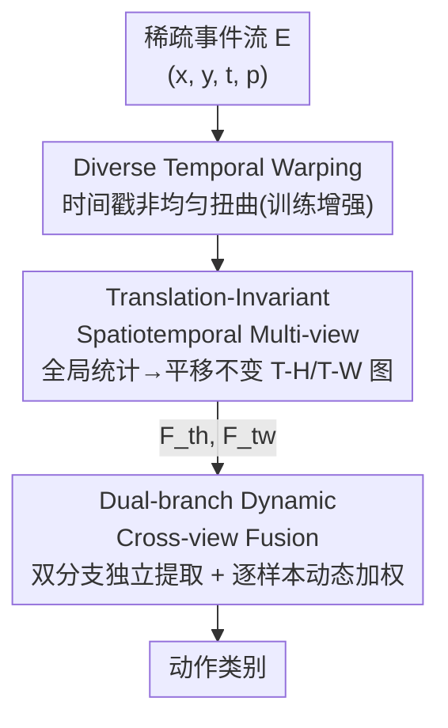

# SMV-EAR: Bring Spatiotemporal Multi-View Representation Learning into Efficient Event-Based Action Recognition

**会议**: CVPR 2026  
**论文**: [CVF Open Access](https://openaccess.thecvf.com/content/CVPR2026/html/Fan_SMV-EAR_Bring_Spatiotemporal_Multi-View_Representation_Learning_into_Efficient_Event-Based_Action_CVPR_2026_paper.html)  
**代码**: https://github.com/Fineshawray/SMV-EAR  
**领域**: 视频理解 / 事件相机动作识别  
**关键词**: 事件相机, 动作识别, 多视角表示, 平移不变性, 动态融合

## 一句话总结
针对事件相机动作识别（EAR），本文不再把事件按时间轴聚成 H-W 帧，而是沿 H/W 轴投影到 T-H、T-W 两个"时间视角"，并系统重做了表示（平移不变的 TISM）、融合（双分支动态融合 DDCF）、增强（多样化时间扭曲 DTW）三个环节，在三个 EAR 基准上 Top-1 提升 +7.0%/+10.7%/+10.2%，同时参数降 30.1%、计算降 35.7%。

## 研究背景与动机

**领域现状**：事件相机以微秒级时间分辨率异步记录亮度变化，天然适合捕捉动作的时间动态，且隐私友好、功耗低。当前主流的事件动作识别（EAR）做法是把稀疏的 H-W-T 事件按时间轴分箱（temporal binning）聚成一叠"类帧"图像，再套用成熟的 2D/视频模型。

**现有痛点**：把事件聚成 H-W 帧虽然符合人眼直觉，但它把最关键的时间运动线索"塞进了帧与帧之间"——而帧的数量是有限的，连续的物理动作被离散成几张快照，细粒度时间动态在分箱时就丢了。已有的时空多视角表示学习（SMVRL）方法（如 EOR 任务上的 MVF-Net）想了一个好思路：沿 H、W 轴投影，让运动线索落在 T-W、T-H 这两张"时间视角"图里（图内即含运动，而非图间）。但它直接照搬到 EAR 上有两个硬伤：(i) 对空间投影轴 H/W 也做分箱（spatial binning），导致同一动作"发生在画面哪个位置"会改变投影结果，表示变成**平移可变**的，特征判别力被位置干扰；(ii) 把 T-H、T-W 两张图**早期拼接**（early concatenation）后共享分支提取，忽略了两个视角维度不对齐（H≠W）、语义不同（水平 vs 垂直运动）的事实，没能真正利用跨视角互补。

**核心矛盾**：T-H/T-W 多视角表示在 EAR 上有潜力，但"沿用 T 轴分箱式的处理范式"和这个表示的内在结构是冲突的——分箱破坏了空间平移不变性，拼接抹平了视角异质性。

**本文目标**：重新审视 SMVRL 用于 EAR 的几个关键设计阶段，分别解决表示、架构、增强三件事。

**核心 idea**：表示上用**全局无分箱**的统计量换取平移不变性（TISM），融合上用**逐样本动态加权的双分支后融合**尊重并利用视角异质性（DDCF），再补一个**模拟真实动作速度变化**的时间扭曲增强（DTW）。

## 方法详解

### 整体框架
SMV-EAR 的输入是稀疏事件流 $E=\{(x_k,y_k,t_k,p_k)\}$，输出是动作类别。整条 pipeline 由三个贡献模块串起来：先用 **TISM** 把事件沿 H、W 轴投影、转成两张平移不变的 2D 特征图 $\{F_{th}, F_{tw}\}$（分别来自 T-H、T-W 视角）；再用 **DDCF** 用两个独立 ResNet 分支分别提取各视角的动作 logits，并用一个从样本语义中导出的跨视角注意力做动态加权后融合，得到最终预测；训练时额外叠加 **DTW** 增强，对事件时间戳做非均匀扭曲来模拟动作快慢，进一步提升测试精度。值得注意的是，HW 视角（$F_{hw}$）只含"动作发生在哪里"的空间上下文、几乎不带时间运动线索，因此被刻意丢弃以省算力，只保留 T-H、T-W 两个时间视角。

### 关键设计

**1. TISM：用全局无分箱统计量换取平移不变的多视角表示**

痛点很直接——动作类型本应与"它发生在画面哪个位置"无关，但沿 H/W 轴做分箱投影会让投影结果随空间位置漂移，破坏平移不变性。本文把视角编码函数拆成三段可选组件：窗口函数 $w_c$、测量函数 $m_c$、聚合函数 $a_c$，即 $F_c=a_c(m_c(w_c(E)))$。对视角 $v$，设其正交轴为 $z_v$（T-H 视角正交轴是 x，T-W 是 y），平移不变性要求对任意位移 $\Delta z_v$ 都有 $F_v(E\mid z_v)=F_v(E\mid z_v+\Delta z_v)$。作者通过推导（细节在补充材料）找出满足该式的一组可行组合：关键结论是 **(i) 窗口必须用全局、无分箱的 $w_0$**；(ii) 涉及 $z$ 维度的测量量只有配 variance 聚合才平移不变，但 variance 是二阶矩、计算昂贵，于是退而用一阶的 sum。最终选了最紧凑的两通道组合：

$$F_v = [\,\mathrm{sum}(c(w_0(E))),\ \mathrm{sum}(p(w_0(E)))\,]\in\mathbb{R}^{2\times U\times V}$$

即每个视角只保留"全局事件计数 $c$"和"全局极性和 $p$"两张图（$U\times V$ 是该视角的 2D 分辨率）。这样既保证平移不变，又把表示压到极致紧凑，t-SNE 可视化（论文 Fig. 6）显示这种全局、平移不变的编码确实让特征空间更可分。

**2. DDCF：双分支独立提取 + 逐样本动态加权的后融合**

痛点是早期拼接抹平了 T-H、T-W 的维度不对齐与语义差异。本文改成双分支后融合：两张视角图各过一个 ResNet 得到 logits $L_v=R_v(F_v)$，再融合 $L=\mathcal{F}([L_{th},L_{tw}])$。但作者进一步观察到——即便同一类动作，在两个视角上的可判别性也因样本而异（论文 Fig. 7 的"Jump up"：有的样本在 W 上清晰、H 上模糊，有的反过来）。因此固定权重的融合（logits 平均、视角级加权、类别级加权）都不够，必须**逐样本**自适应：

$$L = w_{th}(E)\,L_{th} + w_{tw}(E)\,L_{tw}$$

权重 $[w_{th},w_{tw}]=\mathcal{L}(\mathcal{T}(S))$ 不是从输入或中间特征学（维度不对齐又费算力），也不从最终 logits 学（语义太压缩），而是从每个分支分类头前、全局池化得到的语义向量 $S_v\in\mathbb{R}^{512}$ 学。具体把 $S=[S_{th},S_{tw}]$ 送进一个多头注意力块 $\mathcal{T}(\cdot)$ 建模跨视角互补，再过一个线性层出权重。消融显示这种逐样本加权（SW）比早期拼接高 +10.8%、比视角级/类别级加权也各高约 2%。

**3. DTW：用多样化时间扭曲模拟真实动作的速度变化**

痛点是现有事件增强（随机丢弃、空间变换、遮挡、混合）几乎都不生成复杂、非均匀的时间动态，而真实人类动作天生有快慢变化。DTW 直接在**稀疏事件时间戳**上做非均匀扭曲（而非操作帧索引），用一个扭曲函数 $\mathcal{W}:\{t_k\}\to\{t'_k\}$ 映射时间戳，其瞬时速度缩放因子 $s(t)=\frac{d\mathcal{W}(t)}{dt}$：$s(t)>1$ 时局部减速（事件变稀）、$s(t)<1$ 时加速（事件变密）。算法上随机选 $l$ 个不重叠区间（实验取 $l=4$），每个区间随机挑一种函数（identity / linear / power / exponential / cosine）并采样幅度，扭曲后再把扭曲段和未扭曲段拼接保证时间连续。这些函数都保持时间单调序，不像 FlipT 那样反转时间因果（会把"坐下"变成"起立"）。因为是直接操作时间戳，扭曲能在不同视角间保持一致——这是基于帧的方法做不到的几何约束。

## 实验关键数据

### 主实验

三个 EAR 基准（HARDVS、DailyDVS-200、THU-EACT-50-CHL），相对基线 SMVRL 方法 MVF-Net 全面提升且更省：

| 数据集 | 指标 | SMV-EAR(本文) | MVF-Net(基线) | 提升 |
|--------|------|------|----------|------|
| HARDVS | Top-1(%) | 59.63 | 52.61 | +7.0 |
| DailyDVS-200 | Top-1(%) | 54.65 | 43.98 | +10.7 |
| THU-EACT-50-CHL | Top-1(%) | 66.7 | 56.5 | +10.2 |
| HARDVS | MACs / Params | 1.8G / 23.5M | 2.8G / 33.6M | 计算−35.7% / 参数−30.1% |

注：表中 SMV-EAR 为含 DTW 增强版本，SMV-EAR* 为不含增强版本（HARDVS Top-1 55.63%），骨干仅用 ResNet18 即超过用 ResNet50 的多视角方法（CoST、MVFNet）。

### 消融实验

三大贡献逐步叠加（THU-EACT-50-CHL，基线 MVF-Net 56.5%）：

| 配置 | Top-1(%) | FLOPs | Params | 说明 |
|------|---------|-------|--------|------|
| MVF-Net（基线） | 56.5 | 5.6G | 33.6M | 早期拼接 + 空间分箱 |
| + TISM | 59.4 | 5.5G | 33.6M | 平移不变表示，+2.9% |
| + TISM,DDCF | 62.9 | 3.6G | 23.5M | 加双分支动态融合，+3.5% 且更省 |
| + 全部(再加 DTW) | 66.7 | 3.6G | 23.5M | 增强 +3.8% |

DDCF 内部融合方式消融（T-H/T-W 双分支）：

| 融合方式 | Top-1(%) | 说明 |
|---------|---------|------|
| EC 早期拼接(单分支) | 55.9 | 基线式拼接 |
| LA logits平均 | 64.3 | 固定权重 |
| VW 视角级加权 | 64.8 | 固定权重 |
| CW 类别级加权 | 65.2 | 固定权重 |
| SW 逐样本加权(本文) | 66.7 | 动态，最优 |

### 关键发现
- **三大贡献几乎正交互补**：TISM/DDCF/DTW 各贡献 +2.9%/+3.5%/+3.8%，叠加无明显冲突；其中 DDCF 在涨点的同时还把参数从 33.6M 砍到 23.5M、计算从 5.6G 砍到 3.6G。
- **视角选择验证了"丢 HW 视角"的判断**：只用 $F_{hw}$ 单分支仅 35.6%，而 $F_{th}$ 单分支高达 60.9%；加上 $F_{hw}$ 组三视角（67.0%）相比 T-H+T-W 双视角（66.7%）几乎不涨却多花一倍算力——证明 HW 视角对 EAR 基本无用。
- **平移鲁棒性显著**：注入 ±40px 空间平移后，MVF-Net 从 56.5% 跌到 46.1%，而 SMV-EAR 仅从 66.7% 微降到 64.9%，直接验证 TISM 的平移不变设计。
- **失败场景**：相机运动仍难处理（相对 SlowFast −2.9%），因为密集背景事件会在时间图上遮挡动作模式；作者观察到相机自运动在时间图上呈近似线性条纹，提示一个解耦前景动作与背景自运动的潜在先验。

## 亮点与洞察
- **把"换坐标系"做成了系统工程**：核心洞察是"运动线索该放在图内而非帧间"，但真正落地需要同时解决表示的平移不变性和融合的视角异质性——本文没只提一个点子，而是把表示/架构/增强三个阶段逐一重做，这种"系统性重审 design stages"的做法很值得借鉴。
- **平移不变性的形式化拆解很干净**：把编码拆成窗口/测量/聚合三段，再用一个位移不变方程筛出可行组合，并诚实地在"严格不变（variance）"和"高效（sum）"之间做了取舍，可迁移到其他事件表示设计。
- **逐样本动态融合的动机来自真实观察**：用"同类动作在不同视角判别力随样本变化"的具体例子（Jump up）来论证为什么固定权重不够，比空喊"自适应融合"有说服力。
- **DTW 直接操作时间戳而非帧**：保证了跨视角扭曲一致性这一帧方法无法实现的几何约束，是事件数据特有的增强思路。

## 局限与展望
- **相机运动场景退化**：背景密集事件遮挡动作，作者自己承认这是短板，只给出"线性条纹先验"的方向性提示，未真正解决。
- **丢弃 HW 视角的代价**：对"多主体/非人类动作"等需要空间外观的任务，丢掉 $F_{hw}$ 可能不再合适，本文范围限定在通用人体动作识别。
- **TISM 表示极简（仅计数+极性两通道）**：换来了效率和平移不变，但是否在更细粒度动作上损失信息，缺少针对性分析；variance 通道虽更准（+0.4%）却因太慢被舍弃，效率-精度的取舍偏向了效率。
- **DTW 超参（区间数 $l=4$、各扭曲函数幅度）靠实验定**，跨数据集的稳定性主要靠补充材料，正文交代有限。

## 相关工作与启发
- **vs MVF-Net [8]（直接基线）**：同样走 T-H/T-W 多视角，但 MVF-Net 沿用空间分箱（平移可变）+ 早期拼接（共享分支），本文换成全局平移不变表示 + 双分支逐样本动态后融合，在三个基准上各 +7~+10% 且更省算力。
- **vs 帧式 EAR（ESTF、EV-ACT 等）**：它们把事件聚成 H-W 帧再用 2D/视频模型，时间线索藏在帧间且受帧数限制；本文把时间线索直接编码进单张视角图内，更贴合连续动作。
- **vs Spike/点云/图方法（SDT、EventMamba、EventMG）**：那些保持稀疏性、效率高但精度偏低且硬件支持有限；本文用紧凑的 2D 表示 + 标准 ResNet，兼顾精度与通用硬件友好。
- **vs 视频时间增强（temporal sampling/jittering）**：它们在密集帧间隔上操作，DTW 直接扭曲稀疏事件时间戳、做非均匀且跨视角一致的扭曲，是事件域特有的增强。

## 评分
- 新颖性: ⭐⭐⭐⭐ 把"换投影坐标系"的洞察系统化为表示/融合/增强三件套，平移不变性的形式化拆解有新意，但建立在已有 SMVRL 范式上。
- 实验充分度: ⭐⭐⭐⭐⭐ 三个基准 + 逐贡献消融 + 视角选择 + 融合方式 + 平移鲁棒性 + 细粒度属性分析，覆盖全面。
- 写作质量: ⭐⭐⭐⭐ 逻辑链清晰、动机具体，公式与图配合好；部分关键推导和超参放在补充材料略影响自洽。
- 价值: ⭐⭐⭐⭐ 在 EAR 上同时提精度、降参数/计算，且思路（视角重选 + 平移不变 + 动态融合）可迁移到其他事件任务。

<!-- RELATED:START -->

## 相关论文

- [\[CVPR 2026\] Seeing Motion Through Polarity for Event-based Action Recognition](seeing_motion_through_polarity_for_event-based_action_recognition.md)
- [\[CVPR 2026\] DarkShake-DVS: Event-based Human Action Recognition under Low-light and Shaking Camera Conditions](darkshake-dvs_event-based_human_action_recognition_under_low-light_and_shaking_c.md)
- [\[CVPR 2026\] MER-Tracker: Towards High-Speed 3D Point Tracking via Multi-View Event-RGB Hybrid Cameras](mer-tracker_towards_high-speed_3d_point_tracking_via_multi-view_event-rgb_hybrid.md)
- [\[CVPR 2026\] SHANDS: A Multi-View Dataset and Benchmark for Surgical Hand-Gesture and Error Recognition Toward Medical Training](shands_a_multi-view_dataset_and_benchmark_for_surgical_hand-gesture_and_error_re.md)
- [\[AAAI 2026\] SUGAR: Learning Skeleton Representation with Visual-Motion Knowledge for Action Recognition](../../AAAI2026/video_understanding/sugar_learning_skeleton_representation_with_visual-motion_knowledge_for_action_r.md)

<!-- RELATED:END -->
