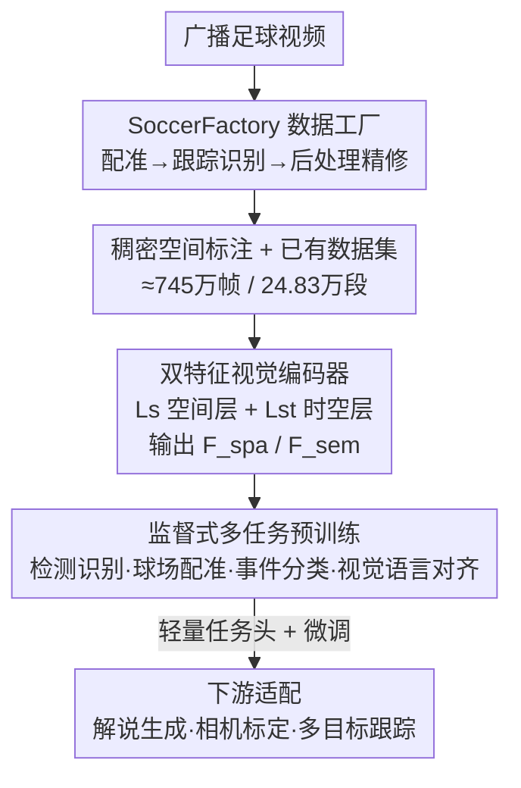

# SoccerMaster: A Vision Foundation Model for Soccer Understanding

**会议**: CVPR2026  
**arXiv**: [2512.11016](https://arxiv.org/abs/2512.11016)  
**代码**: https://haolinyang-hlyang.github.io/SoccerMaster (项目主页，数据/代码/模型承诺开源)  
**领域**: 视频理解 / 视觉基础模型  
**关键词**: 足球理解, 视觉基础模型, 多任务预训练, 时空注意力, 自动数据标注

## 一句话总结
SoccerMaster 用一个共享的时空 ViT 编码器 + 五个轻量任务头，把球员检测识别、球场配准、事件分类、视觉-语言对齐这四类"空间感知 + 语义推理"任务塞进一次监督式多任务预训练，再配套一条自动标注流水线 SoccerFactory 量产稠密空间标签，最终在检测、跟踪、相机标定、解说生成等下游任务上全面超过通用视觉基础模型（SigLIP 2 / DINOv3）和足球专用模型 MatchVision。

## 研究背景与动机

**领域现状**：足球视觉理解最近很热，但主流做法是"一个任务一个专家模型"——检测一个网络、跟踪一个网络、号码识别一个网络、解说生成又一个网络，彼此割裂。这导致每上一个新任务都要从头攒数据、调模型，探索成本极高。

**现有痛点**：少数想做"统一模型"的工作（如 MatchVision/UniSoccer）走的是"视觉-语言对齐"路线，预训练时几乎只优化语义级目标，**忽略了稠密的空间监督**。结果是模型能"说出"画面里发生了什么（语义），却"指不出"谁在哪里（空间）——空间感知和语义推理之间存在断层。论文用数据印证了这一点：MatchVision 在球员检测上只有 17.0 mAP，远低于本文的 49.5。

**核心矛盾**：足球理解天生有一条"空间感知 ↔ 语义推理"的二分裂缝。前者要几何精度（球员框、球场关键点、相机参数），后者要高层抽象（事件类别、解说文本）。把这两类目标分开训，谁也学不到对方的表示；想合起来训，又缺一个同时含稠密空间标签和精确时序语义的大规模数据集——SoccerNet 系列虽全，但标注是为各自割裂任务定制的，尤其缺主摄视角的稠密空间标注。

**本文目标**：(1) 造一个统一的足球视觉基础模型，一套编码器表示同时服务空间感知和语义推理；(2) 解决稠密空间标签稀缺的瓶颈，让多任务预训练有料可喂。

**切入角度**：作者假设——只要在预训练里**同时**强制优化"球场几何"和"比赛语义"两类目标，共享编码器就会被逼出一种既懂位置又懂语义的多粒度表示；而空间标签的稀缺可以用现成专家模型（YOLOv8 / ReID / SAM2 / Qwen2.5-VL / PnL）拼成的自动流水线从广播视频里"刷"出来。

**核心 idea**：用"一套时空编码器 + 多任务监督预训练"取代"一任务一模型"，并用自动标注流水线把稀缺的稠密空间监督补齐。

## 方法详解

### 整体框架
SoccerMaster 的全链路分两条线：**数据线**先用自动流水线 SoccerFactory 把广播视频转成带框、带号码、带球场关键点、带相机参数的稠密标注，与已有数据集（SoccerNet-GSR/v2、MatchTime、SoccerReplay-1988）合并成约 745 万帧、24.83 万视频段的预训练池（其中空间感知 2.75M 帧、语义推理 4.71M 帧）；**模型线**用一个 ViT 编码器把视频段同时编出"空间特征 $\mathcal{F}_{\mathrm{spa}}$"和"语义特征 $\mathcal{F}_{\mathrm{sem}}$"，接五个轻量任务头做监督式多任务预训练，预训练完成后再用极少量任务头/微调适配下游（解说生成、相机标定、多目标跟踪）。

编码器输入是 $T{=}30$ 帧、$512{\times}512$ 的视频段，由 $L_s{=}16$ 层纯空间注意力块 + $L_{st}{=}8$ 层时空注意力块组成（隐维 1024，由 siglip2-large-patch16-512 初始化）。前 $L_s$ 层只在帧内做空间自注意力，输出当作保留细粒度细节的空间特征 $\mathcal{F}_{\mathrm{spa}}\in\mathbb{R}^{T\times h\times w\times d}$；后 $L_{st}$ 层采用 TimeSformer 式的"时间注意力 + 空间注意力"交替，最后经 MAP 注意力池化得到全局动态语义特征 $\mathcal{F}_{\mathrm{sem}}\in\mathbb{R}^{T\times d}$。空间特征喂给检测头和球场配准头，语义特征喂给事件分类头和对齐头——这就是"一套编码器、两种粒度表示"的来源。

### 关键设计

**1. SoccerFactory 自动数据工厂：把广播视频"炼"成稠密空间标签**

针对"主摄视角稠密空间标注稀缺、人工标太贵"这个最硬的瓶颈，作者把一堆现成专家模型串成三段流水线。**第一段·球场配准**：跟随 GSR 做法用关键点/线检测器建立图像↔球场坐标的几何对应，再用 PnL 模块估出相机参数，反过来用标准球场的投影去精修关键点和线，得到干净的训练标签。**第二段·跟踪与识别**：用在足球数据上微调过的 YOLOv8 检出球员/守门员/裁判，接 StrongSORT + PRTReID 嵌入做跟踪；对每个框裁剪后用 Qwen2.5-VL 识别角色和球衣号码，再经一个可读性分类器过滤遮挡/视角不清的号码；球队归属则在 tracklet 级别的 ReID 嵌入 + 映射到球场坐标上做聚类。**第三段·后处理精修**：用 SAM2 分割补回漏检、纠正 ID 跳变，号码和角色用 tracklet 内多数投票保证时序一致，并按 ReID + 号码一致性把碎片轨迹拼成长轨迹。这条流水线一次产出"球员框 + 角色 + 球队 + 号码 + 球场关键点/线 + 相机参数 + 球场坐标轨迹"全套标注，把稠密空间监督从"靠人标"变成"可规模化生产"。

**2. 双粒度时空编码器：一套 ViT 同时供给空间感知与语义推理**

针对"空间和语义被迫分两个模型"的痛点，编码器用分层设计在**同一条前向**里产出两种粒度的特征。底部 $L_s$ 层只做帧内空间自注意力 $\mathbf{z}_{t,i}^{(l+1)}=\mathrm{SpatialAttn}(\mathbf{z}_{t,i}^{(l)},\{\mathbf{z}_{t,j}^{(l)}\}_{j=1}^{N})$，token 只和同帧内其它 token 交互、不跨帧，因此保留了检测/配准需要的细粒度几何细节，其输出直接当 $\mathcal{F}_{\mathrm{spa}}$；顶部 $L_{st}$ 层加上时间位置编码后做时间↔空间交替注意力，时间注意力 $\mathbf{z}_{t,i}^{(l+\frac12)}=\mathrm{TemporalAttn}(\mathbf{z}_{t,i}^{(l)},\{\mathbf{z}_{t',i}^{(l)}\}_{t'=1}^{T})$ 让每个 token 只和不同帧的同空间位置交互，专门捕捉动作的时序演变，最后 MAP 池化成 $\mathcal{F}_{\mathrm{sem}}$。"先纯空间、后时空"的好处是：把昂贵的时间注意力只留给顶层，既省算力又让浅层专注几何、深层专注语义，天然对应了两类下游任务的需求。

**3. 监督式多任务联合预训练：用四类异构目标逼出共享表示**

针对"对齐路线忽略空间监督导致表示偏科"的核心问题，作者把四类任务的轻量头 $\Psi_{\mathrm{out}}=\{\Psi_{\mathrm{d}},\Psi_{\mathrm{k}},\Psi_{\mathrm{l}},\Psi_{\mathrm{e}},\Psi_{\mathrm{a}}\}$ 一起挂上去联合优化。检测识别头 $\Psi_{\mathrm{d}}$ 用类 Deformable-DETR 解码器在可学习 query 与 $\mathcal{F}_{\mathrm{spa}}$ 间做注意力，三个线性层分别出框、角色、号码，损失为 $\mathcal{L}_{\mathrm{a}}=\lambda_{\mathrm{cls}}\mathcal{L}_{\mathrm{cls}}+\lambda_{\mathrm{bbox}}\mathcal{L}_{\mathrm{bbox}}+\lambda_{\mathrm{r}}\mathcal{L}_{\mathrm{r}}+\lambda_{\mathrm{j}}\mathcal{L}_{\mathrm{j}}$（角色和号码用 focal loss）；球场配准头 $\{\Psi_{\mathrm{k}},\Psi_{\mathrm{l}}\}$ 用含 PixelShuffle 的卷积逐级上采样预测关键点/端点热力图，对热力图做 MSE（$\mathcal{L}_{\mathrm{k}},\mathcal{L}_{\mathrm{l}}$）；事件分类头 $\Psi_{\mathrm{e}}$ 在 $\mathcal{F}_{\mathrm{sem}}$ 上接两层 Transformer + 时序平均池化 + 线性分类，交叉熵 $\mathcal{L}_{\mathrm{e}}$（24 类事件）；对齐头 $\Psi_{\mathrm{a}}$ 对 $\mathcal{F}_{\mathrm{sem}}$ 时序平均后与 SigLIP 2 文本编码器的解说文本嵌入算相似度，用 SigLIP 对比损失 $\mathcal{L}_{\mathrm{con}}$。总损失是加权和

$$\mathcal{L}_{\mathrm{total}}=\lambda_{\mathrm{a}}\mathcal{L}_{\mathrm{a}}+\lambda_{\mathrm{k}}\mathcal{L}_{\mathrm{k}}+\lambda_{\mathrm{l}}\mathcal{L}_{\mathrm{l}}+\lambda_{\mathrm{e}}\mathcal{L}_{\mathrm{e}}+\lambda_{\mathrm{con}}\mathcal{L}_{\mathrm{con}}.$$

关键在于：稠密空间损失（检测 + 配准）和高层语义损失（事件 + 对齐）共享同一个编码器梯度，迫使表示既含球场几何又含比赛语义，这正是对齐路线缺的那一块。

**4. 轻量下游适配：把预训练表示零样本/微调迁到三类任务**

为证明学到的是"通用可迁移"表示而非过拟合预训练任务，作者只在编码器上挂极小的下游头。**解说生成**用 Q-Former 对 $\mathcal{F}_{\mathrm{sem}}$ 做时序聚合，线性投影成前缀嵌入喂给 Llama-3-8B 自回归生成。**相机标定**直接复用预训练的球场配准头检出的关键点/线，送进 PnL 精修模块解相机内外参——配准已是预训练目标，因此可零样本推理。**多目标跟踪**走 MOTIP 思路把数据关联当分类：从检测头 DETR 解码器取目标级特征，拼上来自 ID 字典的可学习 ID 嵌入构成历史轨迹作"上下文身份提示"，再用一个 ID 解码器（Transformer decoder）对当前帧每个检测预测一致身份。这套适配的卖点是端到端、流程简单，跟踪不再需要"检测器 + 独立 ReID + 后处理"的多阶段拼装。

### 损失函数 / 训练策略
预训练目标即上文 $\mathcal{L}_{\mathrm{total}}$，五项任务损失加权联合优化。编码器由 siglip2-large-patch16-512 初始化，$L_s{=}16$、$L_{st}{=}8$、$d{=}1024$，输入 $T{=}30$ 帧、$512{\times}512$、patch $16{\times}16$。下游评测中相机标定区分零样本（直接用预训练配准头）与微调两种设置；解说生成各模型统一在 MatchTime 上微调后再评。

## 实验关键数据

### 主实验

预训练任务直评（冻结编码器、只训任务头；SoccerMaster 因原生预训练过故直接评）：

| 任务/指标 | SigLIP 2 | DINOv3 | MatchVision | SoccerMaster |
|--------|------|------|------|------|
| 检测 AP@50 | 72.3 | 70.2 | 51.9 | **91.5** |
| 检测 mAP | 32.0 | 28.0 | 17.0 | **49.5** |
| 号码识别 jn | 78.2 | 76.1 | 74.9 | **79.7** |
| 角色 role | 97.3 | 98.1 | 94.1 | **99.1** |
| 事件分类 acc | 49.8 | 51.8 | 65.3 | **77.2** |
| 对齐检索 top-1 | 3.4 | — | 4.0 | **39.0** |

（SigLIP 2/DINOv3 数值取其 +SoccerFactory Data 行）相比次优，检测 mAP +17.5、事件分类 +11.9；对齐检索 39.0 把基线（SigLIP 2 仅 3.4，存在严重领域鸿沟）甩开一大截。

下游任务对比（精选）：

| 任务 | 指标 | 之前 SOTA | SoccerMaster | 说明 |
|------|------|------|------|------|
| 相机标定 SN22-center | FS | PnlCalib 67.6 | 75.8 (微调) / 70.1 (零样本) | 同 512×512 下 +8.2 FS；零样本已超 |
| 相机标定 SN23-test | FS | PnlCalib 51.8 | 56.2 (微调) | +4.4 FS |
| 多目标跟踪 | HOTA / DetA | PRTreID 59.8 / 61.1 | 59.1 / **65.2** | 唯一端到端，DetA 最佳 |
| 解说生成 | CIDEr | MatchVision 35.7 | **38.6** | BLEU@1/4 也最佳 |

GSR 标注质量（验证 SoccerFactory 本身）：在 SoccerNet-GSR 测试集上 GS-HOTA 达 64.1，超过挑战赛冠军 KIST-GSR 的 61.5，说明流水线产出的标注质量足以替代人工。GS-HOTA 是 Game State Reconstruction 任务的综合指标，同时考核跟踪、角色、号码、标定、球队归属多个维度。

### 消融实验

是否加入 SoccerFactory 自动生成的空间标注（用 224×224、$L_s{=}8$、$L_{st}{=}4$ 的紧凑变体）：

| 配置 | 检测 AP@50 | 检测 mAP | 号码 jn | 事件 acc | 对齐 top-1 |
|------|---------|---------|---------|---------|---------|
| 仅已有数据 | 77.7 | 30.2 | 75.0 | 71.6 | 35.0 |
| + SoccerFactory 数据 | **82.0** | **37.5** | 76.5 | 70.5 | 36.8 |

加入自动标注后，空间感知任务大涨（检测 +4.3 AP@50、+7.3 mAP），而事件分类、对齐等语义任务基本持平或微动——印证自动标注是一份可靠且可规模化的空间监督来源，且不损害语义表示。

### 关键发现
- **稠密空间监督是检测涨点的主因**：消融显示加入 SoccerFactory 数据后检测 mAP +7.3，是所有任务里增益最大的；对齐路线之所以"指不出谁在哪"，根因就是缺这份监督。
- **对齐检索的领域鸿沟最触目**：通用 SigLIP 2 在足球解说检索上 top-1 仅 3.4%，本文 39.0%，说明足球领域语义需要专门的视觉-语义共训，通用 VFM 直接迁移几乎失效。
- **零样本相机标定已具竞争力**：未微调时在 SN22-center 上 FS 70.1 已超 PnlCalib（67.6），说明球场配准作为预训练任务确实学到了可迁移的几何表示；但在含大量非主摄视角的 SN23-test 上零样本（44.8）落后于 PnlCalib（51.8），微调后才反超。
- **跟踪靠端到端简化流程**：DetA 65.2 最佳、AssA 53.9 次优，在不用"检测器+独立 ReID+后处理"多阶段拼装的前提下拿到有竞争力的整体成绩。

## 亮点与洞察
- **"补监督"而非"换架构"**：本文最关键的判断是——对齐模型的偏科不是结构问题，而是预训练目标缺了稠密空间监督。于是它没有重造编码器，而是把空间损失加回联合训练 + 造流水线补数据，思路朴素但直击要害。
- **自动标注流水线本身就是可复用资产**：SoccerFactory 把 YOLOv8/StrongSORT/PRTReID/Qwen2.5-VL/SAM2/PnL 这些现成专家拼成"配准→跟踪识别→后处理"三段式，产出的标注在 GSR 上 GS-HOTA 64.1 超过人工标注挑战赛冠军——这套"用专家模型集成刷标签"的范式可迁移到其它垂直视频域（如其它球类、安防、体育转播）。
- **分层时空设计省得巧**：把时间注意力只放顶 $L_{st}$ 层、底层纯空间，既让浅层特征保留几何细节供检测用、深层语义供分类用，又避免全程时空注意力的高开销，是一个表示与算力双赢的工程选择。
- **一份编码器、两种粒度**：$\mathcal{F}_{\mathrm{spa}}$ 与 $\mathcal{F}_{\mathrm{sem}}$ 的显式区分让"哪类任务该吃哪种特征"一目了然，可直接搬到任何"既要定位又要语义"的视频任务设计上。

## 局限与展望
- **重度依赖现成专家模型的质量**：SoccerFactory 的标注上限被 YOLOv8、PRTReID、Qwen2.5-VL、SAM2 等组件决定，任一环节在极端遮挡/罕见视角下出错都会污染标签，论文未深入分析误差传播。
- **非主摄视角是软肋**：相机标定在 SN23-test（含大量非主摄视角）零样本明显落后，预训练数据刻意排除了回放、特写、其它机位，模型对这些场景的泛化未被充分验证。
- **算力门槛高**：512×512、30 帧、24 层 ViT、745 万帧的预训练规模不小，论文主消融用的是 224×224 紧凑变体，全量配置的可复现成本偏高。
- **"基础模型"的广度仍以足球闭域为界**：所有任务、数据、评测都在足球内，是否能像通用 VFM 一样跨运动迁移（如篮球、橄榄球）尚无证据。
- **改进思路**：引入标注置信度/不确定性过滤来抑制流水线噪声；在预训练池中纳入多机位数据以补非主摄视角短板；探索把 SoccerFactory 的"专家集成刷标"范式做成跨运动的通用体育标注工厂。

## 相关工作与启发
- **vs MatchVision / UniSoccer**：同样想做统一足球模型，但它们走纯视觉-语言对齐、预训练几乎不带稠密空间目标，导致检测（mAP 17.0）和对齐（top-1 4.0）双弱；本文把空间监督加回联合训练，检测 mAP 49.5、对齐 39.0 全面反超，核心区别是"是否在预训练里强制空间感知"。
- **vs 通用 VFM（SigLIP 2 / DINOv3）**：通用模型表示泛而不专，在足球解说检索上存在严重领域鸿沟（SigLIP 2 仅 3.4% top-1），DINOv3 甚至无对齐用文本编码器；本文用足球域多任务预训练填平鸿沟。
- **vs 一任务一专家（YOLOv8+OC-SORT / PnlCalib / 各检测号码识别模型）**：传统范式每任务一套多阶段管线，跟踪要"检测+ReID+后处理"拼装；本文一套编码器 + 轻量头即可端到端覆盖检测、跟踪、标定、解说，DetA 65.2 最佳且流程显著简化。
- **启发**：垂直视频域要做基础模型，关键不在堆更大编码器，而在"预训练目标是否覆盖该域全部粒度（空间几何 + 时序语义）"，以及"如何用现成专家集成低成本造出稀缺粒度的监督"。

## 评分
- 新颖性: ⭐⭐⭐⭐ 首个统一空间感知与语义推理的足球视觉基础模型，但核心组件多为现成模块的系统集成。
- 实验充分度: ⭐⭐⭐⭐⭐ 覆盖 4 个预训练任务直评 + 4 类下游任务 + 标注质量验证 + 数据消融，对比全面。
- 写作质量: ⭐⭐⭐⭐ 任务定义、架构、损失交代清晰，公式规范；部分超参权重未给具体值。
- 价值: ⭐⭐⭐⭐ 给足球理解提供统一 backbone + 可规模化标注流水线，对体育视频垂直域有较强示范与复用价值。

<!-- RELATED:START -->

## 相关论文

- [\[CVPR 2025\] Towards Universal Soccer Video Understanding](../../CVPR2025/video_understanding/towards_universal_soccer_video_understanding.md)
- [\[CVPR 2026\] UniVBench: Towards Unified Evaluation for Video Foundation Models](univbench_towards_unified_evaluation_for_video_foundation_models.md)
- [\[CVPR 2025\] LLAVIDAL: A Large Language Vision Model for Daily Activities of Living](../../CVPR2025/video_understanding/llavidal_a_large_language_vision_model_for_daily_activities_of_living.md)
- [\[CVPR 2026\] Towards Data-Efficient Video Pre-training with Frozen Image Foundation Models](towards_data-efficient_video_pre-training_with_frozen_image_foundation_models.md)
- [\[CVPR 2025\] MambaVLT: Time-Evolving Multimodal State Space Model for Vision-Language Tracking](../../CVPR2025/video_understanding/mambavlt_time-evolving_multimodal_state_space_model_for_vision-language_tracking.md)

<!-- RELATED:END -->
