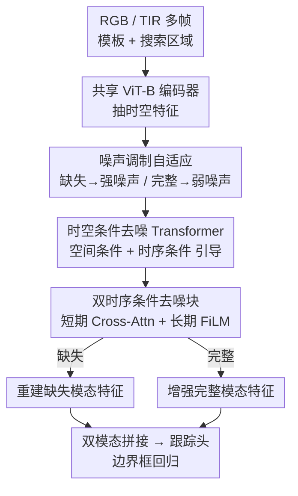

# Spatio-Temporal Conditional Denoising Transformer for Modality-Missing RGBT Tracking

**会议**: CVPR 2026  
**论文**: [CVF Open Access](https://openaccess.thecvf.com/content/CVPR2026/html/Lu_Spatio-Temporal_Conditional_Denoising_Transformer_for_Modality-Missing_RGBT_Tracking_CVPR_2026_paper.html)  
**代码**: 无  
**领域**: 视频理解  
**关键词**: RGBT 跟踪, 模态缺失, 条件去噪, 时空建模, 扩散

## 一句话总结
把 RGB-热红外（RGBT）跟踪里的"模态缺失补全"和"完整模态增强"统一成一个**时空条件去噪**过程：用历史帧的短期/长期时序线索做条件，引导去噪器在强噪声下重建缺失模态、在弱噪声下增强完整模态，单一架构和参数即可应对两种场景，在三个 RGBT 基准的完整与缺失设定上都拿到 SOTA 或接近 SOTA。

## 研究背景与动机
**领域现状**：RGBT 跟踪靠 RGB（外观/语义）与热红外 TIR（低光/遮挡下稳定的辐射线索）互补，在夜间监控、搜救、自动驾驶等安全攸关场景很有价值。但真实部署常因传感器失配、遮挡、硬件故障导致**某一模态动态缺失**，此时网络学到的多模态特征变得不完整、不稳定，跟踪精度骤降。

**现有痛点**：现有针对缺失的工作分两类——IPL（IJCV'25）这类**从可用模态生成缺失模态**的重建法，以及 FlexTrack（ICCV'25）这类**混合专家/开关式架构**按模态配置切分支。两类都有硬伤：① 几乎只用**当前帧的空间线索**，忽略历史帧里关于缺失模态的时序相关性，重建出来的特征容易空间偏置、时序不一致；② 架构**场景依赖**，要显式切换或单独分支处理缺失/完整，扩展性差、计算冗余。

**核心矛盾**：缺失模态跟踪本质要求模型既能**重建缺失信息**、又能**自适应利用时序与跨模态上下文**保持时间一致性，而"按场景切架构"的做法天然无法在一套参数里同时满足这两点。

**本文目标**：用**单一模型、单套参数**同时处理缺失与完整两种模态条件，且重建要兼顾空间细节与时序连贯。

**切入角度**：作者把多模态特征重建**重新表述为时空条件去噪**——既然扩散/去噪天生就是"从噪声里在条件引导下逐步生成结构化信号"，那"从可用模态+历史上下文里恢复/精炼另一模态特征"恰好就是一个条件生成问题。

**核心 idea**：用**噪声强度**当开关、用**短期+长期时序**当条件，把"缺失重建"和"完整增强"统一进同一个条件去噪 Transformer（SCDT）。

## 方法详解

### 整体框架
给定 RGB 与 TIR 视频序列，二者先经**共享 ViT-B 编码器**（沿用 ODTrack 预训练）从多帧模板与搜索区域里抽取时空特征。可用模态的特征被注入**自适应高斯噪声**后送入 SCDT 模块；SCDT 在两类条件引导下做条件去噪——**空间条件 $c_s$**来自当前帧、**时序条件 $c_t$**来自互补模态的历史帧（含短期相邻帧 token + 长期模态演化 token）。缺失时（如 TIR 没了）施加**强噪声**逼模型重建缺失模态语义；完整时施加**弱噪声**精炼跨模态表征、提升语义对齐与时序连贯。去噪后双模态特征拼接送入跟踪头做框回归。整个流程**不改架构、不换参数**即可在两种场景间无缝切换。

### 关键设计

**1. 时空条件去噪表述：把多模态融合改写成条件生成**

针对"现有方法只靠当前帧空间线索、重建空间偏置又时序不一致"的痛点，SCDT 不再直接融合异构特征，而是学习在**可用模态+时序线索为条件**下生成模态表征。给定可用模态编码特征 $f_m\in\mathbb{R}^{B\times N\times C}$，先构造带噪输入：

$$\tilde f_m=\sqrt{\bar\alpha}\,f_m+\sqrt{1-\bar\alpha}\,\varepsilon,\quad \varepsilon\sim\mathcal N(0,\sigma^2 I)$$

去噪器 $D_\theta$ 在条件下输出精炼特征 $\hat f=D_\theta(\tilde f_m;c_s,c_t)$，其中 $c_s$ 是当前帧空间信息、$c_t$ 融合了"未缺失的短期历史帧"与"长期模态 token"。关键在于噪声方差 $\sigma^2$ 是**任务相关**的：高噪声逼向重建、低噪声偏向增强。缺失场景（如 TIR 缺）对可用模态加强噪声、强迫去噪器在时空条件引导下推断缺失语义 $\hat f_{m'}=D_\theta(\tilde f_m;c_s,c_t)$，重建特征与可用特征拼接后供下游跟踪，监督用特征级重建损失 $L_\text{recon}=\lVert\hat f_{m'}-f_{m'}\rVert_2^2$。把"融合"换成"条件去噪生成"，让模型天然具备从噪声+上下文恢复结构的能力，这是统一缺失/完整的根基。

**2. 双时序条件去噪块：短期 Cross-Attention 管局部对齐，长期 FiLM 管全局连贯**

针对"忽略历史时序、重建漂移"的痛点，每个去噪块**互补地**注入短期与长期条件。先用互补模态近邻未缺失帧的短期 token $s_c$ 做 cross-attention 融合：

$$f'_m=\tilde f_m^{SA}+\text{CrossAttn}(\tilde f_m^{SA},s_c,s_c)$$

它提供逐帧、局部对齐的运动连续性，缓解跨模态错位。随后用编码长期时序演化的全局 token $l_c$ 以 FiLM 风格做缩放-平移调制：

$$f''_m=f'_m\odot\big(1+\tanh(W_s l_c)\big)+\tanh(W_r l_c)$$

长期 token 稳定特征、压制噪声激活、降低累积漂移；最后经 FFN 得 $\hat f_m=f''_m+\text{FFN}(\text{LN}(f''_m))$。短期负责"细粒度运动一致"、长期负责"高层语义稳定"，消融里二者各自在缺失/完整基准上分别涨点、合并后最优——这正是它要区分两种时序角色的理由。

**3. 噪声调制自适应：用"弱噪声-强噪声"把增强与重建塞进一套参数**

针对"架构场景依赖、要切分支"的痛点，作者不靠改结构而靠**噪声强度+损失目标**隐式编码不同融合目标。完整模态走同一条件生成通路但用**弱噪声**，不强求像素级保真，而对齐生成与真实特征的一二阶统计量：

$$L_\text{align}=\lVert\mu(\hat f_m)-\mu(f_m)\rVert_2^2+\lVert\text{Var}(\hat f_m)-\text{Var}(f_m)\rVert_2^2$$

让 $\hat f_m$ 保住模态分布的同时探索更具判别力的方向。配合动态损失权重——缺失场景 $\lambda_1{=}1,\lambda_2{=}0$ 主攻重建，完整场景 $\lambda_1{=}0,\lambda_2{=}1$ 主攻增强（跟踪损失 $\lambda_3$ 恒为 1），**去噪器权重在两种场景间完全共享**。消融证实"弱-强"组合优于"强-强/弱-弱"：弱噪声给完整模态轻微扰动提鲁棒，强噪声模拟缺失给重建有效引导，单模型由此通吃两种条件。

### 损失函数 / 训练策略
总目标 $L_\text{total}=\lambda_1 L_\text{recon}+\lambda_2 L_\text{align}+\lambda_3 L_\text{track}$，跟踪损失沿用 ODTrack 设定。模板 128×128、搜索 256×256，ViT-B 主干，6 张 RTX 4090、总 batch 24、AdamW；主干学习率 $10^{-5}$、其余 $10^{-4}$。LasHeR/RGBT234 系列训 30 epoch（每 epoch 4 万样本，第 24 epoch 起加 $10^{-4}$ 权重衰减），VTUAV 训 5 epoch（每 epoch 6 万样本）。

## 实验关键数据

### 主实验
三大基准 × 完整/缺失两套设定（PR=精度率、SR=成功率，RGBT234 用 MPR/MSR）。SCDT 在缺失设定上优势尤其明显。

| 数据集（设定） | 指标 | SCDT | 次优(FlexTrack/IPL) | 提升 |
|--------|------|------|----------|------|
| LasHeR-Miss | PR / SR | **69.3 / 54.4** | 65.1 / 52.3 | +4.2 / +2.1 |
| RGBT234-Miss | MPR / MSR | **88.1 / 64.3** | 84.1 / 62.6 | +4.0 / +1.7 |
| VTUAV-Miss | PR / SR | **84.1 / 69.6** | 80.9 / 68.5 (IPL) | +3.2 / +1.1 |
| LasHeR | PR / SR | **77.4** / 61.0 | 77.3 / 62.0 | +0.1 / −1.0 |
| RGBT234 | MPR / MSR | **93.1** / 69.6 | 92.7 / 69.9 | +0.4 / −0.3 |
| VTUAV | PR / SR | **93.6 / 78.9** | 88.6 / 76.2 | +5.0 / +2.7 |

完整设定下 SCDT 在 PR/MPR 上普遍最优、SR 偶居次优；缺失设定下 PR/SR 全面领先，验证了去噪重建对不完整输入的鲁棒性。

### 消融实验
| 配置 | LasHeR PR/SR | LasHeR-Miss PR/SR | 说明 |
|------|---------|---------|------|
| baseline | 75.1 / 59.2 | 63.2 / 49.6 | 无时空条件 |
| w/ SP | 75.7 / 58.7 | 66.9 / 52.2 | 只加空间条件 |
| w/ SP+ST | 75.8 / 59.6 | 68.3 / 53.6 | 加短期时序（缺失场景受益大） |
| w/ SP+LT | 76.0 / 59.7 | 67.3 / 52.9 | 加长期时序（完整场景受益大） |
| Full (SP+ST+LT) | **77.4 / 61.0** | **69.3 / 54.4** | 短长期互补最优 |

| 噪声策略（完整-缺失） | LasHeR PR/SR | LasHeR-Miss PR/SR |
|------|------|------|
| 强-强 | 73.2 / 57.4 | 65.4 / 51.4 |
| 弱-弱 | 75.8 / 59.6 | 68.9 / 54.1 |
| 弱-强（本文） | **77.4 / 61.0** | **69.3 / 54.4** |

监督消融：仅 $L_\text{align}$ 完整场景好但缺失差（67.2/52.8），仅 $L_\text{recon}$ 反之（68.0/53.3），二者合并最优（69.3/54.4）。去噪层深度以 4 层最佳（2 层欠拟合、6 层略降）。

### 关键发现
- **时序条件各司其职**：短期 token 在缺失场景涨点更多（强调运动连续、抗局部抖动），长期 token 在完整场景更有用（稳全局语义、降漂移），合并才是最优解。
- **"弱-强"噪声配比是关键**：强-强会因输入被严重破坏导致对齐损失生成不出好特征，弱-弱又对缺失重建引导不足，唯有弱(完整)/强(缺失)兼顾两端。
- **统一框架不牺牲完整场景**：即使无模态退化，条件增强机制仍提升跨模态特征质量（VTUAV 完整设定大涨 5.0 PR）。

## 亮点与洞察
- **用噪声强度当"任务开关"**：把"该重建还是该增强"编码进噪声幅度而非网络分支，单套参数通吃两类场景——这比 MoE/开关式架构优雅得多，可迁移到任意"有时输入完整、有时部分缺失"的多模态任务。
- **短期 Cross-Attn + 长期 FiLM 的分工**：把时序拆成"局部对齐"和"全局调制"两种机制分别建模，而非笼统塞一个时序模块，给"如何用历史帧补当前缺失"提供了清晰范式。
- **重述胜过堆模块**：把融合重新表述为条件去噪生成，让扩散式"从噪声+条件恢复结构"的能力天然服务于缺失补全，是"换个问题表述就解锁新解法"的好例子。

## 局限与展望
- 框架建立在去噪/扩散式条件生成上，去噪层深度敏感（4 层最优，6 层反降），实际部署需调；论文未报告推理速度/FPS，统一架构是否真比切分支更省算力仍待量化 ⚠️。
- 缺失设定用的是从原数据集构造的"modality-missing 变体"（LasHeR-Miss 等），其缺失模式是模拟的，真实传感器故障下的分布偏移是否一致存疑 ⚠️。
- 长期 token "编码模态演化"的具体构造在缓存里描述较略，长序列下其稳定性与累积误差值得进一步分析。

## 相关工作与启发
- **vs IPL (IJCV'25)**：IPL 用可逆 prompter 从可用模态**生成**缺失模态、靠空间线索，本文改用时空条件去噪并显式引入短长期历史时序，缺失场景 PR/SR 全面反超（LasHeR-Miss +7.6/+8.0）。
- **vs FlexTrack (ICCV'25)**：FlexTrack 走混合专家/自适应路由按模态配置切分支，本文用单一架构+噪声调制统一缺失与完整，缺失设定上领先（LasHeR-Miss +4.2 PR）且省去显式切换。
- **vs Diffusion Transformer / 扩散跟踪**：现有扩散跟踪多停留在帧级生成、忽略时序依赖，本文把去噪重述为**时空条件重建**，把时序连贯做进去噪过程，更契合视频跟踪的连续性需求。

## 评分
- 新颖性: ⭐⭐⭐⭐⭐ 用噪声强度统一缺失重建与完整增强、去噪重述融合，思路新颖且优雅
- 实验充分度: ⭐⭐⭐⭐ 三基准×完整/缺失全覆盖、消融完整，但缺推理效率与真实缺失场景验证
- 写作质量: ⭐⭐⭐⭐ 动机—方法—消融逻辑清晰，部分时序 token 构造略简
- 价值: ⭐⭐⭐⭐ 为模态缺失跟踪立了强 baseline，"噪声当开关"范式可迁移到更广的缺失多模态任务

<!-- RELATED:START -->

## 相关论文

- [\[CVPR 2026\] Progressive Multi-cue Alignment for Unaligned RGBT Tracking](progressive_multi-cue_alignment_for_unaligned_rgbt_tracking.md)
- [\[CVPR 2026\] VISTA: Video Interaction Spatio-Temporal Analysis Benchmark](vista_video_interaction_spatio-temporal_analysis_benchmark.md)
- [\[CVPR 2026\] RAGTrack: Language-aware RGBT Tracking with Retrieval-Augmented Generation](ragtrack_language-aware_rgbt_tracking_with_retrieval-augmented_generation.md)
- [\[CVPR 2026\] Towards Spatio-Temporal World Scene Graph Generation from Monocular Videos](towards_spatio-temporal_world_scene_graph_generation_from_monocular_videos.md)
- [\[CVPR 2026\] Streaming Video Crime Anticipation with Spatio-Temporal Causal Reasoning](streaming_video_crime_anticipation_with_spatio-temporal_causal_reasoning.md)

<!-- RELATED:END -->
