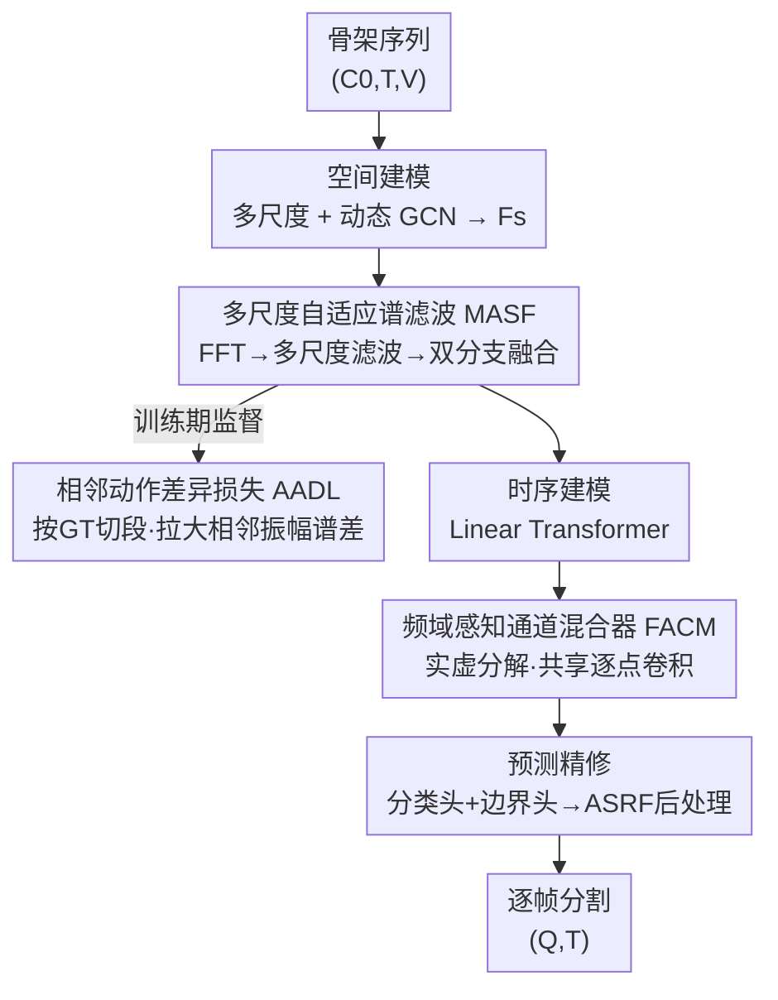

# Spectral Scalpel: Amplifying Adjacent Action Discrepancy via Frequency-Selective Filtering for Skeleton-Based Action Segmentation

**会议**: CVPR 2026  
**论文**: [CVF Open Access](https://openaccess.thecvf.com/content/CVPR2026/html/Ji_Spectral_Scalpel_Amplifying_Adjacent_Action_Discrepancy_via_Frequency-Selective_Filtering_for_CVPR_2026_paper.html)  
**代码**: https://github.com/HaoyuJi/SpecScalpel  
**领域**: 视频理解 / 时序动作分割  
**关键词**: 骨架动作分割, 频域滤波, 相邻动作判别, 谱编辑, 通道混合

## 一句话总结
针对骨架时序动作分割（STAS）里"相邻相似动作分不清、边界糊"的痛点，本文把建模搬到频域：用一把可学习的"频谱手术刀"（多尺度自适应谱滤波 MASF）放大每个动作独有频率、压制相邻动作共享频率，再用"相邻动作差异损失"（AADL）当手术目标显式拉大相邻段的振幅谱差距，在五个数据集上取得 SOTA 且 FLOPs/参数更低。

## 研究背景与动机

**领域现状**：骨架时序动作分割（Skeleton-based Temporal Action Segmentation, STAS）要对一段长且未裁剪的骨架运动序列做逐帧分类——给每一帧打上动作标签。相比直接吃 RGB 的视频版（VTAS），骨架输入轻量、对外观鲁棒。主流做法是"空间建模 + 时序建模"：GCN 抓关节间的空间依赖，TCN / Transformer 抓帧间的长程时序关联（MS-GCN、DeST、LaSA 这一脉）。

**现有痛点**：两个老大难。其一是**类间混淆**——视觉或语义相近的动作（比如花样滑冰里两个细分动作）特征不够判别，被分错；其二是**边界模糊**——相邻动作之间的过渡动态太相似，模型说不清切换点到底在哪一帧。

**核心矛盾**：作者把根因归到时序建模范式本身。TCN 和 Transformer 为了聚合上下文、维持动作内部连贯，**本质上都在干低通滤波的活**，带来一种内在的"过平滑"效应。这种平滑对保持单个动作内部一致性很有用，却**顺手把相邻不同动作之间那些关键的细微差异也抹平了**，边界自然糊掉。也就是说，现有架构天生在"压制"判别信号，需要一个机制把核心差异显式找回来、放大。

**切入角度**：作者把视角从时空域转到**频域**。骨架运动本质上是关节的振荡叠加，不同动作有截然不同的周期性和频谱能量分布——这些差异是物理层面的，不只是表面的时序轨迹。关键观察是：不同动作的频谱里，**既有共享的公共频率成分，也有各自独有的、动作特异的频率成分**；而恰恰是这些动作特异线索最容易被时序平滑抹掉。那么只要在频域里**有选择地压共享、放独有**，就能直接放大类间判别性、锐化过渡边界（论文 Fig. 1 用合成的双动作单关节信号演示了这个效果）。

**核心 idea**：把"放大相邻动作差异"当作明确的**手术目标**，把自适应频谱滤波当作**手术刀**——做有目标约束的主动谱编辑，而不是像以往 FFT 滤波方法那样靠无约束的盲目数据驱动去学滤波器。

## 方法详解

### 整体框架
Spectral Scalpel 把一段骨架序列 $X \in \mathbb{R}^{C_0 \times T \times V}$（$T$ 帧、$V$ 个关节、$C_0$ 输入通道）映射到逐帧的动作标签 $Y \in \mathbb{R}^{Q \times T}$。整条管线是**四个串行阶段**：空间建模 → 频域建模 → 时序建模 → 预测精修。空间阶段沿用既有 STAS 框架（多尺度 GCN + 沿通道/时间双分支的动态 GCN）拿到精细空间特征 $F_s$；这之后是本文真正的三处创新——频域阶段用**多尺度自适应谱滤波 MASF**当"手术刀"对频谱做编辑，训练时由**相邻动作差异损失 AADL**当"手术目标"显式拉大相邻段差异；时序阶段在 Linear Transformer 抓长程依赖之外，插入**频域感知通道混合器 FACM** 从频谱视角强化通道演化。最终表示 $F_R \in \mathbb{R}^{C\times T}$ 进分类头与边界头，按 ASRF 后处理方案联合两路预测得到分割结果。

### 关键设计

**1. 多尺度自适应谱滤波 MASF：当"手术刀"对频谱做可学习的多尺度编辑**

这是用来对付"过平滑抹掉动作特异频率"的核心模块。给定空间特征 $F_s$，先沿时间轴做 FFT 转到频域 $F_{f0}\in\mathbb{C}^{C\times S\times V}$，然后用 $M$ 个滤波块做多尺度滤波：每块带一个可学习谱滤波器 $H_m\in\mathbb{R}^{1\times R_m\times V}$，经最近邻插值（NNI）拉到频谱分辨率 $S$ 后，与频谱做 Hadamard 逐元素乘，再 iFFT 回时域：

$$F_f^m = \mathcal{F}^{-1}\big(\mathrm{NNI}(H_m)\odot\mathcal{F}(F_s)\big)$$

所有 $H_m$ 都初始化为全 1，于是训练中模型自己学会"哪些频率该压、哪些该放"。多尺度体现在每块滤波器长度 $R_m$ 不同，用**线性**公式排布而非指数：

$$R_m = \frac{(M+m)\cdot R_{\max}}{2M}$$

作者特意不用 $R_m=2^{m+b}$ 这类指数策略，因为线性排布让相邻尺度插值后的滤波器边界重叠更少，从而支持更细粒度、更有区分度的逐通道加权。多尺度滤完后得到 $[F_f^1,\dots,F_f^M]$，再经**双分支动态-静态逐通道融合**聚合：静态分支用训练后固定的参数矩阵 $W_{st}\in\mathbb{R}^{M\times C}$ 学跨样本一致但不灵活的权重；动态分支由 $F_s$ 经线性投影生成输入相关的权重 $W_{dy}$（$W_{dy}=[W_M\cdot\mathrm{Flatten}(W_T\cdot W_S\cdot\mathrm{AvgPool}(F_s))]^\top$），灵活但样本依赖。两路各自沿 $M$ 维 softmax 归一后等权相加，再加 $\tfrac12 F_s$ 残差，得到滤波特征 $F_f$。静态+动态互补，既有泛化性又有逐实例自适应。

**2. 相邻动作差异损失 AADL：给"手术刀"指定明确的手术目标**

光有可学习滤波器还不够——它凭什么知道要"放大相邻动作的差异"？AADL 就是把这个目标显式写成损失。训练时按真值边界把滤波特征 $F_f$ 切成 $N$ 个动作段 $F_a^1,\dots,F_a^N$，每段做 FFT、取振幅谱，再用线性插值（LI）把不同段长 $T_n$ 带来的不一致频率分辨率统一到固定长度 $S_f$：

$$F_b^n = \mathrm{LI}\big(|\mathcal{F}(F_a^n)|\big)$$

这里有个关键性质：由于 FFT 的特性，无论段长 $T_n$ 多少，频率轴始终覆盖 $[0,f_s)$，$T_n$ 只影响频率分辨率 $\Delta f=f_s/T_n$；插值统一到同一频率轴后，相邻段之差 $F_b^n-F_b^{n-1}$ 才有可比意义。然后对相邻段振幅谱差取绝对值、求均值、缩放、过 tanh 与对数：

$$\mathcal{L}_{AAD}=\frac{1}{N-1}\sum_{n=2}^{N}-\log\!\big(\tanh(\alpha\cdot\mathbb{E}|F_b^n-F_b^{n-1}|)\big)$$

其中 $\mathbb{E}(\cdot)$ 对所有元素求均值，$\alpha$ 是缩放因子（实现里 $\alpha=100$）。$\tanh$ 把差异压到 $(0,1)$，$-\log$ 让差异越大损失越小——所以**最小化 $\mathcal{L}_{AAD}$ 就是在逼相邻动作段的频谱拉开距离**。它只在训练期作为辅助损失起作用，反向引导 MASF 的滤波器学出真正有判别力的频率响应。

**3. 频域感知通道混合器 FACM：从频谱视角补强时序建模里的通道演化**

时序阶段的 Linear Transformer 主要抓时间维的长程依赖，但通道维（不同特征通道之间）的交互在频域视角下没被利用。FACM 嵌在每个时序块里补这一刀。对第 $l$ 块的时序特征 $F_{t1}^l\in\mathbb{R}^{C\times T}$ 做 FFT，分离实部 $R_0^l$、虚部 $I_0^l\in\mathbb{R}^{C\times S}$，拼接后过两层逐点卷积混合通道：

$$R^l,I^l=\mathrm{Split}\big(W_{c2}\cdot W_{c1}\cdot\mathrm{Concat}[R_0^l,I_0^l]\big)$$

混合后的实虚部重组为复数谱、iFFT 回时域得 $F_{t2}^l$。作者点明一个巧思：对实虚部共享同一套逐点卷积，**在数学上等价于对复数谱整体做线性变换**（$W\cdot R_0^l+W\cdot jI_0^l=W\cdot F^l$），从而既保留复数的线性可塑性，又避开了"拆成幅度/相位再变换"会引入的非线性分解损失——参数高效地联合学实虚部，同时维持频谱完整性。

### 损失函数 / 训练策略
总损失叠加：分类各阶段用交叉熵 + 平滑损失（CE + Smoothness）、边界各阶段用二元交叉熵（BCE）、再加 LaSA 一脉的动作-文本对比损失提升语义质量，以及本文的 AADL。超参方面，通道数 $C=64$；MASF 用 $M=4$ 个滤波器、最大长度 $R_{\max}=64$（⚠️ 正文实现细节处写作 $S_{\max}=64$，与公式里的 $R_{\max}$ 应为同一量，以原文为准）；动态加权池化长度 $T_d=64$、投影维 $D=4$；AADL 插值谱长 $S_f=32$、$\alpha=100$；Adam 学习率 0.001，多数数据集训 300 epoch。

## 实验关键数据

### 主实验
五个公开 STAS 数据集，统一骨架输入特征保证公平。下表摘 PKU-MMD v2 两协议上最具代表性的段级指标 F1@50（%），并列出效率：

| 数据集 | 指标 | Spectral Scalpel | 之前最佳 | 提升 |
|--------|------|------|----------|------|
| PKU-MMD (X-view) | F1@50 | 67.2 | 62.4 (ME-ST) | +4.8 |
| PKU-MMD (X-sub) | F1@50 | 66.6 | 64.3 (LPL) | +2.3 |
| MCFS-130 | F1@50 | 67.6 | 66.6 (LaSA) | +1.0 |
| TCG-15 | F1@50 | 74.7 | 73.8 (LPL) | +0.9 |
| LARa | F1@50 | 59.4 | 58.6 (LPL) | +0.8 |
| PKU-MMD | FLOPs / Param | 11.56G / 1.44M | 11.65G/1.60M (LaSA) | 更低 |

几乎所有指标 SOTA，且 FLOPs 与参数都低于此前最强模型——效率与精度兼得。X-view 的 +4.8% 提升尤其显著，说明频域编辑对跨视角下的判别性帮助很大。

### 消融实验
PKU-MMD (X-sub) 上对 MASF / AADL / FACM 做增量消融（Baseline 基于 DeST + CTR-GCN 风格自适应 GCN + 动作-文本对比损失）：

| 配置 | Acc | Edit | F1@10 | F1@25 | F1@50 |
|------|-----|------|-------|-------|-------|
| Baseline | 73.6 | 73.0 | 78.2 | 74.6 | 64.3 |
| +MASF | 74.5 | 73.7 | 78.7 | 75.4 | 65.6 |
| +AADL | 74.8 | 73.9 | 79.0 | 75.5 | 65.5 |
| +FACM | 74.0 | 73.2 | 78.0 | 74.8 | 65.7 |
| +MASF+AADL | 75.1 | 73.9 | 79.3 | 76.3 | 66.0 |
| +AADL+FACM | 74.9 | 74.3 | 79.6 | 76.6 | 66.3 |
| +All (完整模型) | 75.4 | 74.5 | 79.7 | 76.8 | 66.6 |

### 关键发现
- **三个模块各自有效、两两叠加更好、三者全开最优**，互补性成立。单加 AADL 就把 F1@50 从 64.3 拉到 65.5，单加 MASF 到 65.6，说明"频谱编辑 + 差异损失"这对组合是主要增益来源。
- **几乎零代价**：MASF 单级 Hadamard 乘只加 +0.01G FLOPs / +0.006M 参数、训练时间约 +1%；AADL 是纯训练期损失，不增加任何推理 FLOPs/参数（但训练时间约 +21%）；FACM 加 +0.49G FLOPs / +0.083M 参数、+1% 训练时间。性能涨点几乎不付出推理代价。
- **可视化佐证机制**：t-SNE 上 Spectral Scalpel 的类内更紧、类间更分；逐帧特征激活图（Fig. 7）显示滤波后第 2/4/5 段原本难分的频率-振幅模式被明显拉开，第 6/7 段共享的低频成分被成功压制，波形对比更清晰——直接验证了"压共享、放独有"。

## 亮点与洞察
- **"手术刀 + 手术目标"的范式拆解很妙**：以往 FFT 滤波方法都是盲学滤波器，本文把"可学习滤波器（刀）"和"显式差异损失（目标）"解耦——刀负责执行、目标负责指方向，让频谱编辑有了明确监督信号，这个"目标引导滤波"的思路可迁移到任何需要判别性增强的频域任务。
- **把"过平滑"诊断成低通滤波是关键洞察**：作者一句"TCN/Transformer 本质是低通滤波器"点破了 STAS 边界糊的架构根因，再顺势用频域的"放高频/独有频率"去补偿——诊断与解法在同一个语言体系里自洽。
- **复数谱共享卷积等价于复线性变换**：FACM 里"实虚共享逐点卷积 = 对复数谱整体线性变换"的等价分析，既省参数又避免幅度/相位分解的非线性损失，是个干净的工程 trick，可直接搬到其他频域通道交互模块。
- **AADL 的频率轴对齐细节**：利用"FFT 频率轴恒为 $[0,f_s)$、段长只改分辨率"的性质，靠线性插值就让不同长度的动作段振幅谱可比——把一个看似麻烦的"变长段对齐"问题用信号处理常识轻巧化解。

## 局限与展望
- 作者承认仍有偶发的误分类和边界偏移，远未完美。
- AADL **依赖真值动作边界来切段**，是训练期监督；这套差异损失天然要求有帧级标注，弱监督/半监督场景下如何切段并不直接适用（⚠️ 论文未讨论无标注下的退化）。
- 训练时间 +21%（AADL 带来）在大数据集上不可忽视，虽然不影响推理。
- 作者展望的方向：自适应局部滤波与多级滤波、正负频率模式间的对比学习、引入频率先验提升泛化。
- 自己的观察：方法在五个数据集上提升幅度从 +0.8% 到 +4.8% 跨度较大，频域编辑的收益似乎与数据集的视角/类别难度强相关，何时收益大缺乏更深的分析。

## 相关工作与启发
- **vs DeST / LaSA（时空建模 STAS）**：它们在时空域里做空间 GCN + 时序注意力/对比；本文在两者基础上**新增频域阶段**（MASF/AADL）和频域通道混合（FACM），直接针对它们过平滑导致的边界模糊。本文实际就是把 DeST+对比损失当 baseline 再叠频域模块，提升来自频域这一新维度。
- **vs 以往 FFT 滤波方法（AFF、DFFormer 等）**：它们靠无约束、盲目的数据驱动学频率滤波；本文用 AADL 给滤波器加了"放大相邻动作差异"的显式目标，是"有目标的主动谱编辑"而非被动学习。
- **vs DFN（视频动作分割的频域 token mixer）**：同样引入频域，但 DFN 做滑窗 Fourier token 混合；本文是**首个把频域分析系统性引入骨架 STAS**，且重点在"相邻动作判别"这一 STAS 特有痛点。

## 评分
- 新颖性: ⭐⭐⭐⭐⭐ 首个把频域分析系统引入骨架时序动作分割，"手术刀+手术目标"的目标引导谱编辑范式清晰且自洽。
- 实验充分度: ⭐⭐⭐⭐⭐ 五数据集 SOTA、完整增量消融、效率分析与多种可视化（t-SNE、逐帧激活）齐全。
- 写作质量: ⭐⭐⭐⭐⭐ 诊断（低通过平滑）到解法（频域放独有压共享）逻辑顺畅，公式与图示对应清楚。
- 价值: ⭐⭐⭐⭐ 精度与效率兼得且模块即插即用，但依赖帧级边界标注、增益与数据集强相关，限制了通用性。

<!-- RELATED:START -->

## 相关论文

- [\[CVPR 2026\] SkeletonContext: Skeleton-side Context Prompt Learning for Zero-Shot Skeleton-based Action Recognition](skeletoncontext_skeleton-side_context_prompt_learning_for_zero-shot_skeleton-bas.md)
- [\[CVPR 2026\] Polyphony: Diffusion-based Dual-Hand Action Segmentation with Alternating Vision Transformer and Semantic Conditioning](polyphony_diffusion-based_dual-hand_action_segmentation_with_alternating_vision_.md)
- [\[CVPR 2026\] Exploring Adaptive Masked Reconstruction for Self-Supervised Skeleton-Based Action Recognition](exploring_adaptive_masked_reconstruction_for_self-supervised_skeleton-based_acti.md)
- [\[ICCV 2025\] Frequency-Semantic Enhanced Variational Autoencoder for Zero-Shot Skeleton-based Action Recognition](../../ICCV2025/video_understanding/frequency-semantic_enhanced_variational_autoencoder_for_zero-shot_skeleton-based.md)
- [\[CVPR 2026\] Prototypical Action Reasoning Facilitated by Vision-Language Alignment for Egocentric Action Anticipation](prototypical_action_reasoning_facilitated_by_vision-language_alignment_for_egoce.md)

<!-- RELATED:END -->
