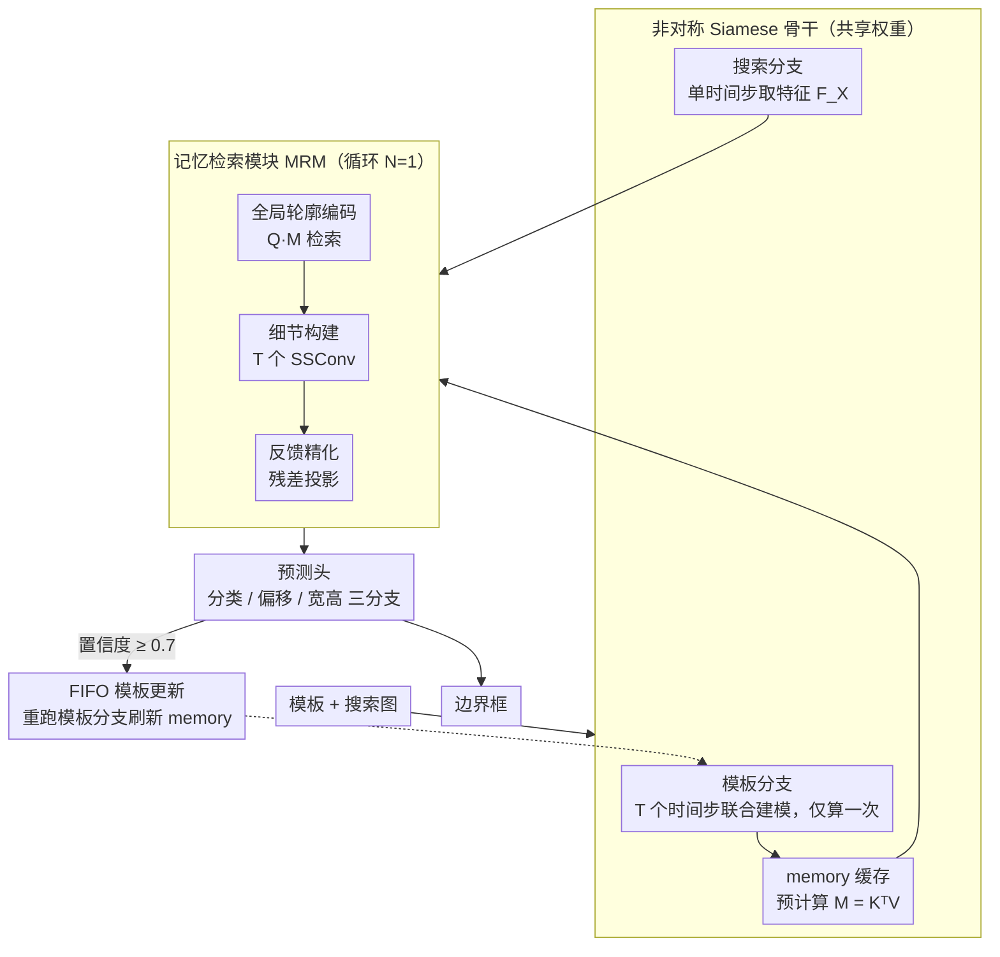

# SpikeTrack: A Spike-driven Framework for Efficient Visual Tracking

**会议**: CVPR 2026  
**arXiv**: [2602.23963](https://arxiv.org/abs/2602.23963)  
**代码**: 有（论文中提及）  
**领域**: 视频理解  
**关键词**: 脉冲神经网络, 视觉跟踪, 能效, 非对称架构, 记忆检索

## 一句话总结
提出 SpikeTrack，首个完全符合脉冲驱动范式的 RGB 视觉跟踪框架，通过非对称时间步扩展、单向信息流和脑启发记忆检索模块（MRM），在 SNN 跟踪器中达到 SOTA 并与 ANN 跟踪器持平，同时能耗仅为 TransT 的 1/26。

## 研究背景与动机
脉冲神经网络（SNN）通过模拟生物神经元的时空动态和脉冲机制实现低功耗计算：(i) 仅在事件驱动时触发计算，(ii) 脉冲张量与权重的矩阵乘法可转换为稀疏加法。这使 SNN 在神经形态芯片上具有显著节能优势。

**现有 SNN 跟踪方法的问题**：

**RGB 类方法**（SiamSNN, Spike-SiamFC++）：虽然使用脉冲神经元，但将脉冲信号解码为连续值进行计算，未实现完全脉冲驱动处理，能效受限

**事件相机类方法**：直接模仿 ANN 的 one-stream 架构（如 OSTrack），将模板和搜索区域拼接后送入骨干做双向交互。这种方式存在两个缺陷：
   - 未充分利用 SNN 神经元的时空关联动态
   - 密集的双向交互大幅增加计算开销

**核心研究问题**：能否设计一个遵循脉冲驱动范式、同时充分利用时空建模能力的 SNN 跟踪器？

## 方法详解

### 整体框架
SpikeTrack 要解决的问题很具体：让一个**完全脉冲驱动**的 SNN 在 RGB 单目标跟踪上既省电又跟得准。整篇的核心思路是「重活只算一次、信息单向流动」。具体怎么转：一个共享权重的脉冲骨干分成模板分支和搜索分支两路跑，模板分支只在初始化或模板更新时执行一次，把中间层特征缓存成 memory；之后每来一帧搜索图，搜索分支只跑单个时间步，通过记忆检索模块（MRM）从 memory 里检索目标线索、逐步精化对目标的感知，最后由预测头回归出边界框。整条链路里信息只从模板分支流向搜索分支，把计算密集的部分隔离出来只算一遍，是它能效远超 ANN 的根本原因。

### 关键设计

**1. 非对称 Siamese 骨干：让计算密集的模板分支只跑一次，搜索分支轻装上阵**

事件相机类的 SNN 跟踪器普遍照搬 ANN 的 one-stream 架构——把模板和搜索区域拼接起来送进骨干做双向交互，既没用上 SNN 神经元的时空动态，密集的双向交互又把算力吃光。SpikeTrack 反其道而行，把两个分支拆开、而且**时间步不对称**：模板分支在 $T$ 个时间步上展开，每个时间步喂入一个模板，靠脉冲神经元的时空动态把多个模板的表征联合建模；搜索分支则只跑单个时间步，图一个快。骨干选用 Spike-Driven Transformer V3（前两阶段是 CNN 块、后两阶段是 Transformer 块），脉冲神经元采用 Normalized Integer LIF（NI-LIF），训练时用归一化整数激活、推理时再转换成等效脉冲。这里的关键改进是把衰减因子设为**可学习**变量 $\beta_t = \sigma(\theta_t)$，让网络自适应决定不同时间步之间该保留多少历史：

$$U[t] = \beta_t H[t-1] + Y[t], \quad S[t] = \text{Clip}(\text{round}(U[t]), 0, D)/D$$

可学习的 $\beta_t$ 比固定衰减更灵活地控制时间步间的关联（消融中带来 +1.9 LaSOT AUC）；而把重算的模板分支隔离出来只在更新时跑一次，正是能耗大降的源头。

**2. 记忆检索模块 MRM：用脑启发的循环精化完成单向信息传递**

搜索分支算出自己的特征后，要把模板里的目标线索「借」过来，又不能重新做一遍昂贵的双向 attention。MRM 的设计灵感来自神经科学：V1 视觉皮层 L2/3 区的循环连接在目标被遮挡时，会基于先验期望迭代精化、补全完整感知——这套机制天然契合「拿已知模板去找当前目标」的跟踪范式。MRM 把检索拆成三步循环：先做**全局轮廓编码**，模板特征 $F_Z$ 投影为 $K_S, V_S$，并在初始化时一次性预计算出 memory 矩阵 $M = K_S^T V_S$；搜索特征 $F_X$ 时序扩展为 $Q_S^{(0)}$，再通过 $Q_S^{(i)'} = \mathcal{SN}(Q_S^{(i)}M \cdot scale)$ 从 memory 检索全局信息。接着做**细节构建**，用 $T$ 个专用 SSConv 沿时间维度逐时间步处理，提高对时序变化的敏感度。最后做**反馈精化**，用残差连接加投影模拟向高层视觉区域的反馈。由于脉冲注意力是线性复杂度，$M$ 预计算一次即可跨帧复用（思路与 Transformer 的 KV-cache 异曲同工），既省算力又把单向传递做实；消融显示循环次数 $N=1$ 最优，再多反而累积误差、让注意力过度聚焦。

**3. 预测头：三分支中心点回归，省掉单独的质量评分**

脉冲特征偏粗粒度，回归框时既要定位准、又要补偿降分辨率带来的偏移。预测头从搜索分支特征出发，用三个并行分支各管一摊：分类分支预测目标中心定位，偏移分支补偿分辨率降低引起的局部偏移，宽高分支回归归一化的边界框尺寸，每个分支都由多层 Conv-BN-NILIF 堆成。它刻意不设单独的质量评分模块，而是直接拿定位分支的分数当置信度（也用于模板更新时的 0.7 阈值判断）。这样结构简单、全程脉冲，避免额外评分模块的能耗开销；代价是这种简单评分在长序列里容易引入低质量模板（见局限）。

### 一个例子：跟一段视频
- **第 0 帧（初始化）**：从给定目标框裁出模板，模板分支在 $T=3$ 个时间步上各喂一个模板，跑完后把中间层特征缓存成 memory，并预计算出 memory 矩阵 $M = K_S^T V_S$。这一步只算一次，之后不再触碰。
- **第 1 帧（推理）**：裁出搜索区域，搜索分支跑单时间步得到 $F_X$，时序扩展为 query 后用 $QM$ 从 memory 检索全局轮廓，$T$ 个 SSConv 补上时序细节，残差反馈精化一轮（$N=1$）；预测头三分支输出中心、偏移、宽高，组装成边界框。整帧只跑了轻量的搜索分支加 MRM 检索。
- **第 25 帧（模板更新）**：若当前预测置信度 ≥ 0.7，新结果入 FIFO 队列触发模板更新——此时才重新跑一次模板分支、刷新 memory；否则继续复用旧的 memory。这样昂贵的模板分支在整段视频里只被零星触发几次。

### 损失函数 / 训练策略
- **损失函数**：$\mathcal{L} = \mathcal{L}_{class} + \lambda_G \mathcal{L}_{IoU} + \lambda_{L_1} \mathcal{L}_1$，其中 $\lambda_G=2$, $\lambda_{L_1}=5$
- $\mathcal{L}_{class}$：加权 focal loss，$\mathcal{L}_{IoU}$：generalized IoU loss，$\mathcal{L}_1$：L1 回归损失
- 训练数据：COCO + LaSOT + TrackingNet + GOT-10k
- 两阶段训练：$T=1$ 模型先训 320 epochs（lr backbone 4e-5, head/MRM 4e-4），$T>1$ 模型从 $T=1$ 微调 60 epochs
- 模板更新：FIFO 队列，更新间隔 25 帧，置信度阈值 0.7
- 能耗计算：SNN 能耗 $E_{SNN} = \text{FLOPs} \times E_{AC} \times SFR \times T \times D$，$E_{AC}=0.9$ pJ（45nm），远低于 $E_{MAC}=4.6$ pJ

## 实验关键数据

### 主实验

| 数据集 | 指标 | SpikeTrack-B384 | TransT (ANN) | 能耗比 |
|--------|------|-----------------|--------------|--------|
| LaSOT | AUC | 66.7 | 64.9 | 27.3 vs 75.2 mJ (1/2.8) |
| TrackingNet | AUC | 82.0 | 81.4 | 27.3 vs 75.2 mJ |
| GOT-10k | AO | 73.1 | 72.3 | 27.3 vs 75.2 mJ |
| TNL2K | AUC | 54.8 | 50.7 | 27.3 vs 75.2 mJ |

SpikeTrack-B256-T3 在 LaSOT 上超越 TransT 2.2% AUC，能耗仅 1/7.6。

| 数据集 | 指标 | SpikeTrack-S256 | SpikeSiamFC++ | 提升 |
|--------|------|-----------------|---------------|------|
| UAV123 | AUC | 66.2 | 57.8 | +8.4 |
| OTB100 | AUC | 69.4 | 64.4 | +5.0 |
| GOT-10k | AO | 67.8 | - | - |

### 消融实验

| 配置 | 能耗(mJ) | GOT-10k AO | LaSOT AUC | 说明 |
|------|----------|------------|-----------|------|
| Baseline (非对称) | 8.7 | 71.3 | 66.8 | 基线 |
| One-stream | 22.8 | 70.8 | 65.4 | 能耗↑163%，精度↓ |
| Vanilla Cross-attn | 7.6 | 70.9 | 65.0 | 替代 MRM，精度下降 |
| Modulation (spike) | 6.8 | 58.3 | 49.9 | AsymTrack方式不适合SNN |
| Mean Fusion | 8.5 | 71.0 | 66.2 | 通道加权融合更优 |
| Fixed Decay | 8.9 | 68.9 | 66.0 | 可学习衰减因子更好 |

### 关键发现
- 非对称架构在精度和能耗两方面均优于 one-stream 架构，证明 SNN 时空动态 + MRM 优于暴力双向交互
- AsymTrack 的模板调制方法在脉冲化后严重退化（AUC 49.9），说明用模板作卷积核做信号调制不适合 SNN 的粗粒度表征
- 可学习衰减因子比固定衰减（+1.9 LaSOT AUC）更灵活地控制时间步交互
- 与 OSTrack 的差距主要在 Deformation 和 Fast Motion 场景，这对 SNN 的深层语义理解和重检测能力挑战最大
- MRM 循环次数 $N=1$ 最优，过多循环导致累积误差和过度聚焦

## 亮点与洞察
1. **非对称设计的精妙**：模板分支多时间步利用 SNN 时空动态，搜索分支单时间步高效推理——将 SNN 的时空建模优势与 Siamese 架构的效率结合
2. **脑启发 MRM**：从 V1 视觉皮层的循环连接获得启发，预计算 memory 矩阵实现跨帧复用，兼顾生物合理性与工程效率
3. **首次在 RGB 跟踪中实现**能效-精度帕累托最优——超越同精度 ANN 同时能耗降低数个数量级
4. **6个模型变体**覆盖不同精度-功耗需求，体现良好的可扩展性

## 局限与展望
- 在相似目标干扰场景下表现较弱——脉冲编码难以传递细粒度语义信息用于区分相似目标
- 模板更新使用简单的置信度阈值策略，缺乏专用质量评分模块
- 长期跟踪（LaSOT）中 $T$ 增加不一定提升性能，因为简单评分机制会引入低质量模板
- 当前仅在 45nm 工艺下理论计算能耗，未在实际神经形态芯片上测试

## 相关工作与启发
- 继承 AsymTrack（CVPR'25）的非对称 Siamese 思想，但用 SNN 时空动态替代 ANN 的模板调制
- 骨干使用 Spike-Driven Transformer V3，属于 Meta-Transformer 风格的 SNN
- MRM 的 memory 预计算思路与 Transformer 的 KV-cache 有异曲同工之妙
- 为 SNN 在更广泛视频理解任务（如 MOT、视频分割）的应用提供了重要参考

## 评分
- 新颖性: ⭐⭐⭐⭐ 非对称脉冲跟踪 + 脑启发 MRM 设计新颖
- 实验充分度: ⭐⭐⭐⭐⭐ 7个基准、6个变体、详尽消融与能耗分析
- 写作质量: ⭐⭐⭐⭐ 结构清晰，与神经科学对应关系阐述良好
- 价值: ⭐⭐⭐⭐ 推动 SNN 在视觉跟踪中的实用化进程
- 价值: 待评

<!-- RELATED:START -->

## 相关论文

- [\[CVPR 2026\] SpikeTrack: High-performance and Energy-efficient Event-Based Object Tracking with Spiking Neural Network](spiketrack_high-performance_and_energy-efficient_event-based_object_tracking_wit.md)
- [\[CVPR 2026\] An Efficient Token Compression Framework for Visual Object Tracking](an_efficient_token_compression_framework_for_visual_object_tracking.md)
- [\[CVPR 2026\] Drift-Resilient Temporal Priors for Visual Tracking](drift-resilient_temporal_priors_for_visual_tracking.md)
- [\[CVPR 2026\] Adaptive Capacity Autoregressive Visual Tracking](adaptive_capacity_autoregressive_visual_tracking.md)
- [\[CVPR 2026\] UETrack: A Unified and Efficient Framework for Single Object Tracking](uetrack_a_unified_and_efficient_framework_for_single_object_tracking.md)

<!-- RELATED:END -->
