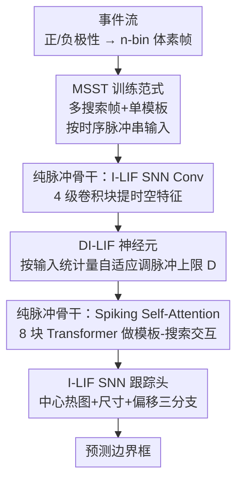

# SpikeTrack: High-performance and Energy-efficient Event-Based Object Tracking with Spiking Neural Network

**会议**: CVPR 2026  
**论文**: [CVF Open Access](https://openaccess.thecvf.com/content/CVPR2026/html/Wang_SpikeTrack_High-performance_and_Energy-efficient_Event-Based_Object_Tracking_with_Spiking_Neural_CVPR_2026_paper.html)  
**代码**: 无  
**领域**: 视频理解（事件相机目标跟踪 / 脉冲神经网络）  
**关键词**: 事件相机, 单目标跟踪, 脉冲神经网络, Spiking Transformer, 能效

## 一句话总结
SpikeTrack 用一个**纯脉冲驱动**的 Spiking Transformer 做事件相机单目标跟踪，靠「多搜索帧-单模板（MSST）」训练范式把跟踪天然的时序连续性喂进 SNN 的膜电位累积里，再用「动态整数 LIF（DI-LIF）」神经元按输入稀疏程度自适应调节脉冲发放上限，在 FE108 / FELT / VisEvent 三个基准上同时拿到 SOTA 精度，且能耗只有次优方法的 6.6%、参数量只有 25.8%。

## 研究背景与动机

**领域现状**：单目标跟踪长期由 RGB 方法主导（Siamese、相关滤波、Transformer 跟踪器如 OSTrack / SeqTrack / ODTrack）。但 RGB 相机在高速运动、强光弱光等极端场景下会糊掉或过曝。事件相机以微秒级时间分辨率、140 dB 动态范围（RGB 仅 ~60 dB）捕捉亮度变化，天然适合这类挑战场景，于是事件跟踪成为热点。

**现有痛点**：事件数据本身是稀疏、异步的脉冲流，和 SNN 的「累积-衰减-静息」时序机制、稀疏脉冲通信高度契合，理论上 SNN 既省电又能抓时序。但现有事件 SNN 跟踪器（STNet、SNNTrack）几乎都是 **CNN-SNN 混合架构**——重活还是靠 CNN 提特征，SNN 只是补一层时序，既没吃到纯 SNN 的低功耗红利，也没用上自注意力做模板-搜索交互。

**核心矛盾**：纯 SNN 架构在分类任务上研究得很充分，但在跟踪上几乎空白。难点有二：一是怎么让 SNN 显式建模目标在**帧间**的轨迹演化（以往要靠 LSTM 或多搜索帧 Transformer，前者笨重、后者算力爆炸）；二是 SNN 把膜电位量化成脉冲时会丢信息——I-LIF 神经元用整数发放缓解了量化误差，但它的最大发放整数值 $D$ 是**全局固定**的，面对跟踪里时快时慢、外观剧变的动态场景缺乏适应性：目标快速运动时事件暴增，固定 $D$ 截断信息；静止时又发放过量脉冲，徒增能耗和噪声。

**本文目标**：造一个**纯脉冲驱动**（pure spike-SNN）的事件跟踪框架，要同时做到（i）让 SNN 自己的时序动力学承担帧间轨迹建模、不再外挂时序模块；（ii）让脉冲量化随输入自适应、消除固定 $D$ 的死板。

**核心 idea**：以 Spiking Transformer 为骨干，用「多搜索帧-单模板」训练范式把多帧搜索序列当成时序脉冲串喂进 SNN（让膜电位跨帧累积自然捕捉运动），并用「动态整数 LIF」按每个 batch 的输入统计量动态调节脉冲发放上限——稠密输入抬高上限增强响应、稀疏输入降低上限抑制冗余。

## 方法详解

### 整体框架

SpikeTrack 是端到端跟踪器，不需要数据增强或后处理。给定一段事件流，先把它按时间切成 $n$-bin 的体素网格，每个 bin 把落在该时间段内的正/负极性事件分别累加成两通道事件帧。训练时不只取「1 模板帧 + 1 搜索帧」，而是把**多个连续时刻的搜索帧 + 单个模板帧**一起当作按时间排序的脉冲串送入网络（这就是 MSST），脉冲神经元的膜电位 $U$ 在帧间持续更新，天然把时序连续性编码进去。

整条管线三段串行：先过 **I-LIF SNN Conv 模块**（4 个级联卷积块）提取模板和搜索帧的时空特征；再过 **DI-LIF SNN Transformer 模块**（8 个块）做模板-搜索的脉冲自注意力交互，并在这里按输入自适应调节脉冲发放上限；最后把模板-搜索的互相关特征送进 **I-LIF SNN 跟踪头**，用中心热图 + 尺寸回归 + 偏移回归三分支定位目标。全程脉冲驱动，乘累加（MAC）被替换成更省电的累加（AC）运算。

### 关键设计

**1. MSST 多搜索帧-单模板训练范式：让 SNN 的膜电位自己背时序，不外挂模块**

跟踪的本质是利用历史线索捕捉目标的时序演化，对快速运动、遮挡、形变都靠它兜底。以往两条路都别扭：单搜索帧配动态核/更新分支要靠手工规则、泛化差；多搜索帧塞进 Transformer 又算力高、长程吃力。SpikeTrack 的观察是——SNN 的膜电位本来就跨时间累积，正好能当「免费」的时序记忆。于是训练时把多个连续时刻的搜索帧分布到不同 timestep、共享同一个参考模板帧（Multi-Search-sequence-and-Single-Template），让网络在膜电位 $U$ 的跨帧累积中自然学到帧间动力学，处理大幅外观变化。这样既不需要 LSTM 那样的大循环模块，也不需要手工更新规则，靠 SNN 的稀疏与内存友好特性就能在长序列上稳定跟踪。消融显示搜索序列长度从 1 → 10 时 SR 从 34.6% 涨到 38.9%，10 帧是甜点，再加到 12 帧反而轻微回落（冗余）。

**2. DI-LIF 动态整数 LIF 神经元：按输入稀疏程度自适应调节脉冲发放上限**

I-LIF 神经元训练时用发放率表示信息 $s^\ell = \frac{1}{D}\lfloor\mathrm{clip}(x^\ell, 0, D)\rfloor$，推理时把发放率分解成 $D$ 个二值脉冲 $s^\ell = \frac{1}{D}\sum_{t=1}^{D} s^\ell[t]$，从而把 MAC 换成 AC。问题是 $D$ 全局固定：目标快速运动时事件暴增、固定 $D$ 会截断关键时序线索；静止时又发放冗余脉冲、浪费能量还引噪声。DI-LIF 让 $D$ **随每个 batch 的输入统计量自适应**。给定特征 $X \in \mathbb{R}^{B\times C\times H\times W\times T}$，先在空间和时间维上求平均激活：

$$\mu(X) = \frac{1}{HWT}\sum_{h=1}^{H}\sum_{w=1}^{W}\sum_{t=1}^{T} X[:,:,h,w,t]$$

再经一个可学习线性层 + sigmoid 得到标量调节因子 $\alpha = \sigma(W\cdot\mu(X) + b)$，最终量化深度为

$$D_{batch} = \lfloor \alpha \cdot D_{init} + D_{init} \rceil$$

其中 $D_{init}$ 是预设基准（默认 6），$\lfloor\cdot\rceil$ 四舍五入取整。这样稠密事件（运动剧烈）抬高 $D$ 增强对信息线索的响应，稀疏事件压低 $D$ 抑制冗余、提升效率，同时把膜电位↔脉冲转换的量化误差压下去，又保住 SNN 离散脉冲的本质。作者把 DI-LIF 放进 Transformer 而非卷积层，因为 Transformer 处理模板-搜索的全局高熵交互，更需要这种动态发放密度来稳住高熵下的时序编码。一个额外好处：由于 $\alpha$ 在线调节阈值，模型对 $D_{init}$ 初值几乎不敏感（$D_{init}$ 从 4 扫到 12，SR 只波动 0.9%）。

**3. 纯脉冲驱动骨干：I-LIF 卷积 + Spiking Self-Attention 全程无 ANN**

为了真正吃到 SNN 的低功耗红利（而非像 STNet/SNNTrack 那样靠 CNN 提特征），SpikeTrack 把整条主干都做成脉冲驱动。卷积模块每块做层级特征精炼 $U' = U + \mathrm{SNNSepConv}(U)$、$U'' = U' + \mathrm{SNNConvGroup}(U')$，其中可分离卷积 $\mathrm{SNNSepConv}$ 用「点卷积→深度卷积→点卷积」三段、每段前接 I-LIF 脉冲层。Transformer 块则用 Spiking Self-Attention（SSA）：把 token 投影成查询/键/值的脉冲矩阵 $Q_s, K_s, V_s$，按 $\mathrm{SSA} = (Q_s K_s^\top / \sqrt{d_h})\, V_s$ 做脉冲驱动的跨区域相关，实现模板与搜索 token 的交互（残差式 $U' = U + \mathrm{SSA}(U)$、$U'' = U' + \mathrm{SNNMLP}(U')$）。跟踪头同样三分支全脉冲，中心分支输出得分图 $\hat{C}$、尺寸分支回归 $\hat{S}=[\hat{w},\hat{h}]$、偏移分支回归 $\hat{O}=[\hat{o}_x,\hat{o}_y]$，推理取 $\hat{C}$ 最大响应位置解出边界框。正因为全程是脉冲（发放率 $f_r$ 低），能耗公式 $E_{SNN} = (T\times D)\times f_r \times O^2 \times C_{in} \times C_{out} \times k^2 \times E_{AC}$ 里的稀疏脉冲活动让算术运算量大幅下降，AC 的单次能耗（0.9 pJ）也远低于 MAC（4.6 pJ）。

### 损失函数 / 训练策略
跟踪头用分类 + 回归联合损失：$L = L_{cls} + \lambda_{iou} L_{iou} + \lambda_{L1} L_{L1}$，其中 $L_{cls}$ 是加权 focal loss，$L_{iou}$ 是 GIoU loss，$L_{L1}$ 是 L1 loss，$\lambda_{iou}=2$、$\lambda_{L1}=5$。训练用 8 张 RTX 4090、batch size 8、AdamW（weight decay $10^{-4}$、初始学习率 $4\times10^{-4}$），搜索序列长度 10、$D_{init}=6$、训练 60 epoch（每 epoch 20K 样本），搜索/模板帧分辨率 256×256 / 128×128。MSST 把训练显存从 5.8 GB 抬到 18.8 GB、训练时长从 2.5 h 到 8 h，换来显著精度提升。

## 实验关键数据

### 主实验
在 FE108、FELT、VisEvent 三个事件跟踪基准上对比 SOTA（SR=成功率，PR=精度率，Power 为推理能耗）：

| 方法 | 参数(M) | 能耗(mJ) | FE108 SR/PR | FELT SR/PR | VisEvent SR/PR |
|------|--------|---------|-------------|------------|----------------|
| OSTrack (ECCV22) | 92.52 | 98.90 | 54.3 / 86.2 | 35.9 / 45.5 | 33.7 / 45.3 |
| ARTrack (CVPR23) | 202.56 | 174.80 | 56.6 / 87.4 | 39.5 / 49.4 | 32.3 / 42.8 |
| HIPTrack (CVPR24) | 120.41 | 307.74 | 50.8 / 81.0 | 38.2 / 48.9 | 32.3 / 42.8 |
| SNNTrack (TIP25) | 31.40 | 8.25 | 57.2 / 89.0 | — | 35.9 / 49.1 |
| HDETrack (CVPR24) | 97.82 | 120.8 | 59.8 / 92.2 | — | 37.3 / 52.5 |
| **SpikeTrack (Ours)** | **25.26** | **7.92** | **60.3 / 92.7** | **41.0 / 52.3** | **38.9 / 54.3** |

VisEvent 上 SpikeTrack 比次优 SR/PR 各高 1.6% / 1.8%；FE108 上 PR 92.7%、SR 60.3%，比次优各高 0.5%；FELT 三项也全是第一。最亮眼的是效率：相比次优的 HDETrack，参数只用 25.8%、能耗只用 6.6%（7.92 mJ vs 120.8 mJ）；相比同为 SNN 的 SNNTrack，参数和能耗更低且三库精度全面领先。

### 消融实验（VisEvent，SR/PR）

| 配置 | SR(%) | PR(%) | 说明 |
|------|------|------|------|
| Full (Ours) | 38.9 | 54.3 | 完整模型 |
| DI-LIF → I-LIF | 38.1 | 53.0 | 换回固定 $D$，SR/PR 各掉 0.8/1.3 |
| DI-LIF → LI-LIF | 38.4 | 52.8 | $D$ 设为可学习但推理固定，PR 掉 1.5 |
| Transformer 深度 8 → 4 | 37.4 | 52.0 | 深度不够，特征提取乏力 |
| Transformer 深度 8 → 12 | 38.0 | 52.2 | 过深引入冗余/过拟合，轻微回落 |
| Center Head → Corner Head | 37.0 | 51.9 | 角点头不如中心头 |
| Center Head → Line Head | 35.3 | 49.1 | 线性头掉得最多 |

搜索序列长度消融（Table 3）：长度 1 → SR 34.6，长度 5 → 37.7，长度 10 → 38.9（峰值），长度 12 → 37.1。$D_{init}$ 从 4 扫到 12（Table 4），SR 仅波动 0.9%、PR 仅 1.5%，对初值极不敏感。长序列测试（Table 5）：300 帧时与 HDETrack 持平，超过 500 帧后反超，2000 帧时 SR/PR 各高 1.5% / 1.9%。

### 关键发现
- **MSST 的搜索序列长度是吞吐与精度的主要旋钮**：从单帧到 10 帧 SR 提升约 4.3 个点，证明 SNN 膜电位累积确实在背时序；但超过 10 帧收益递减，说明时序上下文有饱和点。
- **DI-LIF 的价值在「推理时仍能动态调节」**：可学习但推理固定的 LI-LIF（PR 52.8）反而比固定 I-LIF 在 PR 上更差，恰恰说明 SpikeTrack 的增益来自随输入在线变阈值，而非单纯把 $D$ 变成可学习参数。
- **能效是最大卖点**：纯脉冲架构把能耗压到主流 ANN 跟踪器的几十分之一（7.92 mJ vs HDETrack 120.8 mJ、SeqTrack 302.68 mJ），同时精度还更高，打破了「SNN 省电但掉点」的惯性印象。
- **长程优势随序列变长放大**：短序列上和 HDETrack 打平，但越长越拉开差距，说明 SNN 的时序建模在长时跟踪上更有后劲。

## 亮点与洞察
- **「让时序记忆寄生在膜电位里」很巧**：MSST 没有引入任何新的循环模块或更新分支，只是改了训练时的输入组织方式（多搜索帧分布到不同 timestep），就把帧间时序建模这件昂贵的事白嫖给了 SNN 的固有动力学——这是个低成本高回报的设计哲学，可迁移到其他需要时序的事件视觉任务（如事件分割、事件光流）。
- **DI-LIF 把「量化深度」做成输入自适应**，思路类似 ANN 里的动态网络/条件计算，但落在 SNN 的脉冲发放上限上：稠密多发、稀疏少发，既保精度又保能效。这种「按输入难度分配脉冲预算」的想法对任何脉冲驱动模型都通用。
- **首个纯脉冲事件跟踪框架**：之前 SNN 跟踪都靠 CNN 提特征当拐杖，本文证明纯 SNN（含 Spiking Self-Attention）也能在跟踪上达到甚至超过 ANN，且能耗低一两个数量级，给边缘端实时跟踪部署提供了实证支撑。

## 局限与展望
- **MSST 的训练开销不小**：显存 5.8 GB → 18.8 GB、训练时长 2.5 h → 8 h（约 3 倍），多搜索帧虽然只在训练期用，但对算力有限的复现者是门槛。
- **绝对精度仍偏低**：在 VisEvent 这类难库上 SR 也才 38.9%，长序列测试中各方法 SR 普遍只有 24~26%，说明事件跟踪整体远未成熟，SpikeTrack 是相对最优而非绝对可用。
- **DI-LIF 是 batch 级而非样本级自适应**：$D_{batch}$ 由整个 batch 的平均激活算出，同一 batch 内不同样本共享同一个 $D$，对 batch 内差异大的场景可能不够精细；样本级或 token 级动态阈值或许还有空间。
- **能耗是理论估算而非实测**：能耗用标准 SNN 社区公式（45 nm、$E_{MAC}=4.6$ pJ、$E_{AC}=0.9$ pJ）推算，真实神经形态芯片上的功耗、延迟未给出。

## 相关工作与启发
- **vs STNet / SNNTrack（CNN-SNN 混合事件跟踪）**: 它们用 SNN 补一层时序、主干仍是 CNN，没吃到纯 SNN 的低功耗红利、也没用自注意力做模板-搜索交互；SpikeTrack 是纯脉冲驱动 + Spiking Self-Attention，参数和能耗都更低、三库精度全面反超。
- **vs I-LIF / Luo et al.（固定整数发放 SNN）**: I-LIF 用整数发放缓解量化误差，但最大发放整数值 $D$ 全局固定、缺乏对动态场景的适应；SpikeTrack 的 DI-LIF 按输入统计量在线调 $D$，消融证明这种动态性带来确实增益（vs 固定 I-LIF +0.8 SR）。
- **vs 多搜索帧 Transformer 跟踪器（如 ODTrack）**: 它们也用多帧建时序但靠 Transformer 显式处理、算力高且长程吃力；SpikeTrack 把多帧时序交给 SNN 膜电位累积，算力友好且长序列后劲更足（2000 帧反超 HDETrack）。

## 评分
- 新颖性: ⭐⭐⭐⭐⭐ 首个纯脉冲事件跟踪框架，MSST「寄生膜电位」+ DI-LIF「自适应脉冲预算」两个设计都切中 SNN 跟踪的真实痛点。
- 实验充分度: ⭐⭐⭐⭐ 三大基准 + 5 张消融表 + 长序列/属性级分析较完整，但能耗为理论估算、缺神经形态芯片实测。
- 写作质量: ⭐⭐⭐⭐ 动机递进清晰、公式完整、图示到位，方法可复述性强。
- 价值: ⭐⭐⭐⭐⭐ 把能耗压到 ANN 跟踪器的几十分之一同时拿 SOTA，对边缘端实时事件跟踪部署有直接实用价值。

<!-- RELATED:START -->

## 相关论文

- [\[CVPR 2026\] SDTrack: A Baseline for Event-based Tracking via Spiking Neural Networks](sdtrack_a_baseline_for_event-based_tracking_via_spiking_neural_networks.md)
- [\[CVPR 2026\] SpikeTrack: A Spike-driven Framework for Efficient Visual Tracking](spiketrack_a_spike-driven_framework_for_efficient_visual_tracking.md)
- [\[CVPR 2026\] Event6D: Event-based Novel Object 6D Pose Tracking](event6d_event-based_novel_object_6d_pose_tracking.md)
- [\[CVPR 2026\] MER-Tracker: Towards High-Speed 3D Point Tracking via Multi-View Event-RGB Hybrid Cameras](mer-tracker_towards_high-speed_3d_point_tracking_via_multi-view_event-rgb_hybrid.md)
- [\[CVPR 2026\] DarkShake-DVS: Event-based Human Action Recognition under Low-light and Shaking Camera Conditions](darkshake-dvs_event-based_human_action_recognition_under_low-light_and_shaking_c.md)

<!-- RELATED:END -->
