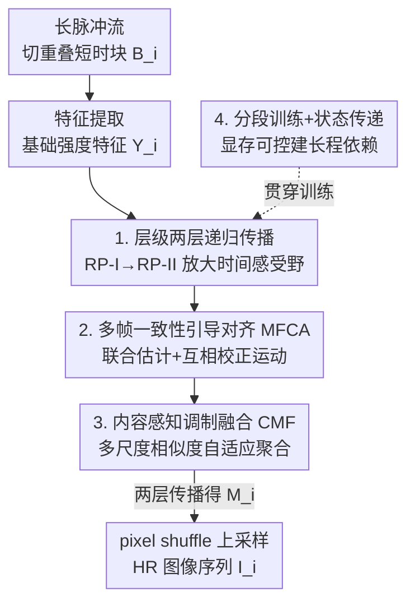

# Spk2VidNet: A Hierarchical Recurrent Architecture for High-Fidelity Video Reconstruction from Long Spike-Camera Streams

**会议**: CVPR 2026  
**论文**: [CVF OpenAccess](https://openaccess.thecvf.com/content/CVPR2026/html/Wang_Spk2VidNet_A_Hierarchical_Recurrent_Architecture_for_High-Fidelity_Video_Reconstruction_from_CVPR_2026_paper.html)  
**代码**: 无  
**领域**: 图像/视频恢复重建（脉冲相机超分）  
**关键词**: 脉冲相机, 超分辨率, 层级递归网络, 时序对齐, 长序列建模

## 一句话总结
针对脉冲相机超分（SCSR）只能处理固定短序列、且脉冲信号有波动的两大痛点，Spk2VidNet 用「逐层放大时间感受野的两层递归传播 + 多帧一致性对齐 + 内容感知调制融合 + 分段训练状态传递」从任意长脉冲流重建高分辨率图像序列，在合成与真实数据上以更快速度刷新 SOTA（REDS-LSSR ×4 PSNR 29.92dB、推理仅 43ms）。

## 研究背景与动机

**领域现状**：脉冲相机（spike camera）是一种神经形态视觉传感器，每个像素独立地「积分光子—超过阈值就发放一个脉冲」（accumulation-and-fire），以极高时间分辨率（约 40,000Hz）记录场景的**绝对光强**，特别适合高速运动场景。但它的空间分辨率偏低，于是有了脉冲相机超分（Spike Camera Super Resolution, SCSR）这一方向：从低分辨率（LR）二值脉冲流重建高分辨率（HR）图像。代表方法有 VidarSR、SpikeSR-Net、Spk2SRImgNet、SCSRNet 等。

**现有痛点**：现有 SCSR 方法存在两个结构性问题。其一，它们通常在**固定长度的短脉冲段**上工作（如 101 帧），能访问的时序信息被限制在一个局部邻域里，无法利用长脉冲流中丰富的强度线索；而脉冲相机每秒能产生 4 万帧，长程信息本应是它最大的优势。其二，由于光子到达的随机性、脉冲读出的量化效应、以及电路热噪声，脉冲信号本身存在**波动（fluctuation）**，单帧脉冲并不直接携带光强，使得可靠的强度提取很困难。

**核心矛盾**：脉冲相机的优势在「超高时间分辨率带来的长程时序冗余」，但现有方法既没把长程时序用起来（受限于固定短段），又被短段内的脉冲波动干扰——既要利用长序列，又受限于 GPU 显存无法直接在长序列上训练，这是方法层面的根本张力。

**本文目标**：分解为三个子问题——(1) 如何在不爆显存的前提下利用任意长脉冲流的长程时序依赖；(2) 如何在帧间运动下做精确对齐以聚合相关时序信息；(3) 如何在对齐不可靠的区域抑制错位/噪声信号。

**切入角度**：脉冲相机超高时间分辨率意味着相邻特征之间**运动连贯、运动场高度一致**——这个一致性可以用来互相校正各帧的运动估计；同时不同邻帧与当前帧的相关程度是空间自适应的，应按内容相似度来融合。

**核心 idea**：用「逐层放大时间感受野的递归传播」渐进式地精炼特征以压制波动，配合多帧一致性引导的对齐和内容感知的调制融合，并用分段训练+状态传递把递归网络扩展到任意长序列。

## 方法详解

### 整体框架

Spk2VidNet 是一个端到端可训练的层级递归 SCSR 网络。输入是一段长脉冲流 $\{S(u)\} \in \mathbb{B}^{H\times W\times L}$（二值、时序长度 $L$），输出是对应时刻的 HR 图像序列 $\{I_i\}_{i=0}^{N-1}$，$I_i \in \mathbb{R}^{rH\times rW\times 1}$，$r$ 为超分倍数。

整条流水线分四步：(1) **特征提取**——把长脉冲流按重叠滑窗切成 $N$ 个短时脉冲块 $B_i=\{S(u)\}_{u=t_i-w}^{t_i+w}$（$2w+1$ 帧），利用短时时序相关性用几层卷积抽出基础强度特征 $\{Y_i\}$ 作为初始表征；(2) **第一层递归传播 RP-I**——把 $\{Y_i\}$ 沿时间逐步更新成更可靠的特征 $\{F_i\}$；(3) **第二层递归传播 RP-II**——以**时间膨胀因子 2** 采样历史特征，把 $\{F_i\}$ 进一步精炼为 $\{M_i\}$，扩大时间感受野、捕获更长程依赖；(4) **上采样重建**——把 $\{M_i\}$ 经 pixel shuffle 上采样得到 HR 图像。RP-I 与 RP-II 内部结构相同（MFCA 对齐 + CMF 融合）但参数独立、输入不同。

### 关键设计

**1. 层级递归传播 + 逐层放大时间感受野：用渐进精炼对抗脉冲波动**

脉冲波动会污染单帧强度提取，单层局部聚合不足以稳健地恢复。Spk2VidNet 用两层递归传播来「渐进式」地放大时间感受野：第一层 RP-I 在每个时刻 $t_i$ 利用当前输入 $Y_i$ 和 $K$ 个前序特征 $\{F_{i-1},\dots,F_{i-K}\}$ 提取时序一致信号、抑制扰动，生成 $F_i$；第二层 RP-II 则取当前 $F_i$ 和**按时间膨胀因子 2 采样**的 $K$ 个前序特征 $\{M_{i-2},M_{i-4},\dots,M_{i-2K}\}$ 来生成 $M_i$。膨胀采样让第二层在不增加聚合帧数的情况下覆盖更长的时间跨度，从而捕获更可靠的长程依赖。两层叠加相当于把感受野从「短时邻域」逐级扩展到「长程时序」，使特征表示被逐步精炼——这正是它能压制波动、利用长脉冲流的关键，也是消融中「2 层优于 1 层」的来源。

**2. 多帧一致性引导对齐 MFCA：让多帧运动互相校正**

要聚合前序特征就得先对齐，但逐帧独立估计运动容易因脉冲噪声而不准。MFCA 的洞察是：脉冲相机时间分辨率极高，相邻特征的运动场天然高度一致，可以**联合估计并互相精炼**。具体地，先把 $\{F_{i-K},\dots,F_{i-1},Y_i\}$ 沿通道拼接抽运动线索 $X_i = m([F_{i-K},\dots,F_{i-1},Y_i])$，再分别导出 $K$ 个初步运动 $\mathcal{O}_{i-n}=f_n(X_i)$；关键一步是利用运动一致性做**互相校正**：

$$\mathcal{O}_{i-n}^{\text{R}} = \mathcal{O}_{i-n} + h_n([\mathcal{O}_{i-1},\mathcal{O}_{i-2},\dots,\mathcal{O}_{i-K}])$$

即每个时刻的运动都吸收其他时刻运动的精炼信号 $h_n(\cdot)$。最后用校正后的运动 $\mathcal{O}_{i-n}^{\text{R}}$ 通过可变形卷积对齐对应邻帧 $\tilde{F}_{i-n}=\text{DCN}(F_{i-n},\mathcal{O}_{i-n}^{\text{R}})$。相比逐帧独立对齐，这种联合+互校机制产出更一致、更准的运动，是 MFCA 优于「独立对齐」基线的根本（消融里 MFCA 比 independent alignment 涨点）。

**3. 内容感知调制融合 CMF：按多尺度相似度自适应抑制错位信号**

即便对齐了，遮挡和光照变化也会让某些区域对齐不可靠，简单拼接会把错位/噪声信号混进来。CMF 的做法是按**内容相似度空间自适应地调制**每个对齐特征。其核心子模块 MDM（Multi-Dilation Modulation, 多膨胀调制）通过多条不同膨胀率的卷积分支，在多个空间感受野尺度上评估对齐特征 $\tilde{F}_{i-n}$ 与当前特征 $Y_i$ 的相关强度 $\text{P}_{i-n}=f_{\text{MDConv}}([\tilde{F}_{i-n},Y_i])$，据此生成空间自适应的缩放参数 $\alpha_{i-n}$ 和平移参数 $\beta_{i-n}$，再带残差地调制对齐特征：

$$\hat{F}_{i-n} = (\alpha_{i-n}\odot\tilde{F}_{i-n}+\beta_{i-n}) + \tilde{F}_{i-n}$$

多膨胀设计让相似度评估能跨多个空间尺度更准确，从而在相关区域增强、在错位区域抑制。最后把调制后的 $\{\hat{F}_{i-n}\}$ 与当前 $Y_i$ 拼接喂进若干残差块 $f_D(\cdot)$ 聚合得到增强后的 $F_i=f_D([\hat{F}_{i-K},\dots,\hat{F}_{i-1},Y_i])$，存入特征缓冲区供后续时刻更新。这一「先按相似度调制、再聚合」的两步，正是它在对齐不可靠区仍能稳健融合的原因。

**4. 分段训练 + 状态传递：在有限显存下建长程依赖**

递归架构理论上能建任意长依赖，但直接在整条长序列上反传会爆显存。该策略把长脉冲序列切成多个较短段，**逐段顺序训练**；对来自同一序列的相邻段，把前一段的**最后若干状态从计算图 detach**、存入特征缓冲区、作为扩展上下文传给下一段。训练时梯度只在段内反传，但传递的状态让模型仍能利用历史时序信息，等价于扩展了建模范围，同时保持段边界处的时序连续、改善边界帧重建。实现上分 5 段、每段长 101（含 9 个短时块）：第一层传递前一段最后 2 个状态、第二层传递最后 4 个状态。正因为有它，Spk2VidNet 才能处理任意长脉冲流——消融显示用状态传递（29.79dB）明显优于各段独立训练（29.58dB）。

### 损失函数 / 训练策略
采用 Adam 优化器 + L1 损失训练 800 epoch；batch size 8，初始学习率 0.0002、每 100 epoch 衰减 0.7；脉冲输入随机裁到 $64\times64$，并随机翻转/旋转做数据增强；$K=2$（聚合前两个时刻），输入序列长 $L=461$、短时块数 $N=45$（$w=10$）。全部在单张 NVIDIA RTX 3090 上训练测试。

## 实验关键数据

### 主实验

合成数据上 Spk2VidNet 在两个评测集、两个超分倍数上全面最优，且推理最快、显存更省（表中数值为 REDS-LSSR / Adobe240-LSSR）：

| 倍数 | 方法 | REDS PSNR↑ | Adobe240 PSNR↑ | LPIPS↓(REDS) | Params(M) | Runtime(ms) |
|------|------|-----------|----------------|--------------|-----------|-------------|
| ×4 | VidarSR | 28.42 | 30.07 | 0.3244 | 12.79 | 740 |
| ×4 | SpikeSR-Net | 29.20 | 31.14 | 0.2962 | 3.34 | 1088 |
| ×4 | Spk2SRImgNet | 29.46 | 31.31 | 0.2813 | 3.86 | 219 |
| ×4 | SCSRNet | 29.50 | 31.31 | 0.2786 | 5.30 | 187 |
| ×4 | **Spk2VidNet** | **29.92** | **32.36** | **0.2624** | 3.73 | **43** |
| ×8 | SCSRNet | 25.81 | 26.15 | 0.4311 | 5.45 | 61 |
| ×8 | **Spk2VidNet** | **26.20** | **27.19** | **0.4149** | 3.88 | **21** |

注意 Adobe240-LSSR 的序列长度约为 REDS-LSSR 的两倍（用来评测泛化与长程建模），Spk2VidNet 在更长序列上的领先幅度更大（×4 时领先 SCSRNet 1.05dB），印证「利用长程时序」这一卖点；同时推理速度比次优方法快 4 倍以上、显存最低（4606M）。真实采集脉冲数据（分辨率板、快速旋转风扇等）上为定性对比，纹理和细节更清晰真实。

### 消融实验

在 REDS-LSSR ×4 上，逐步加模块（a- 为单层传播、b- 为两层传播；b-5 为最终模型）：

| 配置 | MFCA | CMF | 传播层数 | PSNR↑ | SSIM↑ | 说明 |
|------|------|-----|---------|-------|-------|------|
| b-1 | ✗ | ✗ | 2 | 28.39 | 0.7969 | 去掉两模块的基线 |
| b-2 | 独立对齐 | ✗ | 2 | 29.02 | 0.8197 | 仅加独立对齐 |
| b-3 | ✓ | ✗ | 2 | 29.41 | 0.8325 | 加 MFCA |
| b-4 | ✗ | ✓ | 2 | 29.27 | 0.8273 | 加 CMF |
| b-5 | ✓ | ✓ | 2 | **29.79** | **0.8432** | 完整模型 |
| a-5 | ✓ | ✓ | 1 | 29.66 | 0.8383 | 单层传播版完整模型 |

### 关键发现
- **MFCA 与 CMF 互补且都有效**：b-3（仅 MFCA）和 b-4（仅 CMF）都明显高于基线 b-1，二者组合 b-5 最佳；其中 MFCA 比「独立对齐」（b-2 29.02）涨到 b-3 29.41，证明「联合估计+互相校正运动」确实比逐帧独立对齐更准。
- **两层传播优于单层**：a-5（单层 29.66）→ b-5（两层 29.79），逐层放大时间感受野带来稳定增益。
- **状态传递关键**：各段独立训练只有 29.58dB，启用分段训练+状态传递后升至 29.79dB，说明跨段历史信息对长程建模与边界帧质量的价值。
- **长序列优势明显**：从 PSNR 随帧序号上升的曲线可见，随着可利用的长程时序信息增多，Spk2VidNet 的 PSNR 持续走高，这是固定短段方法做不到的。

## 亮点与洞察
- **把「超高时间分辨率」从负担变成资产**：脉冲波动一直被当成 SCSR 的难点，本文反过来用「高时间分辨率 ⇒ 相邻运动场高度一致」这一物理先验，设计 MFCA 让多帧运动互相校正，是很贴合脉冲相机本质的思路。
- **递归 + 分段状态传递是处理任意长流的实用范式**：用「detach + 状态缓冲传递」绕开长序列反传的显存墙，既保住长程依赖又控住显存，这套思路可迁移到事件相机、长视频、流式时序等任何「序列长到无法整段训练」的任务。
- **膨胀采样放大时间感受野**：第二层用时间膨胀因子 2 采历史特征，在不增加聚合帧数的前提下覆盖更长跨度，是把空间膨胀卷积思想迁到时间维的优雅复用。
- **效率与精度兼得**：43ms 的推理速度、3.73M 参数、最低显存，同时全面 SOTA——对高速成像这种本就追求实时的场景很有实用价值。

## 局限与展望
- **真实数据只有定性评估**：真实采集脉冲数据缺乏 GT，无法定量验证，泛化到真实场景的程度仍存不确定性。
- **依赖合成长序列数据集（LSSR）**：训练用脉冲相机模拟器从高帧率视频生成 REDS-LSSR/Adobe240-LSSR，模拟与真实脉冲在噪声特性上的差异可能影响真实场景表现。⚠️ 模拟器细节以原文/补充材料为准。
- **超参 $K=2$、固定段长 101**：聚合帧数和分段长度是手工设定的，更长/更动态的运动下是否需要自适应的 $K$ 与段长，论文未深入探讨。
- **改进思路**：可探索自适应膨胀率/聚合帧数、引入真实脉冲噪声建模做域适应、或与事件相机融合做多模态高速重建。

## 相关工作与启发
- **vs 固定长度 SCSR（SCSRNet / Spk2SRImgNet / VidarSR / SpikeSR-Net）**：它们都在固定短段上工作，时序信息局限在局部邻域；本文用递归 + 分段状态传递处理任意长流，在更长的 Adobe240-LSSR 上领先幅度更大，正是「能用长程时序」的直接体现。
- **vs 视频超分递归方法（BasicVSR / BasicVSR++ / FRVSR / RBPN）**：同属递归传播思路，但本文针对脉冲相机的物理特性（二值脉冲、波动、超高时间分辨率）专门设计了 MFCA 的多帧运动互校与 CMF 的内容感知调制，并用分段状态传递解决脉冲流远长于普通视频带来的显存问题。
- **vs 脉冲相机重建（Spk2ImgNet / WGSE / BSF / STIR）**：这些聚焦原分辨率强度重建，本文同时解决超分与长程建模，并把对齐-融合机制做得更贴合脉冲运动一致性。

## 评分
- 新颖性: ⭐⭐⭐⭐ 把长程时序、运动互校、内容调制、分段状态传递系统性地组织成层级递归框架，针对脉冲相机做了有物理依据的定制。
- 实验充分度: ⭐⭐⭐⭐ 两数据集×两倍数主结果 + 细致消融 + 真实数据定性 + 效率对比；真实数据缺定量略有遗憾。
- 写作质量: ⭐⭐⭐⭐ 动机—方法—实验逻辑清晰，模块设计与公式表述到位。
- 价值: ⭐⭐⭐⭐ 兼顾精度与实时性，分段状态传递范式对长序列重建有较强可迁移性。

<!-- RELATED:START -->

## 相关论文

- [\[CVPR 2026\] VideoARM: Agentic Reasoning over Hierarchical Memory for Long-Form Video Understanding](videoarm_agentic_reasoning_over_hierarchical_memory_for_long-form_video_understa.md)
- [\[CVPR 2026\] SpikeTrack: A Spike-driven Framework for Efficient Visual Tracking](spiketrack_a_spike-driven_framework_for_efficient_visual_tracking.md)
- [\[CVPR 2026\] Reconstruction-Guided Slot Curriculum: Addressing Object Over-Fragmentation in Video Object-Centric Learning](reconstruction-guided_slot_curriculum_addressing_object_over-fragmentation_in_vi.md)
- [\[CVPR 2026\] Exploring Adaptive Masked Reconstruction for Self-Supervised Skeleton-Based Action Recognition](exploring_adaptive_masked_reconstruction_for_self-supervised_skeleton-based_acti.md)
- [\[ICCV 2025\] VideoLLaMB: Long Streaming Video Understanding with Recurrent Memory Bridges](../../ICCV2025/video_understanding/videollamb_long_streaming_video_understanding_with_recurrent_memory_bridges.md)

<!-- RELATED:END -->
