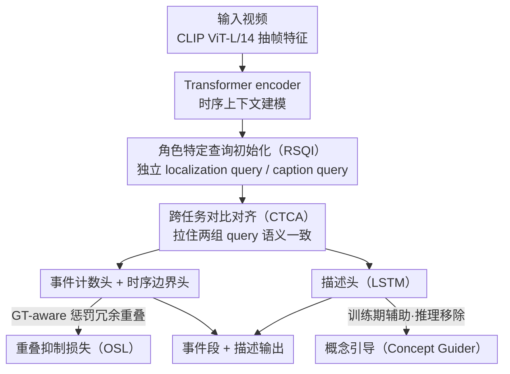

# Stay in your Lane: Role Specific Queries with Overlap Suppression Loss for Dense Video Captioning

**会议**: CVPR 2026  
**arXiv**: [2603.11439](https://arxiv.org/abs/2603.11439)  
**代码**: [https://github.com/edwardback/ROS-DVC](https://github.com/edwardback/ROS-DVC)  
**领域**: 视频理解  
**关键词**: Dense Video Captioning, 角色特定查询, 重叠抑制损失, 对比对齐, 概念引导

## 一句话总结
提出 ROS-DVC，通过将 DETR-based DVC 框架中的共享 query 分离为独立的 localization query 和 caption query，并设计 Overlap Suppression Loss 惩罚 query 间的时序重叠、Cross-Task Contrastive Alignment 保证跨任务语义一致性，在 YouCook2 和 ActivityNet Captions 上实现了 SOTA 的 captioning 和 localization 性能。

## 研究背景与动机
Dense Video Captioning (DVC) 的目标是在长视频中**同时**完成事件时序定位和自然语言描述两个子任务。早期方法采用两阶段 "先定位后描述" 策略，两个模块独立训练，缺乏交互。PDVC 首次将 DETR 架构引入 DVC，用一组可学习 query 并行预测事件段和生成描述，实现端到端联合优化。

**现有 query-based DVC 的两大痛点**：

**多任务干扰**：localization 和 captioning 共享同一组 query，单个 query 同时承担"找边界"和"写描述"两个截然不同的任务。在注意力层面，query 的 attention 既不能精确聚焦于事件边界（localization 需要 broad attend），也不能密集关注关键帧的细粒度语义（captioning 需要 dense attend）——两个优化目标冲突，导致注意力模糊。DDVC 虽然尝试了 query 分解，但只是通过 MLP 从 localization query 派生 caption query，两者注意力分布高度相似，并未真正实现任务分离。

**时序冗余**：多个 query 倾向于捕获重复的时序区间，生成冗余的描述。如图 1(a) 所示，baseline 模型对同一段时间重复检测，产生相同的 caption，严重影响 localization 精度和描述多样性。

**核心矛盾**：query 需要同时服务两个异质任务，但 shared representation space 导致优化方向冲突；同时缺乏对 query 间时序关系的显式约束，使得 overlap 问题无法自动消除。

**本文切入角度**：与其让一个 query 身兼两职，不如让两组独立 query "各司其职"——localization query 专注于 broad temporal context 定位边界，caption query 专注于 key frame 的语义细节。同时通过显式的 loss 设计约束 query 间行为：对比损失保证跨任务一致性，overlap 损失惩罚时序冗余。

**核心 idea**：用角色特定的独立 query 消除 DVC 中的多任务干扰，用 Overlap Suppression Loss 消除时序冗余。

## 方法详解

### 整体框架
ROS-DVC 沿用 DETR 风格的并行编解码框架，但把"一组 query 身兼定位与描述两职"改成"两组 query 各管一摊"。一段视频先用预训练 CLIP ViT-L/14 抽出帧级特征，送进 Transformer encoder 做时序上下文建模；decoder 里并行放两组独立的可学习 query——localization query 负责找事件边界、caption query 负责写描述——各自通过 cross-attention 读取帧特征。最后接四个任务头，分别预测事件数量、时序边界、描述文本和事件概念，整个流程端到端联合训练。在这条主干上，本文用一次 query 分离加三个新损失/辅助头，把多任务干扰和时序冗余两个老毛病一起解决。

### 关键设计

**1. Role Specific Query Initialization：让定位和描述各用一组独立 query，从源头切断多任务干扰**

传统 query-based DVC 让同一个 query 既找边界又写描述，但这两件事对注意力的要求恰好相反——定位要 broadly attend 到大段时序上下文才能估准边界，描述要 densely attend 到关键帧才能抓住细粒度语义，硬塞进一个 query 只会两头不靠、注意力变模糊。ROS-DVC 直接把单一 query 集合拆成 $\{q_{\text{loc}}^j\}_{j=1}^K$ 和 $\{q_{\text{cap}}^j\}_{j=1}^K$ 两组，从两个**完全独立**的可学习嵌入空间初始化，各自与编码后的帧特征做 cross-attention；两组共享同一个 decoder，并在 cross-attention 中引用相同的 visual location（由 localization query 的 reference point 给出），保证它们对的是同一段视觉区域。和 DDVC 用 MLP 从 localization query 派生 caption query 的做法不同——派生出来的两者注意力高度相似、本质上仍互相牵制——完全独立初始化让每组 query 都能自由收敛到最适合自己任务的注意力模式，这才算真正把任务分开。

**2. Cross-Task Contrastive Alignment（CTCA）：拉住分家后可能漂移的两组 query，保证同一事件的定位和描述对得上**

query 一旦分家就有新风险：localization query 和 caption query 各练各的，可能在语义上越走越远，落到"定位的是 A、描述的是 B"的尴尬。CTCA 用一个非对称对比损失把它们重新拽到一起。先用 Hungarian 匹配确定与 ground truth 对应的 query 索引集合 $\mathcal{M}$，对每个 $j \in \mathcal{M}$，把第 $j$ 个 caption query $\tilde{q}_{\text{cap}}^j$ 和对应的 localization query $\tilde{q}_{\text{loc}}^j$ 当作正样本对、其余 localization query 当负样本：

$$\mathcal{L}_{\text{CTCA}} = -\sum_{j \in \mathcal{M}} \log \frac{\exp(\text{sim}(\tilde{q}_{\text{cap}}^j, \tilde{q}_{\text{loc}}^j)/\tau)}{\sum_{j'} \exp(\text{sim}(\tilde{q}_{\text{cap}}^j, \tilde{q}_{\text{loc}}^{j'})/\tau)}$$

其中 $\text{sim}(\cdot)$ 是余弦相似度、$\tau$ 是温度参数。这样既保住两组 query 的任务独立性，又让 localization query 借对比学习"沾上"语义感知能力，避免分离过头反而丢了一致性。

**3. Overlap Suppression Loss（OSL）：显式惩罚 query 间的时序重叠，但只重罚偏离 GT 的冗余预测**

定位变差的另一个根因是多个 query 爱往同一段时间挤，反复检测出重叠区间、生成雷同 caption。最直接的想法是惩罚一切 overlap，可那会误伤"两个事件本就紧挨着"的正确情况。OSL 的巧处在于让惩罚力度随预测与 GT 的对齐程度自适应。先定义预测区间之间的重叠度 $P_o(i,j) = \text{IoU}(B_i, B_j)$、以及预测与 GT 的对齐度 $P_g(i,j) = \text{IoU}(B_i, G_j)$，据此构造自适应权重：

$$\alpha = \gamma \cdot P_g + (1-\gamma) \cdot (1-P_g), \quad \gamma \leq 0.5$$

当预测和 GT 对得很准（$P_g$ 高）时 $\alpha$ 小、几乎不罚重叠；当预测偏离 GT 时 $\alpha$ 大、狠狠压制。最终损失为 $\mathcal{L}_{\text{OSL}} = -\alpha \cdot \log(\beta - P_o)$，其中 $\beta$ 是最大重叠阈值超参。这种 GT-aware 设计让模型既能砍掉冗余提议、又保住对紧邻事件的检测能力，消融里它对 F1 的提升也是所有单组件中最大的。

**4. Concept Guider：用一个训练期辅助头给 caption query 注入高层语义，且不增加推理开销**

CM2、MCCL 这类方法靠外挂记忆库来丰富描述语义，代价是系统更复杂。Concept Guider 走的是内部辅助任务这条更轻的路：从训练集 caption 里抽出 top-$N_c$ 个名词和动词当概念词表，为每个事件构建 multi-hot 标签 $Y^c \in \{0,1\}^{N_c}$；概念头拿 caption query 的输出过一个 MLP + sigmoid 预测概念分布 $\hat{y}_c = \text{sigmoid}(\text{MLP}(\tilde{q}_{\text{cap}}))$，用交叉熵训练。推理时整个头直接丢掉，纯靠训练阶段把"这个事件的核心概念"压进 caption query 的嵌入，让生成的描述更具体、更有上下文感。

### 损失函数 / 训练策略
总损失由标准 DVC 损失和新增三个损失组合：
$$\mathcal{L}_{\text{total}} = \lambda_{\text{giou}}\mathcal{L}_{\text{giou}} + \lambda_{\text{cls}}\mathcal{L}_{\text{cls}} + \lambda_{\text{cap}}\mathcal{L}_{\text{cap}} + \lambda_{\text{ec}}\mathcal{L}_{\text{ec}} + \lambda_{\text{CTCA}}\mathcal{L}_{\text{CTCA}} + \lambda_{\text{OSL}}\mathcal{L}_{\text{OSL}} + \lambda_{\text{CG}}\mathcal{L}_{\text{CG}}$$

- 视觉编码：CLIP ViT-L/14，帧采样 1 FPS
- 2 层 deformable transformer decoder，4 级多尺度特征
- YouCook2：K=50 queries/组，帧数 F=200；ActivityNet：K=10，F=100
- OSL 超参：$\gamma=0.25$, $\beta=1.0$；概念词数 $N_c=30$

## 实验关键数据

### 主实验 — Captioning 性能

| 方法 | 预训练 | YouCook2 CIDEr↑ | YouCook2 SODA_c↑ | ActivityNet CIDEr↑ | ActivityNet SODA_c↑ |
|------|--------|-----------------|-------------------|--------------------|--------------------|
| PDVC | ✗ | 29.69 | 4.92 | 29.97 | 5.92 |
| CM2 | ✗ | 31.66 | 5.34 | 33.01 | 6.18 |
| MCCL | ✗ | 36.09 | 5.21 | 34.92 | 6.16 |
| E2DVC | ✗ | 34.26 | 5.39 | 33.63 | 6.13 |
| **ROS-DVC (Ours)** | **✗** | **39.18** | **7.06** | **35.04** | **6.45** |

YouCook2 上 CIDEr 比 MCCL（用外部记忆库）高 3.09，SODA_c 高 1.85；ActivityNet 上 CIDEr 最优（35.04），超越所有 non-pretrained 方法。

### 主实验 — Localization 性能

| 方法 | YouCook2 Rec.↑ | YouCook2 Pre.↑ | YouCook2 F1↑ | ActivityNet Rec.↑ | ActivityNet F1↑ |
|------|---------------|---------------|-------------|-------------------|----------------|
| PDVC | 22.89 | 32.37 | 26.81 | 53.27 | 54.78 |
| E2DVC | 24.36 | 34.75 | 28.64 | 54.67 | 56.14 |
| **ROS-DVC** | **29.34** | **35.26** | **32.03** | **55.35** | **55.50** |

YouCook2 上 F1 比 E2DVC 高 3.39；ActivityNet 上 Recall 和 Precision 接近平衡，说明事件计数器预测的事件数更接近 GT。

### 消融实验

| RSQI | CTCA | OSL | CG | CIDEr↑ | SODA_c↑ | F1↑ | 说明 |
|------|------|-----|-----|--------|---------|-----|------|
| ✗ | ✗ | ✗ | ✗ | 29.69 | 5.39 | 26.81 | Baseline (PDVC) |
| ✓ | ✗ | ✗ | ✗ | 32.33 | 5.43 | 27.00 | 仅分离 query→CIDEr +2.64 |
| ✗ | ✗ | ✓ | ✗ | 33.60 | 6.79 | 31.22 | 仅 OSL→F1 大幅提升 +4.41 |
| ✗ | ✗ | ✗ | ✓ | 31.40 | 5.62 | 27.69 | 仅概念引导→CIDEr +1.71 |
| ✓ | ✓ | ✗ | ✗ | 34.48 | 5.58 | 27.59 | query分离+对比→CIDEr +4.79 |
| ✓ | ✓ | ✓ | ✓ | **39.18** | **7.06** | **32.03** | **完整模型，全指标最优** |

### 关键发现
- **OSL 对 localization 贡献最大**：单独加 OSL 使 F1 从 26.81 跳到 31.22（+4.41），是所有单组件中提升最显著的，直接验证了"query 时序重叠是定位瓶颈"的假设
- **RSQI + CTCA 对 captioning 贡献最大**：query 分离 + 对比对齐使 CIDEr 从 29.69 提到 34.48（+4.79），说明任务解耦确实释放了 captioning 能力
- **四组件缺一不可**：完整模型 CIDEr 39.18 显著超越任何三组件组合，各模块互补而非冗余
- **$\gamma=0.25$ 是 OSL 最优平衡点**：更小的 $\gamma$ 导致 captioning 质量下降，更大的 $\gamma$ 削弱 overlap 抑制效果
- **去掉 $\alpha$（即均匀惩罚所有 overlap）会降低 Precision**：验证了 GT-aware 自适应权重的必要性
- **query 数量 50 为最优**：太少会漏事件，太多会产生冗余提议；50 在 captioning 和 localization 间取得最佳平衡

## 亮点与洞察
- **独立 query 初始化的简单有效性**：不需要额外的 encoder 或复杂的 query 交互机制，仅从不同嵌入空间初始化就能让 localization query 和 caption query 自然学会不同的注意力模式（broad vs dense），设计极为简洁
- **OSL 的 GT-aware 自适应设计**巧妙地回避了"惩罚所有 overlap"的过度约束问题，用 $\alpha$ 权重让模型在"减少冗余"和"保留正确检测"之间找到平衡
- **Concept Guider 不增加推理开销**：仅在训练时作为辅助任务引导 query 学习，推理时移除，是典型的"训练增强 + 零开销"范式，可迁移到其他生成任务

## 局限与展望
- Captioning head 使用 LSTM，在长描述生成能力上弱于 GPT-2/LLM-based 方法（DDVC 使用 GPT-2），如果替换为更强的语言模型可能进一步提升
- 概念词汇 $N_c=30$ 较小且从训练集统计得到，面对 open-vocabulary 场景可能不足
- 仅在 YouCook2（烹饪）和 ActivityNet（人类活动）两个 benchmark 上验证，泛化性到其他视频类型（如 Ego4D、电影理解）未验证
- OSL 基于 temporal IoU，假设事件是连续时间段，不适用于 multi-label 或 hierarchical event 场景
- 论文未报告推理速度，两组 query 的 decoder 计算量理论上是 baseline 的 2 倍

## 相关工作与启发
- **vs PDVC**：PDVC 首次将 DETR 用于 DVC，共享 query；本文在此基础上分离 query + 显式 loss 约束，CIDEr +9.49，F1 +5.22，提升非常显著
- **vs DDVC**：DDVC 用 MLP 从 localization query 派生 caption query，本质仍有依赖；本文的完全独立初始化更彻底，且不依赖 GPT-2
- **vs CM2/MCCL**：这两种方法靠外部记忆库增强 captioning，增加了系统复杂度；本文通过内部的 Concept Guider 和 role-specific query 达到甚至超越其效果，更简洁
- **思路可迁移**：OSL 的 GT-aware overlap 惩罚机制可以直接迁移到 temporal action detection、moment retrieval 等时序定位任务中解决 proposal 冗余问题

## 评分
- 新颖性: ⭐⭐⭐⭐ 核心idea（query分离+overlap loss）直觉清晰、设计简洁，但每个组件的技术复杂度不高
- 实验充分度: ⭐⭐⭐⭐⭐ 双benchmark + 完整消融（单组件、组合、超参、query数量）+ 定性分析，非常详尽
- 写作质量: ⭐⭐⭐⭐ 动机阐述清楚，图表直观（Fig.1的注意力对比很有说服力），但Related Work稍显冗长
- 价值: ⭐⭐⭐⭐ 为query-based DVC提供了清晰的改进范式，OSL可迁移到其他时序任务
- 价值: 待评

<!-- RELATED:START -->

## 相关论文

- [\[CVPR 2026\] SAIL: Similarity-Aware Guidance and Inter-Caption Augmentation-based Learning for Weakly-Supervised Dense Video Captioning](sail_similarity-aware_guidance_and_inter-caption_augmentation-based_learning_for.md)
- [\[AAAI 2026\] Explicit Temporal-Semantic Modeling for Dense Video Captioning via Context-Aware Cross-Modal Interaction](../../AAAI2026/video_understanding/explicit_temporal-semantic_modeling_for_dense_video_captioning_via_context-aware.md)
- [\[CVPR 2026\] Beyond Caption-Based Queries in Video Moment Retrieval](beyond_caption-based_queries_in_video_moment_retrieval.md)
- [\[CVPR 2026\] Self-Critical Distillation Network for Video-based Commonsense Captioning](self-critical_distillation_network_for_video-based_commonsense_captioning.md)
- [\[CVPR 2026\] Your One-Stop Solution for AI-Generated Video Detection](your_one-stop_solution_for_ai-generated_video_detection.md)

<!-- RELATED:END -->
