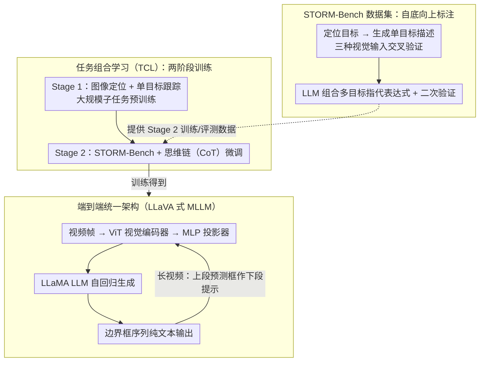

# STORM: End-to-End Referring Multi-Object Tracking in Videos

**会议**: CVPR 2026  
**arXiv**: [2604.10527](https://arxiv.org/abs/2604.10527)  
**代码**: [https://github.com/amazon-science/storm-referring-multi-object-grounding](https://github.com/amazon-science/storm-referring-multi-object-grounding)  
**领域**: 视频理解  
**关键词**: 指代多目标跟踪, 多模态大语言模型, 任务组合学习, 视频理解, 数据集

## 一句话总结
STORM 是首个端到端的多模态大语言模型框架用于指代多目标跟踪（RMOT），通过任务组合学习策略大幅减少对 RMOT 标注数据的依赖，并构建了高质量 STORM-Bench 数据集。

## 研究背景与动机

**领域现状**：指代多目标跟踪要求模型根据文本描述在视频中跟踪所有匹配的目标。现有 RMOT 方法将目标定位和跟踪拆分为独立模块，依赖外部检测器。

**现有痛点**：(1) RMOT 训练视频极度稀缺；(2) 现有数据集标注模糊且领域受限；(3) 模块化方法难以理解复杂的指代表达式和推理因果/关系依赖。

**核心矛盾**：RMOT 是一个需要联合视觉-语言理解和时序跟踪的复杂任务，但标注成本极高导致无法获得足够的训练数据。

**本文目标**：统一定位和跟踪，消除外部模块依赖，解决数据稀缺问题。

**切入角度**：借鉴 LLM 预训练中"先学基础能力再微调"的思路，将 RMOT 分解为图像定位和单目标跟踪两个基础子任务。

**核心 idea**：用任务组合学习将 RMOT 分解为数据丰富的子任务，先学定位和跟踪基础能力，再用少量 RMOT 数据微调。

## 方法详解

### 整体框架
STORM 的核心是用任务组合学习（TCL）绕开 RMOT 数据稀缺：把任务拆成数据丰富的子任务做两阶段训练，让一个端到端 MLLM 直接推理，所需的高质量训练/评测数据则由自底向上标注的 STORM-Bench 提供。具体分三块——**任务组合学习（TCL）**用两阶段训练，Stage 1 在大规模图像定位与单目标跟踪数据上预训练、Stage 2 用 STORM-Bench 配合思维链（Chain-of-Thought, CoT）微调；**端到端统一架构**是 LLaVA 风格 MLLM：ViT 视觉编码器提取帧级特征 → MLP 投影器映射到文本空间 → LLaMA-based LLM 自回归生成边界框序列，输出结构化文本 `Object 1: Frame 1: [x1,y1,x2,y2], ...`，长视频切片处理并以上段预测框作下段提示接力；**STORM-Bench 数据集**走自底向上标注，先定位目标再生成并验证描述，最后由 LLM 组合成多目标指代表达式。

### 关键设计

**1. 任务组合学习（TCL）：用数据丰富的子任务"拼"出数据稀缺的 RMOT 能力**

RMOT 真正卡脖子的不是模型架构，而是标注——既要框出所有匹配目标、又要跨帧维持身份、还要对齐一句复杂的指代描述，标一条视频的成本远超普通检测。STORM 的破局思路是把 RMOT 拆成两个本身就有海量数据的基础子任务：图像定位（看懂"指代表达式 ↔ 框"的对应）和单目标跟踪（看懂"同一目标跨帧的时序一致性"）。Stage 1 先在这两类大规模数据上预训练，让模型分别学会跨模态对齐和时序连续；Stage 2 才用规模小得多的 STORM-Bench 做微调，把两种能力组合成"按描述跟一组目标"。微调阶段进一步用 Chain-of-Thought 训练策略显式拆解推理：先在首帧把目标定位出来，再以此为锚跨帧跟踪——这条思维链让模型在多目标、有遮挡的场景里不容易把身份跟丢。这套"先学通用基础能力、再少量数据微调"的路径，本质上是把 LLM 预训练那一套迁移到了 RMOT，使得 RMOT 标注从"必需的海量"降为"少量的对齐数据"。

**2. 端到端统一架构：把定位和跟踪都写成一段纯文本，让语言模型自己推理**

传统 RMOT 把定位、跟踪、文本匹配拆成串起来的独立模块，每跨一道模块边界就丢一次信息，复杂指代表达式里的因果/关系依赖更是被切碎在各模块之间。STORM 索性取消所有外部检测器和跟踪器，让 MLLM 直接自回归地把全部目标的边界框序列当作纯文本吐出来，格式就是 `Object 1: Frame 1: [x1,y1,x2,y2], ...`。这样指代表达式的语义推理和框的生成发生在同一个语言模型内部，能直接调用预训练 LLM 的推理能力去解析"穿红衣服、正在向左跑的那几个人"这类复合条件。对于超出上下文长度的长视频，模型把它切成短片段逐段处理，并把上一片段最后预测出的框作为下一片段的提示喂进去——比如一句"跟踪所有正在过马路的行人"，第一段先定位并输出三条轨迹的框，第二段就带着这三组框继续往后接，靠这种状态接力把分段的轨迹缝成完整一条，避免端到端模型在长视频上断片。

**3. STORM-Bench 数据集：自底向上标注，利用"描述比定位简单"的不对称性**

现有 RMOT 数据集的麻烦在于自顶向下标注——先给一句描述、再去视频里找匹配目标，描述本就模糊、领域又窄，标出来的对应关系噪声大。STORM-Bench 反过来走自底向上：先把视频里的目标定位出来、为每个目标生成描述（用 MLLM 配合三种不同视觉输入交叉验证，降低单次幻觉），再交给 LLM 把多个单目标描述组合成一条多目标指代表达式并做二次验证。这么做的底层判断是"描述一个已经框好的目标，比凭空从一句话里定位目标要可靠得多"，于是把易做的一步放在前面、难的一步交给已知答案去约束，整条管线的噪声就被压下来。最终得到 15.7K 视频、251K 图像、200K 指代表达式的规模，既是 Stage 2 微调的训练源，也是评估 RMOT 的基准。

### 损失函数 / 训练策略
标准的 next-token prediction 交叉熵损失——边界框以纯文本 token 形式预测，因此定位、跟踪、指代理解统一在同一个自回归目标下优化。

## 实验关键数据

### 主实验

| 任务/数据集 | 指标 | STORM | 之前SOTA | 提升 |
|-------------|------|-------|----------|------|
| RefCOCO val | Acc@0.5 | 89.1 | 88.7 (M-GPT2) | +0.4 |
| Elysium RSOT | AUC | 84.1 | 83.3 (Elysium) | +0.8 |
| STORM-Bench RMOT | HOTA | 42.9 | 37.9 (Qwen2.5-VL) | +5.0 |

### 消融实验

| 配置 | HOTA | 说明 |
|------|------|------|
| Full STORM | 42.9 | 完整模型 |
| w/o Stage 1 预训练 | 35.2 | 子任务预训练贡献显著 |
| w/o CoT 推理 | 39.6 | Chain-of-Thought 提升跟踪一致性 |

### 关键发现
- TCL 策略显著减少了对 RMOT 数据的需求，图像定位子任务的训练也反过来提升了 RMOT 性能
- 使用更长更全面的提示词可以进一步提升跟踪性能（87.4→87.5 AUC）
- 端到端方法在复杂指代表达式上的优势明显，Grounding DINO + 跟踪器的管线方法 HOTA 仅 31.7

## 亮点与洞察
- **任务分解学习的实用性**：将复杂任务分解为数据丰富的子任务是解决标注瓶颈的通用策略，可迁移到其他需要复杂标注的视频任务
- **自底向上标注管线**：比自顶向下更鲁棒的标注方式，利用"描述比定位简单"的不对称性

## 局限与展望
- 基于 8B 参数模型，推理效率仍是部署瓶颈
- 长视频分段处理可能丢失跨片段的跟踪一致性
- 自由形式文本输出有时会产生格式错误的边界框

## 相关工作与启发
- **vs ReferGPT**: ReferGPT 在 MLLM 上增加匹配模块，STORM 完全端到端
- **vs Elysium**: Elysium 用自顶向下标注有噪声，STORM 的自底向上标注更可靠

## 评分
- 新颖性: ⭐⭐⭐⭐ 首个端到端 MLLM RMOT 框架，TCL 策略巧妙
- 实验充分度: ⭐⭐⭐⭐⭐ 三个层级的评估（图像/SOT/RMOT）非常完整
- 写作质量: ⭐⭐⭐⭐ 问题定义清晰，方法描述详尽
- 价值: ⭐⭐⭐⭐ 数据集和方法都有较高价值

<!-- RELATED:START -->

## 相关论文

- [\[CVPR 2026\] FlexHook: Rethinking Two-Stage Referring-by-Tracking in RMOT](rethinking_two-stage_referring-by-tracking_in_referring_multi-object_tracking_ma.md)
- [\[ECCV 2024\] OneTrack: Demystifying the Conflict Between Detection and Tracking in End-to-End 3D Trackers](../../ECCV2024/video_understanding/onetrack_demystifying_the_conflict_between_detection_and_tracking_in_end-to-end_.md)
- [\[CVPR 2026\] Occlusion-Aware SORT: Observing Occlusion for Robust Multi-Object Tracking](occlusion-aware_sort_observing_occlusion_for_robust_multi-object_tracking.md)
- [\[CVPR 2026\] FC-Track: Overlap-Aware Post-Association Correction for Online Multi-Object Tracking](fc-track_overlap-aware_post-association_correction_for_online_multi-object_track.md)
- [\[CVPR 2026\] Dual-level Adaptation for Multi-Object Tracking: Building Test-Time Calibration from Experience and Intuition](tcei_test_time_calibration_experience_intuition_mot.md)

<!-- RELATED:END -->
