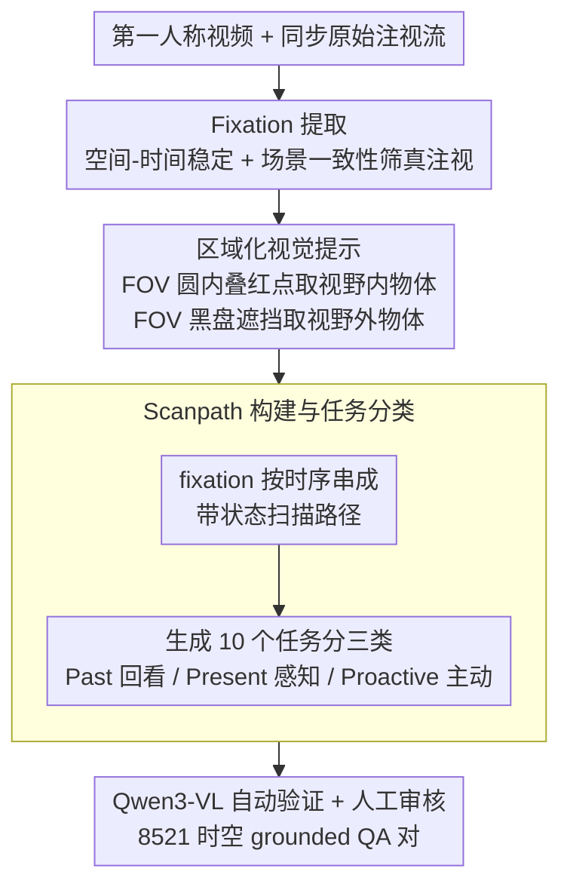

# StreamGaze: Gaze-Guided Temporal Reasoning and Proactive Understanding in Streaming Videos

**会议**: CVPR 2026  
**arXiv**: [2512.01707](https://arxiv.org/abs/2512.01707)  
**代码**: 有（Project page + Code + Dataset）  
**领域**: 视频理解 / 流式视频 / 注视引导  
**关键词**: 注视信号、流式视频理解、时间推理、主动预测、第一人称视频

## 一句话总结
提出首个注视引导的流式视频理解基准 StreamGaze，包含 8521 个 QA 对覆盖过去/现在/主动预测三类任务，通过注视轨迹-视频对齐的数据构建管线生成时空grounded的QA，揭示了当前 MLLM 在利用注视信号进行时间推理方面的巨大差距。

## 研究背景与动机

1. **领域现状**：流式视频理解要求模型实时处理时序输入帧并做出响应，这对 AR 眼镜、机器人等应用至关重要。现有流式视频基准（StreamingBench、OVO-Bench 等）评估了时间推理能力。
2. **现有痛点**：(a) 现有基准几乎不包含人类感知信号——特别是注视信号，即使它们使用第一人称视频并暗示 AR 场景；(b) 很少有基准同时覆盖过去、现在和主动预测（proactive）任务；(c) 将注视信号融入视频理解非常困难——原始注视流噪声大、第一人称视频持续抖动、需要时空grounding。
3. **核心矛盾**：注视是人类最直接、最可靠的注意力指标，但现有基准和模型完全忽略了这一关键感知信号，导致评估与真实应用场景脱节。
4. **本文目标** (1) 如何构建注视引导的流式视频 QA 数据？(2) 如何设计覆盖过去/现在/主动预测的注视相关任务？(3) 当前 MLLM 能否有效利用注视信号？
5. **切入角度**：从注视行为的时序结构出发——提取注视点（fixation）、构建扫描路径（scanpath）、区分视野内/外区域——构建时空grounded的QA。
6. **核心 idea**：首个将注视轨迹与第一人称流式视频对齐的基准，通过 fixation 提取 + 区域化视觉提示 + scanpath 构建实现注视引导的过去/现在/主动预测评估。

## 方法详解

### 整体框架
StreamGaze 不是一个新模型，而是一条「把人眼注视轨迹翻译成视频 QA」的数据构建管线。输入是第一人称视频加上同步采集的原始注视流，输出是 8521 个时空 grounded 的 QA 对。管线先把噪声很大的原始注视坐标投影到图像平面，再从中筛出真正「看进去」的稳定注视时刻（fixation），围绕每个 fixation 区分用户视野内/外的物体，最后把这些 fixation 按时间串成扫描路径（scanpath），并据此生成覆盖 past / present / proactive 三类、共 10 个任务的问答。所有中间产物（scanpath、物体提取）都经人工验证（平均正确率约 83%），生成的 QA 再经 Qwen3-VL-30B 自动验证加人工审核双重过滤，保证基准本身的可信度。

### 关键设计

**1. Fixation 提取：从噪声注视流里筛出真正「看进去」的时刻**

原始注视流里夹杂大量 saccade（快速扫视），这些一闪而过的跳动并不代表有意义的注意力，直接拿来 grounding 只会把噪声引入标注。StreamGaze 用两道条件把 fixation 筛出来：一是空间-时间稳定性，要求一个注视窗口内的注视点空间分散度 $d_t = \|(x_t, y_t) - (\bar{x}_i, \bar{y}_i)\|_2 \leq r_{thresh}$ 且持续时间 $t_i^e - t_i^s \geq \tau_{dur}$，也就是「盯得够稳、够久」才算数；二是场景一致性，对窗口内连续帧计算色调-饱和度直方图的 Pearson 相关系数，要求最小值 $S_{min} \geq \tau_{scene}$。第二道条件是专门针对第一人称视频的——头戴相机持续抖动，画面随时可能整片切换，单看注视坐标稳定还不够，必须确认这段时间「看的是同一个场景」，才能把相机运动造成的伪稳定剔除掉。

**2. 区域化视觉提示：把「看到的」和「没看到的」物体物理隔开**

光知道注视落点还不够，构建难度可控的 QA 需要分别拿到「用户视野内」和「视野外」两套物体清单，而且两套不能互相污染。StreamGaze 对每帧以注视中心为圆心、$\tau_{fov}$ 为半径画出 FOV 圆形区域：提取视野内物体 $\mathcal{O}_i^{fov}$ 时，裁出这块圆形 patch 并在注视中心叠一个红点送进 MLLM（InternVL3.5-38B）；提取视野外物体 $\mathcal{O}_i^{out}$ 时，反过来把 FOV 那块用黑色圆盘遮死再送进同一个 MLLM。这种物理遮挡的好处是，两次提取在视觉输入层面就彻底分开，模型不可能把视野外的物体误算进 FOV 集合。这套互斥的物体集合直接撑起了后面 QA 的难度分级——Easy 模式的干扰项取自其它时刻的物体，Hard 模式则取自同一帧但落在视野外的物体，难度控制无需任何额外标注。

**3. Scanpath 构建与任务分类：把注视的时序流变成 10 个任务**

单帧的注视落点只是静态快照，注视真正的信息量在于它如何随时间在不同区域和语义之间转移——这正是时间推理要考的东西。StreamGaze 把所有 fixation 按时间顺序串成扫描路径 $\mathcal{S} = \{(\mathcal{O}_i^{fov}, \mathcal{O}_i^{out})\}_{i=1}^N$，每一步都带着「这一刻看到了什么、没看到什么」的双重物体集合。围绕这条带状态的路径，论文设计了 10 个任务并按认知层次分成三类：Past 类回看历史（NFI 非注视物体识别、OTP 物体转移预测、GSM 注视序列匹配、SR 场景回忆），Present 类考当前感知状态（OI 物体识别 Easy/Hard、OAR 物体属性识别、FAP 未来动作预测），Proactive 类则要求模型主动干预（GTA 注视触发警报、OAA 物体出现警报）。举例来说，一条做菜场景的 scanpath 可能先在锅上停留、再扫到旁边的盐罐，OTP 任务就问「下一个注视会转移到哪个物体」，而 GSM 任务则给出一段乱序的注视序列让模型还原顺序——同一条路径在不同任务下被切成记忆、感知、预测三种不同的考法。这样的划分让 past 测时间推理、present 测感知、proactive 测主动决策，三层难度逐级递进。

## 实验关键数据

### 主实验

| 模型 | 参数 | Past 平均 | Present 平均 | Proactive 平均 | Overall |
|------|------|-----------|-------------|---------------|---------|
| Human | - | 0.800 | 0.880 | 0.773 | 0.827 |
| GPT-4o | - | 0.541 | 0.606 | 0.373 | 0.535 |
| Qwen2.5-VL | 7B | 0.450 | 0.522 | 0.447 | 0.478 |
| InternVL3.5 | 8B | 0.481 | 0.523 | 0.212 | 0.444 |
| ViSpeak | 7B | 0.428 | 0.467 | 0.547 | 0.467 |
| EgoGPT | 7B | 0.479 | 0.496 | 0.222 | 0.436 |
| AssistGaze | 26M | 0.257 | 0.223 | N/A | 0.223 |

### 消融实验
注视输入方式对 Qwen2.5-VL 的影响：

| 策略 | Past | Present | Proactive | Avg |
|------|------|---------|-----------|-----|
| 无注视 | 0.423 | 0.500 | 0.384 | 0.446 |
| 文本提示 | 0.403 | 0.499 | 0.341 | 0.429 |
| 视觉提示 | 0.398 | 0.503 | 0.342 | 0.429 |
| 显著性图 | 0.394 | 0.546 | 0.386 | 0.454 |

### 关键发现
- **人类与模型差距巨大**：人类 0.827 vs 最好模型 GPT-4o 0.535，差距近 30 个百分点，说明当前 MLLM 远未具备有效利用注视信号的能力。
- **通用 MLLM 无法有效利用注视**：提供注视信息后模型表现未必提升，甚至在某些任务上下降（NFI 任务中注视提示反而限制了对非注视物体的探索）。
- **流式 MLLM 在主动任务上有优势**：ViSpeak 的逐帧在线处理机制使其在 proactive 任务上优于非流式模型。
- **专门的注视模型泛化性差**：AssistGaze 虽专为注视设计，但无法泛化到流式长时序场景（Overall 仅 0.223）。
- **显著性图是最优注视输入方式**：将注视轨迹聚合为热力图比原始坐标或帧级叠加更适合当前模型处理。

## 亮点与洞察
- **从感知信号到基准设计的完整闭环**：fixation 提取→区域化视觉提示→scanpath 构建→任务生成，每一步都有心理学/眼动研究的理论支撑，这种将人类感知科学与 AI 评估相结合的思路值得借鉴。
- **任务设计的认知层次递进**：Past→Present→Proactive 不仅是时间维度的划分，更是认知难度的递进——从记忆回溯到当前感知再到意图推断和主动干预。
- **视野内/外物体的巧妙利用**：通过 FOV/out-of-FOV 的区分自然实现了 QA 难度控制（Easy 模式干扰项来自其他时刻，Hard 模式来自同帧但视野外），无需额外标注。

## 局限与展望
- 基准仅使用第一人称视频（EGTEA+、EgoExoLearn、HoloAssist），场景类型受限于烹饪/实验室/装配
- 当前没有模型能真正从注视信号中获益——这既是发现也是局限，说明需要专门的注视感知模型架构
- proactive 任务的评估采用逐时间步查询的方式模拟在线决策，与真正的实时流式处理仍有差距
- 注视数据依赖设备采集，不同设备的注视精度差异可能影响结果的泛化性

## 相关工作与启发
- **vs GazeVQA**: GazeVQA 是首个注视 VQA 数据集但限于装配场景的静态交互，StreamGaze 扩展到流式设置并覆盖更多时间维度。
- **vs EgoGazeVQA**: EgoGazeVQA 仅使用逐帧注视点，不提取 fixation 也不做时空grounding。StreamGaze 提取完整 scanpath 并建模注视动态。
- **vs StreamingBench/OVO-Bench**: 这些基准覆盖过去/现在/未来但完全不包含注视信号，StreamGaze 填补了注视+流式的空白。
- **vs ViSpeak**: ViSpeak 在 proactive 任务上表现最好，说明逐帧在线处理的架构设计对流式理解很重要，未来的注视感知模型应该优先考虑流式架构。

## 评分
- 新颖性: ⭐⭐⭐⭐⭐ 首个将注视信号引入流式视频理解的基准，问题定义新颖
- 实验充分度: ⭐⭐⭐⭐⭐ 覆盖 4 类模型共 16 个基线，消融分析深入细致
- 写作质量: ⭐⭐⭐⭐⭐ 动机清晰、方法与任务设计环环相扣、图表精美
- 价值: ⭐⭐⭐⭐ 为注视感知的视频理解开辟了新方向，但短期内实际应用受限于模型能力不足

<!-- RELATED:START -->

## 相关论文

- [\[CVPR 2026\] StreamReady: Learning What to Answer and When in Long Streaming Videos](streamready_learning_what_to_answer_and_when_in_long_streaming_videos.md)
- [\[ACL 2026\] Response-G1: Explicit Scene Graph Modeling for Proactive Streaming Video Understanding](../../ACL2026/video_understanding/response-g1_explicit_scene_graph_modeling_for_proactive_streaming_video_understa.md)
- [\[CVPR 2026\] Color When It Counts: Grayscale-Guided Online Triggering for Always-On Streaming Video Sensing](color_when_it_counts_grayscale-guided_online_triggering_for_always-on_streaming_.md)
- [\[CVPR 2026\] FluxMem: Adaptive Hierarchical Memory for Streaming Video Understanding](fluxmem_adaptive_hierarchical_memory_for_streaming_video_understanding.md)
- [\[CVPR 2026\] Mistake Attribution: Fine-Grained Mistake Understanding in Egocentric Videos](mistake_attribution_fine-grained_mistake_understanding_in_egocentric_videos.md)

<!-- RELATED:END -->
