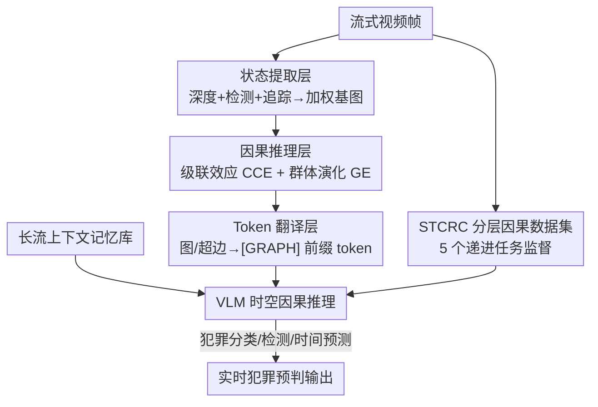

# Streaming Video Crime Anticipation with Spatio-Temporal Causal Reasoning

**会议**: CVPR 2026  
**论文**: [CVF Open Access](https://openaccess.thecvf.com/content/CVPR2026/html/Wang_Streaming_Video_Crime_Anticipation_with_Spatio-Temporal_Causal_Reasoning_CVPR_2026_paper.html)  
**代码**: 无  
**领域**: 视频理解  
**关键词**: 犯罪预判, 流式视频理解, 时空因果, 超图, 视觉语言模型

## 一句话总结
针对"现有监控系统只能事后/事中报警、无法在犯罪发生前预判"的问题，本文做了两件事——构建带时空因果标注的 STCRC 数据集（73K 样本、5 个递进因果推理任务），并设计一个流式协处理器 STCH 把视频里隐式的实体动态转成显式因果超图喂给 VLM，使犯罪分类相对提升 70.7%、检测提升 10.1%、时间预测误差降低 3.7%。

## 研究背景与动机
**领域现状**：传统视频异常检测（VAD）把任务建模为"检测偏离正常行为的事件"，本质是事后或实时的分类——事情发生了才报警。近来基于视觉语言模型（VLM）的视频理解方法凭借宽广的世界知识，在高层语义推理上展现潜力，也有一批"流式视频理解"工作（KV-cache 管理、记忆库缓冲感知状态）让模型能在线推理。

**现有痛点**：这些方法都是**回溯式（retrospective）**的——擅长"看完一段后总结发生了什么"，但犯罪预判（crime anticipation）要求的是**前瞻式（forward-looking）**推理：在犯罪真正发生**之前**，从一连串看似无害的前兆事件里读出危险信号。比如劫匪突然加速冲向受害者、枪与受害者的距离逐帧缩小——这些是犯罪的"时空因果前兆"，而现有流式方法既没有这类监督信号，架构上也没有显式建模时空因果关系的机制。

**核心矛盾**：作者把短板归结为两点。其一，**数据缺失**：现有犯罪数据集没有时空因果标注，模型学不到"前兆事件链 → 犯罪"的因果动态。其二，**架构缺失**：VLM 能轻松检测出"这是人、那是枪"，却无法把实体间隐式的运动因果（A 突然加速 → 导致 B 群体散开）显式结构化。

**本文目标**：让 VLM 具备实时犯罪预判能力，分解为"补上因果监督数据"与"补上因果建模模块"两个子问题。

**切入角度**：作者从"预测性因果（predictive causality）"出发——不追求建立严格的结构因果模型，而是把**前兆事件的结构化时序序列**与**并发的空间关系动态**当作对未来犯罪高度预测性的信号来用。

**核心 idea**：用一个分层因果数据集教 VLM 学因果推理，再用一个流式超图模块把隐式实体动态翻译成显式因果结构作为 VLM 的输入前缀。

## 方法详解

### 整体框架
系统要解决的是：输入一段**未修剪的流式视频**（只能看到犯罪发生前的观测窗口 $\{x_t\}_{t=1}^{t_{obs}}$），输出对未来犯罪的预测属性 $\hat{P}_{future}$（是否会发生、犯罪类型、还有多久发生）。整条流水线由五个模块串成：(a) **标注**先离线把 UCF-Crime 视频加工成带因果标签的 STCRC 数据集；(b) **时空因果超图 STCH** 作为流式协处理器，逐帧把实体动态转成显式因果超图并 token 化；(c) **记忆库**保留长视频流的历史上下文；(d) 在五个递进因果任务上做 **时空因果推理训练**；(e) 把学好的能力对接到分类/检测/时间预测三个**下游任务**。其中 (a) 是离线数据侧、(b)(c) 是在线模块侧、(d)(e) 是训练与评测侧。

### 关键设计

**1. STCRC 数据集：用五个递进任务把"前兆→犯罪"的因果链显式标出来**

痛点很直接——现有犯罪数据集只标"哪段是异常"，没有"哪些前兆事件因果地导向了犯罪"。作者基于 UCF-Crime Annotation，分三步加工：① **时序事件标注**，用 GPT-4o 结合前文事件把每个事件二分类为"犯罪事件 (1) / 前兆非犯罪事件 (0)"，从而把一个场景里"良性前兆序列 → 最终犯罪"的行为演化链显式标出；② **空间关系标注**，逐帧用 Depth Anything 估深度、YOLO-World 开放词表检测实体框、ByteTrack 跨帧追踪赋予持久 ID，把 2D 框中心配上深度得到伪 3D 坐标 $(c_x, c_y, z)$，再算实体对之间的相对方位和归一化欧氏距离作为"接近度"启发信号；③ 把以上素材用 prompt 模板组织成**五个由局部到全局再到实体级**的递进推理任务：Task 1 即时因果推断（给事件预测其直接后果）、Task 2 空间因果推断（预测下一事件的空间分布）、Task 3 时序因果结构推断（把多事件排成 $\gamma_{t-n} \prec \cdots \prec \gamma_{t+n}$ 的因果链）、Task 4 因果关系推断（从混入负样本的前序事件里挑出真正有因果的）、Task 5 实体—事件因果（找出导致目标事件的实体子集）。全集 73K 样本（45,567 训练 / 12,467 验证 / 14,672 测试），并经十名标注员多阶段人工校验。消融显示这套监督是预判能力的命根子——去掉它分类直接从 40.67 掉到 23.03。

**2. STCH 时空因果超图：把隐式实体动态渲染成显式因果超边作为 VLM 输入**

VLM 看得出"有人有枪"，却建模不了"A 加速导致 B 群体散开"这类高阶因果。STCH 是一个**流式协处理器**，分三层把隐式动态变成显式结构。**状态提取层**维护一张动态加权基图 $G_b=(V, E_b)$：每个节点（实体）持有一个活动分 $\alpha_i \in (0,1]$，被观测到时置 $\alpha_i \leftarrow 1$、否则指数衰减 $\alpha_i \leftarrow \lambda \alpha_i$，从而优雅处理实体的出现与消失；每个节点抽四类特征（运动学的位置/速度/加速度、轨迹形态的位移/曲率/转角、语义的 GloVe 类别嵌入、时间元数据的活动分与帧号），并各配一个 GRU 记忆 $h_i^{(t)} = \mathrm{GRU}(f_i^{(t)}, h_i^{(t-1)})$ 把瞬时特征变成时序感知表示；边权 $w_{ij}$ 综合空间邻近的高斯核 $k_{ij}$ 与联合激活 $\alpha_i\alpha_j$，低于阈值 $\tau$ 的边被剪掉，得到只保留时空邻近强连接的稀疏图。**因果推理层**在基图上检测两类超边：**级联效应 CCE** 用 Z-score 阈值在窗口 $[t-\Delta_{hist}, t]$ 内找运动突变的响应节点集 $V_{resp}$，再去缓冲区里找此前已突变的触发集 $V_{trig}$，当两者在基图上的边权超过 $\tau_{link}$（空间局部性作为隐式因果先验）就连成超边 $H=(V_{trig}\cup V_{resp}, T_{edge})$，显式刻画"突变→后果"；**群体演化 GE** 对基图做连通分量聚类得到当前群组 $C(t)$，与上一时刻 $C(t-1)$ 比成员构成，检测聚合（合并/新群涌现）与分离（分裂/解散）两类事件并各形成超边。**Token 翻译层**用图注意力网络编码 $G_b$，对全图做自加权注意力池化得全局图 token $[G]$，对每条超边涉及的节点子集池化并拼上可学习的类型嵌入 $E_{type}$ 得超边 token $[HE]$，最后用 `[GRAPH START]`/`[GRAPH END]` 包起来作为 VLM 的前缀输入。消融里去掉 STCH 后 WF1 从 40.67 掉到 33.88、TimeDiff 从 55.80 升到 58.73，CCE 与 GE 分别贡献了分类与时序预测的不同部分。

**3. 长流上下文记忆库：让模型不丢掉远端历史证据**

长视频流里早期的关键前兆很容易被滑窗推出视野。作者用一个记忆库 $S_{mem}$：每步把当前窗口特征均值池化成感知状态 $Q_{cur}$，以它为 query 通过交叉注意力检索历史 $R_{mem}=\mathrm{CrossAttn}(Q_{cur}, S_{mem}, S_{mem})$；检索完把当前感知状态追加进 $S_{mem}$，并把检索到的特征与当前状态融合，得到一个同时整合"当下证据 + 长程上下文"的表示。这让模型在做 60 秒级长时预判时仍能利用远端前兆。

### 损失函数 / 训练策略
以 Qwen2-VL-7B 为骨干做监督微调；视频按 2 FPS 采样、8 帧为一个流式窗口处理；对所有线性层用 LoRA（秩 $r=64$、缩放 $\alpha=32$）；AdamW（$\beta_2=0.95$、weight decay 0.1）训练 2 个 epoch，学习率 $1\times10^{-5}$ 配余弦退火；在 NVIDIA H200 上训练，结果对 5 个随机种子取平均。

## 实验关键数据

### 主实验
在 UCF-Crime 上训练/验证/测试，XD-Violence 做跨域评测。三个指标：TimeDiff（预测时间与真值的平均绝对误差，越低越好）、AUC-S/M/L（短 2s / 中 20s / 长 60s 窗口的区分能力）、WF1（多类犯罪分类的加权 F1）。

| 数据集 | 指标 | 本文 | 最强 baseline | 说明 |
|--------|------|------|---------------|------|
| UCF-Crime | WF1↑ | **40.67** | 23.83 (Flash-VStream) | 分类相对提升约 70.7% |
| UCF-Crime | AUC-L↑ | **0.692** | 0.609 (Holmes-VAU) | 长时区分能力 +0.083 |
| UCF-Crime | TimeDiff↓ | **55.80** | 57.91 (VideoLLM-online) | 时间预测误差更低 |
| XD-Violence | WF1↑ | **36.90** | 30.51 (Flash-VStream) | 跨域分类最佳 |
| XD-Violence | AUC-L↑ | **0.622** | 0.583 (Flash-VStream) | 跨域长时最佳 |

本文在两个数据集、几乎所有指标上都拿到最佳，且标 * 表示对最强 baseline 统计显著（$p<0.05$）。

### 消融实验
分层渐进式移除（Table 4，UCF-Crime）：

| 配置 | WF1↑ | TimeDiff↓ | AUC-L↑ | 说明 |
|------|------|-----------|--------|------|
| Complete | 40.67 | 55.80 | 0.692 | 完整模型 |
| w/o STCH | 33.88 | 58.73 | 0.597 | 去掉因果超图模块 |
| w/o CCE | 39.81 | 57.61 | 0.642 | 去级联效应超边 |
| w/o GE | 36.64 | 57.53 | 0.644 | 去群体演化超边 |
| w/o STCRC | 23.03 | 65.88 | 0.595 | 去因果数据集监督 |

### 关键发现
- **STCRC 监督是最大功臣**：去掉后分类从 40.67 暴跌到 23.03、TimeDiff 从 55.80 恶化到 65.88，说明显式时空因果监督是预判能力的根基。
- **STCH 内部两类超边分工不同**：去掉 CCE（级联效应）主要伤分类（40.67→39.81，且 AUC 明显下降），去掉 GE（群体演化）对分类影响更大（→36.64）；二者整体去掉（w/o STCH）使 WF1 掉到 33.88。
- **任务层级各有侧重**：Task 1&2（局部即时/空间因果）主要改善时间预测和检测，Task 5（实体级因果）对分类影响最强。

## 亮点与洞察
- **把"异常检测"重构成"因果预判"**：最大的认知转变是从"事情发生了再分类"转向"从前兆因果链预测尚未发生的事"，并配套造了带因果标注的数据集，让这个新任务可学可评。
- **超图作为 VLM 与场景动态之间的"因果翻译器"很巧妙**：用 GRU + 活动分衰减处理流式实体生灭，用 Z-score 突变检测 + 连通分量聚类分别抓"个体级联"和"群体演化"两类因果，最后 token 化成前缀喂给 VLM——这套"显式结构化再交给 LLM 推理"的思路可迁移到其他需要关系推理的视频任务（如交通事故预判、群体行为预测）。
- **活动分衰减机制**值得复用：$\alpha_i \leftarrow \lambda\alpha_i$ 让离场实体平滑淡出而非硬删，避免流式图频繁重建带来的抖动。

## 局限与展望
- 因果是**预测性因果**而非结构因果——作者明确说不追求严格的结构因果模型，所以"因果"更像是高预测性的统计关联，可能在分布外场景（罕见犯罪模式）失效。⚠️ 这点作者自陈。
- 数据标注重度依赖 GPT-4o 的事件因果判断 + 人工校验，标注成本高且 GPT-4o 的偏差可能注入数据集；空间标注链路（Depth Anything + YOLO-World + ByteTrack）的累积误差会传到下游因果推理。
- 仅在 UCF-Crime / XD-Violence 两个监控数据集验证，骨干固定为 Qwen2-VL-7B；STCH 多层（突变检测、聚类、超图编码）的额外延迟对"实时"约束的真实影响、以及超参（$\tau$、$\tau_{link}$、$\lambda$、Z-score 阈值）的敏感性，正文披露有限。

## 相关工作与启发
- **vs 传统 VAD（UR-DMU / CLAP）**: 它们做的是回溯式异常分类（事中/事后），本文做前瞻式预判（事前），且显式建模时空因果而非只学"正常 vs 异常"的边界，故在所有预判指标上大幅领先。
- **vs 流式 VLM（Flash-VStream / VideoLLM-online / Dispider / SVQA）**: 它们用记忆/KV-cache 解决在线推理的效率与长上下文，但本质仍是回溯理解；本文额外加了 STCH 把实体动态显式因果结构化，并用 STCRC 提供前瞻监督，因此在同为流式的设定下分类与长时 AUC 都明显更好。
- **vs 离线 VLM（GPT-4o / Holmes-VAD/VAU / Qwen2-VL）**: 离线方法需看完全片，无法满足犯罪预判的在线因果约束；作者用滑窗适配后对比，本文仍全面占优。

## 评分
- 新颖性: ⭐⭐⭐⭐⭐ 把异常检测重构为时空因果预判，并配套数据集 + 流式因果超图模块，任务与方法都新。
- 实验充分度: ⭐⭐⭐⭐ 两数据集 + 跨域 + 分层消融 + 5 种子平均较扎实，但骨干单一、超参敏感性披露有限。
- 写作质量: ⭐⭐⭐⭐ 动机与三层模块逻辑清晰，公式与流程图配合到位。
- 价值: ⭐⭐⭐⭐ 公共安全预判场景价值高，STCRC 数据集与"超图作因果翻译器"思路对社区有复用价值。

<!-- RELATED:START -->

## 相关论文

- [\[CVPR 2026\] CaST-Bench: Benchmarking Causal Chain-Grounded Spatio-Temporal Reasoning for Video Question Answering](cast-bench_benchmarking_causal_chain-grounded_spatio-temporal_reasoning_for_vide.md)
- [\[CVPR 2026\] Towards Spatio-Temporal World Scene Graph Generation from Monocular Videos](towards_spatio-temporal_world_scene_graph_generation_from_monocular_videos.md)
- [\[CVPR 2026\] Prototypical Action Reasoning Facilitated by Vision-Language Alignment for Egocentric Action Anticipation](prototypical_action_reasoning_facilitated_by_vision-language_alignment_for_egoce.md)
- [\[CVPR 2026\] VISTA: Video Interaction Spatio-Temporal Analysis Benchmark](vista_video_interaction_spatio-temporal_analysis_benchmark.md)
- [\[CVPR 2026\] OASIS: On-Demand Hierarchical Event Memory for Streaming Video Reasoning](oasis_on-demand_hierarchical_event_memory_for_streaming_video_reasoning.md)

<!-- RELATED:END -->
