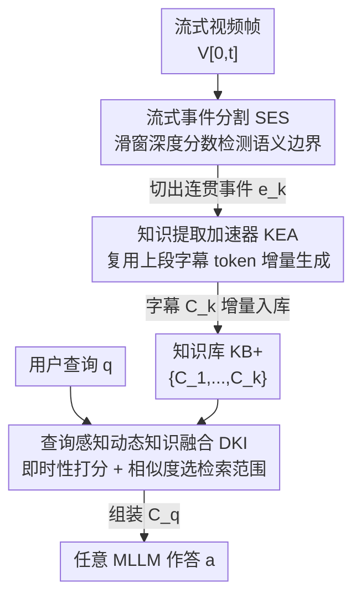

# StreamRAG: Enhancing Real-Time Video Understanding with Retrieval Augmentation

**会议**: CVPR 2026  
**论文**: [CVF Open Access](https://openaccess.thecvf.com/content/CVPR2026/html/Xie_StreamRAG_Enhancing_Real-Time_Video_Understanding_with_Retrieval_Augmentation_CVPR_2026_paper.html)  
**代码**: 无  
**领域**: 视频理解  
**关键词**: 流式视频问答, 检索增强生成, 事件分割, 低延迟字幕, 动态知识注入

## 一句话总结
StreamRAG 把 RAG 第一次系统性地搬到流式视频问答上，用「实时事件分割 + 复用历史字幕 token 的低延迟知识提取 + 按查询时效性动态选检索范围」三个即插即用模块，在不改动底座 MLLM 架构的前提下，于 OVO-Bench / StreamingBench 上把 Qwen2-VL、ViSpeak 等模型的准确率最高拉高约 11%~20%，同时把字幕生成延迟降近一半。

## 研究背景与动机
**领域现状**：长视频理解里，RAG 已经被验证很有用——把视频转成可检索的外部知识库（字幕、OCR、场景图等），按需取证据喂给 LLM，既能突破上下文窗口限制，又能用证据接地缓解幻觉。代表工作如 DrVideo（把长视频转文档后 agent 迭代定位关键帧）、Goldfish（按字幕语义匹配取 top-k 片段）、VideoRAG（加 OCR/场景图等多模态信号）、AdaRAG（按查询复杂度自适应选检索方案）。

**现有痛点**：这些方法几乎全部假设**完整视频提前可得**，是离线设定。一旦换到流式场景（自动驾驶、AI 眼镜第一人称视频、直播），三个前提全崩了：(1) 数据是无界、持续流入的；(2) 必须低延迟实时响应；(3) 查询有强时效性——答案可能依赖流里某个特定时刻。直接把离线 video-RAG 管线套上去会水土不服。最接近流式的 StreamChat 维护层次化记忆并渐进更新，但它**固定频率更新**（无视内容、按帧数切，破坏事件因果）、**重型字幕管线**（成为延迟瓶颈）、**纯相似度检索**（忽略查询时效性）。

**核心矛盾**：流式 RAG 卡在三个 trade-off 上——什么时候更新知识库（更新太频碎片化、太稀疏丢信息）、字幕够丰富 vs 够快（延迟）、检索取多近多远（即时查询要最新片段，回溯查询要长程历史，一刀切的相似度搞不定）。

**本文目标**：拆成三个具体子问题——(1) 如何在线、无标注地实时检测语义边界来决定「何时更新」；(2) 如何在保证描述质量的同时把字幕提取的延迟压下来；(3) 如何按查询的时效性动态调节检索范围和融合粒度。

**切入角度**：作者观察到流式视频天然有**语义连续性**——相邻事件的画面和描述高度重叠，前一段字幕的大部分 token 在新画面下仍然成立。于是不去压缩输入（传统做法），而是去**复用输出语义 token**，只在内容真正变化处重新生成。

**核心 idea**：用「事件级自适应分割 + 复用上一段字幕 token 的增量字幕 + 按查询即时性打分动态选检索范围」三件套，把离线 RAG 改造成流式 RAG，做成不改底座、即插即用的外挂。

## 方法详解

### 整体框架
StreamRAG 解决的是流式视频 QA：模型只能看到截至当前时刻 $t$ 的帧序列 $V_{[0,t]}=\{v_1,\dots,v_t\}$，严格因果（看不到未来帧），要实时回答查询 $q$。本文把生成改写为 $a=M(V_{[0,t]}, q, C_q)$，其中 $C_q$ 是为该查询检索出的相关知识。整条管线是「流入帧 → 切事件 → 给每个事件生成字幕入库 → 来查询时按时效性取知识融合作答」，三个模块串行协同：**流式事件分割（SES）** 实时检测语义跳变把流切成连贯事件；**知识提取加速器（KEA）** 给每个新事件低延迟生成字幕、增量更新知识库 $KB^+$；**查询感知动态知识融合（DKI）** 在查询到来时按即时性 + 相似度选检索范围、组装 $C_q$ 喂给任意 MLLM 出答案。整套外挂不改 MLLM 架构。

### 关键设计

**1. 流式事件分割（SES）：用滑窗深度分数无标注地实时找事件边界**

针对「何时更新」难题：固定频率切帧会把一个完整事件拦腰斩断、破坏因果链，也无法贴合内容节奏。SES 在固定窗口 $W_t=\{v_{t-w},\dots,v_t\}$ 上逐帧增量处理，先用 ViT 的 [CLS] token 算相邻帧语义相似度 $c^{ViT}_t$，再对窗口内第 $i$ 帧算「深度分数」$d_i=(c^{ViT}_{l_i}+c^{ViT}_{r_i}-2c^{ViT}_i)^2$，其中 $c^{ViT}_{l_i}$、$c^{ViT}_{r_i}$ 是 $i$ 左右两侧的峰值相似度。直觉是：边界处当前帧与左右两侧都不连贯，$d_i$ 会陡升。当 $d_i$ 超过统计阈值 $\mu+\tau\cdot\sigma$（$\mu,\sigma$ 是窗口内深度分数的均值和标准差，$\tau$ 控制分割粒度）就判定为显著边界 $t_b$，把 $\{v_{t_{prev}+1},\dots,v_{t_b}\}$ 切成一个语义连贯事件 $e_k$，窗口随后前移到 $W_t\leftarrow\{v_{t_b+1},\dots,v_{t_b+w}\}$。这样在线、无需 ground-truth 标注，且不打断视频内部因果，给后续字幕提取一个干净的事件粒度——消融里它带来约 2% 的准确率提升，在历史事件分析任务上尤为明显。

**2. 知识提取加速器（KEA）：复用上段字幕 token、只重写变化部分来压字幕延迟**

针对「字幕延迟瓶颈」：离线 RAG 靠外部 captioner 给每段视频写详细描述，重型管线在流式场景里直接拖垮响应。传统加速思路是减输入（关键帧筛选、token 压缩），本文反过来——**复用输出语义 token**。给定上一事件字幕 $C_{k-1}=(w_1,\dots,w_{L_c})$ 和新事件帧 $V_k$，先把字幕编码成 $E_c$、把帧 + 指令「Describe this video」经多模态编码器得 $E_v$，拼成 $X=[E_v; E_c]$ 做一次并行前向（类似 prefilling）得到概率矩阵 $P$。然后做「生成置信度分析」：对原字幕每个位置取模型对真值下一 token 的预测概率 $p_z=P[L_v+z-1, w_{z+1}]$、取对数 $\ell_z=\log p_z$，并用窗口 $\delta$ 的滑动均值检测置信度骤降，找出**分歧点** $o$：

$$o=\min\Big\{z\in[\delta+1, L_c-1]\ \big|\ (\mu_{[z-\delta:z-1]}-\ell_z) > \max(\alpha\cdot|\mu_{[z-\delta:z-1]}|, \beta)\Big\}$$

即第一处同时超过相对阈值 $\alpha$ 和绝对阈值 $\beta$ 的位置。$p_z$ 高说明原字幕第 $z+1$ 个 token 在新画面下仍成立、可保留；骤降说明从这里开始模型想说的和旧字幕分叉了，得重写。于是采取两阶段自适应生成：保留前缀 $C^{1:o}_{k-1}$、把 $X_{preserve}=[E_v; \text{TextProcessor}(C^{1:o}_{k-1})]$ 喂回模型，只自回归生成 $\le 128$ 个新 token $G=(g_{o+1},\dots,g_{o+m})$，拼成最终字幕 $C_k=(w_1,\dots,w_o,g_{o+1},\dots,g_{o+m})$ 增量入库 $KB^+\leftarrow KB^+\cup C_k$。本质是从「减输入」转向「保输出语义」，利用流式视频的连续性省掉对未变化内容的重复生成——18% 的复用率下延迟降 27% 且准确率反升。

**3. 查询感知动态知识融合（DKI）：按查询即时性打分动态选检索范围**

针对「检索粒度一刀切」：有的查询问当下（"他们在干什么？"，要最新片段），有的查询问历史（"开背包前登山者在做什么？"，要长程回溯），纯相似度检索区分不开。DKI 先用 LLM 做即时性分类，给查询打一个归一化紧迫度分 $S_t(q)\in[0,1]$（越接近 1 越时效）；再从知识库取 top-3 最相关历史字幕，用预训练文本编码器算平均相似度 $S_r(q)=\frac{1}{3}\sum_{j=1}^{3}\text{sim}(q, C^{(j)})$ 衡量历史是否够用。两者经门控融合成复合分数：

$$S_c(q)=\gamma\cdot S_t(q)+(1-\gamma)\cdot(1-S_r(q))$$

$S_c$ 同时反映「查询多紧迫」和「历史多不足」。再按阈值分三档检索：$S_c>\theta_1$（高时效 + 历史不足）只用最新事件字幕；$\theta_2<S_c\le\theta_1$ 取 $k_1$ 条历史字幕；$S_c\le\theta_2$ 取 $k_2>k_1$ 条引入更广历史上下文。$k$ 随 $S_c$ 反向调节——越不紧迫、历史越有用就取越多。选出的字幕组装成 $C_q$ 作为增广上下文。这样既不像 +LatestKB 丢历史，也不像 +FullKB 引噪声增延迟，按查询自适应取得平衡。

### 一个完整示例
以厨房视频 + 查询「他们在干什么？」为例走一遍：SES 监测到「切茄子」→「洗碗」之间画面语义跳变（深度分数 $d_i$ 超过 $\mu+\tau\sigma$），切出事件 $e_k$；KEA 拿上段字幕「This person is in the kitchen... cutting the eggplant chopping it into little pieces」，逐 token 验证发现前面「in the kitchen... cutting the eggplant」置信度仍高（保留），到「chopping...」后续置信度骤降命中分歧点 $o$，只重写成「...continue chopping it / putting eggplant into a bowl」拼成新字幕入库；查询到来时，DKI 判定「他们在干什么」是即时查询（$S_t$ 高），历史相似度 $S_r$ 偏低 → $S_c>\theta_1$ → 只取最新事件字幕组装 $C_q$，喂给 MLLM 输出准确答案，避免被远处历史片段干扰。

### 损失函数 / 训练策略
StreamRAG 是**训练自由、即插即用**的外挂，不引入新训练目标，直接套在现成 MLLM 上。关键超参：SES 窗口 $w=8$、分割阈值 $\tau=0.7$；DKI 平衡因子 $\gamma=0.5$、三档检索深度 $k=1/3/5$；KEA 回看窗口 $\delta=20$、相对阈值 $\alpha=0.85$、绝对阈值 $\beta=1$。

## 实验关键数据

### 主实验
在两个流式视频 QA benchmark 上评测：OVO-Bench（644 视频、0.5–30 分钟、7 域）和 StreamingBench（900 视频、4500 题、8 类）。框架作为外挂套在 Qwen2-VL 和 SOTA 流式模型 ViSpeak 上，对比 VideoRAG（非流式）与 StreamChatRAG（流式）两种 RAG 变体。

| Benchmark | 底座/设置 | 关键指标 | 基线 | +StreamRAG | 提升 |
|--------|------|------|------|----------|------|
| OVO-Bench | Qwen2-VL-7B（实时感知 R-Avg） | 准确率 | 60.65 | 69.96 | +约9 |
| OVO-Bench | ViSpeak（实时感知 R-Avg） | 准确率 | 66.28 | 69.68 | +3.4 |
| OVO-Bench | ViSpeak + VideoRAG（对比 RAG） | R-Avg | 66.28 | 57.21 | −9（反降）|
| StreamingBench | Qwen2-VL-7B（实时理解 Avg） | 准确率 | 71.15 | 77.33 | +6.2 |
| StreamingBench | ViSpeak（实时理解 Avg） | 准确率 | 74.36 | 78.12 | +3.8 |

整体上 Qwen2-VL 套 StreamRAG 后约 20% 的相对提升（论文表述），基本补齐与 ViSpeak 的差距；连专用流式模型 ViSpeak 也再涨约 5%。值得注意的是直接套 VideoRAG 反而拖累 ViSpeak——因为流式视频里音频信号无效、不加区分地融合知识引入噪声；StreamChatRAG 虽支持动态更新但均匀采样破坏了事件时序因果。

### 消融实验
| 配置 | R-Avg | B-Avg | 说明 |
|------|---------|---------|------|
| 仅 KEA（建库） | 55.98 | 46.46 | 只有检索增强知识库 |
| + SES | 65.33 | 49.75 | 加事件分割，R-Avg +9.4 |
| + SES + DKI | 68.54 | 51.28 | 再加动态融合 |
| Full（KEA+SES+DKI） | 69.96 | 53.08 | 完整模型 |

补充消融——KEA token 复用率（表3）：0% 复用延迟 15.24s；约 18% 复用延迟降到 11.12s（加速 27%）且 R-Avg/B-Avg 反升到 69.96/53.08；约 33% 复用延迟进一步降到 8.43s（加速 45%）但准确率回落到 69.23/50.47。更新策略（表4）：固定间隔 32 帧 R-Avg 68.98、SES 在约同等帧数下 69.96 且 B-Avg 从 50.04→53.08。融合策略（表5）：+LatestKB（69.59/51.25）、+FullKB（68.54/51.28）、+Ours（69.96/53.08）。

### 关键发现
- 三个模块贡献递进，**SES 贡献最大**（单独加上 R-Avg +9.4），因为它保住了完整事件因果链，给字幕和检索一个干净粒度。
- KEA 存在「复用率 vs 效果」的明确 trade-off：约 18% 是甜点——既加速又提精度；33% 时延迟最低但开始引入噪声/冗余、准确率下滑，说明过度复用会牺牲鲁棒性。
- DKI 在**回答时效性查询**时优势最明显——能滤掉无关历史、只留时序相关知识，这正是实时场景里效率与时序精度都吃紧的地方。
- 横向对比的 caveat：不同 benchmark 的属性维度（OCR/ACR/.../MCU 等）难度不一，且各底座基线起点不同，提升幅度不可直接跨行比大小。

## 亮点与洞察
- **「保输出语义」而非「减输入」的反直觉加速**：主流流式加速都在压缩输入 token，本文反过来复用上一段字幕的输出 token、只在置信度骤降的分歧点重写——抓住了流式视频「相邻事件高度重叠」的本质，这个视角可迁移到任何时序连续的增量生成任务（如流式 OCR、连续语音转写）。
- **用 next-token 预测置信度当「变化检测器」**：把「旧字幕哪里还成立」转化为「模型对旧 token 的预测概率是否骤降」，用相对+绝对双阈值找分歧点，是个轻量又优雅的免标注信号，可复用到任意「增量复用历史文本」的场景。
- **检索范围按查询时效性自适应**：$S_c=\gamma S_t+(1-\gamma)(1-S_r)$ 把「查询多紧迫」和「历史多不足」两个正交信号融成一个门控分数来分档检索，比纯相似度更贴合流式查询的多时间尺度需求。
- **完全即插即用、零训练**：套在 Qwen2-VL / ViSpeak 上都能涨点，作为工程化外挂落地成本低。

## 局限与展望
- 阈值/超参偏多（$\tau,\gamma,\theta_1,\theta_2,\delta,\alpha,\beta,k$ 三档），论文给的是单一固定配置，跨域、跨视频长度的鲁棒性与调参敏感性未充分展开。
- DKI 的即时性打分依赖一次额外 LLM 调用，在极端低延迟场景下这部分开销和它带来的检索增益之间的净收益没有单独计量。
- 评测局限在 OVO-Bench / StreamingBench 两个 benchmark、底座主要是 Qwen2-VL/ViSpeak，是否能泛化到更大底座、更长（小时级）真实直播流缺验证。
- KEA 的字幕复用在场景剧烈快变（而非「自然连续演化」）时可能保留过时内容，论文也承认过度复用会引噪声，但缺少对「快变 vs 慢变」视频的分场景分析。
- 论文有少量笔误/表述瑕疵（如分歧点公式里 $o$ 与正文 $k$ 混用），⚠️ 公式与符号以原文为准。

## 相关工作与启发
- **vs StreamChat / StreamChatRAG**：都做流式动态更新知识库，但 StreamChat 固定频率/均匀采样更新（破坏事件因果）、重型字幕管线（延迟瓶颈）、纯相似度检索（忽略时效）；StreamRAG 用 SES 按语义边界更新、KEA 复用 token 压延迟、DKI 按时效性选范围，三处都针对它的短板。
- **vs VideoRAG**：VideoRAG 靠 OCR/场景图等多模态信号提升离线检索精度但计算更重，且为离线静态库设计；直接搬到流式反而拖累 ViSpeak（音频无效 + 无差别融合引噪）。StreamRAG 专为流式、增量构库。
- **vs Goldfish / DrVideo（离线 video-RAG）**：它们在完整视频上取 top-k 片段或 agent 迭代定位关键帧，纯文本表示、假设全片可得；StreamRAG 在严格因果的流式设定下增量构建与检索，互补而非竞争。
- **vs Dispider / ViSpeak（流式 Video-LLM）**：它们改模型本身（解耦感知与响应、定义视觉指令反馈任务）；StreamRAG 走互补路线——不改模型，外挂动态知识库，因此能即插即用地增强这些模型。

## 评分
- 新颖性: ⭐⭐⭐⭐ 首个明确面向流式视频 QA 的 RAG 框架，「复用输出 token 加速字幕」和「按时效性分档检索」都是有想法的切入点。
- 实验充分度: ⭐⭐⭐⭐ 两 benchmark、多底座、5 张表覆盖主结果+三模块消融+复用率 trade-off，较完整；但底座和视频时长跨度有限。
- 写作质量: ⭐⭐⭐ 思路清晰、公式齐全，但符号偶有不一致、个别表述粗糙（缓存里也有 OCR 乱码）。
- 价值: ⭐⭐⭐⭐ 即插即用、零训练就能给现成 MLLM 涨点并降延迟，对自动驾驶/AI 眼镜等实时场景实用价值高。

<!-- RELATED:START -->

## 相关论文

- [\[CVPR 2025\] VISTA: Enhancing Long-Duration and High-Resolution Video Understanding by Video SpatioTemporal Augmentation](../../CVPR2025/video_understanding/vista_enhancing_long-duration_and_high-resolution_video_understanding_by_video_s.md)
- [\[CVPR 2026\] Compositional Transformation Reasoning for Composed Video Retrieval](compositional_transformation_reasoning_for_composed_video_retrieval.md)
- [\[CVPR 2026\] Beyond Caption-Based Queries in Video Moment Retrieval](beyond_caption-based_queries_in_video_moment_retrieval.md)
- [\[CVPR 2026\] SAIL: Similarity-Aware Guidance and Inter-Caption Augmentation-based Learning for Weakly-Supervised Dense Video Captioning](sail_similarity-aware_guidance_and_inter-caption_augmentation-based_learning_for.md)
- [\[ICML 2026\] ProAct-VL: A Proactive VideoLLM for Real-Time AI Companions](../../ICML2026/video_understanding/proact-vl_a_proactive_videollm_for_real-time_ai_companions.md)

<!-- RELATED:END -->
