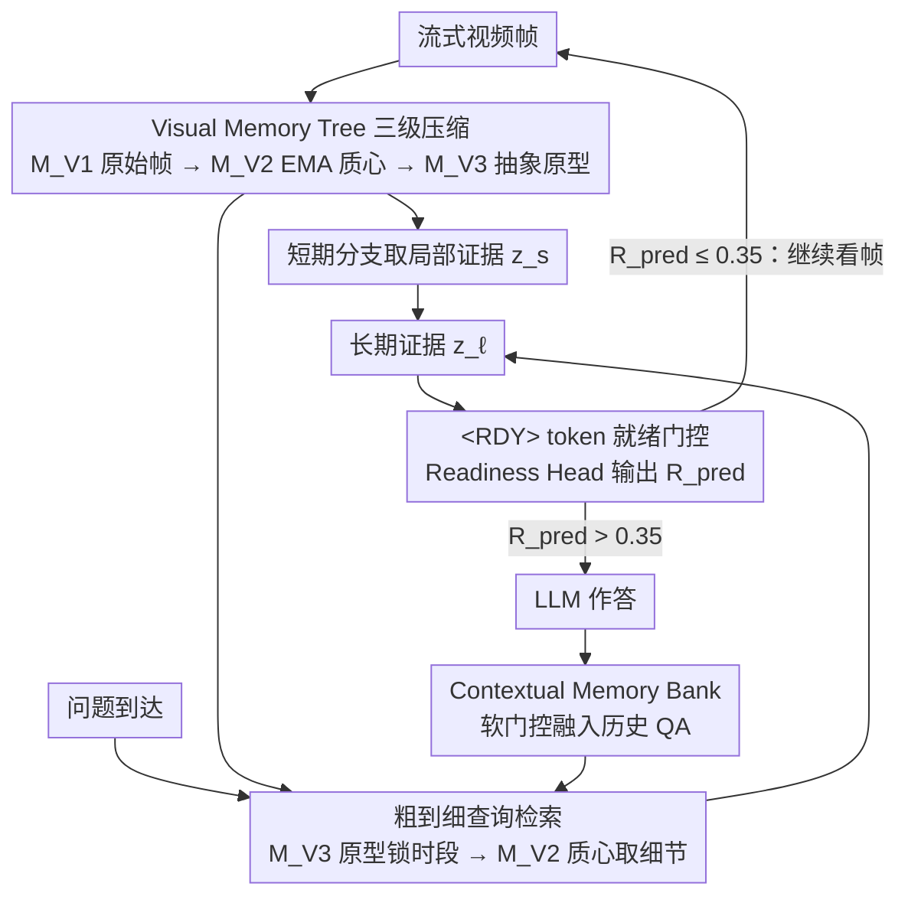

# StreamReady: Learning What to Answer and When in Long Streaming Videos

**会议**: CVPR 2026  
**arXiv**: [2603.08620](https://arxiv.org/abs/2603.08620)  
**代码**: [项目页面](https://sacrcv.github.io/StreamReady-website/)  
**领域**: 视频理解  
**关键词**: 流式视频理解, 回答就绪性, 时序推理, 多模态大语言模型, 主动式问答

## 一句话总结

提出就绪性感知的流式视频理解范式，通过可学习的 `<RDY>` token 和 Answer Readiness Score (ARS) 指标，让模型不仅回答正确，还能在证据出现的恰当时刻作答，在 9 个流式/离线视频基准上取得 SOTA。

## 研究背景与动机

**长视频流式理解的迫切需求**：现实场景（监控、体育分析、机器人、辅助系统）要求模型在视频帧顺序到达时实时推理，而非离线处理完整视频。

**现有方法只关注"答什么"忽视"何时答"**：大多数流式视频模型仅评估回答的正确性，完全忽略回答时机——过早回答意味着臆测，过晚回答降低实时性。

**主动式推理场景的挑战**：在 proactive 设定中，问题先于证据出现，模型需要持续观察视频流并判断何时积累了足够的视觉证据才能作答。

**缺乏时序标注的评估基准**：现有流式基准缺少答案证据时间窗口标注，无法系统评估模型的回答时机是否得当。

**现有延迟回答方案的局限**：辅助 MLLM 延迟（StreamBridge）或基于提示词的延迟策略存在非确定性或额外计算开销，且缺乏与推理模块的深度耦合。

**精细时序评估指标的空白**：需要一种能同时衡量正确性和时机的指标，对过早回答（臆测）施加严厉惩罚、对轻微延迟给予宽容。

## 方法详解

### 整体框架

StreamReady 想让流式视频模型不只"答得对"，还要"在证据齐了的那一刻才答"。它以 Qwen-2-VL (7B) 为骨干、用 HierarQ 的预训练权重初始化双分支 Q-Former，整条链路是"分层记忆 → 查询感知推理 → 就绪性门控"三段：流式帧先进 Visual Memory Tree（原始帧缓冲 $\mathcal{M}_{V1}$、EMA 质心 $\mathcal{M}_{V2}$、抽象原型 $\mathcal{M}_{V3}$ 三层由细到粗）和记录历史 QA 的 Contextual Memory Bank $\mathcal{M}_C$；问题到达后短期分支 $Q_s$ 在 $\mathcal{M}_{V1}$ 取局部证据 $z_s$、长期分支 $Q_\ell$ 在 $\mathcal{M}_{V2}/\mathcal{M}_{V3}$ 上粗到细检索并跨尺度融合得 $z_\ell$、再把历史 QA 语义融进来；最后把 `<RDY>` token 挂在 $z_\ell$ 上，由 2 层 MLP 的 Readiness Head 输出就绪分数 $R_{pred}\in[0,1]$，超过阈值 0.35 才触发 LLM 作答、否则继续看后续帧，答完把融合表示当作 $a_i$ 存回 $\mathcal{M}_C$。

### 关键设计

**1. Visual Memory Tree 三级压缩：用由细到粗的三层记忆装下任意长的视频**

流式视频帧无界增长，全存会 OOM，所以要一套能恒定占用的记忆。$\mathcal{M}_{V1}$ 是 FIFO 原始帧缓冲、保最近细节；当它满了，淘汰出来的帧经公式 (1) 的 EMA 聚类更新 $\mathcal{M}_{V2}$ 质心，阈值 $\tau_t$ 按场景稳定性自适应（稳定就收紧促合并、新颖就放松允许开新质心）；$\mathcal{M}_{V2}$ 容量饱和或分布漂移时再抽象成 $\mathcal{M}_{V3}$ 粗粒度原型，并周期性触发 mini-K-means 重对齐保持一致。三层都是固定大小，于是视频再长、延迟和显存也恒定。

**2. 粗到细查询检索：先用原型锁时段，再用质心取细节**

问题到达后要在海量记忆里快而准地定位证据。它先在 $\mathcal{M}_{V3}$ 原型上 Top-K 定位相关时段（softmax 归一化让路由稳定），再从对应的 $\mathcal{M}_{V2}$ 质心里 Top-m 提取细粒度证据（这一步不归一化，以保持锐利排序）。这就像人的情景回忆——原型给出粗时序锚点，质心补上细节。

**3. Contextual Memory Bank：把历史 QA 语义接进当前推理**

多轮问答需要语义连续。它存历史 QA 对的问题嵌入 $q_i$ 和答案表示 $a_i$，用软门控把当前问题和历史问题匹配，取最相关的条目经轻量交叉注意力融进长期视觉特征 $z_\ell$，让模型记得之前问过、答过什么。

**4. `<RDY>` token 与推理模块共演化：让"何时答"长在"答什么"的表示里**

时机判断如果挂在弱表示上就抓不准状态迁移。StreamReady 把 `<RDY>` 直接嵌进长期推理分支 $Q_\ell$ 的学习表示中，让它和查询对齐的证据一起演化，从而自然感知从"弱对齐、低置信"到"强对齐、可回答"的过渡。消融证明这个放置位置（ARS 0.68）远优于放在短期分支（0.31）或长期分支输入端（0.54）。

**5. 弱监督就绪性训练：没有时间戳标注、也不干扰推理地学会判断时机**

现有流式基准没有证据时间窗口标注，没法直接监督"何时答"；而且"答什么"和"何时答"若共享梯度还会相互干扰。StreamReady 用两招一起解决：其一是构造弱伪监督——训练时（可访问完整视频）利用 $z_\ell$ 与 $\mathcal{M}_{V2}$ 质心的时序相似度，把高相似度时段标为伪正区域 $P$、低相似度标为伪负区域 $N$，用成对对比损失 $\mathcal{L}_{ctr}$ 让证据充分处的就绪分数更高，从而绕开真实时间戳（选 $\mathcal{M}_{V2}$ 是因为它在细节与紧凑性之间最平衡，且伪标签事后在 ProReady-QA 上验证与真实证据窗口的时序 IoU 达 0.87）。其二是梯度隔离——$\mathcal{L}_{rdy}$ 只更新 Readiness Head 和 `<RDY>` token，梯度被截断、不回传推理模块，让推理走标准视频-文本损失专心学"答什么"、就绪机制用时序损失独立学"何时答"，两个目标互不打架。

### 损失函数

- **对比就绪损失**：$\mathcal{L}_{ctr} = -\log \sigma(R_{pred}(t^+) - R_{pred}(t^-))$，其中 $t^+ \in P$（伪正区域），$t^- \in N$（伪负区域）。
- **时序平滑正则**：$\mathcal{L}_{rdy} = \mathcal{L}_{ctr} + \lambda_{reg} \|\nabla_t R_{pred}(t)\|_1$，L1 正则化抑制就绪信号的噪声抖动。
- **ARS 评估指标**：$\text{ARS} = \frac{1}{N}\sum_{i}(\text{EP}_i \cdot \text{LP}_i)$，Early Penalty 用 sigmoid 锐利惩罚过早回答（$\gamma_e=6$），Late Penalty 温和衰减延迟回答（$\gamma_\ell=1$）。有效精度 $\text{Acc}_e = \text{Acc} \times \text{ARS}$。

## 实验

### 主要结果

**ProReady-QA 就绪性感知评估**（Table 2）：

| 方法 | Size | Avg Acc. | Avg ARS | Acc_e |
|------|------|----------|---------|-------|
| Qwen-2-VL (baseline) | 7B | 41.4 | 0.34 | 0.20 |
| HierarQ | 7B | 46.0 | 0.40 | 0.27 |
| StreamBridge | 7B | 53.1 | 0.60 | 0.42 |
| InfiniPot-V | 7B | 52.0 | 0.47 | 0.36 |
| **StreamReady** | **7B** | **56.4** | **0.69** | **0.53** |

StreamReady 比最佳竞争者 StreamBridge 高出 ~3% 准确率和 ~9% ARS，有效精度提升 11 个百分点。
最大 ARS 增益出现在 REC (+0.25)、GSD (+0.11)、CTD (+0.10) 任务上，说明就绪机制在需要等待证据的任务上尤其有效。

**流式基准泛化**（Table 3）：

- StreamingBench 平均 63.4（vs ViSpeak 58.6），proactive 子集 48.2（vs ViSpeak 43.9）
- OVOBench 平均 68.2（vs StreamBridge 62.6），proactive 子集 63.7（vs ViSpeak 61.6）
- VStream-QA RE/RM 分别为 64.8/57.2，均为最优

**离线长视频基准**（Table 4）：

- VideoMME 65.8、MLVU 71.3、MVBench 71.8、EgoSchema 70.4
- 全面超越 StreamBridge（64.4/69.6/64.4/66.9）和 Flash-VStream（61.2/66.3/65.4/68.2）
- 离线评估时禁用就绪机制和上下文推理，仅靠记忆层级和查询推理即可取得优势

### 消融实验

| 配置 | REC Acc/ARS | GSD Acc/ARS | CTD Acc/ARS |
|------|-------------|-------------|-------------|
| Baseline (Qwen-2-VL) | 20.7/0.31 | 35.1/0.52 | 30.3/0.28 |
| + Memory + QA Reasoning | 39.4/0.48 | 60.9/0.53 | 43.6/0.39 |
| + Readiness Mechanism | **39.6/0.68** | **61.2/0.68** | **43.5/0.59** |

- 记忆+推理模块主要提升准确率（+19 on REC），就绪机制在此基础上大幅提升 ARS（+0.20 on REC/CTD）。
- `<RDY>` + MLP Head 与 Transformer Head 性能相当，但计算更轻。
- `<RDY>` 放置在长期推理的学习表示上效果最佳（ARS 0.68），放在短期分支仅 0.31。

### 关键发现

- 仅靠基础推理模块（如 HierarQ 的 Q-Former）提升准确率但对时机帮助甚微；就绪机制必须与强推理模块配合才能同时提升 Acc 和 ARS。
- 辅助 MLLM 判断就绪性（如 StreamBridge 策略）ARS 仅 0.60，不如与推理模块深度耦合的 `<RDY>` token（0.68）。
- StreamReady 在视频长度增长时保持恒定延迟和内存，得益于固定大小的质心/原型记忆，而 Qwen-2-VL 在长视频上 OOM。

## 亮点

- **首次形式化"就绪性感知"流式视频理解**：将回答时机纳入评估，提出非对称惩罚的 ARS 指标，填补了该领域的评估空白。
- **轻量优雅的就绪机制**：单个 `<RDY>` token + MLP Head，无需辅助模型或启发式规则，零额外推理开销。
- **弱监督时序学习**：无需真实证据时间戳标注，利用推理表示与记忆的相似度自动构建伪监督信号。
- **完整的 benchmark 贡献**：ProReady-QA 提供 5 类主动式任务、5K QA 对、30-60 分钟长视频、标注的证据时间窗口，支持局部和全局多轮依赖。
- **广泛的泛化能力**：在 9 个基准（流式 + 离线）上全面 SOTA，证明设计的通用性。

## 局限性

- ProReady-QA 仅包含 32 个视频（10 个 Ego-4D + 22 个 MovieNet），规模有限，视频类型多样性不足，可能无法覆盖所有现实流式场景。
- 就绪性学习依赖伪监督（z_ℓ 与 ℳ_V2 的相似度），在证据分布极度分散或模糊的场景下伪正/负区域可能不准确，导致就绪性判断失误。
- 就绪阈值 0.35 为固定超参数，不同任务和视频类型可能需要调优；论文未探索自适应阈值或基于置信度的动态策略。
- 三级记忆树的 K-means/EMA 更新引入多个超参（α、τ_t、J、U、K、m），调参负担较重，且 EMA 衰减因子的选择对记忆质量有较大影响。
- 仅在 7B 量级模型上验证，未探索更大（如 70B）或更小（如 2B）模型的表现，可扩展性有待验证。
- ARS 指标的非对称惩罚参数 γ_e=6、γ_ℓ=1 虽经实验验证稳健，但在不同应用场景（如安全监控 vs 运动分析）中最优惩罚权重可能不同。

## 相关工作

- **离线长视频理解**：HierarQ、LLaVA-Video、LongVU 等使用记忆或查询条件存储，但需完整视频和记忆重建，不适用流式场景。StreamReady 借鉴查询感知条件化思路但适配流式处理，无需记忆重置。
- **流式视频理解**：StreamBridge 通过辅助 MLLM 延迟回答实现主动行为，Flash-VStream/StreamForest/InfiniPot-V 关注在线记忆管理和检索效率，ViSpeak 探索语音交互场景，但均缺乏显式时机控制。StreamReady 的就绪机制可作为这些方法的互补扩展。
- **流式基准**：ODVBench、StreamBench、OVBench 仅支持过去依赖型问答；StreamingBench、OVOBench、Omni-MMI 引入主动式场景但限于短视频和局部上下文；ProReady-QA 首次在长视频上提供证据时间窗口标注、全局多轮依赖和五类主动推理任务。
- **回答时机控制**：现有方案包括基于提示词的延迟（"Answer whenever you are ready"）、辅助 MLLM 判断就绪性；StreamReady 提出将就绪性判断内嵌到推理模块中的新范式，避免外部依赖和非确定性。

## 评分

- 新颖性: ⭐⭐⭐⭐⭐ — 首次形式化回答时机问题并提出完整的指标+方法+基准
- 实验充分度: ⭐⭐⭐⭐⭐ — 9 个基准全面评估，消融详尽覆盖每个组件和设计选择
- 写作质量: ⭐⭐⭐⭐ — 结构清晰，公式规范，图表丰富
- 价值: ⭐⭐⭐⭐⭐ — 定义新问题+新指标+新方法+新基准，对流式视频理解领域有重要推动

<!-- RELATED:START -->

## 相关论文

- [\[CVPR 2026\] Color When It Counts: Grayscale-Guided Online Triggering for Always-On Streaming Video Sensing](color_when_it_counts_grayscale-guided_online_triggering_for_always-on_streaming_.md)
- [\[CVPR 2026\] Learning Transferable Temporal Primitives for Video Reasoning via Synthetic Videos](learning_transferable_temporal_primitives_for_video_reasoning_via_synthetic_vide.md)
- [\[CVPR 2026\] Time Blindness: Why Video-Language Models Can't See What Humans Can?](time_blindness_why_video-language_models_cant_see_what_humans_can.md)
- [\[CVPR 2026\] An Empirical Study on How Video-LLMs Answer Video Questions](an_empirical_study_on_how_video-llms_answer_video_questions.md)
- [\[CVPR 2026\] MuKV: Multi-Grained KV Cache Compression for Long Streaming Video Question-Answering](mukv_multi-grained_kv_cache_compression_for_long_streaming_video_question-answer.md)

<!-- RELATED:END -->
