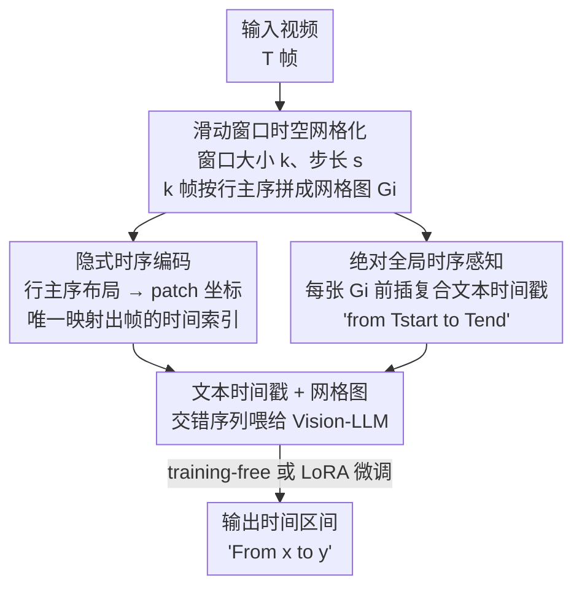

# T2SGrid: Temporal-to-Spatial Gridification for Video Temporal Grounding

**会议**: CVPR 2026  
**论文**: [CVF Open Access](https://openaccess.thecvf.com/content/CVPR2026/html/Guo_T2SGrid_Temporal-to-Spatial_Gridification_for_Video_Temporal_Grounding_CVPR_2026_paper.html)  
**代码**: 无  
**领域**: 视频理解  
**关键词**: 视频时序定位, 网格化, 多模态LLM, 时序建模, 滑动窗口

## 一句话总结
T2SGrid 把视频时序定位（VTG）从"逐帧处理"改造成"逐片网格图处理"——用滑动窗口把若干连续帧按行主序拼成一张 2D 网格图喂给 Vision-LLM，让模型用它擅长的空间推理能力去读时序，再配一个"整段网格共用一个文本时间戳"补全绝对时间感知，在 Charades-STA / ActivityNet 上让没有时序编码的 Qwen2-VL-7B 的 mIoU 从 7.9 飙到 44.3。

## 研究背景与动机
**领域现状**：视频时序定位（Video Temporal Grounding, VTG）要根据自然语言 query 定位出对应的视频片段，输出形如"从 X 秒到 Y 秒"。现在主流做法是把 Vision-LLM（如 Qwen2.5-VL）搬过来用，给它补一套时序感知机制。

**现有痛点**：补时序感知的三条路线各有硬伤。① **位置编码（+PE）**：能建模相对顺序，但抓不住"绝对时间位置"，而 grounding 恰恰要的就是绝对时间戳，还得额外加编码模块；② **文本时间戳（+TextNum）**：给每一帧前面塞一个 "Frame 1" / "1 second" 文本 token，视频一长，文本 token 数量爆炸式增长，视觉注意力被稀释得越来越分散；③ **视觉编号（+VisualNum）**：直接把帧号画在图像上，破坏了图像本身的空间细节，而空间细节正是 Vision-LLM 做语义理解的命根子。

**核心矛盾**：Vision-LLM 是在静态图像上训出来的，**空间推理能力极强但时序推理是短板**。把视频拍成"一长串帧序列"线性喂进去，作者通过可视化交叉注意力发现：模型只会逐帧识别"画面里有什么物体"（靠静态物体显著性），却抓不住"物体在帧间怎么动"，时序注意力峰值严重偏离 Ground Truth。也就是说，序列化处理逼着模型做逐帧物体匹配，丢掉了帧间的运动线索。

**本文目标**：在不新增专用时序模块、不大规模标注新数据集的前提下，让 Vision-LLM 真正读懂时序。

**切入角度**：既然模型空间推理强、时序推理弱，那干脆**把时序问题翻译成空间问题**——把时间维度"折叠"进空间维度。作者观察到（Figure 2）现代 Vision-LLM 本来就能读懂网格拼图：给它一张 3×3 的帧拼图，它能从左上到右下推断出 "before / after" 的相对顺序，甚至能指出第 6 格里的咬人动作。这说明网格布局天然就编码了时序。

**核心 idea**：用滑动窗口把连续若干帧按行主序拼成一张 2D 网格图（gridification），让标准 ViT 直接当一张图来处理，用空间注意力捕捉局部时序动态；再用"每张网格图配一个复合文本时间戳"补回绝对全局时间感知。

## 方法详解

### 整体框架
T2SGrid 的核心是把"视频 = 帧序列"重新表述为"视频 = 网格图序列"。整条流程分两步：先用**滑动窗口时空网格化**把视频切成若干窗口、每个窗口内的 $k$ 帧拼成一张网格图 $G_i$；再做 **T2SGrid 时序建模**——一方面靠网格的行主序布局隐式编码窗口内的相对时序，另一方面在每张网格图前面插一个文本时间戳（如 "from Frame 0 to 11"）建立绝对全局时序，最后把"文本时间戳 + 网格图"交错成一个序列喂给 Vision-LLM。整个框架既可以**训练无关（training-free）**直接套在现成模型上，也可以再用 LoRA 微调进一步增强。

### 关键设计

**1. 滑动窗口时空网格化：把时间折进空间，又不牺牲分辨率**

这一步针对的痛点是：逐帧线性处理让模型只见物体不见运动。做法是给视频定义窗口大小 $k$ 和步长 $s$，第 $i$ 个窗口取连续 $k$ 帧 $W_i = \{f_{i \times s}, f_{i \times s+1}, \dots, f_{i \times s+k-1}\}$，再把这 $k$ 帧按行主序（左到右、上到下）拼成一张复合网格图 $G_i$，布局灵活只要 $M \times N = k$（如 9 帧拼成 3×3）。关键之处在于**网格化只是把原分辨率帧拼起来，不做任何下采样**，空间细节一点不丢。作者点明：均匀采样逐帧处理本质上就是 $s=1, k=1$ 的退化情形，而把 $k>1$ 后，处理中心帧 $f_t$ 时模型同时看到邻域 $f_{t-4}, \dots, f_{t+4}$，拿到了完整的动态上下文。步长 $s$ 用来调重叠：短视频设 $s<k$ 引入重叠，避免把一个关键动作劈到两张网格里、保住时序连续性；长视频设 $s=k$ 无重叠，避免冗余计算。这套设计天然适配长视频和各种帧率。

**2. 网格布局的隐式时序编码：行主序 = 一种确定性的位置编码**

这一步要解决的是"网格图本身是空间的，时序信息藏在哪"。作者用一条坐标映射把它讲透了：设每行 $N_c$ 帧，某帧在网格里的行列坐标是 $(r_f, c_f)$，它的时间索引唯一确定为 $t_f = r_f \times N_c + c_f$。而自注意力实际操作的是 patch 级坐标 $(r_p, c_p)$ 及其 2D 位置嵌入 $E(r_p, c_p)$，帧坐标可由 patch 坐标还原：$r_f = \lfloor r_p / h_{patch} \rfloor$，$c_f = \lfloor c_p / w_{patch} \rfloor$。代入得 $t_f = \lfloor r_p / h_{patch} \rfloor \times N_c + \lfloor c_p / w_{patch} \rfloor$，说明**时间索引是 patch 坐标的良定义函数**——也就是说，模型现成的 2D 位置嵌入里已经蕴含了推断帧时序所需的全部信息，无需显式时间戳或帧号就能做隐式时序推理。这正是"为什么 Vision-LLM 能直接读懂网格时序"的数学解释，也是本文区别于 IG-VLM、DynImg 等只用网格做粗粒度 VQA 的关键：他们没意识到网格空间布局里本就编码了细粒度时序。

**3. 复合文本时间戳：补回滑动窗口丢掉的绝对时间**

滑动窗口 + 网格只编码了窗口内的**相对**时序（动作连续性），却丢了每个片段在全局时间轴上的**绝对**位置。可 VTG 要输出 "Xs to Ys" 这种精确时间戳，绝对时间不能少。作者的解法是：在把每张网格图 $G_i$ 喂给模型前，给 prompt 前面拼一个文本时间戳——$\text{Prompt}_i = (\text{"from } T_{start} \text{ to } T_{end}\text{."}; \ \text{Image: } G_i)$，$T_{start}, T_{end}$ 是第 $i$ 张网格对应的起止时间。与 TextNum 给**每一帧**都塞时间戳不同，这里是**一整张网格图（多帧）只共用一个复合时间戳**，文本 token 数量大幅下降、不稀释视觉注意力。多张网格按"文本-图像"交错组织，这些绝对时间戳串成一条贯穿全片的连续时间链，让模型既能推理网格内的动态、又能定位它在整段时间轴上的位置。

## 实验关键数据

### 主实验
在 Charades-STA / ActivityNet 上评测，指标为 mIoU 和 R@1（IoU 阈值 0.3/0.5/0.7）。T2SGrid 既能 training-free 插到各种 Vision-LLM 上，也能微调（T2SGrid-FT）。下表是 Charades-STA 上的代表性结果（"+T2SGrid" 为 training-free 直插）：

| 模型 | R@0.3 | R@0.5 | R@0.7 | mIoU |
|------|-------|-------|-------|------|
| Qwen2-VL-7B（无时序编码）| 8.7 | 5.4 | 2.4 | 7.9 |
| + T2SGrid | 70.1 (+61.4) | 46.7 (+41.3) | 20.1 (+17.7) | 44.3 (+36.4) |
| + T2SGrid-FT | 76.9 | 60.6 | 35.9 | 53.2 |
| LLaVA-OneVision-1.5-8B（纯静态图训练）| 19.8 | 6.7 | 2.3 | 14.5 |
| + T2SGrid | 45.0 (+25.2) | 26.3 (+19.6) | 11.9 (+9.6) | 28.8 (+14.3) |
| GPT-4o | 55.0 | 32.0 | 11.5 | 35.4 |
| + T2SGrid | 57.3 (+2.3) | 36.7 (+4.7) | 14.8 (+3.3) | 36.9 (+1.5) |
| Qwen3-VL-8B（已用文本时间戳）| 69.3 | 43.4 | 17.5 | 43.1 |
| + T2SGrid | 71.4 (+2.1) | 47.0 (+3.6) | 20.7 (+3.2) | 44.9 (+1.8) |

最亮眼的是 Qwen2-VL-7B：它本身没有时序编码，直插 T2SGrid 后 mIoU 从 7.9 暴涨到 44.3，直接超过一堆专门微调过的 VTG 视频 LLM；再 LoRA 微调到 53.2 拿下最佳。纯静态图训练的 LLaVA-OneVision 也有 +14.3 mIoU 的大幅提升，印证了"借空间推理能力做时序理解"的有效性。而对已经用文本时间戳建模的 Qwen3-VL-8B，提升较小（+1.8 mIoU），作者归因于本文的局部时序编码与它原有的时间戳方案有轻微冲突。

T2SGrid 在 VQA 任务上同样有泛化力（Table 3，Qwen2-VL-7B）：

| Benchmark | 子指标 | Qwen2-VL-7B | + T2SGrid |
|-----------|--------|-------------|-----------|
| Video-MME | 时序感知 | 60.0 | 74.5 (+14.5) |
| Video-MME | 时序推理 | 41.7 | 50.2 (+8.5) |
| MVBench | All | 51.7 | 58.3 (+6.6) |
| VideoInstruct | 时序理解 | 2.47 | 2.52 |

### 消融实验
组件消融（Charades-STA, Qwen2-VL-7B）逐个加回三大组件：

| ComTextNum | 滑动窗口 | 网格 | R@0.3 | R@0.5 | R@0.7 | mIoU |
|:---:|:---:|:---:|------|------|------|------|
| ✗ | ✗ | ✗ | 8.7 | 5.4 | 2.4 | 7.9 |
| ✓ | ✗ | ✗ | 53.5 | 23.2 | 7.9 | 32.9 |
| ✓ | ✓ | ✗ | 58.3 | 35.1 | 13.6 | 36.5 |
| ✓ | ✓ | ✓ | 70.1 | 46.7 | 20.1 | 44.3 |

时序建模策略对比（同一 Qwen2-VL-7B baseline，含 token 数和推理时间）：

| 策略 | R@0.3 | mIoU | mToken | mTime/s |
|------|-------|------|--------|---------|
| PE | 53.1 | 33.8 | 5760.4 | 1.69 |
| TextNum | 53.5 | 32.5 | 5791.2 | 1.45 |
| VisualNum | 60.7 | 38.5 | 5760.4 | 2.17 |
| Ours（无重叠）| 64.5 | 41.2 | 5766.1 | 1.43 |
| Ours（有重叠）| 70.2 | 44.3 | 7909.7 | 2.31 |

### 关键发现
- **网格化是贡献最大的组件**：只加文本时间戳（ComTextNum）mIoU 已从 7.9 跳到 32.9；再加滑动窗口到 36.5；最后把窗口转成 2D 网格直接拉到 44.3（+7.8），证明"局部隐式时序编码"才是核心增益来源。
- **无重叠版几乎零额外开销**：因为只是把原分辨率帧拼到一张图，无重叠设置下 mToken（5766）和逐帧输入（5791）基本持平，却比 VisualNum 推理快 34.1%；要更高精度就开重叠，仅多 6% 时间换 14% 性能。
- **网格尺寸有甜区**：随窗口增大性能上升（g11 s1 的 32.9 → g43 s12 的 41.2 mIoU），但过大（g44 s16）反而掉到 35.9——拼太多帧会让单帧太小、空间细节受损。g43 在两个数据集上都是最优配置。

## 亮点与洞察
- **"把时序问题改写成空间问题"是个很漂亮的视角转换**：不去补模型的时序短板，而是把任务搬到模型的空间强项上，等于绕开了"给 Vision-LLM 重训时序能力"这条昂贵的路。
- **用坐标映射公式把"网格隐式编码时序"讲成了数学事实**（$t_f = \lfloor r_p/h_{patch}\rfloor \times N_c + \lfloor c_p/w_{patch}\rfloor$），而不是停留在"模型好像能读懂网格"的直觉，这让方法的可信度大大提升。
- **"多帧共用一个复合时间戳"是对 TextNum 的精准改良**：抓住了 TextNum"每帧一戳导致 token 爆炸、注意力稀释"的真痛点，用分组时间戳一招化解，是可迁移到其他长视频任务的省 token trick。
- **几乎 plug-and-play**：training-free 就能给任意 Vision-LLM 大幅涨点，对没时序编码的模型尤其立竿见影，落地成本极低。

## 局限与展望
- **对已有强时序方案的模型增益有限**：Qwen3-VL-8B 这种本就用文本时间戳的模型只涨 +1.8 mIoU，作者承认本文局部编码与其原方案有冲突，如何兼容/融合两套时序信号是个开放问题。
- **网格尺寸需要调参且有上限**：g44 s16 就开始掉点，说明"一张图塞太多帧→单帧太小→空间细节受损"的 trade-off 客观存在，最优 grid 配置可能随数据集/视频时长变化，需要针对性 ablation。⚠️ 论文主要在 Charades-STA / ActivityNet 这两个相对短的 VTG 数据集上验证，超长视频下窗口数量膨胀后的可扩展性还需更多证据。
- **重叠模式的开销**：开重叠虽涨点，但 mToken 从 ~5766 涨到 7909、推理时间也上升，长视频上这部分成本会被放大。
- 可改进方向：让网格布局自适应（按动作密度动态决定 $k$ 和 $s$），或把隐式网格时序与显式时间戳做更优融合而非简单冲突。

## 相关工作与启发
- **vs 逐帧 + 位置编码 / 文本时间戳 / 视觉编号（+PE / +TextNum / +VisualNum）**：三者都在"帧序列"范式内打补丁——PE 抓不住绝对时间、TextNum 让 token 爆炸稀释视觉注意力、VisualNum 在图上画字破坏空间细节。本文跳出帧序列范式，把帧折进空间网格，既不牺牲分辨率也不增 token（无重叠时），是范式级而非补丁级的改动。
- **vs IG-VLM / DynImg 等网格化 VQA 方法**：他们也把多帧拼成一张图，但只用于 VQA 的粗粒度事件理解（IG-VLM 选少量关键帧拼大图，DynImg 放大一个关键帧加小图当时序线索），都没保住细粒度时序顺序。本文是**第一个揭示并利用"空间网格本身就编码了内在时序"** 并把它用到 VTG 的工作，把网格化从 VQA 推广到了需要精确时序的 grounding 任务。

## 评分
- 新颖性: ⭐⭐⭐⭐⭐ "时序→空间网格化"的视角转换很巧，且首次把网格内隐式时序用于 VTG
- 实验充分度: ⭐⭐⭐⭐ 跨 4 个模型 + VTG/VQA 多 benchmark + 组件/策略/网格配置多重消融，但数据集偏短视频
- 写作质量: ⭐⭐⭐⭐ 注意力分析 + 坐标映射公式把"为什么有效"讲得很清楚
- 价值: ⭐⭐⭐⭐⭐ training-free 即插即用、近零额外开销大幅涨点，落地价值高

<!-- RELATED:START -->

## 相关论文

- [\[CVPR 2026\] CVA: Context-aware Video-text Alignment for Video Temporal Grounding](cva_context-aware_video-text_alignment_for_video_temporal_grounding.md)
- [\[CVPR 2026\] OmniVTG: A Large-Scale Dataset and Training Paradigm for Open-World Video Temporal Grounding](omnivtg_a_large-scale_dataset_and_training_paradigm_for_open-world_video_tempora.md)
- [\[CVPR 2026\] VideoITG: Multimodal Video Understanding with Instructed Temporal Grounding](videoitg_multimodal_video_understanding_with_instructed_temporal_grounding.md)
- [\[CVPR 2026\] Learning to Refuse: Refusal-Aware Reinforcement Fine-Tuning for Hard-Irrelevant Queries in Video Temporal Grounding](learning_to_refuse_refusal-aware_reinforcement_fine-tuning_for_hard-irrelevant_q.md)
- [\[CVPR 2026\] HieraMamba: Video Temporal Grounding via Hierarchical Anchor-Mamba Pooling](hieramamba_video_temporal_grounding_via_hierarchical_anchor-mamba_pooling.md)

<!-- RELATED:END -->
