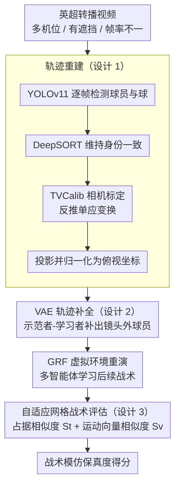

# TacSIm: A Dataset and Benchmark for Football Tactical Style Imitation

**会议**: CVPR 2026  
**arXiv**: [2603.25199](https://arxiv.org/abs/2603.25199)  
**代码**: TacSIm（已公开）  
**领域**: 视频理解  
**关键词**: 足球战术模仿、多智能体学习、轨迹重建、战术评估、虚拟仿真

## 一句话总结

本文提出 TacSIm，首个从真实英超比赛转播画面中重建全队轨迹并在虚拟足球环境中进行战术风格模仿的大规模数据集与基准，通过空间占据相似度和运动向量相似度两个指标量化战术模仿保真度。

## 研究背景与动机

**领域现状**：足球模仿学习研究目前主要以奖励优化为导向（如进球数、胜率代理指标），侧重于个体动作的行为克隆或强化学习策略优化，而非精确复制真实球队的战术组织行为。

**现有痛点**：三大难题制约了战术模仿的发展。首先，数据获取受限——顶级联赛的精细追踪数据被商业壁垒封锁，转播画面存在多机位切换、遮挡、帧率不一致等问题，难以获得 11v11 全队轨迹。其次，模仿过程中个体行为克隆与团队协作优化之间存在失衡，在部分可观测条件下泛化能力弱。第三，评估框架偏重个体误差或片段级奖励，缺乏对团队空间-时间一致性的系统评价。

**核心矛盾**：现有研究缺少一个统一的、从真实比赛到虚拟仿真的闭环基准，无法公平评估不同方法在战术层面的模仿质量。

**本文目标** (1) 如何从转播画面中获取标准化的全队轨迹数据；(2) 如何定义和量化战术风格模仿的好坏；(3) 如何在统一环境中公平比较不同模仿学习方法。

**切入角度**：作者从英超转播画面出发，通过相机标定+轨迹重建+VAE补全的方式获取全队坐标，再映射到 Google Research Football 虚拟环境中进行战术重演和评估。

**核心 idea**：构建首个从转播画面到虚拟仿真的足球战术模仿基准，用空间占据和运动向量双指标系统评价团队战术风格复现能力。

## 方法详解

### 整体框架

TacSIm 的 pipeline 包含三个阶段：(1) 数据获取——从英超转播画面中通过目标检测、追踪和相机标定重建球员和球的标准化坐标；(2) 轨迹补全——用条件 VAE 对不可见区域的球员位置进行补全；(3) 虚拟仿真与评估——将重建的初始状态输入 GRF 虚拟足球平台，让多智能体系统学习和复现后续战术行为，并与真实轨迹对比评估。

### 关键设计

**1. 从转播画面到标准坐标的轨迹重建：把多机位、有遮挡的电视画面还原成统一的鸟瞰坐标**

整套数据的起点是公开的英超转播视频，但这类画面机位频繁切换、球员相互遮挡、帧率也不稳定，没法直接当成轨迹用。作者把成熟的视觉工具链串成一条流水线来抠坐标：先用 YOLOv11 在每帧检测球员和球，再用 DeepSORT 在时间维度上维持身份一致、避免追踪 ID 跳变；关键一步是用 TVCalib 从球场的白线标志反推摄像机参数，得到图像平面到真实球场的单应性变换，从而把任意机位下的像素坐标统一投影成俯视坐标。投影结果再归一化到 GRF 仿真平台的标准范围 $x \in [-1,1]$、$y \in [-0.42, 0.42]$，这样重建出来的数据能直接喂进虚拟环境。这条路线的意义在于：它完全绕开了被商业壁垒封锁的官方追踪数据，只靠公开转播画面就拿到了 11v11 的全队轨迹。

**2. 基于 VAE 的 off-camera 轨迹补全：补出镜头外那些"看不见但确实在跑"的球员**

转播镜头一次只能拍到球场的一部分，剩下的球员要么被切出画面、要么被遮挡，重建出来的轨迹因此到处是断裂的空洞。作者用一个条件 VAE 把这些缺口续上，架构是"示范者—学习者"的师生形式：示范者是一个双向 RNN，在训练时观察**完整**轨迹，学习球场上的时空动力学（球员之间怎么联动、跑位有什么规律）；学习者只拿到被 mask 掉一部分的轨迹，靠一个 masked 解码器去重建被遮住的运动。训练目标是只在缺失区域计算的重建损失加上 KL 正则：

$$\mathcal{L} = \mathbb{E}\big[\|(1-M) \odot (X - \hat{X})\|_2^2\big] + \beta \cdot KL$$

其中 $M$ 标出哪些位置是可见的，$(1-M)$ 把损失约束在不可见区域。用 VAE 而不是确定性插值，是因为镜头外的真实走位本身存在不确定性，VAE 的隐变量能生成平滑且多样的候选轨迹，既保证物理上合理、又不会假装"补出来的就是唯一答案"。

**3. 自适应网格战术评估协议：用两个互补指标量出"模仿得像不像"**

战术模仿的难点不在于单个球员误差几米，而在于整支球队的空间组织和流动方向有没有复刻出来，传统的逐点 L2 误差衡量不了这种团队级一致性。作者先把球场离散成网格，再根据当前帧的平均位移动态调网格粒度 $\Delta_g = \min(\Delta_{max}, \max(\Delta_{min}, \alpha/s_t))$——球队跑得快时网格放大、跑得慢时收紧，让不同运动强度下的评估尺度保持一致。在网格之上算两个互补指标：空间占据相似度用 Jaccard 指数衡量占据格子的重叠程度

$$S_t = \frac{|O^{gt} \cap O^{pred}|}{|O^{gt} \cup O^{pred}|}$$

运动向量相似度用余弦相似度衡量流向是否一致

$$S_v = \frac{1}{2}\left(\frac{v^{gt} \cdot v^{pred}}{\|v^{gt}\|\, \|v^{pred}\|} + 1\right)$$

最终得分取二者算术平均。两个指标缺一不可：$S_t$ 管"站位对不对"，$S_v$ 管"往哪儿动"——只对位置不看方向，会把"站对了却朝反方向跑"判成完美；只看方向不看位置，又会忽略整体阵型的错位。

### 损失函数 / 训练策略

数据集共含 194,565 个标注视频片段（约 38,913 秒），按比赛身份划分 70%/15%/15% 的训练/验证/测试集以防止球队信息泄露。训练采用多窗口长度方式（$L \in \{1, 10, 25, 50\}$），包含短期闭环推理以缓解暴露偏差。测试时仅提供第一帧上下文（球员和球位置），由模型推断后续过程。

## 实验关键数据

### 主实验

在 150 格 (15×10) 网格下的 3.0s 预测结果：

| 方法 | Score | $S_t$ | $S_v$ |
|------|-------|-------|-------|
| BC | 37.86 | 28.57 | 47.14 |
| CMIL | 42.98 | 40.22 | 45.73 |
| IRL | 32.53 | 28.34 | 36.72 |
| CoDAIL | **50.89** | **48.56** | **53.22** |
| DRAIL | 41.72 | 39.88 | 43.56 |

### 消融实验

| 网格分辨率 | 最佳方法 | 3s Score | 10s Score |
|-----------|---------|----------|-----------|
| 60格 (10×6) | CoDAIL | 46.63 | 33.00 |
| 150格 (15×10) | CoDAIL | 50.89 | 28.37 |
| 240格 (20×12) | CMIL | 47.87 | 20.11 |
| 600格 (30×20) | CoDAIL | 37.12 | 14.12 |
| 1768格 (105×68) | CoDAIL | 27.10 | 6.45 |

### 关键发现

- **预测时长是性能下降的主因**：所有模型从 3s 到 10s 性能大幅下降，表明从"运动状态模仿"到"战术意图推断"存在根本性挑战
- **存在最优网格分辨率区间**：中等网格（150/240 格）在保留战术信息和模型可学习性之间取得最佳平衡，过粗丢失信息、过细陷入维度灾难
- **CoDAIL 整体最优**：得益于其多智能体协调机制和对抗学习框架，在中短期预测中表现最好
- **DRAIL 在长期预测中更鲁棒**：扩散模型在 10s 级空间占据指标上展现相对优势

## 亮点与洞察

- **首创性强**：首个从转播画面到虚拟仿真的足球战术模仿闭环基准，填补了领域空白
- **评估设计巧妙**：自适应网格+双指标体系，首次系统化地量化团队级战术模仿质量
- **实用价值明确**：可用于教练战术分析、对手定制化模拟、球员适应性评估等实际场景
- **交叉分析有深度**：时间×空间的交叉分析揭示了不同任务场景（短期/精细 vs 长期/宏观）的最优配置

## 局限与展望

- 仅评估球的轨迹而非个体球员轨迹，回避了身份歧义问题但也限制了评估颗粒度
- 数据仅覆盖英超联赛，战术多样性受限于单一联赛风格
- 缺少对 Transformer 架构和大规模预训练模型的基线比较
- 虚拟环境（GRF）与真实物理的 sim-to-real gap 未被充分讨论

## 相关工作与启发

- SoccerNet 系列提供视频理解和目标追踪标注，但缺乏战术级时空数据
- Google Research Football 提供全可观测仿真环境，但与真实比赛存在差距
- 本文的评估协议设计可启发其他团队运动（篮球、冰球）的战术分析基准构建

## 评分

- **新颖性**: ⭐⭐⭐⭐ — 首个足球战术模仿基准，选题非常新颖且有明确应用价值
- **实验充分度**: ⭐⭐⭐ — 覆盖 5 种基线和多种网格配置，但缺少更先进模型的对比
- **写作质量**: ⭐⭐⭐⭐ — 论文结构清晰，问题定义和评估协议描述详尽
- **价值**: ⭐⭐⭐⭐ — 既推动了体育分析领域，又为多智能体模仿学习提供了新的测试平台

<!-- RELATED:START -->

## 相关论文

- [\[CVPR 2026\] Pioneering Perceptual Video Fluency Assessment: A Novel Task with Benchmark Dataset and Baseline](pioneering_perceptual_video_fluency_assessment_a_novel_task_with_benchmark_datas.md)
- [\[CVPR 2026\] OpenMarcie: Dataset for Multimodal Action Recognition in Industrial Environments](openmarcie_dataset_for_multimodal_action_recognition_in_industrial_environments.md)
- [\[CVPR 2026\] SAVA-X: Ego-to-Exo Imitation Error Detection via Scene-Adaptive View Alignment and Bidirectional Cross View Fusion](savax_egotoexo_imitation_error_detection_via_scene.md)
- [\[CVPR 2026\] EgoXtreme: A Dataset for Robust Object Pose Estimation in Egocentric Views under Extreme Conditions](egoxtreme_a_dataset_for_robust_object_pose_estimation_in_egocentric_views_under_.md)
- [\[CVPR 2026\] MovieRecapsQA: A Multimodal Open-Ended Video Question-Answering Benchmark](movierecapsqa_a_multimodal_open-ended_video_question-answering_benchmark.md)

<!-- RELATED:END -->
