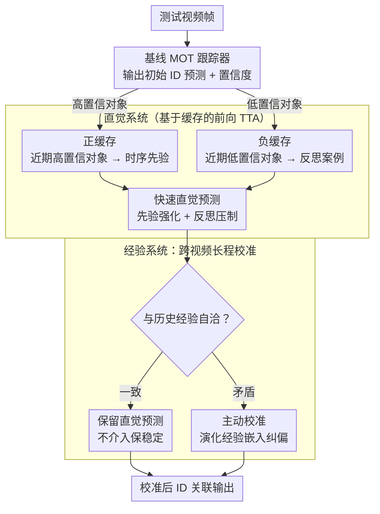

# Dual-level Adaptation for Multi-Object Tracking: Building Test-Time Calibration from Experience and Intuition

**会议**: CVPR 2026  
**arXiv**: [2603.21629](https://arxiv.org/abs/2603.21629)  
**代码**: [https://github.com/1941Zpf/TCEI](https://github.com/1941Zpf/TCEI)  
**领域**: 视频理解  
**关键词**: 多目标跟踪, 测试时自适应, 双系统理论, 分布偏移, 身份关联

## 一句话总结

TCEI 框架受 Kahneman 双系统理论启发，提出直觉系统（利用近期观测对象的瞬时记忆快速推断）和经验系统（利用历史视频积累的经验校准直觉预测）相结合的测试时自适应方法，无需反向传播即可在分布偏移下显著提升多目标跟踪性能。

## 研究背景与动机

1. **领域现状**：多目标跟踪(MOT)在训练和测试数据间常存在外观、运动模式和类别的分布偏移，导致在线推理性能下降。测试时自适应(TTA)是缓解此问题的有前景范式。
2. **现有痛点**：现有TTA方法主要针对静态图像任务（分类、分割），仅利用帧内信息适应，忽略了MOT中帧间时序一致性和身份关联的需求。基于反向传播的TTA方法还存在计算效率低和灾难性遗忘问题。
3. **核心矛盾**：MOT中帧内线索用于区分对象，帧间时序线索确保ID一致性——两者同等重要但现有TTA方法仅考虑前者。
4. **本文目标**：设计一种面向MOT的前向传播TTA方法，利用历史观测对象为当前ID关联提供时序指导。
5. **切入角度**：类比人类决策的双系统理论——快速直觉判断(System 1) + 慢速深思熟虑校准(System 2)。
6. **核心 idea**：直觉系统用近期对象的瞬时记忆提供快速预测，经验系统用所有已处理视频的积累知识校准直觉预测中的不一致。

## 方法详解

### 整体框架

TCEI 要解决的是多目标跟踪在测试阶段碰到分布偏移（外观、运动模式、类别都和训练集对不上）后 ID 关联崩坏的问题，而且要在不做反向传播、不更新网络权重的前提下做到。它本身不是一个独立跟踪器，而是挂在任意现有 MOT 跟踪器之上的一层测试时校准模块。整条链路是这样转的：基线跟踪器先吐出每一帧的初始 ID 预测；直觉系统从近期几帧里观测过的对象组成"瞬时记忆"，用其中高置信的对象当时序先验去强化当前预测、用低置信对象当反面教材去审视当前预测；经验系统再拿一份跨越所有已处理视频的长程记忆，检查直觉给出的结果是否和历史经验自洽——自洽就放行，矛盾就出手校准。全程只有前向的缓存查询与相似度计算，没有梯度回传——所有"记忆"都落在键值缓存里，这正是第三个关键设计「基于缓存的前向 TTA」承载直觉与经验两套系统的底座。

### 关键设计

**1. 直觉系统：用最近几帧的瞬时记忆给当前预测打快速补丁**

针对的痛点是——基线跟踪器做 ID 关联时只看当前帧的帧内线索，这种孤立判断在分布偏移下很容易把同一个目标在相邻帧判成不同 ID。直觉系统的做法是维护一份只存近期已处理对象的瞬时记忆，并按基线预测的置信度把它们分成两路来用：高置信对象作为"时序先验"，拿它们的特征和当前检测算相似度，相似度高就强化当前这条 ID 关联；低置信、不确定的对象作为"反思案例"，当模型打算做出与这些失败案例类似的判断时就提高警惕、压低该预测。这一正一反两路信号，本质是把训练期学到的知识和测试时刚观测到的证据当场拼在一起，对应人类先快速回忆近期经验、再对照成功/翻车案例下初判的那种直觉过程。

**2. 经验系统：用跨视频的长程经验给直觉预测做深思校准**

直觉系统的短板很明显——它只够得着最近几帧，提供不了长程时序信息，遇到目标长时间被遮挡后再出现、或外观随时间剧烈变化的场景就失灵。经验系统补的正是这一段：它维护一份从所有已处理测试视频里累积下来的经验，且这份经验不是固定模板，而是让经验嵌入跟着查询嵌入一起演化，因此捕获的是对象级别的特征而非粗糙的类别级特征。运作上它走"按需介入"——直觉给出的预测若和这份历史经验一致，就原样保留（保住稳定性、不乱改已经对的部分）；一旦发现不一致，才主动出手把这条预测拉回经验认可的方向（纠偏）。

**3. 基于缓存的前向 TTA：用键值缓存替代反向传播完成测试时优化**

前两个系统都要"记住并调用历史"，而本文不愿为此付出反向传播的代价——梯度更新既慢，又容易被测试流里的噪声样本带偏、引发灾难性遗忘。于是 TCEI 用一个键值缓存模型来承载记忆：高置信对象写进正缓存、充当先验来源，低置信对象写进负缓存、充当反思信号来源；缓存随视频推进动态增删，始终对齐最新的测试环境状态。直觉系统的先验/反思、经验系统的演化嵌入，都落在这套缓存的查询与相似度计算上完成，全程只有前向运算。和 TENT 这类靠反向传播在线更新参数的 TTA 相比，这种缓存式方案不动网络权重，因此更稳、也更契合 MOT 这种对实时性敏感的在线场景。

### 损失函数 / 训练策略

TCEI 是纯前向传播方法，不涉及训练或反向传播。直觉预测和经验校准都在推理时通过缓存查询和相似度计算完成。

## 实验关键数据

### 主实验

| 数据集 | 指标 | TCEI | 基线跟踪器 | 提升 |
|--------|------|------|-----------|------|
| MOT17 | HOTA/IDF1 | SOTA | 基线 | 显著 |
| MOT20 | HOTA/IDF1 | SOTA | 基线 | 显著 |
| DanceTrack | HOTA/IDF1 | SOTA | 基线 | 显著 |
| 多数据集 | 一致性 | 全部提升 | - | 强泛化 |

### 消融实验

| 配置 | 关键指标 | 说明 |
|------|---------|------|
| 仅基线跟踪器 | 基线 | 无TTA适应 |
| + 直觉系统 (正缓存) | 提升 | 时序先验有效 |
| + 直觉系统 (正+负缓存) | 进一步提升 | 反思机制有效 |
| + 经验系统 | SOTA | 长程校准进一步增强 |

### 关键发现

- TCEI 在三个主流数据集上一致优于无TTA的基线，验证了测试时自适应对MOT的价值
- 前向传播方案比基于反向传播的TTA方法（如TENT）更稳定，不易灾难性遗忘
- 高置信和低置信对象的双重利用比仅用高置信对象效果更好（消融里"正+负缓存"优于"仅正缓存"印证了反思机制的增量贡献）
- 经验系统的长程记忆对外观变化剧烈的场景（如DanceTrack）尤为重要

## 亮点与洞察

- **双系统理论到MOT-TTA的映射**很自然：近期记忆→直觉快速判断→经验深思校准，这个认知框架使方法设计有清晰的指导原则
- **负缓存/反思机制**是一个有趣的设计：利用失败/不确定案例作为"避坑指南"
- **前向传播TTA**对实时性要求高的MOT场景至关重要，避免了反向传播的开销和不稳定性

## 局限与展望

- 缓存大小和更新策略需要仔细调优
- 经验系统的知识积累在极长视频序列上可能导致过时信息干扰
- 未考虑多目标交互关系的建模

## 相关工作与启发

- **vs TENT/FSTTA**: 基于反向传播的TTA方法，计算开销大且不稳定；TCEI 仅需前向传播
- **vs TDA/Tip-Adapter**: 基于缓存的TTA方法，但之前仅用于静态图像；TCEI 扩展到视频时序建模
- **vs ByteTrack/OC-SORT**: 传统跟踪方法无测试时适应能力，TCEI 作为附加模块可增强任何跟踪器
- 双系统理论到 MOT-TTA 的映射自然：近期记忆→直觉快速判断→经验深思校准
- 负缓存/反思机制利用失败/不确定案例作为"避坑指南"，是有趣的设计创新
- 经验嵌入随查询嵌入演化而非固定模板，捕获对象特定特征而非类别级特征
- MOTIP 的 ID 解码器重新定义关联为直接 ID 预测，TCEI 可作为其上层自适应模块

## 评分

- 新颖性: ⭐⭐⭐⭐ 双系统认知理论与MOT测试时自适应的跨学科结合新颖
- 实验充分度: ⭐⭐⭐⭐ MOT17/MOT20/DanceTrack多数据集验证，消融分析完整
- 写作质量: ⭐⭐⭐⭐ 动机清晰，人类认知理论的类比框架图直观易懂
- 价值: ⭐⭐⭐⭐ 首次系统研究MOT的测试时自适应，前向传播方案实用性强

<!-- RELATED:START -->

## 相关论文

- [\[CVPR 2026\] Occlusion-Aware SORT: Observing Occlusion for Robust Multi-Object Tracking](occlusion-aware_sort_observing_occlusion_for_robust_multi-object_tracking.md)
- [\[CVPR 2026\] FC-Track: Overlap-Aware Post-Association Correction for Online Multi-Object Tracking](fc-track_overlap-aware_post-association_correction_for_online_multi-object_track.md)
- [\[CVPR 2026\] STORM: End-to-End Referring Multi-Object Tracking in Videos](storm_referring_multi_object_tracking.md)
- [\[CVPR 2026\] Enhancing Accuracy of Uncertainty Estimation in Appearance-based Gaze Tracking with Probabilistic Evaluation and Calibration](enhancing_accuracy_of_uncertainty_estimation_in_appearance-based_gaze_tracking_w.md)
- [\[AAAI 2026\] PlugTrack: Multi-Perceptive Motion Analysis for Adaptive Fusion in Multi-Object Tracking](../../AAAI2026/video_understanding/plugtrack_multi-perceptive_motion_analysis_for_adaptive_fusion_in_multi-object_t.md)

<!-- RELATED:END -->
