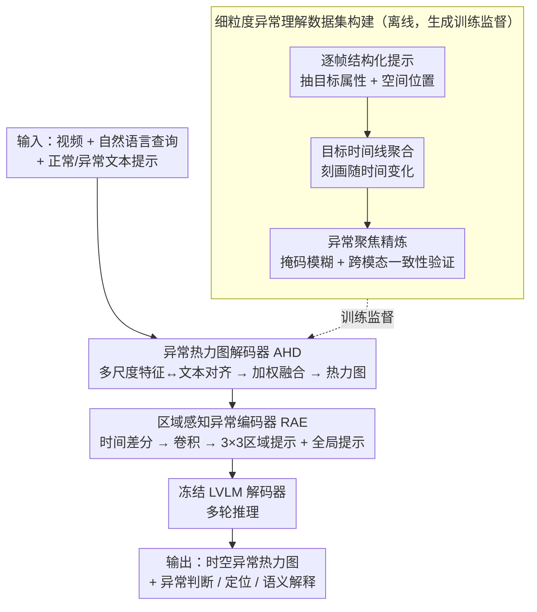

# Text-guided Fine-Grained Video Anomaly Understanding

**会议**: CVPR2026  
**arXiv**: [2511.00524](https://arxiv.org/abs/2511.00524)  
**代码**: [github.com/momiji-bit/T-VAU](https://github.com/momiji-bit/T-VAU)  
**领域**:视频理解
**关键词**: 视频异常检测, 异常热力图, 区域感知编码器, 大视觉语言模型, 多轮对话

## 一句话总结
提出T-VAU框架，通过异常热力图解码器(AHD)实现像素级时空异常定位，并设计区域感知异常编码器(RAE)将热力图证据注入LVLM进行异常判断、定位和语义解释的统一推理。

## 研究背景与动机
视频异常检测(VAD)对安全监控至关重要。现有方法存在根本性局限：
- **传统VAD**：输出视频/帧级异常分数，提供粗粒度的二值决策，缺乏可解释性证据。细粒度线索可能被特征聚合稀释
- **LVLM直接应用**：虽能产生文本判断，但缺乏像素级定位能力，对微弱异常信号的捕捉不可靠，导致文本描述不忠实
- **LVLM-扩散混合**：结合可视化和文本，但可能不稳定/不一致

核心需求：异常理解不仅需要"是否异常"，还需要"哪里异常"、"哪个目标负责"、"如何随时间演变"——这要求从像素级证据到语言推理的闭环。

切入角度：(i) 通过视觉-文本对齐提取时空异常证据，(ii) 将证据作为结构化提示注入LVLM完成多任务、多轮推理。

## 方法详解

### 整体框架
T-VAU要解决的是一件传统VAD做不到的事：不仅说出"这段视频异常"，还要指出"哪个像素、哪个目标、怎么随时间演变"，并用自然语言把这套判断讲清楚。它的做法是在一个**冻结的LVLM骨干**上挂两个轻量可训练模块——先用异常热力图解码器(AHD)从视觉表示里把异常信号"画"成像素级热力图，再用区域感知异常编码器(RAE)把这张热力图压缩成结构化提示喂回语言模型。整条链路接收"视频 + 自然语言查询 + 正常/异常文本提示"，输出一张时空异常热力图和一轮轮的对话回答，证据(热力图)和推理(语言)在同一框架里闭环。而要训练AHD和RAE，还需要带"目标级 + 时序"粒度的监督——这由一条离线的细粒度数据集构建流水线自动生成（见下）。

### 关键设计

**1. 异常热力图解码器(AHD)：不设阈值，直接从视觉-文本对齐里"读"出异常在哪**

传统VAD要么输出一个帧级分数、把细粒度线索在特征聚合里稀释掉，要么靠人工设阈值切分正常/异常——既不可解释也不鲁棒。AHD换了个思路：既然LVLM的视觉编码器中间层已经携带了丰富的语义，那就直接拿"正常/异常"文本提示去对齐这些视觉特征，对齐得越好的位置就越像异常。具体地，它从视觉编码器抽多尺度特征 $V_i$（第1/8/16/32层），用MLP投影到文本空间后逐位置算余弦相似度 $h_c^i[t,h,w] = \text{CosineSimilarity}(V'_i[t,:,h,w], T_c)$，再用一组可学习权重跨层加权融合 $H_c = \sum_i w_i \cdot h_c^i$，最后对类别通道做softmax、取异常通道就得到热力图。整个过程没有任何硬阈值，异常强度由视觉-文本相似度连续给出，因此对微弱异常信号也能保留响应。

**2. 区域感知异常编码器(RAE)：把像素证据翻译成LLM能"听懂"的结构化提示**

AHD产出的是逐帧热力图，但LLM吃的是token序列，直接把热力图拍平喂进去既冗长又丢掉了运动信息。RAE负责在两者之间架桥。它先对相邻帧热力图做时间差分 $X[t] = H_c[t+1] - H_c[t]$，让"哪里在动、怎么动"这种运动线索显式化；再用卷积骨干提取区域感知特征，把每帧切成 $3\times3$ 网格做自适应池化得到区域提示 $P_{region}$，同时用空间均值池化得到一个概览整帧的全局提示 $p_{global}$。三者拼成提示序列 $P_{An} = [P_{base}, P_{region}, p_{global}]$，和视觉提示、对话上下文一起送进LLM解码器。这样语言模型拿到的不是一堆原始像素，而是"哪个区域、整体态势、随时间如何变化"的紧凑摘要，定位和解释才有据可依。

**3. 细粒度异常理解数据集构建：让监督信号本身就带"目标级 + 时序"的粒度**

要训练出能指名道姓、讲清演变的模型，光有帧级异常标签不够，得有目标级、跨时间的结构化标注，而这类数据原本不存在。作者基于ShanghaiTech和UBnormal搭了一条三阶段流水线来自动生成：先对每帧做结构化提示，抽出目标属性和空间位置；再把同一目标的逐帧信息聚合成"目标时间线"，刻画它如何随时间变化；最后做异常聚焦精炼——用异常掩码加高斯模糊把背景压下去、突出异常主体，并通过"外观↔运动"双向的跨模态一致性验证剔除矛盾标注。产出的监督信号天然带有目标粒度和时序结构，正好对上T-VAU想要的细粒度理解能力。

### 一个完整示例

以UBnormal里一段"行人突然奔跑"的监控片段为例，走一遍证据如何变成回答：视频和正常/异常文本提示先进AHD，视觉编码器第1/8/16/32层特征分别与文本对齐、按可学习权重融合，奔跑者所在像素在异常通道上亮起，得到逐帧热力图 $H_c$。RAE接手：对相邻帧热力图做差分 $X[t]$，奔跑带来的位移让该区域差分值显著，卷积提特征后按 $3\times3$ 网格池化，奔跑者落在的那个网格给出高响应的区域提示，全局提示则概括"画面整体有快速运动"。这些提示连同查询"画面里发生了什么异常？"一起进LLM，模型据此回答"右侧一名行人突然奔跑（目标级）、沿人行道向上移动（轨迹）、属异常行为（判断）"——三类输出都能追溯到具体的热力图证据，而非凭文本先验猜测。

### 损失函数 / 训练策略
分两阶段、骨干始终冻结：AHD阶段只优化AHD、其余部分全部冻结；RAE阶段做课程式SFT，先学"外观-运动叙述"再过渡到"异常聚焦精炼"。整套训练只动AHD和RAE两个轻量模块，LVLM骨干不参与梯度更新，因此新增参数极少（见实验）。

## 实验关键数据

### 主实验

| 数据集 | 指标 | T-VAU | 之前SOTA | 提升 |
|--------|------|-------|----------|------|
| UBnormal | Micro-AUC | 94.8 | 68.2 (Georgescu FT) | +26.6 |
| UBnormal | RBDC | 67.8 | 28.7 (Georgescu FT) | +39.1 |
| UBnormal | TBDC | 76.7 | 58.1 (Georgescu FT) | +18.6 |
| ShanghaiTech | BLEU-4 (Target) | 62.67 | 55.73 (InternVL 8B) | +6.94 |
| ShanghaiTech | BLEU-4 (Trajectory) | 88.84 | 82.65 (InternVL 8B) | +6.19 |
| ShanghaiTech | Yes/No Acc | 97.67% | 94.28% (InternVL 8B) | +3.39% |

### 消融实验

| 配置 | RBDC/TBDC | BLEU-4 (Target) | Yes/No Acc |
|------|-----------|----------------|-----------|
| T-VAU完整 | 67.8/76.7 | 62.67 | 97.67% |
| 无AHD | 不适用 | 61.82 | 95.38% |
| 无RAE | 67.8/76.7 | - | - |
| 无AHD&RAE | 不适用 | 61.82 | 95.38% |

### 关键发现
- AHD和RAE具有强互补性：AHD提供像素级证据，RAE将证据转化为可理解的语言
- One-shot设定下AHD即达94.5% micro-AUC和64.3% RBDC，数据效率极高
- 微调后进一步提升，但one-shot已建立强基线
- 模型参数仅增加约50M（8274→8325M），轻量高效

## 亮点与洞察
- "证据→推理"的闭环设计思想：异常热力图作为视觉证据，RAE将其结构化注入语言模型
- 细粒度数据集构建流程系统完整：帧级提取→时间聚合→异常聚焦→跨模态验证
- 轨迹可视化（热力图跨帧累加）提供了直观的时序一致性验证
- 无需阈值的异常定位设计，避免了传统方法的阈值敏感性问题

## 局限与展望
- 微动作（位移极小）和高度非刚性运动场景性能仍有挑战
- 场景依赖的外观变化（镜面反射、雾等）影响定位准确性
- 数据集基于ShanghaiTech和UBnormal构建，场景多样性有限
- LVLM骨干冻结可能限制了更深层的异常理解能力

## 相关工作与启发
- 与HAWK、Holmes-VAU等VAU方法相比，T-VAU通过AHD提供了显式的像素级证据
- LAVAD等免训练方法虽有趣但缺乏精确定位
- 结合SVC（细微视觉计算）视角审视异常检测是有意义的方向

## 评分
- 新颖性: ⭐⭐⭐⭐ AHD+RAE的证据-推理闭环设计新颖
- 实验充分度: ⭐⭐⭐⭐ 多维度评估+完整消融+定性分析
- 写作质量: ⭐⭐⭐⭐ 框架图清晰，各组件关系明确
- 价值: ⭐⭐⭐⭐ 将异常检测从分数预测提升到可解释推理

<!-- RELATED:START -->

## 相关论文

- [\[CVPR 2026\] Frame2Freq: Spectral Adapters for Fine-Grained Video Understanding](frame2freq_spectral_adapters_for_fine-grained_video_understanding.md)
- [\[CVPR 2026\] Fine-VAD: Towards Fine-Grained Video Anomaly Detection via Progressive Cross-Granularity Learning](fine-vad_towards_fine-grained_video_anomaly_detection_via_progressive_cross-gran.md)
- [\[AAAI 2026\] FineVAU: A Novel Human-Aligned Benchmark for Fine-Grained Video Anomaly Understanding](../../AAAI2026/video_understanding/finevau_a_novel_human-aligned_benchmark_for_fine-grained_video_anomaly_understan.md)
- [\[CVPR 2026\] Mistake Attribution: Fine-Grained Mistake Understanding in Egocentric Videos](mistake_attribution_fine-grained_mistake_understanding_in_egocentric_videos.md)
- [\[CVPR 2026\] UFVideo: Towards Unified Fine-Grained Video Cooperative Understanding with Large Language Models](ufvideo_towards_unified_fine-grained_video_cooperative_understanding_with_large_.md)

<!-- RELATED:END -->
