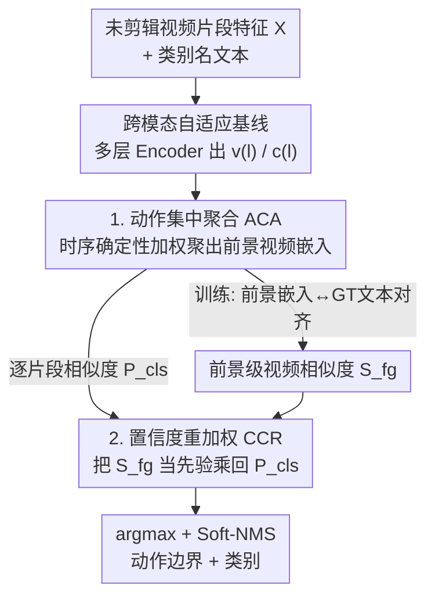

# TF-CADE: Foreground-Concentrated Text-Video Alignment for Zero-Shot Temporal Action Detection

**会议**: CVPR 2026  
**论文**: [CVF Open Access](https://openaccess.thecvf.com/content/CVPR2026/html/Lee_TF-CADE_Foreground-Concentrated_Text-Video_Alignment_for_Zero-Shot_Temporal_Action_Detection_CVPR_2026_paper.html)  
**代码**: 无  
**领域**: 视频理解  
**关键词**: 零样本时序动作检测, 文本-视频对齐, 前景聚合, 置信度重加权, ZSTAD

## 一句话总结
针对零样本时序动作检测中"文本不影响预测"的痛点，本文用一个动作集中聚合模块（ACA）把视频特征按时序前景显著度加权聚出一个前景视频嵌入、专门和文本对齐，再用一个基于确定性的置信度重加权（CCR）把视频级先验注回逐片段分类分，从而压住语义不相关的动作类，在 THUMOS14/ActivityNet 的同分布与跨数据集零样本设定上都刷到 SOTA。

## 研究背景与动机
**领域现状**：零样本时序动作检测（ZSTAD）要在未剪辑长视频里定位并识别训练时没见过的动作类别。借助 CLIP/ALIGN 这类大规模视觉-语言模型的泛化能力，主流做法是把文本（类别名）特征和视频里相关的时序区域对齐。现有方法分两派：前景式（先抽前景候选段、再和文本对齐）和无前景式（把文本特征通过双向 cross-attention 直接融进整段视频特征）。其中 Ti-FAD 是无前景式的代表 SOTA。

**现有痛点**：无前景式方法虽然架构上做了文本-视频互增强，但预测其实"几乎不看文本"。作者做了一个很说明问题的诊断：给检测器分别喂正确动作名（"ThrowDiscus"）和一个毫无语义的乱词（"XYZ"），Ti-FAD 输出的类别置信度分布在所有时间步上几乎一模一样。这说明文本输入对最终预测没起到实质引导作用——预测主要由视频特征驱动，产生大量"文本无关预测"（text-irrelevant predictions）。

**核心矛盾**：作者进一步追问为什么文本失效。假设在于：cross-modal adaptation 把文本和"既含前景又含背景"的整段视频特征做对齐，而未剪辑视频里背景区域往往主导视觉表示，于是被更新的文本特征会朝"背景偏置的视觉模式"漂移。作者用一个诊断实验验证：只喂 ground-truth 前景区域（去掉所有背景、其余架构不变）时，得到的文本特征在不同类别间明显更可分（余弦相似度热图对角化）；而用全部区域时，不同动作名的文本特征相似度一片高、几乎无法区分类别。结论：背景信息干扰了文本和动作相关视觉模式的对齐。

**本文目标 / 切入角度**：既然问题出在"文本被迫和背景对齐"，那就**显式地让文本只和动作相关的前景区域对齐**，避免背景主导的漂移。

**核心 idea**：用一个软的、随时序变化的"动作确定性"权重把视频特征聚成一个前景集中的视频嵌入，专门拿它去和文本对齐（训练）；推理时再把这个前景级的视频先验乘回逐片段分类分，压制语义混淆类。

## 方法详解

### 整体框架
TF-CADE 建立在 Ti-FAD 的 cross-modal adaptation 基线之上：输入是未剪辑视频的片段级特征 $X=\{x_t\}_{t=1}^{T_0}$（经 I3D/VideoMAE/CoCa 等骨干抽取），通过 1D 卷积投影成初始视频嵌入 $v^{(0)}$，类别名经冻结文本编码器（CLIP/CoCa）得到初始文本嵌入 $c^{(0)}$；二者经多层 Encoder（视频/文本各自 self-attention + 跨模态 cross-attention + FFN）逐层更新，视频侧还逐层时序下采样形成金字塔多尺度特征 $v^{(l)}$（$T_l=T_{l-1}/2$）。在这个骨架之上，本文加了两个贡献模块：训练时用 **动作集中聚合（ACA）** 产出一个前景加权视频嵌入并与对应 GT 文本对齐；推理时用 **基于确定性的置信度重加权（CCR）** 把 ACA 得到的视频级相似度先验乘回逐片段分类分。最终经 argmax + Soft-NMS 出检测结果。

### 关键设计

**1. 动作集中聚合 ACA：把视频按时序前景显著度软聚成一个专供文本对齐的前景嵌入**

这是直接针对"文本被迫和背景对齐"的核心模块。它分两步。第一步构造**时序动作确定性图（Temporal Action Certainty Map）**：在每层 $l$，先算视频-文本相似度图 $P_{\text{cls}} = v^{(l)} \cdot {c^{(l)}}^\top \in \mathbb{R}^{T_l \times N_c}$，沿类别维取最大再 softmax 得到初始确定性 $m_{\text{max}}^{(l)} = \mathrm{softmax}(\max_{N_c}(P_{\text{cls}})) \in \mathbb{R}^{T_l}$——它会尖锐地集中在最显著的动作帧（动作峰值）。但只看峰值会丢掉动作段的完整时序上下文，所以再用高斯核 $G(\sigma)$ 沿时间做 1D 平滑卷积 $m_{\text{filter}}^{(l)} = m_{\text{max}}^{(l)} \circledast G(\sigma)$，抑制噪声和过尖峰值、让权重覆盖连续动作段；最终把"尖锐显著"和"平滑上下文"相加 $m^{(l)} = m_{\text{max}}^{(l)} + m_{\text{filter}}^{(l)}$ 并沿时间归一化。

第二步用这张确定性图把视频特征**软聚合**成前景加权嵌入 $v_{\text{fg}}^{(l)} = \sum_{t=1}^{T_l} m_t^{(l)} \odot v_t^{(l)} \in \mathbb{R}^{D}$，再算它和各类文本嵌入的余弦相似度、并跨 $L$ 层平均得到前景级视频相似度

$$S_{\text{fg}}^{(n)} = \frac{1}{L}\sum_{l=1}^{L} \mathrm{sim}(v_{\text{fg}}^{(l)}, c_n^{(l)}), \quad n=1,\dots,N_c$$

训练时把 $v_{\text{fg}}^{(l)}$ 与其 GT 文本对齐（video-level 分类损失）。这样文本只跟"被确定性加权选出来的动作相关区域"对齐，背景被权重压低，从根上避免了文本特征朝背景漂移——前面热图实验里前景-only 让类别更可分，ACA 正是把那个理想条件用可学习的软权重逼近出来。

**2. 基于确定性的置信度重加权 CCR：把视频级前景先验乘回逐片段分类分，压住混淆类**

ACA 解决了训练对齐，但推理时标准流程还是把 $P_{\text{cls}}$ 过 sigmoid 出逐片段分类分，这会让"视觉上像、但语义不相关"的类被过度激活。CCR 把 ACA 算出的前景级视频相似度 $S_{\text{fg}}$ 当作一个**视频级先验**：先对 $S_{\text{fg}}$ 做 softmax 估计每个类在该视频中出现的可能性，再和逐片段分类分逐元素相乘后开方

$$\tilde{P}_{\text{cls}} = \sqrt{\mathrm{sigmoid}(P_{\text{cls}}) \odot \mathrm{softmax}(S_{\text{fg}})} \in \mathbb{R}^{T_l \times N_c}$$

直觉是：如果整段视频在前景级上就判断"这个类不太可能存在"，那么逐片段即使局部相似度高也会被压下去，从而强化动作相关类、抑制不相关类。这是个无需额外参数的推理期重加权，和 ACA 互补——消融里单用 ACA 的 $\mathcal{L}_{video}$ 提升很小，单用 CCR 提升更大，两者合用最好，因为 $S_{\text{fg}}$ 提供的全局先验恰好给逐片段分类补了视频级上下文。

### 损失函数 / 训练策略
分类损失 $\mathcal{L}_{cls} = \mathcal{L}_{snippet} + \mathcal{L}_{video}$：$\mathcal{L}_{snippet}$ 基于 $P_{\text{cls}}$ 监督逐片段分类，$\mathcal{L}_{video}$ 把前景级相似度 $S_{\text{fg}}$ 和对应动作类对齐，两者都用 focal loss。总目标 $\mathcal{L} = \mathcal{L}_{cls} + \mathcal{L}_{loc} + \mathcal{L}_{an}$，其中定位损失 $\mathcal{L}_{loc}$ 用 DIoU 回归动作边界，actionness 损失 $\mathcal{L}_{an}$ 用 focal loss。THUMOS14 训 25 epoch、ActivityNet/HACS 训 15 epoch，Adam + 5 epoch 线性 warmup，初始 lr 0.0001，单张 A100。值得一提：基线虽是双向 cross-attention，但消融显示用文本/视频/双向当 query 差别很小，作者因此简化成只更新视频侧。

## 实验关键数据

### 主实验（同分布 ZSTAD，average mAP）
严格零样本评测——只比不依赖外部分类器（如 UntrimmedNet）后处理的方法。下表为 THUMOS14 与 ActivityNet v1.3 在 "no external information" 场景、I3D + CLIP-B 特征下的结果。

| 设定 | 数据集 | 指标 | Ti-FAD | TF-CADE | 提升 |
|------|--------|------|--------|---------|------|
| 50%-50% | THUMOS14 | Avg. mAP | 16.0 | **21.1** | +5.1 |
| 50%-50% | ActivityNet v1.3 | Avg. mAP | 7.4 | **10.5** | +3.1 |
| 75%-25% | THUMOS14 | Avg. mAP | 26.9 | **34.5** | +7.6 |
| 75%-25% | ActivityNet v1.3 | Avg. mAP | 13.7 | **17.2** | +3.5 |

把本文模块即插到 Ti-FAD（Ti-FAD + Ours）也一致涨点（如 75%-25% THUMOS14 26.9→31.2），说明 ACA/CCR 是可迁移的增量。

### 跨数据集泛化（训 ActivityNet → 测 THUMOS14，average mAP）
这是更能体现零样本能力的设定，差距被显著拉大。

| 评测划分 | 方法 | Avg. mAP |
|----------|------|----------|
| 50%-50% | Ti-FAD | 11.7 |
| 50%-50% | **TF-CADE** | **28.2** |
| 75%-25% | Ti-FAD | 13.0 |
| 75%-25% | **TF-CADE** | **26.1** |
| 0%-100% | T3AL | 9.6 |
| 0%-100% | Ti-FAD | 11.1 |
| 0%-100% | **TF-CADE** | **27.4** |

在最难的 0%-100%（训练完全不见任何测试类）下，TF-CADE 把 Ti-FAD 的 11.1 提到 27.4，几乎翻倍，跨数据集鲁棒性是本文最亮的结果。用 VideoMAE 特征在 HACS↔ActivityNet↔THUMOS14 三向迁移上也一致优于 Ti-FAD。

### 消融实验

| 配置 | THUMOS14 Avg. mAP | 说明 |
|------|-------------------|------|
| Baseline | 16.0 | Ti-FAD cross-modal 基线 |
| + $\mathcal{L}_{video}$（仅 ACA 对齐） | 16.4 | 单用前景对齐，提升小 |
| + CCR | 19.7 | 单用推理重加权，提升明显 |
| + $\mathcal{L}_{video}$ & CCR（Full） | **21.1** | 两者互补，最佳 |

ACA 内部设计消融（50%-50% THUMOS14）：聚合方式上确定性加权聚合（21.1）优于均值池化（18.9）；确定性图上 $m_{\text{max}}+m_{\text{filter}}$（21.1）优于只用尖峰 $m_{\text{max}}$（20.7）或只用平滑 $m_{\text{filter}}$（19.6）。高斯平滑在跨数据集设定下增益尤其大（w/o filter 21.3 → w/ filter 27.4）。

### 关键发现
- **CCR 单独贡献大于 ACA 对齐单独贡献，但两者强互补**：$\mathcal{L}_{video}$ 单用只 +0.4，CCR 单用 +3.7，合用 +5.1——前景对齐训练出的 $S_{\text{fg}}$ 给推理期重加权提供了靠谱的全局先验。
- **跨数据集增益远大于同分布增益**，印证"文本真正起作用"才是泛化关键：DETAD 误差分析显示 TF-CADE 的 wrong-label 错误显著减少（文本被有效注入）；CCR 还明显降低极短（XS）和极长（XL）动作的漏检（false negative）。
- 高斯平滑 $\sigma$ 在跨数据集下作用突出，说明覆盖完整动作段的时序上下文对未见类定位很重要。

## 亮点与洞察
- **用"换文本看预测变不变"做诊断**很有说服力：给乱词"XYZ"和正确类名，看置信度分布是否雷同，一眼坐实"文本无关预测"问题，比单看 mAP 更直击病因。
- **前景对齐不靠预抽 proposal，而是软的确定性权重**：既保留无前景式的端到端文本融合优势，又避免了背景漂移——相当于把"前景-only 理想实验"用可学习权重逼近出来，思路干净。
- **CCR 是零参数、即插即用的推理期先验**：$\sqrt{\mathrm{sigmoid}(P_{\text{cls}}) \odot \mathrm{softmax}(S_{\text{fg}})}$ 把视频级判断乘回片段级，这种"全局先验抑制局部混淆"的重加权范式可迁移到其他开放集/零样本逐片段分类任务。
- ACA/CCR 作为增量加到 Ti-FAD 上即涨点，说明它和现有无前景式检测器正交、复现门槛低。

## 局限与展望
- 方法仍建立在 Ti-FAD 的 cross-modal adaptation 基线上，前景确定性完全由当前 $v$-$c$ 相似度自举得到，若骨干本身对未见类的视觉判别就弱（如细粒度近似动作），$m^{(l)}$ 可能本身不准，ACA 难以纠偏。⚠️ 这是笔者从机制推断，论文未专门讨论。
- 高斯核 $\sigma$ 是关键超参，平滑过度可能糊掉短动作边界、不足又退回尖峰；论文展示了它在跨数据集下重要，但缺少跨不同动作时长的 $\sigma$ 自适应方案。
- CCR 的视频级先验假设"每段视频里出现的类有限"，对动作类别密集、单视频多类共现的场景，softmax 先验可能过度抑制真实存在的次要类。
- 评测刻意排除了依赖外部分类器的方法以保证严格零样本，因此与那一批（往往报更高 mAP 的）方法不可直接横向比大小——这是合理的 caveat，但也意味着绝对数值偏低。

## 相关工作与启发
- **vs Ti-FAD（无前景式 SOTA）**: Ti-FAD 把文本和含前景+背景的整段视频做双向对齐，导致文本朝背景漂移、预测文本无关。本文只让文本和确定性加权的前景嵌入对齐，并加 CCR 推理重加权；同分布提升中等，跨数据集几乎翻倍。
- **vs STALE 等前景式方法**: 前景式先独立抽前景 proposal（不看文本）再对齐，文本整合受限。本文不预抽 proposal，用软确定性权重端到端地"动态聚前景"，兼顾文本融合与前景聚焦。
- **vs T3AL（training-free）**: T3AL 用文本引导的区域抑制对齐，但依赖额外 captioning 模型（CoCa）生成句级描述、管线受外部语言模型牵制。本文只用类别名提示、无需 caption 或辅助分类分，更轻、跨数据集更强（0%-100% 27.4 vs 9.6）。

## 评分
- 新颖性: ⭐⭐⭐⭐ 用诊断实验精准定位"文本无关预测"病因，并用软前景对齐 + 视频级重加权对症下药，思路清晰但建立在已有基线增量之上。
- 实验充分度: ⭐⭐⭐⭐ 同分布 + 三向跨数据集 + 组件/ACA 内部多重消融 + DETAD 误差分析，覆盖全面。
- 写作质量: ⭐⭐⭐⭐ 动机部分用两个可视化实验层层递进讲清"为什么文本失效"，可读性强。
- 价值: ⭐⭐⭐⭐ 跨数据集零样本近翻倍提升、且模块可即插到现有检测器，对 ZSTAD 实用价值高。

<!-- RELATED:START -->

## 相关论文

- [\[CVPR 2026\] CVA: Context-aware Video-text Alignment for Video Temporal Grounding](cva_context-aware_video-text_alignment_for_video_temporal_grounding.md)
- [\[CVPR 2026\] Decompose and Transfer: CoT-Prompting Enhanced Alignment for Open-Vocabulary Temporal Action Detection](decompose_and_transfer_cot-prompting_enhanced_alignment_for_open-vocabulary_temp.md)
- [\[CVPR 2026\] No Need For Real Anomaly: MLLM Empowered Zero-Shot Video Anomaly Detection](no_need_for_real_anomaly_mllm_empowered_zero-shot_video_anomaly_detection.md)
- [\[CVPR 2026\] Memory Matters: Boosting Training-Free Zero-Shot Temporal Action Localization with a Learnable Lookup Table](memory_matters_boosting_training-free_zero-shot_temporal_action_localization_wit.md)
- [\[CVPR 2026\] SkeletonContext: Skeleton-side Context Prompt Learning for Zero-Shot Skeleton-based Action Recognition](skeletoncontext_skeleton-side_context_prompt_learning_for_zero-shot_skeleton-bas.md)

<!-- RELATED:END -->
