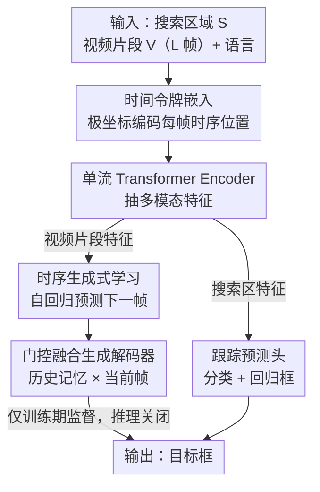

# TGTrack: Temporal Generative Learning for Unified Single Object Tracking

**会议**: CVPR 2026  
**论文**: [CVF Open Access](https://openaccess.thecvf.com/content/CVPR2026/html/Geng_TGTrack_Temporal_Generative_Learning_for_Unified_Single_Object_Tracking_CVPR_2026_paper.html)  
**代码**: https://github.com/wtg1/TGTrack  
**领域**: 视频理解 / 单目标跟踪  
**关键词**: 单目标跟踪, 时序建模, 生成式学习, 自回归预测, 多模态统一跟踪

## 一句话总结
TGTrack 给统一单目标跟踪框架加了一条"预测下一帧"的并行生成式监督任务——用带门控融合的自回归生成解码器和极坐标时间令牌，把以往隐式、被动的时序建模变成显式、主动的时序学习，在 5 种模态 11 个 benchmark 上刷新 SOTA（LaSOT AUC 75.3%）。

## 研究背景与动机

**领域现状**：单目标跟踪（SOT）给定首帧框、要在整段视频里持续定位目标。近年的 RGB 跟踪器把 backbone 和大规模训练做得很强，又进一步把深度、热红外、事件流、语言描述等模态接进来，发展出"一个模型统一多模态"的 unified tracking（如 SUTrack 第一次覆盖全部 5 种模态任务）。

**现有痛点**：这些工作几乎都把精力压在架构设计和模态融合上，**时序建模被当成附属品**。现有时序方案分两派：一派靠手工参数更新模板帧（template update），对参数设置敏感、泛化差；另一派在帧间传播少量时序 token（token propagation）。两派的共同毛病是——都只是把"和时序相关的内容"塞进输入里**隐式**编码，**没有显式的时序监督信号**，模型从没被真正"教过"目标和场景是怎么随时间演化的。

**核心矛盾**：跟踪的监督几乎全是空间监督（模板匹配 / 当前帧定位），时间维度上没有任何 loss 去约束模型理解"帧到帧的变化"。于是模型对目标外观的动态变化、运动连续性的适应能力受限。

**本文目标**：给跟踪引入一个**时间感知的学习目标**，显式地逼模型去理解目标与场景如何随时间演化，且要在统一多模态设定下验证。

**切入角度**：作者从生成式学习的视角切入——既然生成模型能学到数据的演化分布，那就让跟踪器**预测未来帧的表征**，把"生成"当作一种时序监督信号（注意：不是为了生成高质量图像，而是借生成这个目标来逼模型学会时序动态）。

**核心 idea**：在常规跟踪头之外并行挂一条**自回归预测下一帧表征**的生成式任务，配上能区分"何时"的时间令牌，把时序建模从"被动接收"扭转为"主动理解"。

## 方法详解

### 整体框架

TGTrack 沿用单流（one-stream）transformer 架构。输入有三路：搜索区域 $S$、一段视频片段 $V$（$L$ 帧，充当参考模板）、以及语言描述。$S$ 和 $V$ 都按 SUTrack 的做法把 RGB 与其它模态图像在通道维拼接，从而一个模型吃任意模态组合。$S$、$V$ 经 stride-16 的 patch embedding 得到 $P_s$、$P_v$，语言描述过 CLIP 文本编码器 + 线性投影得到文本嵌入 $T$。给 $P_v$ 加上位置嵌入和**时间令牌嵌入**后，三路 flatten 拼成一条序列送进 transformer encoder 抽多模态特征。

抽出来的特征**分流**：对应搜索区域的特征送进跟踪预测头做定位（分类 + 回归框）；对应视频片段的特征送进**生成解码器**，自回归地预测未来帧表征、提供时序监督。关键点在于——生成解码器只在**训练时**提供显式时序监督，**推理时直接关掉**，所以不带来任何额外推理开销。

### 关键设计

**1. 时序生成式学习范式：用"预测下一帧"当显式时序监督**

这一设计直击痛点——以往时序信息只被隐式塞进输入、缺监督信号。TGTrack 把视频片段对应的 encoder 特征拿来做一个**自回归生成过程**：片段含 $L$ 帧（从原序列稀疏采样，保留长程时序关联），按帧序逐步进行——第 2 帧由第 1 帧生成，第 3 帧由第 1、2 帧生成，以此类推；第 $l$ 步在已知当前帧和前 $l-1$ 帧的条件下预测第 $l+1$ 帧的表征。预测结果 $\hat{V}_{t+1}$ 用 MSE 直接对齐真值帧表征：$L_{gen}=\frac{1}{L}\sum_{t=0}^{L}\lVert \hat{V}_{t+1}-V_{t+1}\rVert_2^2$，真值帧表征由 patchify 得到。

它和已有的生成式跟踪器（如 ARTrackV2）有本质区别：ARTrackV2 用生成只是为了"重建目标外观、更新模板"，而 TGTrack 用生成作为**时序学习信号**去建模帧到帧的过渡，目标是让模型"主动探索并内化时序演化"，而非追求生成保真度。这是把空间监督之外补上了一条时间维度的监督链。

**2. 门控融合生成解码器：自回归地把历史记忆和当前帧动态融合**

生成式学习的核心载体是这个解码器，它要解决一个老问题：自回归推进时早期帧（如 $t{=}1$）的语义会随步数衰减。解码器建在一摞 transformer block 上，并引入**门控融合（gated fusion）**动态调配历史与当前的贡献。它维护一个历史记忆，初始 $H_0=0$；每个时间步把当前帧特征 $F_t$ 和上一步记忆 $H_{t-1}$ 沿空间维拼成 $Z_t=\text{concat}(H_{t-1},F_t)$，再用一个 sigmoid 门控向量 $G_t=\sigma(W_g Z_t+b_g)$ 做自适应加权融合：

$$\tilde{F}_t = G_t \odot H_{t-1} + (1-G_t)\odot F_t$$

融合后的 $\tilde{F}_t$ 过若干 transformer block 精炼得到 $F_t^{out}$，它既用来更新记忆 $H_t=F_t^{out}$，又经 LayerNorm + 线性头投回 patch 空间得到下一帧预测 $\hat{V}_{t+1}=W_p\cdot \text{LN}(F_t^{out})+b_p$。门控让模型在预测远处帧时仍能保留并利用早期帧的语义，缓解了传统方法因时序建模范围有限而出现的特征退化。消融里去掉门控融合模块平均掉 0.84% AUC，验证了它对生成解码器内部时序特征学习的作用。

**3. 时间令牌嵌入：用极坐标旋转给每帧一个可学习的"何时"身份**

多数方法把帧特征当无序集合处理，模型只知道"看到了什么"、不知道"何时看到"。本设计给每帧注入唯一的时序身份。它用一个可学习的基础时间令牌 $t_0\in\mathbb{R}^C$，再对一组角度 $\theta=\{\theta_1,...,\theta_L\}$ 做**极坐标变换**生成各帧的时间令牌：

$$T_t = \cos(\theta_t)\cdot t_0 + \sin(\theta_t)\cdot W(t_0)$$

其中 $\theta_t\in[0,\frac{\pi}{2}]$，$W$ 是可学习线性变换。这样每帧拿到各不相同但共享同一结构的时序编码。角度默认在 $0$ 到 $\frac{\pi}{2}$ 间均匀初始化保证渐变；开启"可学习角度"模式后模型能在训练中优化角度、自学最优的帧间时序间距。最终 $T_t$ 和位置嵌入、初始 patch 嵌入相加 $E_t=E_t^{init}+T_t+P_t$，把空间布局与时序顺序统一进同一嵌入空间，几乎不增加计算开销。消融显示用非可学习时间令牌会再掉 0.58%，说明"可学习的时序编码"确实有用。

### 损失函数 / 训练策略

总目标是四项加权和：$L_{total}=\lambda_{cls}L_{cls}+\lambda_{\ell1}L_{\ell1}+\lambda_{G}L_{GIoU}+\lambda_{gen}L_{gen}$。其中分类用 focal loss、回归用 $\ell_1$ + GIoU（沿用 OSTrack 预测头），生成项 $L_{gen}$ 用 MSE。默认权重为 $\lambda_{cls}{=}1,\lambda_{\ell1}{=}5,\lambda_{G}{=}2,\lambda_{gen}{=}0.1$——生成项故意压成"正则项"量级，避免它压过跟踪主目标。训练用 AdamW，180 epoch、4×A100，每个样本含 1 搜索帧 + 5 模板帧；RGB 与多模态数据集联合训练以增强跨模态泛化。

## 实验关键数据

### 主实验（RGB-based，AUC / 关键指标）

在 5 种模态、11 个 benchmark 上评测；下表为四个大规模 RGB benchmark 的对比节选。

| 方法 | 来源 | LaSOT AUC | LaSOText AUC | TrackingNet AUC | GOT-10k AO |
|------|------|-----------|--------------|-----------------|------------|
| **TGTrack-L384** | Ours | **76.4** | **55.9** | **88.0** | **81.8** |
| TGTrack-B384 | Ours | 75.3 | 54.8 | 87.5 | 79.8 |
| TGTrack-S224（35M） | Ours | 72.9 | 52.4 | 85.3 | 77.2 |
| SUTrack-L384 | AAAI25 | 75.2 | 53.6 | 87.7 | 81.5 |
| SUTrack-B384 | AAAI25 | 74.4 | 52.9 | 86.5 | 79.3 |
| ARTrackV2-256 | CVPR24 | 71.6 | 50.8 | 84.9 | 75.9 |
| AQATrack-256 | CVPR24 | 71.4 | 51.2 | 83.8 | 73.8 |

TGTrack-L256 在 LaSOT 拿到 75.8% AUC，比统一跟踪器 SUTrack-L224 高 2.3%；多模态上 TGTrack-L384 在 DepthTrack 达 67.5% F-score（超时序跟踪器 STTrack 4.2%），LasHeR / VisEvent / TNL2K 分别 63.3% / 65.7% / 68.6%。值得注意的是 TGTrack-S224 仅 35M 参数就反超 ARTrackV2（130M）和 AQATrack（72M）。

### 消融实验（TGTrack-B256，AUC，DepthTrack 为 F-score，Δ 为多 benchmark 平均变化）

| # | 配置 | LaSOT | DepthTrack | LasHeR | TNL2K | Δ |
|---|------|-------|-----------|--------|-------|---|
| 1 | Baseline（完整） | 74.6 | 65.5 | 61.7 | 65.4 | – |
| 2 | w/o 生成解码器 GD | 73.6 | 63.5 | 60.2 | 64.2 | -1.50 |
| 3 | w/o 时间令牌 TTE | 74.3 | 65.1 | 61.3 | 64.8 | -0.44 |
| 4 | w/o (GD + TTE) | 73.4 | 61.6 | 59.0 | 63.8 | -2.36 |
| 5 | w/o 门控融合 GFM | 74.0 | 64.5 | 60.9 | 64.5 | -0.84 |
| 6 | 非可学习时间令牌 | 74.1 | 64.6 | 61.6 | 65.0 | -0.58 |
| 7 | 预测当前帧（非下一帧） | 73.9 | 63.9 | 60.9 | 64.6 | -0.90 |

### 关键发现
- **生成解码器贡献最大**：去掉它平均掉 1.50%，时间令牌贡献较小（0.44%），两者一起去掉掉 2.36%，说明显式时序学习是涨点主力。
- **"预测下一帧"的方向不能改**：改成预测当前帧（配置 #7）掉 0.90%，证明 next-frame 预测才真正捕捉到了时序动态，否则退化成自编码。
- **超参敏感性**：生成解码器深度 8 层最优（4/6/10 层都更差，过浅建模不足、过深优化难）；视频片段 5 帧最佳（3-4 帧时序上下文不足、6 帧冗余分散注意力）；生成 loss 权重 0.1 最优（0.01 监督太弱、0.5/1 喧宾夺主）。
- **零推理开销**：生成解码器训练后即弃用，TGTrack-T224 能在 Intel i9 CPU 上 26 FPS 实时跑，却仍大幅超越轻量跟踪器。

## 亮点与洞察
- **把"生成"重新定位成监督信号而非产物**：同样用生成式目标，ARTrackV2 是为了重建外观更新模板，TGTrack 是借生成逼模型学帧间过渡——同一工具、完全不同的用法，这个视角切换很巧。
- **训练增强、推理零成本**：生成解码器是纯训练期"脚手架"，推理时拆掉，等于免费拿到时序监督带来的鲁棒性，工程上非常友好，这个范式可迁移到其它"训练期辅助任务"的设计。
- **极坐标时间令牌**：用 $\cos/\sin$ 旋转一个共享基令牌得到各帧时序身份，既保证帧间结构一致又给每帧唯一编码，还能让角度可学习，比直接给每帧独立可学 embedding 更省参数、更有结构先验。
- **门控融合缓解自回归特征退化**：sigmoid 门动态平衡历史记忆与当前帧，是解决长程自回归里早期信息衰减的轻量手段，可复用到其它序列建模。

## 局限与展望
- 论文未充分讨论生成解码器在训练期的**额外显存/时间开销**有多大（虽然推理零开销，但训练多挂一条自回归生成支路对训练成本的影响值得量化）。⚠️ 以原文为准。
- 视频片段固定为稀疏采样的 5 帧，对**超长程目标外观剧变**或**极快运动**是否够用没有专门验证；片段长度的 trade-off 也意味着该设计对采样策略有一定敏感性。
- 生成监督是 MSE 对齐 patch 表征，本质是 L2 重建；是否会偏向"平滑/低频"预测、对高频细节的时序变化建模是否充分，值得进一步分析。
- 改进思路：可探索把生成目标从 MSE 换成对比式/分布式时序监督，或让生成解码器在推理期也以极低成本参与，进一步榨取时序信息。

## 相关工作与启发
- **vs SUTrack（统一跟踪 SOTA）**：SUTrack 第一次把 5 种模态统一进单模型，但时序建模仍薄弱；TGTrack 在其统一设定上**补一条显式时序生成监督**，LaSOT 上以同体量稳定超出 1-2%+。
- **vs 模板更新派（如 template update）**：那一派靠手工参数更新模板、对参数敏感；TGTrack 不更新模板，而是用可学习的生成任务隐式注入时序，泛化更稳。
- **vs token 传播派（如 ODTrack/STTrack）**：那一派在帧间传播少量时序 token、属隐式编码；TGTrack 给出**显式监督信号**（预测下一帧），并在 DepthTrack 上超 STTrack 4.2% F-score。
- **vs ARTrackV2（生成式跟踪）**：同用生成目标，ARTrackV2 重建外观做模板更新，TGTrack 用生成建模帧间过渡作时序学习信号——出发点根本不同，且 TGTrack 全面更优。

## 评分
- 新颖性: ⭐⭐⭐⭐ 把生成式目标重新定位为"时序监督信号"、配极坐标时间令牌，视角清晰且与 ARTrackV2 区分明确。
- 实验充分度: ⭐⭐⭐⭐⭐ 5 模态 11 benchmark + 六个模型规模 + 组件/深度/帧长/loss 权重全套消融，非常扎实。
- 写作质量: ⭐⭐⭐⭐ 动机与方法叙述清晰，公式完整；图依赖原文 Fig.1/2 理解。
- 价值: ⭐⭐⭐⭐ 训练增强、推理零开销的范式实用，统一跟踪 SOTA，易被后续工作借鉴。

<!-- RELATED:START -->

## 相关论文

- [\[CVPR 2026\] UETrack: A Unified and Efficient Framework for Single Object Tracking](uetrack_a_unified_and_efficient_framework_for_single_object_tracking.md)
- [\[CVPR 2026\] Toward Low-Cost yet Effective Temporal Learning for UAV Tracking](toward_low-cost_yet_effective_temporal_learning_for_uav_tracking.md)
- [\[CVPR 2026\] Drift-Resilient Temporal Priors for Visual Tracking](drift-resilient_temporal_priors_for_visual_tracking.md)
- [\[CVPR 2026\] Temporally Consistent Long-Term Memory for 3D Single Object Tracking](chronotrack_temporally_consistent_long_term_memory_for_3d_single_object_tracking.md)
- [\[CVPR 2026\] SpikeTrack: High-performance and Energy-efficient Event-Based Object Tracking with Spiking Neural Network](spiketrack_high-performance_and_energy-efficient_event-based_object_tracking_wit.md)

<!-- RELATED:END -->
