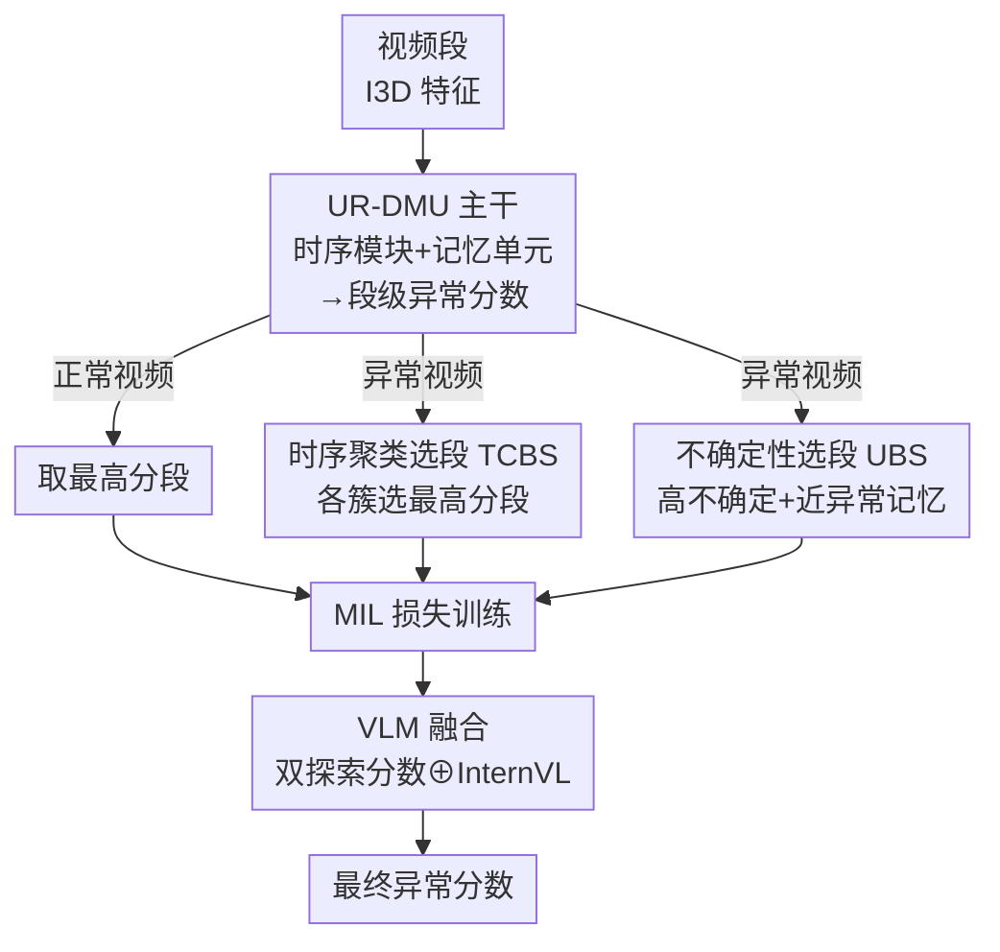

# The Road Less Seen: Segment Exploration for Weakly Supervised Video Anomaly Detection

**会议**: CVPR 2026  
**论文**: [CVF Open Access](https://openaccess.thecvf.com/content/CVPR2026/html/Acharya_The_Road_Less_Seen_Segment_Exploration_for_Weakly_Supervised_Video_CVPR_2026_paper.html)  
**代码**: 待确认  
**领域**: 视频理解  
**关键词**: 弱监督视频异常检测, 多示例学习, 段级探索, 不确定性采样, VLM 融合

## 一句话总结
针对弱监督视频异常检测里 top-k 选段"只盯最高分段、漏掉分散且模糊的异常"的痛点，本文提出**时序聚类 + 不确定性双探索**策略来覆盖多样且暧昧的异常段，并主张用 Recall@FPR 与 AP 取代被严重类别不平衡"灌水"的 AUROC，在 UCF-Crime 上把 AP 从 35.48% 提到 38.33%。

## 研究背景与动机
**领域现状**：弱监督视频异常检测（WSVAD）只用视频级标签训练，主流框架是多示例学习（MIL）——把异常视频当成至少含一个异常段的"正包"、正常视频当成全是正常段的"负包"，训练时通过 top-1 或 top-k 选出正包里分数最高的几个段当作异常段来算损失，目标是拉大正负段的异常分数间隔。评测则几乎清一色用 AUROC。

**现有痛点**：作者首先戳破了一个被普遍忽视的事实——**高 AUROC 是假象**。在正常段远多于异常段的极度不平衡场景下，AUROC 衡量的是"模型把随机正样本排在随机负样本之上"的概率，只要大量正常段被正确排序，分数就能很高，却完全掩盖了召回的崩塌。论文实测：UR-DMU 在 UCF-Crime 上 AUROC 高达 0.8697，但在可用的 FPR 阈值下漏掉约 15,000 个异常段，召回极低；反过来 VadCLIP 召回上去了却制造 29 万+ 误报，几乎是 UR-DMU 的两倍，实际同样不可用。

**核心矛盾**：低召回的根因在于 **top-k 选段策略本身的偏置**。固定的 k 太死板（不同视频的真实异常段数未知且不同）；高分段往往扎堆在某个事件的窄时间窗内，导致 top-k 只覆盖单个事件、漏掉时序上分散的多个异常；而且这种策略天然偏爱运动剧烈、易分类的"简单"段，对细微复杂的异常视而不见。即便后续 DRO（自适应 k）、Unbiased MIL（把段分成自信集/暧昧集再聚类）等方法做了缓解，选段仍依赖最高异常分，且 Unbiased MIL 还假设所有异常语义相似，无法覆盖多样的异常模式。

**本文目标**：让模型在训练时**不只看最高分段，而是系统性地探索正包里所有潜在异常段**——既要覆盖时序上分散、语义多样的不同异常事件，也要照顾那些低分但模型本身拿不准的暧昧段。

**切入角度**：作者把"选段"重新理解为一个**探索问题**。但强化学习式的硬探索因缺乏段级监督而不可行，于是设计了一种"软探索"——用聚类保证多样性、用预测不确定性挖掘暧昧样本，两路互补。

**核心 idea**：用"**时序聚类选多样段 + 不确定性选暧昧段**"的双探索替代 top-k，再融合一个免训练 VLM 的预测来兜底真正新颖/未见的异常，同时改用 Recall@FPR 与 AP 做更贴近实战的评测。

## 方法详解

### 整体框架
方法建在 MIL 训练框架上：用 Kinetics 预训练的 I3D 抽段级特征，过 UR-DMU 的全局-局部时序模块与记忆单元，分类器输出段级异常分数。关键改动发生在"拿到分数后怎么选段算 MIL 损失"这一步——**正常视频仍只取最高分段**（鼓励整段压低分数），**异常视频则走双探索**：一路是时序聚类选段（TCBS），从不同时序簇里各挑一个高分段以保证事件多样性；另一路是不确定性选段（UBS），挑那些低分但预测不确定、且与"异常记忆"高度相似的暧昧段。两路选出的段一起进 MIL/不确定性损失训练。推理时，再把双探索模型的分数与 VLM（InternVL3）的免训练预测做加权融合，得到最终异常分数。

### 关键设计

**1. 时序聚类选段 TCBS：让选出的段覆盖不同时间、不同场景的异常事件**

这一路直接针对 top-k"高分段扎堆单一事件"的偏置。做法是先把视频段按**特征相似度 + 时序邻近**做在线聚类：第一个段开第一个簇，之后每个段若与前一簇代表特征的余弦相似度 $S(\mathbf{x}_i,\mathbf{x}_j)=\frac{\mathbf{x}_i^\top \mathbf{x}_j}{\|\mathbf{x}_i\|\|\mathbf{x}_j\|}$ 超过阈值 $\tau_s$ 就并入该簇，否则另起新簇——这样每个簇近似对应一个"场景/事件"，不同场景被自然切开。阈值 $\tau_s$ 不是写死的，而是按每个视频的相邻段相似度分布取 $q$-分位数（如 $q=0.03$）**自适应**得到：爆炸这类剧烈场景相邻相似度低、自然多分簇，虐待/盗窃这类细微异常相似度高、簇更少；$q$ 越小越难起新簇、簇越少。选段时每个簇只允许选**异常分数最高且超过动态阈值 $\tau_a$** 的那一个段，集合写成 $\mathcal{K}=\bigcup_{i=1}^{H}\{k:k=\arg\max_{j\in C_i}p_j,\ f(\mathbf{x}_k^+)\ge\tau_a\}$（$H$ 为簇数，$\tau_a$ 取视频内异常分数的某个百分位）。一簇一选 + 跨簇多样，确保被选中的是分布在不同时间的多个异常事件，而不是同一事件里连续排名的几段。

**2. 不确定性选段 UBS：把低分但模型拿不准、又像异常的暧昧段捞回来训练**

光靠聚类还会漏掉那些**异常分数本身就低、过不了阈值**的异常段。作者观察到这类段往往有**高预测不确定性**，于是用一个由 $M$ 个不同初始化模型组成的集成，把同一段在各模型上异常分数的标准差作为段级不确定性 $u_i$。但高不确定的段里也混着正常段，所以再加一道**异常记忆相似**的门槛：候选集 $\mathcal{U}$ 要同时满足 (i) $u_i>\tau_u$ 且 (ii) 与异常记忆的平均余弦相似度 $\frac{1}{|AM|}\sum_j S(\mathbf{x}_i^+,\mathbf{x}_j^{AM})>\tau_s^m$。对 $\mathcal{U}$ 里的段把目标分数设为 1 算 BCE：$\mathcal{L}_{UNC}=\frac{1}{|\mathcal{U}|}\sum_{i\in\mathcal{U}}\text{BCE}(f(\mathbf{x}_k^+),1)$。妙处在于它自带一个隐式的"退火"效果：训练早期记忆随机初始化、与不确定段的相似度普遍低于 0.7，几乎选不到段，避免在不可靠的初始不确定性上乱训练；随着模型学到异常模式、相似度上升才开始纳入这些段，且被纳入后整体不确定性又会随训练下降——靠精心设置 $\tau_s^m$ 与 $\tau_u$ 就近似实现了余弦退火调度器的作用，无需显式实现。

**3. VLM 知识融合：用免训练大模型兜住记忆覆盖不到的真·新异常**

UBS 依赖异常记忆，而记忆本质是模型对已见异常的先验，**真正新颖/未见、与记忆差异大的异常**仍会被漏。为此作者引入 InternVL3 这类大规模预训练 VLM 的泛化能力——但**不微调**（微调成本高），而是用结构化 prompt 做免训练推理、多次输出取平均得到 VLM 的置信分 $y_{VLM}$，再与双探索模型分数 $y_{Dual}$ 加权融合：$y_{combined}=\lambda\,y_{Dual}+(1-\lambda)\,y_{VLM}$，$\lambda\in[0,1]$ 调优。实验显示 VLM 在很低 FPR 下召回更强（适合做置信兜底），但单用它会把许多不明显的异常误判为正常、整体排序差，所以是融合而非替换。

### 损失函数 / 训练策略
总损失把 MIL 损失、不确定性选段损失与 UR-DMU 基线损失叠加：$\mathcal{L}_{Dual}=\mathcal{L}_{MIL}+\gamma\,\mathcal{L}_{UNC}+\mathcal{L}_{URDMU}$，其中 $\mathcal{L}_{MIL}=\text{BCE}(y,\hat{y})$ 由聚类选段得到的正包预测算出（正包标签取所选段分数均值、负包取最大段分数）。不确定性 $u_i$ 每个 epoch 重算更新；$\gamma$ 控制 $\mathcal{L}_{UNC}$ 权重。

## 实验关键数据

### 主实验
两个标准 WSVAD 基准：UCF-Crime（1900 段监控视频，13 类异常）与 XD-Violence（4754 段电影/YouTube 视频）。评测刻意弃用 AUROC，改用 **AP（PR 曲线下面积）+ Recall@FPR**（在固定误报率 α 下的召回），更贴近"误报受限"的真实部署，并用误分类代价 $\text{MCC}=W\times\text{FN}+\text{FP}$（漏报罚 W 倍）佐证。

| 数据集 | 指标 | 本文(Dual+InternVL) | UR-DMU | VadCLIP | InternVL3-14B(免训练) |
|--------|------|------|--------|---------|------|
| UCF-Crime | AP (%) | **38.33** | 35.48 | 33.55 | 29.50 |
| UCF-Crime | Recall@FPR=2% | **0.263** | 0.170 | 0.155 | 0.301 |
| UCF-Crime | Recall@FPR=3% | **0.336** | 0.212 | 0.217 | 0.418 |
| XD-Violence | AP (%) | **84.58** | 79.14 | 84.50 | 69.85 |
| XD-Violence | Recall@FPR=5% | **0.715** | 0.638 | 0.672 | 0.637 |

本文在两个数据集上 AP 均为最高（UCF-Crime 38.33%、XD-Violence 84.58%），且在可行的低 FPR 区间普遍优于其他弱监督方法。免训练 InternVL 在极低 FPR 下召回更高（故值得融合），但 AP 偏低、整体排序差——印证它适合做置信兜底而非独当一面。

### 消融实验
| Baseline | TCBS | UBS | VLM | AP (%) | Recall@FPR=3% |
|:--:|:--:|:--:|:--:|:--:|:--:|
| ✓ | | | | 35.48 | 0.212 |
| ✓ | ✓ | | | 34.25 | 0.207 |
| ✓ | | ✓ | | 34.58 | 0.243 |
| ✓ | ✓ | ✓ | | 36.42 | 0.256 |
| ✓ | ✓ | ✓ | ✓ | **38.33** | **0.336** |

### 关键发现
- **TCBS、UBS 单独上略降 AP（34.25/34.58 vs 35.48），但两者协同就反超到 36.42**——说明多样性探索与暧昧性探索是互补的，单独任一路都不足以覆盖完整异常谱，合在一起才发挥作用。⚠️ 单组件 AP 略降的具体原因论文未深究，以原文为准。
- **VLM 融合贡献最大的边际提升**：在双探索基础上加 InternVL 把 AP 从 36.42 拉到 38.33、Recall@FPR=3% 从 0.256 拉到 0.336，主要补的是记忆覆盖不到的新异常。
- **按事件类型看（表4）异常检测能力高度不均**：Dual Exploration 在 Burglary（AUROC 0.89）、Assault（0.81）上强，但 Explosion 仅 0.47——细微/突发类异常仍是难点。
- AUROC 的误导性被实证：UR-DMU AUROC 0.8697 却漏 ~15k 异常段；在 UCF-Crime 上 5% FPR 就意味着 5 万+ 误报（≈50 段额外视频），实战不可接受，故必须看低 FPR 下的召回。

## 亮点与洞察
- **指标层面的"打假"很有价值**：论文最大的"啊哈"不在模型而在评测——系统性论证了 AUROC 在极度类别不平衡的安全攸关场景下会给出过度乐观的假象，并用 Recall@FPR + AP + 误分类代价三件套替代。这个洞察可迁移到任何"漏报代价远高于误报、且负样本压倒性多数"的检测任务（医疗筛查、欺诈检测）。
- **把"选段"重构成"探索"**：用聚类管多样性、用不确定性管暧昧性的双路设计，思路清晰且各自针对 top-k 的一种具体偏置，互补性强。
- **隐式退火的巧思**：不去显式写余弦退火调度器，而是靠"记忆相似度随训练自然升高"这一动力学，用 $\tau_s^m$、$\tau_u$ 两个阈值近似实现"早期少选、后期多选"的调度——省事且自洽。
- **免训练用 VLM 兜底**：不微调、只取置信分做加权融合，低成本利用大模型泛化能力补开放集异常，是可复用的轻量 trick。

## 局限与展望
- **对突发/细微异常仍弱**：Explosion 类 AUROC 仅 0.47，时序聚类对剧烈场景多分簇反而可能打散单一突发事件。
- **超参数偏多且耦合**：$\tau_s$、$\tau_a$、$\tau_u$、$\tau_s^m$、$q$、$\gamma$、$\lambda$ 一大把，"隐式退火"依赖对 $\tau_s^m$/$\tau_u$ 的精心设置，跨数据集的鲁棒性需打问号；论文把实现细节与超参放在补充材料，正文不易复现。⚠️ 具体取值以原文/补充材料为准。
- **UBS 需训练 M 个集成模型估不确定性**，训练成本上升，论文未在正文给出 M 的取值与开销分析（在补充材料）。
- **改进思路**：把固定阈值的探索换成可学习/可调度的探索预算；对突发类异常引入更细粒度的时序边界建模；融合权重 $\lambda$ 可做成按视频/按段自适应而非全局调优。

## 相关工作与启发
- **vs RTFM / top-k 系**: 它们取 top-k 高分段学习，本文指出固定 k 死板且高分段扎堆单一事件、偏爱简单段；本文用时序聚类一簇一选保证事件多样、用不确定性捞低分暧昧段，优势是覆盖更全，代价是探索机制更复杂。
- **vs DRO（自适应 k）/ BNSVP（时序聚类取簇内最高分）**: 二者仍以最高异常分为选段依据、偏向简单上下文；本文额外引入"不确定性 + 异常记忆相似"这条与分数高低无关的通道，专挖被分数掩盖的暧昧异常。
- **vs Unbiased MIL**: 它把段分成自信/暧昧集再聚类，但假设所有异常语义相似、难覆盖多样异常；本文不做语义同质假设，靠时序聚类显式保证跨事件多样性，并用 VLM 兜底新异常。
- **vs VadCLIP / CLIP 系**: 它们用 CLIP 多模态特征提升定位，但召回高的同时误报爆炸（29 万+）；本文坚持 I3D 主干、把 VLM 仅作免训练融合兜底，避免被 VLM 的高误报拖累整体排序。

## 评分
- 新颖性: ⭐⭐⭐⭐☆ 指标"打假" + 双探索 + VLM 融合的组合有新意，但各组件多为已有思路的巧妙组装
- 实验充分度: ⭐⭐⭐⭐☆ 两数据集、完整消融、按事件类型细分、误分类代价分析齐全，唯超参/集成开销藏在补充材料
- 写作质量: ⭐⭐⭐⭐☆ 动机推导（AUROC 为何失效）讲得透彻，方法叙述清晰
- 价值: ⭐⭐⭐⭐⭐ 把 WSVAD 评测拉回"实战可用召回"这件事对高风险落地很有意义

<!-- RELATED:START -->

## 相关论文

- [\[CVPR 2026\] Learning from Noisy Supervision: A Denoising-Debiasing Framework for Weakly Supervised Video Anomaly Detection](learning_from_noisy_supervision_a_denoising-debiasing_framework_for_weakly_super.md)
- [\[CVPR 2026\] Weakly Supervised Video Anomaly Detection with Anomaly-Connected Components and Intention Reasoning](weakly_supervised_video_anomaly_detection_with_anomaly-connected_components_and_.md)
- [\[CVPR 2026\] TLMA: Mitigating the Impact of Weakly Labeled Information for Video Anomaly Detection](tlma_mitigating_the_impact_of_weakly_labeled_information_for_video_anomaly_detec.md)
- [\[CVPR 2026\] Joint Learning of General and Diverse Patterns with Mixture of Memory Experts for Weakly-Supervised Video Anomaly Detection](joint_learning_of_general_and_diverse_patterns_with_mixture_of_memory_experts_fo.md)
- [\[AAAI 2026\] RefineVAD: Semantic-Guided Feature Recalibration for Weakly Supervised Video Anomaly Detection](../../AAAI2026/video_understanding/refinevad_semantic-guided_feature_recalibration_for_weakly_supervised_video_anom.md)

<!-- RELATED:END -->
