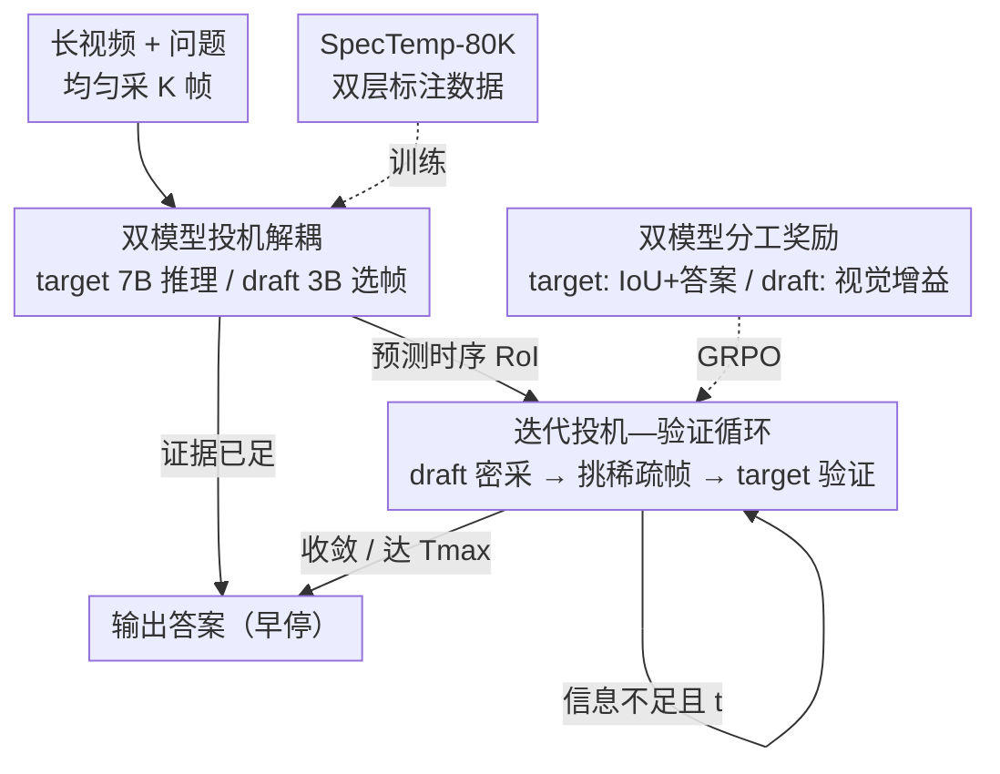

# Thinking with Drafts: Speculative Temporal Reasoning for Efficient Long Video Understanding

**会议**: CVPR 2026  
**论文**: [CVF Open Access](https://openaccess.thecvf.com/content/CVPR2026/html/Hu_Thinking_with_Drafts_Speculative_Temporal_Reasoning_for_Efficient_Long_Video_CVPR_2026_paper.html)  
**代码**: 待确认  
**领域**: 视频理解  
**关键词**: 长视频理解, 投机解码, 双模型协同, 帧选择, 强化学习  

## 一句话总结
SpecTemp 把"thinking-with-frames"里耗时的帧放大过程外包给一个轻量 3B draft MLLM 去密集采样、挑稀疏关键帧，让 7B target MLLM 只负责时序推理和验证，靠投机—验证迭代循环在 8 个视频 benchmark 上保持甚至提升精度的同时把推理延迟降了约 20%。

## 研究背景与动机

**领域现状**：长视频理解的前沿做法是 thinking-with-frames 范式——模型不再一次性吞下整段视频，而是交替做两件事：先从长时段里读出"时序线索"（哪段最可能藏着答案），再在那段里密集采样帧、做局部细看，如此迭代逐步把注意力收敛到信息量最高的片段上，从而支撑跨长时序的有据推理。

**现有痛点**：这套范式有个致命的效率瓶颈——它会不断把高层推理轨迹和密集采样的视觉 token 都累积进上下文，多模态序列越滚越长。作者在 Qwen2.5-VL-7B 上画注意力图发现，语言 token 只稀疏地关注一小撮视觉 token，存在明显的"模态边界"；进一步统计注意力分数是长尾分布，**超过 90% 的视觉 token 注意力分数低于 $10^{-3}$**，几乎不参与推理却照样占满上下文、拖慢 prefill。

**核心矛盾**：精度需要密集采样去看清细节，但密集采样带来的海量冗余视觉 token 又直接拖垮推理效率——感知（要密、要全）和推理（要精、要快）这两件事被硬塞进同一个大模型、同一条上下文里，于是二者互相拖累。

**切入角度**：作者从 LLM 的投机解码（speculative decoding）借灵感——用一个轻量 draft 模型快速猜测中间 token，再用强 target 模型并行验证，能在不掉精度的前提下显著加速。如果把"帧放大/密集探索"这个最耗时的环节当成可以被"投机"的对象交给小模型，大模型只做验证，是不是就能解耦感知与推理？这个角度还对应人脑皮层的协同：一条快速感知通路（lemniscal）先扫一遍场景，一条慢速认知通路（extralemniscal）再整合验证。

**核心 idea**：用"轻量 draft MLLM 投机式密集采样选帧 + 强 target MLLM 时序推理并验证"的双模型协同，把时序感知从推理里解耦出来，迭代到收敛。

## 方法详解

### 整体框架
SpecTemp 是一个双系统协同框架：**target MLLM（7B）** 负责时序推理与验证，**draft MLLM（3B）** 专精密集感知与细粒度选帧，两者参数量严重不对称（$|\pi_{\text{draft}}| \ll |\pi_{\text{target}}|$），正是这种不对称让小模型能廉价地密集探索、大模型专心做高层推理。

整体似然被拆成 target 与 draft 协作的乘积形式：

$$\prod_{\le T_{\max}} \pi_{\text{target}}\!\left(W^a, V^d \mid W^q, V^s\right)\cdot \pi_{\text{draft}}\!\left(V^s \mid V^d\right)$$

其中 $V^d$ 是 target 预测出的关注区域内密集采样的帧（如 1 fps），$V^s$ 是 draft 从中挑出的稀疏代表帧（如 2 帧），$T_{\max}$ 是最大迭代轮数。

工作流（Algorithm 1）：① 先均匀采 $K$ 帧喂给 target 做初始推理，若证据已足够就直接出答案（早停）；② 否则 target 输出一个需要进一步细看的时序兴趣区 RoI，draft 在该区内密集采样、只挑回少量稀疏关键帧；③ target 拿到这些帧后继续推理+验证，决定信息是否够、不够就再触发一轮 draft 投机，直到收敛或达到 $T_{\max}$。注意 draft 只用**当前轮**的推理轨迹做条件，而 target 用**全部历史**推理轨迹——小模型轻装上阵不背历史包袱，大模型才负责跨轮整合。

### 关键设计

**1. 双模型投机式解耦：把密集感知从大模型上卸下来**

针对的痛点是 thinking-with-frames 把密集采样的视觉 token 全堆进 7B 模型的上下文、prefill 被海量低注意力 token 拖垮。SpecTemp 直接把"密集采样+选帧"这件苦力活整体外包给 3B draft 模型：draft 在 target 指定的时序区域里以 1 fps 密集采样，但只把每轮 2 帧最有信息量的稀疏子集 $V^s$ 交回给 target；target 永远只面对少量稀疏帧，不再亲自处理密集帧海。这和 LLM 投机解码的"小模型猜、大模型验"是同构的，只是把被投机的对象从"token"换成了"该看哪几帧"——延迟分解实验显示瓶颈正是 LLM prefill，把密集探索移到小模型上后 prefill 显著缩短，SpecTemp 的总延迟（2.3s）低于 VideoChat-R1.5（2.8s）和纯 7B 基线（2.5s）。

**2. 迭代投机—验证循环：让大模型一轮轮收敛注意力而不是一次看全**

target 第一轮在均匀采的帧上做初始推理 $T_0, V^d_0, W^a = \pi_{\text{target}}(W^q, V^s_0)$，这里 $T_0$（推理轨迹+RoI）和 $W^a$（答案）互斥——证据够就直接出答案，不够就吐一个时序证据区触发下一步。随后每轮 draft 投机 $V^s_t = \pi_{\text{draft}}(V^d_t; T_{t-1})$ 给出稀疏帧，target 验证 $(T_t, V^d_t, W^a) = \pi_{\text{target}}(V^s_t; T_{<t})$，其中 $T_{<t}=\{T_0,\dots,T_{t-1}\}$ 是跨轮累积的推理轨迹。这个循环的价值在于注意力是**渐进收敛**的：不是一上来就密集看全片（那会带来 90% 的废 token），而是每轮只在最可疑的区域加采几帧、验证是否够，实测把最大迭代设为 3 即可在精度和效率间取得平衡。

**3. 双模型分工奖励：用不同奖励逼出各自该有的专长**

为了让两个模型真正各司其职，RFT 阶段（GRPO）给它们设计了不同的奖励。target 拿三路信号：格式奖励 $R^{\text{target}}_{\text{format}}$（检查 `<think>/<segment>/<answer>` 结构）、答案奖励 $R_{\text{answer}}$（对 GT 判对错）、IoU 奖励 $R_{\text{IoU}}$（预测证据段与 GT 时序区的交并比），合成 $R_{\text{target}}=R^{\text{target}}_{\text{format}}+R_{\text{answer}}+R_{\text{IoU}}$——IoU 奖励是逼 target 把时序定位做准的关键。draft 拿两路：格式奖励 $R^{\text{draft}}_{\text{format}}$ 和**视觉信息增益奖励**

$$R_{\text{visual}} = \text{Sim}_{\text{CLIP}}(q, f_i) - \max_{f_j \in F_{\text{prev}}} \text{Sim}_{\text{CLIP}}(f_i, f_j)$$

第一项用 CLIP 相似度奖励"和问题相关的帧"，第二项减去和已选帧的最大相似度来**惩罚冗余**——这正是逼 draft 选出既相关又彼此互补的稀疏帧、而不是挑一堆近似画面的核心。两个模型用统一的策略学习目标联合优化（带 KL 正则约束到参考模型）。

**4. SpecTemp-80K 双层标注数据集：给双模型造出"该看哪段/该挑哪帧"的监督**

双模型协同没有现成训练数据，作者构建了 80K 规模、带同步双层标注的数据集，四阶段流水线：数据采集（短<1min 的 CLEVRER/PerceptionTest/STAR/NeXT-GQA、中 1–10min 的 LLaVA-Video/ActivityNet/YouCook2、长>10min 的 MovieChat/Ego4D）→ 用 GPT-4o 生成场景级 caption（粗证据段，供 target）和帧级 caption（细粒度帧证据，供 draft）→ 用 GPT-4o 合成多轮 `<think>/<segment>/<frame>/<answer>` 推理轨迹来模拟投机—验证过程 → 人工抽检过滤掉时序证据错误或选帧不一致的轨迹。这套"粗段给大模型、细帧给小模型"的同步双层监督，正是让两个模型在训练时就分别学到各自职责的前提；优化分两阶段：先冷启动 SFT 分别建立两模型的验证能力与细粒度选帧能力，再 RFT 用上面的奖励联合精炼协同决策。

## 实验关键数据

target/draft 均由 Qwen2.5-VL 初始化（7B + 3B）；初始均匀采 10 帧，draft 在预测区内 1 fps 密采、每轮选 2 帧，最大迭代 3 轮。对标 16 帧基线时用"10 初始帧 + 至多 3×2 帧"，对标 64 帧基线时用"32 初始帧 + 至多 4×8 帧"。

### 主实验

短视频 benchmark（精度 / 平均帧数 / 延迟）：

| 模型 | 帧数 | TempCompass | MVBench | MMVU(mc) | VSI-Bench | 延迟(s) |
|------|------|-------------|---------|----------|-----------|---------|
| Qwen2.5-VL-7B | 16 | 72.2 | 64.1 | 65.7 | 34.3 | 2.1 |
| **SpecTemp** | 13.7 | 75.3 (+3.1) | 68.7 (+4.6) | 67.8 (+2.1) | 37.4 (+3.1) | **1.8** |
| VideoChat-R1.5 | 64 | 77.3 | 70.6 | 70.1 | 39.4 | 5.8 |
| **SpecTemp** | 47.6 | 77.2 | 69.3 | 70.4 | 39.7 | 4.7 (快 19%) |

长视频 benchmark：

| 模型 | 帧数 | Video-Holmes | LongVideoBench | MLVU | Video-MME | 延迟(s) |
|------|------|--------------|----------------|------|-----------|---------|
| Qwen2.5-VL-7B | 16 | 35.0 | 54.5 | 40.6 | 56.0 | 4.1 |
| **SpecTemp** | 14.5 | 47.0 (+12.0) | 57.5 (+3.0) | 48.6 (+8.0) | 62.4 (+6.4) | **3.7** |
| VideoChat-R1.5 | 64 | 45.1 | 60.6 | 52.3 | 63.4 | 11.5 |
| **SpecTemp** | 58.1 | 47.8 | 61.4 | 50.9 | 64.1 | 8.9 (快 23%) |

亮点是长视频上对 7B 基线的提升尤为显著（Video-Holmes +12.0%、MLVU +8.0%），说明长片里"先定位相关时序段再细看"对精度的杠杆最大；同时平均只用十几帧就把延迟压下来。

### 消融实验

帧选择策略（四 benchmark，LongVideoBench 列举其一）：

| 选帧策略 | 帧数 | MMVU(mc) | Video-Holmes | LongVideoBench | Video-MME |
|----------|------|----------|--------------|----------------|-----------|
| Uniform 均匀采样 | 16 | 65.8 | 39.5 | 55.3 | 57.3 |
| Target + Uniform | 16 | 66.3 | 43.2 | 55.6 | 58.3 |
| Target + CLIP | 16 | 67.1 | 45.1 | 56.7 | 60.5 |
| **Ours (Target + Draft)** | 14.1 | **67.8** | **47.0** | **57.5** | **62.4** |

模型协同（LongVideoBench，Efficiency = Acc/Latency）：

| 配置 | Target | Draft | Acc.(%) | 延迟(s) | Eff. |
|------|--------|-------|---------|---------|------|
| Large only | 7B | 7B | 54.1 | 3.1 | 17.5 |
| Small only | 3B | 3B | 40.3 | 1.7 | 23.7 |
| **Ours (L+S)** | 7B | 3B | **57.5** | 2.3 | **25.0** |

训练策略（LongVideoBench，Acc / Format Acc）：纯 baseline 54.5 / 40.6 → target SFT 55.3 / 95.2 → +target RL 56.3 / 96.5 → +draft SFT 55.8 / 98.7 → 全量 SFT+RL 双模型 **57.5 / 99.5**。

### 关键发现
- **训练专门的 draft 模型 > 启发式选帧**：Target+CLIP（用 CLIP 相似度选帧）已经比均匀采样好 +2.5%，但学出来的 Target+Draft 在所有 benchmark 上更优、且自适应帧数更少（14.1 帧）——说明"选哪帧"本身值得用 RL 专门训练而非靠现成相似度。
- **小模型单干会塌**：Small only(3B) 虽快（1.7s）但精度暴跌到 40.3%，推理能力撑不住；双模型协同能在精度（57.5%，超过 Large only 的 54.1%）和效率（25.0，最高）上同时占优，验证了"解耦感知与推理"的核心假设——大模型还省了延迟，不是简单的精度换速度。
- **瓶颈是 LLM prefill**：延迟分解显示 prefill 主导总耗时，VideoChat-R1.5 因上下文不断膨胀延迟最高（2.8s），SpecTemp 把密集探索卸给 3B、只递稀疏帧给 7B，prefill 开销最小（2.3s）。
- **RL 主要补的是协同决策**：SFT 先把两模型的输出结构和基本能力立起来（format acc 一路冲到 98.7%+），RL 再通过 IoU/视觉增益奖励精炼时序定位与协同，最终 +3.0% over baseline。

## 亮点与洞察
- **把"投机解码"从 token 级抬到"感知动作"级**：传统投机解码猜的是下一个 token，SpecTemp 猜的是"该密集看哪几帧"，把视频理解里最贵的密集采样环节变成可被小模型投机、被大模型验证的对象——这个抽象层的迁移很漂亮，也指明了多模态加速的一条新路。
- **视觉信息增益奖励里的"减冗余项"**：$R_{\text{visual}}$ 用"与问题相似度减去与已选帧最大相似度"显式逼出互补帧，是个可直接复用到任何"选 K 个有代表性样本"任务的 trick（关键帧、检索、主动学习都能套）。
- **不对称是特性不是妥协**：让小模型背轻历史（只用当前轮轨迹）、大模型背全历史，分工边界设计得很克制，避免了小模型也被长上下文拖累。

## 局限与展望
- **依赖 GPT-4o 造数据**：SpecTemp-80K 的双层标注和多轮轨迹全靠 GPT-4o 合成，标注质量、领域覆盖和潜在偏差都受限于 teacher 模型，人工只抽检了子集。⚠️ 论文未给出合成轨迹与真实人类标注的一致性量化，泛化到训练分布外的视频类型时表现存疑。
- **两套基线配置不可直接横比**：表 1/2 里"对标 16 帧"和"对标 64 帧"用了不同的初始帧+迭代预算，不同行之间精度大小不能跨配置直接比较，要看与同帧预算基线的相对增益。
- **加速幅度温和**：20%~23% 的延迟下降在工程上不算激进，且需要额外维护一个 3B draft 模型（多一份显存与部署成本），收益/成本权衡在小规模部署下未必划算。
- **迭代轮数固定为 3**：最大迭代设为 3 是经验值，论文未充分探索更难的超长视频是否需要更深的迭代、以及收敛判据本身是否可靠。

## 相关工作与启发
- **vs thinking-with-frames（VideoChat-R1.5 等）**：它们在单个大模型里交替做时序推理与密集帧细看，上下文随轮次膨胀、堆满冗余视觉 token；SpecTemp 把密集感知解耦到 3B draft、只让 7B 看稀疏帧，精度相当甚至更高但延迟降 ~20%，本质是同一范式下的效率重构。
- **vs token 压缩 / 关键帧选择类长视频方法**：早期做法靠高压缩比丢 token 或选关键帧，常牺牲细粒度细节；SpecTemp 不是一次性压缩，而是迭代地"按需密采+学出来的选帧"，在保细节和省算力间走了条更动态的路。
- **vs token 级投机解码 / Speculative Thinking**：传统投机解码是 token 级加速，Speculative Thinking 把推理过程级别的投机引入 LLM；SpecTemp 把"推理级投机"进一步落到长视频里最耗时的帧放大环节，是该思路在多模态时序感知上的延伸。

## 评分
- 新颖性: ⭐⭐⭐⭐ 把投机解码的"猜—验"抽象迁移到"选哪几帧"的感知动作级，角度新且自洽。
- 实验充分度: ⭐⭐⭐⭐ 覆盖 8 个长短视频 benchmark + 帧选择/协同/训练三组消融 + 延迟分解，较扎实。
- 写作质量: ⭐⭐⭐⭐ 动机（注意力长尾分析）到方法到实验逻辑清晰，类比人脑通路稍显点缀。
- 价值: ⭐⭐⭐⭐ 给长视频 MLLM 的效率瓶颈提供了可复用的双模型解耦范式与选帧奖励 trick。

<!-- RELATED:START -->

## 相关论文

- [\[CVPR 2026\] Efficient Frame Selection for Long Video Understanding via Reinforcement Learning](efficient_frame_selection_for_long_video_understanding_via_reinforcement_learnin.md)
- [\[CVPR 2026\] VideoAuto-R1: Video Auto Reasoning via Thinking Once, Answering Twice](videoauto-r1_video_auto_reasoning_via_thinking_once_answering_twice.md)
- [\[CVPR 2026\] VideoARM: Agentic Reasoning over Hierarchical Memory for Long-Form Video Understanding](videoarm_agentic_reasoning_over_hierarchical_memory_for_long-form_video_understa.md)
- [\[CVPR 2026\] Towards Sparse Video Understanding and Reasoning](towards_sparse_video_understanding_and_reasoning.md)
- [\[ICML 2026\] Video-MTR: Reinforced Multi-Turn Reasoning for Long Video Understanding](../../ICML2026/video_understanding/video-mtr_reinforced_multi-turn_reasoning_for_long_video_understanding.md)

<!-- RELATED:END -->
