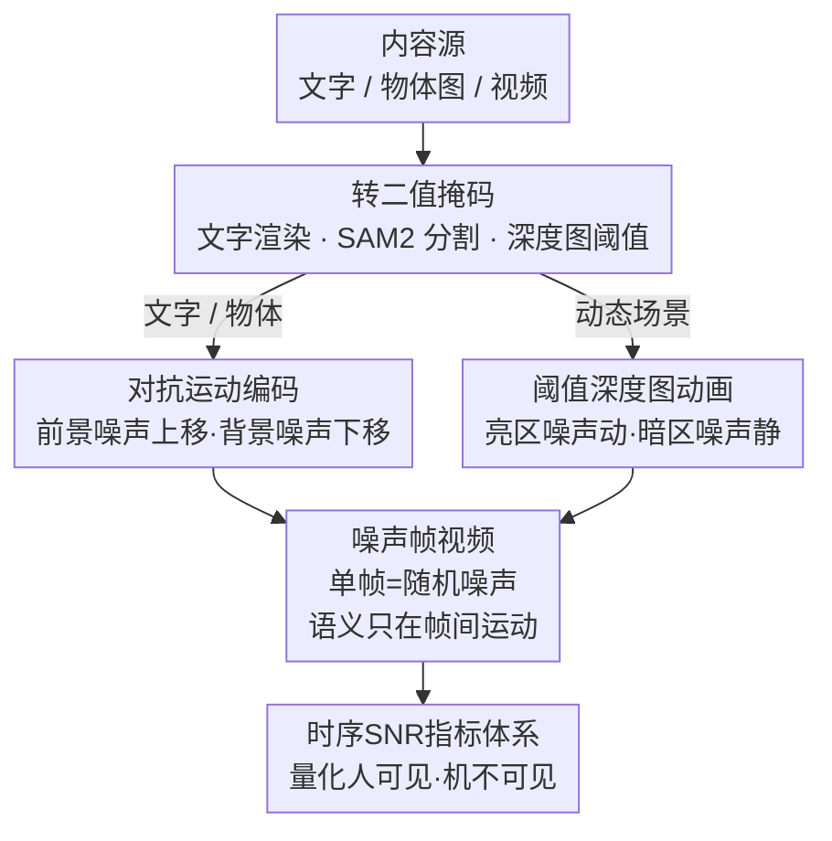

# Time Blindness: Why Video-Language Models Can't See What Humans Can?

**会议**: CVPR 2026  
**论文**: [CVF Open Access](https://openaccess.thecvf.com/content/CVPR2026/html/Upadhyay_Time_Blindness_Why_Video-Language_Models_Cant_See_What_Humans_Can_CVPR_2026_paper.html)  
**代码**: https://timeblindness.github.io/ (项目页含数据集与生成器)  
**领域**: 视频理解  
**关键词**: 时序推理, 视频语言模型, 诊断基准, 运动感知, SpookyBench

## 一句话总结
作者构造了一个"信息只存在于帧间时序、单帧全是噪声"的合成基准 SpookyBench：人类靠运动分组能以 98% 准确率读出其中的文字/物体，而 15 个最强 Video-VLM（含 GPT-4o、Gemini 2.5 Pro、Qwen2.5-VL-72B）全部 0% 准确率，从而干净地暴露出当前视频模型"时间盲"——只会读单帧空间特征、根本没有纯时序信息的处理机制。

## 研究背景与动机
**领域现状**：主流 Video-VLM 走的都是"分层"范式——先用 ViT 抽每一帧的空间特征，再把帧特征在时间维上整合，最后和语言对齐去做动作识别、视频问答、时序定位等任务。这条路在常规视频理解上确实刷出了很高的分数。

**现有痛点**：问题在于，很多被标成"时序"的任务，其实靠单帧的强空间线索就能蒙对——看一帧画面就知道"有人在打篮球"，根本不需要真的沿时间轴推理。也就是说现有基准把空间线索和时序线索**纠缠**在一起，模型用空间捷径就能拿高分，导致我们无法判断它到底有没有时序理解能力。

**核心矛盾**：当信息**纯粹**存在于时间维度、单帧不提供任何可靠空间特征时，这套"先抽空间特征、时序整合是附属"的架构会彻底失效。但现有基准从来没有把这种纯时序的情形隔离出来测过。

**本文目标**：造一个把空间线索完全抹掉、信息只能从"帧与帧之间如何变化"中提取的测试集，从而单独度量模型的纯时序感知能力，并验证人机差距到底有多大、根源是不是架构。

**切入角度**：作者从认知神经科学的"共同命运"(common fate) 格式塔原理出发——人脑能把运动方向一致的像素自动分组，仅凭运动就完成图形-背景分离。那么只要让前景和背景的噪声朝相反方向运动，人就能"看见"内容，而逐帧看全是随机噪声的模型就该抓瞎。

**核心 idea**：用"对抗运动的二值噪声"把文字/物体编码进视频，单帧是噪声、内容只在播放时浮现，以此构造首个**纯时序**基准来诊断 Video-VLM 的时间盲。

## 方法详解
这篇是诊断型的基准/分析论文，"方法"指的是 SpookyBench 这个数据集**怎么造出来**、以及作者用什么指标和对照实验去**证明失败源于架构而非数据**。整体上：拿一段内容（文字 / 物体图 / 视频）→ 转成二值掩码 → 用噪声做时序编码（两种运动配置）→ 输出一段单帧全是噪声、内容只在时间序列里浮现的视频；同时配一套时序信噪比指标量化"为什么人看得见、机器看不见"。

### 整体框架
SpookyBench 共 451 段视频，分三类内容：文字 (210 段, 46.6%)、物体图 (184 段, 40.8%)、动态场景 (57 段, 12.6%，但因时长更长占了 42.5% 的帧)。所有视频统一 960×540 分辨率、平均 7.11 秒、平均 333.5 帧。三类内容走两条编码支路汇成同一种"噪声帧视频"，关键不变量是：**任意单帧都是结构化噪声，语义只在帧间运动里**。

### 关键设计

**1. 对抗运动编码：让文字/物体只在"播放"时浮现**

针对"单帧不能泄露任何空间信息"这个硬约束，作者对文字和物体图采用前景/背景噪声**反向运动**的编码（算法 1）。先把内容转成二值掩码 $M$，$M(x,y)=1$ 是前景、$=0$ 是背景；再生成两张独立的二值噪声 $N_{fg}$、$N_{bg}$（取值 0 或 255）。动画时前景像素以随时间增大的正偏移采样 $F_t(x,y)=N_{fg}(x,\, y+vt \bmod h)$，背景像素以负偏移采样 $F_t(x,y)=N_{bg}(x,\, y-vt \bmod h)$。这样前景区域整体往上/左动、背景往下/右动，人脑靠"共同命运"把同向运动的像素分到一组，内容就从噪声里"长"出来；而把视频暂停，前景背景都是静态随机噪声、内容立刻消失。这正是它能骗过模型的原因——任何只看单帧空间特征的编码器，看到的永远只是一张随机噪声图。物体图的内容掩码则用 Flux 文生图生成单物体图、再用 SAM2 抠出二值掩码，走同一套对抗运动动画。

**2. 阈值深度图动画：把真实视频的运动也变成纯时序刺激**

文字和物体是静态内容，作者还想覆盖真实视频的动态场景，于是引入第二种配置（算法 2）。先用 Video Depth Anything 从单目标跟踪数据集 LaSOT、OTB2015 抽出每帧深度图 $D$，对亮度落在阈值区间 $t_l \le d \le t_u$ 的像素（通常对应前景物体）施加时变偏移 $N(x,\,y+vt \bmod h)$ 让它"动"，区间外的像素（背景）保持静态噪声 $N(x,y)$。结果是前景物体在噪声里随时间移动、背景静止，依旧满足"单帧全噪声、运动才显形"。噪声本身用 1×1 到 3×3 的方块、白块概率取 10%/30%/50%/90%（用来研究噪声粒度对感知的影响），并把噪声做成可平铺（边缘像素复制到对侧）以保证循环动画无缝。

**3. 时序信噪比指标体系：量化"为什么人看得见、机器看不见"**

为了把"内容在时序里有多强"说清楚，作者定义了五个 SNR 指标（表 2）。**基础 SNR** 度量运动边界能量相对静态帧方差的强度：

$$SNR_B = 10\log_{10}\!\left(\frac{P_S}{P_N}\right),\quad P_S = \mathbb{E}[\lVert\nabla F\rVert^2],\ P_N = \mathrm{Var}(I_0)$$

其中 $F$ 是光流场、$I_0$ 是静态帧。**感知 SNR** $SNR_P$ 在傅里叶域用对比敏感度权重 $W(f)=f\,e^{-f/f_0}$（峰值 $f_0\approx0.1$ cycles/pixel）加权，贴近人眼频率响应；**时序一致性 SNR** $SNR_T$ 用方向一致性图 $C=e^{-\mathrm{Var}_\theta(F)}\cdot\mathbb{1}(\lVert F\rVert>\tau)$ 量化运动方向的稳定度；**运动对比 SNR** $SNR_M$ 度量前景掩码区与背景的平均光流向量差异。指标揭示：动态场景的时序一致性最高 (21.91 dB) 但运动对比为负 (-3.18 dB)，文字则基础 SNR 最高 (-39.27 dB)，恰好解释了三类内容上人类感知难度的差别——而模型对这些时序量根本无从利用。这套指标本身也是论文的诊断工具，把"纯时序可读性"变成可测量的数字。

### 一个例子：一段"BASKETBALL"文字视频
取单词 "basketball" 渲染成二值掩码：笔画区是前景、其余是背景。生成两张随机噪声图，播放时笔画处的噪声整体上移、背景噪声整体下移。**逐帧截图**：每一帧都是 960×540 的黑白噪声雪花，肉眼和模型都看不出任何字。**连续播放**：人脑 1 秒内就把"向上动的那簇像素"归成一组，"BASKETBALL"几个字母从雪花里浮出来，标注者打 4.8/5 的可辨识度、准确率 ~98%。同一段视频喂给 GPT-4o，无论直接提示还是思维链，输出都和单帧噪声一致——0% 命中。

## 实验关键数据

### 主实验
15 个 SOTA Video-VLM 在 SpookyBench 上的准确率，与人类对照（节选自表 1）：

| 模型 | 直接提示 Acc | 思维链 Acc | 规模 |
|------|------|------|------|
| 人类 | **98.0% ± 0.6** | N/A | N/A |
| Qwen2.5-VL-72B-Instruct | 0% ± 0.0 | 0% ± 0.0 | 72B |
| InternVL2.5-78B | 0% ± 0.0 | 0% ± 0.0 | 78B |
| InternVideo2.5-Chat-8B | 0% ± 0.0 | 0% ± 0.0 | 8B |
| Gemini 2.5 Pro | 0% ± 0.0 | 0% ± 0.0 | N/A |
| Gemini 2.0 Flash | 0% ± 0.0 | 0% ± 0.0 | N/A |
| GPT-4o | 0% ± 0.0 | 0% ± 0.0 | N/A |

准确率用精确匹配计算，物体/动态场景类还放宽到一组可接受标签 $Y_i$：

$$\text{Accuracy} = \frac{1}{N}\sum_{i=1}^{N}\mathbb{1}(r_i \in L_i)$$

即便这么宽松、又叠加人工核验和 LLM-as-judge 双重判定，所有模型仍是 0%——跨架构、跨参数量 (2B→78B)、跨预训练策略全军覆没。

### 消融实验
作者用多组对照实验逐一排除"非架构"的解释（节选自表 4、表 5）：

| 配置 | 关键结果 | 说明 |
|------|---------|------|
| 帧率 1→30 FPS | 人类 95%+ (20-30FPS)，VLM 全 0% | 时序采样率不是瓶颈 |
| 在 400 段上微调 (InternVL2.5-8B/Qwen2-VL-7B) | 仍 0% | 排除"分布外/没见过"假设 |
| VJEPA-2 / DINOv3 训练二分类 | loss 卡在 0.7、准确率 ~50% | 单帧特征学不到判别表示 |
| Qwen2-VL-7B + 运动边界增强 | 0% → **51.54%** | 把时序显式转成空间线索就能做 |
| GPT-4o + 运动边界增强 | 0% → **59.10%** | 同上，文字类涨到 56.19% |

### 关键发现
- **失败是架构性的，不是数据/采样问题**：改帧率、在原任务原分布上微调 30 epoch、都救不回 0%；连 VJEPA-2/DINOv3 这种自监督视频模型都无法在单帧特征上过拟合"有没有前景"的二分类，证明信息确实不在单帧里。
- **运动边界增强是"决定性证据"**：作者用经典光流 (Farneback) 预先算出运动边界、叠到噪声帧上，把隐式时序变成显式空间线索后，Qwen2-VL-7B 直接从 0% 跳到 51.54%、GPT-4o 到 59.10%。这说明任务可解、模型也能处理"摆成空间形式"的运动信息，真正缺的是**帧间差分/运动提取**这一时序整合机制。
- **二值阈值现象**：文字检测在 SNR 低于 2.5 dB 时几乎 0%，越过阈值骤升到 85.7%，呈阶跃而非渐变——像医学影像里微钙化"要么完全可见要么完全不可见"，这对自动驾驶读路牌、安全关键系统是隐患（轻微加噪就可能让文字彻底不可读）。
- **动态场景几乎吃不到增强红利**（视频类增强后仅 1.75%–3.51%），说明真实运动的纯时序解码比静态文字更难。

## 亮点与洞察
- **用"反向运动噪声"把空间线索清零**，是一个非常干净的实验控制：它把"模型到底有没有时序理解"从纠缠的常规基准里彻底剥离出来，0% vs 98% 的对比一刀切，没有模棱两可的解释空间。
- **"运动边界增强 0%→59%"这一步堪称点睛**：很多基准只会说"模型不行"，而这篇直接证明"信息是可计算提取的、模型也能用，只是它自己不会去提取"——把锅精准扣在缺失的时序整合机制上，而非任务本身或数据分布。
- **借神经科学的 common fate 原理设计刺激**，把认知科学的"运动分组"假设变成可量化的工程基准，这种跨学科迁移思路可复用到其它"人易机难"能力的诊断上。
- 数据可由项目页生成器无限合成，基准规模本质无上限，便于后续做更大规模/可控难度的时序评测。

## 局限与展望
- **只诊断不开方**：论文清楚指出 VLM 缺的是帧间差分/运动整合机制，但没有提出新架构或训练范式去补上，留给后续工作。
- **任务偏合成且单一**：内容是文字/单物体/单目标跟踪场景，且"识别 1-5 个词"的任务形式较窄，离真实复杂时序推理（多物体交互、长程因果）还有距离；动态场景类即便加增强也很难，说明真实运动的纯时序解码尚未被覆盖透。
- **人类基线样本量小**（6 名标注者、帧率实验仅 3 人 120 段），且人在 1 FPS 也掉到 0%——说明结论是"在足够时序分辨率下人远超模型"，跨条件不能简单比大小。⚠️ 部分指标公式（如感知/一致性 SNR 的权重与阈值取值）以原文为准。
- **改进思路**：把"运动边界增强"从评测 trick 升级成架构组件（在编码器前显式做光流/帧差并注入），或设计专门的分布式时序通道，是最直接的下一步。

## 相关工作与启发
- **vs TemporalBench / TVBench / VITATECS**: 这些基准也想测时序，但仍把空间和时序线索纠缠在一起，模型常靠空间捷径蒙混；SpookyBench 把空间信息完全抹掉，是首个**纯时序**基准，诊断更干净。
- **vs ARC-AGI**: 精神一致——都用合成、可控的刺激去隔离某项核心能力（ARC 隔离抽象推理，本文隔离"从时间变化中提取意义"），而非在纠缠的自然数据上间接评估。
- **vs 各类时序建模改进 (TimeChat 时间戳编码 / 分段推理 / 时序分隔 token)**: 它们都在"先抽空间特征、再整合时序"的范式内打补丁，本文证明这类补丁没有触及根本——当单帧没有可靠空间特征时统统失效。

## 评分
- 新颖性: ⭐⭐⭐⭐⭐ 用反向运动噪声构造纯时序基准，把"时间盲"这一隐藏缺陷暴露得极其干净。
- 实验充分度: ⭐⭐⭐⭐⭐ 15 模型 + 帧率/微调/探针/运动边界增强多组对照，逐一排除非架构解释。
- 写作质量: ⭐⭐⭐⭐ 论证链条清晰、神经科学动机扎实；部分 SNR 指标定义偏简略需查附录。
- 价值: ⭐⭐⭐⭐⭐ 给视频理解指出了一个被主流基准长期掩盖的真问题，诊断意义大。

<!-- RELATED:START -->

## 相关论文

- [\[CVPR 2026\] Do You See What I Am Pointing At? Gesture-Based Egocentric Video Question Answering](do_you_see_what_i_am_pointing_at_gesture-based_egocentric_video_question_answeri.md)
- [\[CVPR 2025\] Video Streaming Thinking: VideoLLMs Can Watch and Think Simultaneously](../../CVPR2025/video_understanding/video_streaming_thinking_videollms_can_watch_and_think_simultaneously.md)
- [\[CVPR 2026\] StreamReady: Learning What to Answer and When in Long Streaming Videos](streamready_learning_what_to_answer_and_when_in_long_streaming_videos.md)
- [\[CVPR 2026\] Understanding Temporal Logic Consistency in Video-Language Models through Cross-Modal Attention Discriminability](understanding_temporal_logic_consistency_in_video-language_models_through_cross-.md)
- [\[CVPR 2026\] LensWalk: Agentic Video Understanding by Planning How You See in Videos](lenswalk_agentic_video_understanding_by_planning_how_you_see_in_videos.md)

<!-- RELATED:END -->
