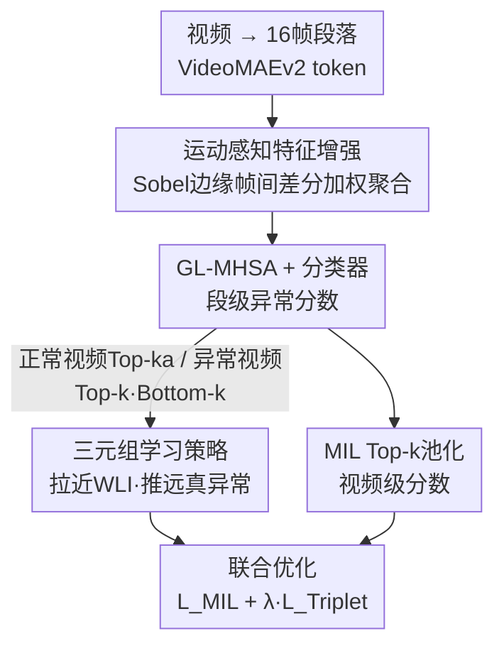

# TLMA: Mitigating the Impact of Weakly Labeled Information for Video Anomaly Detection

**会议**: CVPR 2026  
**论文**: [CVF Open Access](https://openaccess.thecvf.com/content/CVPR2026/html/Xu_TLMA_Mitigating_the_Impact_of_Weakly_Labeled_Information_for_Video_CVPR_2026_paper.html)  
**领域**: 视频理解  
**关键词**: 弱监督视频异常检测, 三元组学习, 多示例学习, 运动感知, 弱标签信息

## 一句话总结
针对弱监督视频异常检测（WSVAD）中视频级标签带来的"弱标签信息（WLI）"干扰，TLMA 用一个从模型预测动态构造的三元组学习策略把 WLI 与真异常在特征空间里推开，再配一个基于帧间边缘差分的运动感知特征增强模块突出前景动态，在 UCF-Crime / XD-Violence / MSAD 三个基准上都刷到 SOTA 并显著降低误报率。

## 研究背景与动机

**领域现状**：WSVAD 的目标是只用视频级标签（整段视频一个 "abnormal" 或 "normal" 标签）训练，就能在测试时把异常段落定位出来，从而避开昂贵的帧级/像素级标注。主流做法是多示例学习（MIL）：把一段视频看成一个"包"，包里是若干段落（segment），异常视频里至少有一段是异常的、正常视频里全是正常段，用 ranking loss 拉大异常视频和正常视频中最高异常分段落之间的分差，实现段级检测。

**现有痛点**：视频级标签太粗，无法精确描述整段视频，于是训练里混进了大量"弱标签信息"（Weakly Labeled Information，WLI）——即标签和实际内容不匹配的段落。论文把 WLI 拆成两类：(1) 异常视频里实际正常的段落（比如"爆炸"视频中爆炸发生前的正常过渡镜头、背景区域，却都被打上 "explosion" 标签）；(2) 正常视频里的非典型段落（比如剧烈运动、罕见模式的镜头，虽被标为 normal，却在嵌入空间里偏离典型正常特征，极易被误判为异常）。正常视频占了近一半训练数据，单一 "normal" 标签根本覆盖不了它们的多样性。

**核心矛盾**：WLI 让模型学不清正常与异常的边界——它在分数曲线上引发系统性误判（论文用 UR-DMU 举例：加油站正常加油被判异常、爆炸前的正常画面被判异常）。而提升标注粒度成本极高、不现实，所以必须在**不增加细粒度标注**的前提下抑制 WLI 的影响。

**切入角度**：作者观察到，误判几乎都发生在 WLI 上——这些段落正常/异常界限模糊、缺乏精确监督。关键难点是 WLI 里"异常视频中的正常段"没有可靠标注、无法直接挑出来；但"正常视频中的非典型段"既能拿到（它们被模型打了高异常分、"看起来很异常"），又天然是 WLI 的代表。于是用它们当抓手。

**核心 idea**：用一个动态构造的三元组（anchor / positive / negative）显式地在特征空间里把 WLI 拉到一起、与真异常推开，再用运动感知增强让特征更聚焦前景动态，从而让 MIL 的 ranking loss 学得更干净。

## 方法详解

### 整体框架
TLMA（**T**riplet **L**earning with **M**otion-**A**ware enhancement）是一个统一框架，输入是一段被切成若干 16 帧段落的视频，输出是每个段落的异常分数。它在标准 MIL 流程上叠了两件事：先用**运动感知特征增强模块（MA）** 把每个段落的 token 特征按运动显著性加权聚合成更聚焦前景的段级特征；再用这些特征经 GL-MHSA 时序建模和分类器打出异常分；然后基于这些预测分数动态挑出**三元组**（正常视频的高分段当 anchor、异常视频的低分段当 positive、异常视频的高分段当 negative），用 triplet loss 把前两者（都是 WLI）拉近、与第三者（真异常）推远。整套模型在 MIL loss 与 triplet loss 联合优化下训练。

### 关键设计

**1. MIL 基线与 Top-k 池化：把段级预测聚合成视频级监督**

WSVAD 只有视频级标签 $Y \in \{0, 1\}$，没有段级标注，所以需要一个把段级分数聚合成视频级决策的桥梁。TLMA 沿用 Top-k 池化：把视频切成 $L$ 个不重叠段落，每段编码后由分类器给出异常分 $s_j \in [0,1]$，视频级分数取 Top-k 段分数的均值 $S_V = \text{mean}(\text{Top-}k(s_1, \dots, s_L))$，其中 $k = \lfloor L/16 \rfloor + 1$。视频级分类损失为

$$\mathcal{L}_{\text{MIL}} = -\mathbb{E}\left[ Y \log S_V + (1-Y)\log(1-S_V) \right].$$

这迫使异常视频里至少有几段拿到高分、正常视频所有段都压到低分。它是整个框架的监督骨架，也正是它会顺带压低 anchor / positive（正常视频里的非典型段、异常视频里的正常段），和三元组损失天然互补。

**2. 三元组学习策略：用"看起来异常的正常段"当抓手把 WLI 推离真异常**

这是论文的核心。痛点是 WLI 缺乏精确监督、和真异常在特征空间里纠缠不清。由于没有细粒度标注，三元组必须从模型预测动态构造，关键在于挑出能代表 WLI 的 anchor。WLI 概念上含两部分，但"异常视频中的正常段"没有可靠标注、不可直接选；而"正常视频中的非典型段"既可得又"看起来很异常"（被模型打高分），最易被误判，正好当 WLI 的实用代理。于是三元组定义为：

- **Anchor $F_a$**：正常视频中 Top-$k_a$ 高分段的平均特征（标签为 normal 却"长得像异常"，是 WLI 代表）；
- **Positive $F_p$**：异常视频中最低 $k$ 分段的平均特征（大概率不含真异常、也属 WLI，但不确定到能当 anchor）；
- **Negative $F_n$**：异常视频中最高 $k$ 分段的平均特征（最可能是真异常、与视频级标签最一致）。

用 margin 三元组损失（$m=1$）：

$$\mathcal{L}_{\text{Triplet}} = \sum_{(a,p,n)} \max\left( \|F_a - F_p\|_2 - \|F_a - F_n\|_2 + m,\ 0 \right).$$

它把 anchor 和 positive（都极可能是 WLI）拉近、与 negative（真异常）推远，学出一个把 WLI 和真异常显式分开的结构化特征空间。和 MIL 的协同很关键：MIL 在分数层面压低正常视频分数（顺带压住 anchor、positive）、放大异常段分数，三元组在特征层面做几何分离，两者一个管分数一个管特征，互相强化得到更精确的定位。

**3. 运动感知特征增强（MA）：用 Sobel 边缘帧间差分把特征聚焦到前景动态**

痛点是现有 WSVAD 普遍从整帧提特征，冗余背景既降低异常打分精度、又污染三元组构造时的对比样本质量；而异常通常只发生在动态前景区域。MA 在 ViT token 之上加一层运动感知 token 注意力，且不需额外网络或训练。具体地，先用 VideoMAEv2（ViT-G/14）把每个 16 帧段落切成 $2\times14\times14$ 时空 cube、3D 卷积投影成 token $\tilde{Z} = \phi(\{z_1,\dots,z_N\}) \in \mathbb{R}^{N\times D}$。运动线索这样算：对每帧 $f_t$ 用水平/垂直 Sobel 核 $S_x, S_y$ 求边缘幅值图 $E_t(x,y) = \sqrt{(S_x * f_t)^2 + (S_y * f_t)^2 + \epsilon}$（Sobel 响应对光照变化更鲁棒、更保运动边界），再做帧间差分 $M_k(x,y) = |E_{2k}(x,y) - E_{2k-1}(x,y)|,\ k=1,\dots,8$。注意这个 2 帧时间窗正好对齐 ViT tokenization 的 2 帧窗，使每个运动分数都对应一个具体 3D cube。把运动图对齐到 token 网格，token $i$ 的运动重要度归一化为 $\tilde{a}_i = a_i / (\max_j a_j + \epsilon)$，其中 $a_i = \sum_{(x,y)\in\Omega_i} M(x,y)$；最终增强特征是 token 特征的运动加权和 $F_{\text{enhanced}} = \sum_{i=1}^N \tilde{a}_i \cdot \tilde{z}_i$。这样自适应地放大强运动 token、抑制背景，既提升异常打分可靠性，又给三元组提供更有判别力的对比样本。增强后再接 GL-MHSA 做长程段间时序建模。

### 损失函数 / 训练策略
总损失为 MIL 损失与三元组损失的加权和：

$$\mathcal{L}_{\text{Total}} = \mathcal{L}_{\text{MIL}} + \lambda \cdot \mathcal{L}_{\text{Triplet}},$$

平衡权重 $\lambda$ 三个数据集统一取 $0.1$（过大会盖过 MIL 优化、过小则 WLI 与真异常分不开）。backbone 用 VideoMAEv2（ViT-G/14），AdamW，学习率 $1\times10^{-3}$，训练 3000 iteration；UCF-Crime / XD-Violence batch size 64、MSAD 为 32。正负样本选择用 $k = \lfloor L/16 \rfloor + 1$，anchor 用数据集相关的 $k_a$（UCF-Crime $k_a=3$、XD-Violence $k_a=11$、MSAD $k_a=1$）。

## 实验关键数据

### 主实验
三个 WSVAD 基准：UCF-Crime（1900 段监控、13 类异常）、XD-Violence（4754 段、6 类暴力）、MSAD（720 段、14 场景、11 类）。UCF-Crime/MSAD 用 AUC、XD-Violence 用 AP；并额外报只在异常视频上算的 AUCA / APA（更能反映定位能力）和正常视频上的误报率 FAR。

| 数据集 | 指标 | 本文 TLMA | 之前最好 | 提升 |
|--------|------|-----------|----------|------|
| UCF-Crime | AUC | **89.47** | VadCLIP 88.02 | +1.45 |
| UCF-Crime | AUCA | **76.16** | UR-DMU 70.81 | +5.35 |
| XD-Violence | AP | **86.78** | PEL4VAD 85.59 | +1.19 |
| XD-Violence | APA | **86.23** | UR-DMU 83.94 | +2.29 |
| MSAD | AUC | **93.68** | PI-VAD 88.68 | +5.00 |
| MSAD | AP | **81.30** | PI-VAD 71.26 | +10.04 |

TLMA 用 MAE 编码器（VideoMAEv2）在三个基准全面领先，尤其在异常视频专用指标（AUCA/APA）和新数据集 MSAD 上优势最大，说明它真正改善了异常定位而非只刷整体 AUC。

### 消融实验

模块贡献（Table 3，FAR 越低越好）：

| 配置 | UCF AUC | UCF FAR↓ | XD AP | XD FAR↓ |
|------|---------|----------|-------|---------|
| Baseline（仅 MIL） | 85.69 | 3.30 | 83.61 | 1.07 |
| + MA | 86.84 | 2.62 | 85.35 | 1.11 |
| + Triplet | 88.37 | 1.93 | 84.64 | 0.96 |
| + MA + Triplet（Full） | **89.47** | **1.56** | **86.78** | **0.43** |

其它分析消融：

| 消融项 | 关键结果 | 说明 |
|--------|---------|------|
| anchor 选择策略（UCF） | 高分 89.47 > 低分 89.06 > 随机 89.04 | 印证"正常视频高分段"是 WLI 最好代理 |
| 边缘滤波器（MSAD AUC/AP） | Sobel 93.68/81.30 > Scharr 93.31/79.82 > DoG > 无滤波 93.20/80.12 | Sobel 给出最具判别力的运动线索 |
| 损失权重 $\lambda$ | $\lambda=0.1$ 三数据集均最优；$\lambda=1$ 时 XD AP 掉到 83.27 | 过大压垮 MIL、过小分不开 WLI |
| anchor $k_a$ | 简单场景（MSAD）$k_a=1$ 最好、复杂场景（XD）$k_a=11$ 最好 | 性能整体稳健，$k_a$ 随场景复杂度调 |

### 关键发现
- **两个模块都有效且能叠加**：MA 单加在 XD 上 AP 从 83.61→85.35，Triplet 单加在 UCF 上 AUC 从 85.69→88.37，合起来取得最佳，且 FAR 随模块加入稳步下降（UCF 3.30→1.56、XD 1.07→0.43），直接证明它在抑制 WLI 引发的误判。
- **anchor 必须用"高分正常段"**：随机或低分段当 anchor 几乎没增益（89.04/89.06），只有高分段（"看起来异常的正常段"）才提供有效的 WLI 监督信号，是整个三元组设计成立的前提。
- **Sobel 优于 Scharr/DoG**：MA 模块对边缘提取方式敏感，Sobel 在抗光照、保运动边界上更合适，但即使无滤波也比纯 baseline 强，说明运动加权本身就有用。

## 亮点与洞察
- **把"无法直接获取的 WLI"换成"可获取的代理"**：WLI 里"异常视频中的正常段"拿不到，作者绕道用"正常视频中的高分非典型段"当 anchor——既可得又最易误判，是一个非常务实的代理选择，消融也证明它确实优于随机/低分。
- **分数层 × 特征层双管齐下**：MIL 在分数层压低正常分、三元组在特征层做几何分离，两者天然互补（MIL 压 anchor/positive、triplet 推远 negative），这种"分数+特征"的协同思路可迁移到其它带噪标签的 ranking 任务。
- **零成本的运动先验**：MA 只靠 Sobel 边缘帧间差分就算出 token 级运动权重，无需额外网络/训练，还刻意把 2 帧运动窗对齐到 ViT 的 2 帧 tokenization，使运动分数和 3D cube 一一对应——这个对齐细节是它能直接当 token 注意力的关键。

## 局限与展望
- **anchor 的 $k_a$ 需逐数据集调**（UCF 3 / XD 11 / MSAD 1），说明 WLI 的分布随场景复杂度变化大，缺乏自适应选择机制；论文也承认简单/复杂场景需要不同 $k_a$。
- **positive 的纯度无保证**：positive 取自异常视频低分段，作者自己也说"不确定到能当 anchor"，若异常视频里异常分布广，低分段也可能含真异常，会污染三元组。
- **WLI 的另一半未被直接处理**："异常视频中的正常段"因无标注被回避，只靠 MIL 间接压制，留下改进空间（如用伪标签或不确定性估计把这部分也纳入 anchor）。
- **依赖大 backbone**：用 VideoMAEv2 ViT-G/14 这种重编码器，运动增强带来的增益是否在轻量 backbone 上同样成立未验证。

## 相关工作与启发
- **vs UR-DMU**: UR-DMU 也用 triplet loss，但配的是双记忆结构来分别建模正常/异常模式；TLMA 不引入记忆，而是直接从预测分数动态构造三元组、并明确把 anchor 定位成"WLI 代理"，目标从"建模模式"转向"分离弱标签噪声"，在 AUCA/APA 上明显反超。
- **vs NG-MIL**: NG-MIL 学正常模式的原型并用 triplet 增强判别力；TLMA 不学原型，而是用"正常视频高分段"这一具体可得的 WLI 代理当 anchor，动机更贴 WSVAD 的标签噪声本质。
- **vs VadCLIP / PI-VAD（多模态路线）**: 它们靠 CLIP 文本对齐或引入额外模态提升表示；TLMA 走单模态、靠纯视觉的运动先验+对比结构就超过它们，说明把 WLI 这个监督噪声问题处理好，比堆模态更直接有效。
- **vs CUPL / MIST（伪标签两阶段）**: 它们用伪标签做两阶段训练来缓解粗标签；TLMA 单阶段端到端，靠动态三元组在线分离 WLI，避免了伪标签噪声累积。

## 评分
- 新颖性: ⭐⭐⭐⭐ 把 WSVAD 的标签噪声问题显式建模为"WLI vs 真异常"的特征空间分离，anchor 代理的选择和运动窗对齐都很巧。
- 实验充分度: ⭐⭐⭐⭐ 三基准全面领先，模块/anchor 策略/滤波器/$\lambda$/$k_a$ 消融齐全，FAR 下降直击 WLI 主张。
- 写作质量: ⭐⭐⭐⭐ 动机（WLI 两类来源）讲得清楚，方法图文配合，公式完整；个别符号（如 anchor $k_a$ 与 $k$ 的关系）需对照实现。
- 价值: ⭐⭐⭐⭐ 在不增加标注成本下显著降误报，对监控/公共安全等实际部署有直接意义，思路可迁移到其它弱监督带噪 ranking 场景。

<!-- RELATED:START -->

## 相关论文

- [\[CVPR 2026\] The Road Less Seen: Segment Exploration for Weakly Supervised Video Anomaly Detection](the_road_less_seen_segment_exploration_for_weakly_supervised_video_anomaly_detec.md)
- [\[CVPR 2026\] Learning from Noisy Supervision: A Denoising-Debiasing Framework for Weakly Supervised Video Anomaly Detection](learning_from_noisy_supervision_a_denoising-debiasing_framework_for_weakly_super.md)
- [\[CVPR 2026\] Weakly Supervised Video Anomaly Detection with Anomaly-Connected Components and Intention Reasoning](weakly_supervised_video_anomaly_detection_with_anomaly-connected_components_and_.md)
- [\[CVPR 2026\] Joint Learning of General and Diverse Patterns with Mixture of Memory Experts for Weakly-Supervised Video Anomaly Detection](joint_learning_of_general_and_diverse_patterns_with_mixture_of_memory_experts_fo.md)
- [\[AAAI 2026\] RefineVAD: Semantic-Guided Feature Recalibration for Weakly Supervised Video Anomaly Detection](../../AAAI2026/video_understanding/refinevad_semantic-guided_feature_recalibration_for_weakly_supervised_video_anom.md)

<!-- RELATED:END -->
