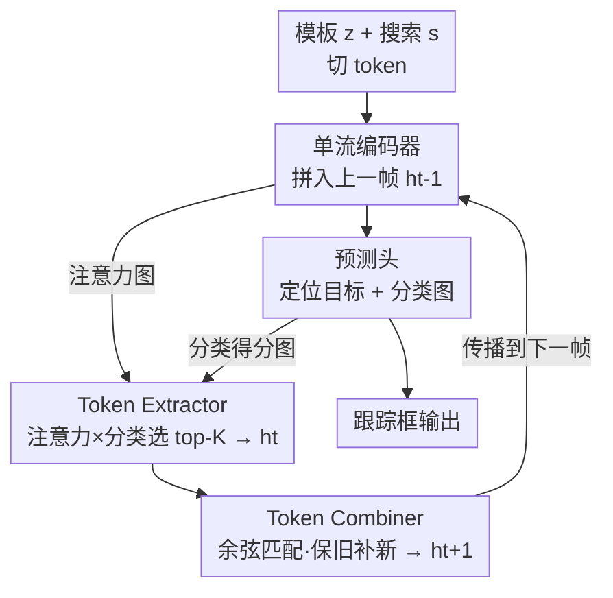

# Toward Low-Cost yet Effective Temporal Learning for UAV Tracking

**会议**: CVPR 2026  
**论文**: [CVF Open Access](https://openaccess.thecvf.com/content/CVPR2026/html/Xue_Toward_Low-Cost_yet_Effective_Temporal_Learning_for_UAV_Tracking_CVPR_2026_paper.html)  
**代码**: https://github.com/GXNU-ZhongLab/LETrack （有）  
**领域**: 视频理解 / 单目标跟踪  
**关键词**: 无人机跟踪、时序建模、token 传播、效率评价、PPF

## 一句话总结
针对无人机（UAV）单目标跟踪，本文先提出一个把「精度提升」和「算力开销」绑在一起看的评价指标 PPF（每 FLOP 精度增益），用它揭示现有时序模块"性价比"普遍很低，再据此设计了一个只靠传播/合并少量代表性外观 token 的轻量时序模块 LETL，把它塞进单流框架做出 LETrack，在六个航拍数据集上拿到 SOTA 的同时几乎不增加算力。

## 研究背景与动机
**领域现状**：在通用视觉目标跟踪（VOT）里，利用时序信息（目标外观随时间的变化）是公认的涨点手段。主流做法有两类：一类是多模板（MixFormer、STARK、ODTrack、MCITrack 把动态模板从 1 个堆到 3 个甚至 5 个）；另一类是轨迹 token（ODTrack、AQATrack、TemTrack 用可学习 query 把每帧信息压成 token 再跨帧传播）。无人机跟踪这条支线近年则被 Aba-ViTrack、AVTrack、SGLATrack 等带向了"极致效率"——为了塞进算力受限的机载芯片，大家忙着剪 token、跳层、蒸馏，反而把航拍特有的难题（相机抖动、背景杂乱、相似目标干扰）放到了次要位置。

**现有痛点**：把时序模块用在无人机上时，两类做法都不理想。多模板要么显存爆、要么 FLOPs 暴涨，机载部署吃不消；轨迹 token 虽然轻，但它把"整个搜索区域"压成几个全局 token，而无人机俯拍视角下背景占了画面绝大部分，目标特征被背景稀释，涨点很有限。

**核心矛盾**：更深一层的问题是评测本身——大家只比"整机精度"，却分不清涨点到底来自时序模块本身，还是来自顺手换的更大 backbone、更多输入。论文举了个尖锐的例子：EVPTrack 整机精度比 HIPTrack 高，但它时序模块带来的增益 $\Delta\text{prec}$ 反而更小，高出来的那部分其实是更强的 HiViT backbone 贡献的。换句话说，社区缺一把能把时序模块单独拎出来量它"真本事"的尺子。

**本文目标**：(1) 造一把能公平、且把算力计入的尺子，量化时序模块的真实贡献；(2) 在这把尺子的指引下，设计一个真正"低成本高收益"、适配无人机的时序模块。

**切入角度**：既然无人机算力有限，理想的时序策略应该是"花很少的算力换显著的精度"，那评价就不该只看精度绝对值，而要看"每单位算力换来多少精度"。作者由此引入 precision per FLOP（PPF）这个比值，并发现它能直接把"靠 backbone 涨点"和"靠时序模块涨点"区分开。

**核心 idea**：用 PPF 重新定义"好的时序模块"，再据此设计 LETL——不压缩全局、不堆模板，而是每帧只挑一小撮最有信息量的局部外观 token，跨帧传播并合并，用极低算力捕捉目标外观变化。

## 方法详解

### 整体框架
LETrack 的骨架是一个标准的单流（one-stream）跟踪器：模板图 $z\in\mathbb{R}^{3\times H_z\times W_z}$ 和搜索图 $s\in\mathbb{R}^{3\times H_s\times W_s}$ 先各自切成 token 序列 $Z\in\mathbb{R}^{N_z\times D}$、$S\in\mathbb{R}^{N_s\times D}$，再把 $Z$、$S$ 和上一帧传来的时序 token 集 $h_{t-1}$ 拼在一起，送进 DeiT-Tiny 编码器做统一的特征提取与交互；编码后的搜索特征交给中心点预测头定位目标。真正的"时序大脑"是 LETL 模块：当前帧预测完后，它接管编码器产生的注意力图和预测头产生的分类得分图，用 token 抽取器挑出本帧新的代表性 token $h_t$，再用 token 合并器把 $h_t$ 与 $h_{t-1}$ 合成 $h_{t+1}$，传给下一帧。整个时序环路只在 token 这一极轻量的层面流转，因此几乎不增加 FLOPs。

### 关键设计

**1. PPF 评价指标：把时序模块的精度增益除以它额外烧掉的算力**

痛点在于现有评测只比整机精度，分不清涨点来源、也没把算力受限这件事算进去。作者先给"纯跟踪器"和"时序跟踪器"下了精确定义：纯跟踪器只吃初始模板 $z$ 和当前搜索帧 $s$，记作 $\Psi(z,s)=\{G(z,s),P(s)\}$，其中 $G$ 是做特征提取+交互的 backbone、$P$ 是预测头；加上一个时序模块 $T(h)$（$h$ 是当前帧之前的历史信息）就变成 $\Psi(z,s,h)=\{G(z,s),P(s),T(h)\}$。关键约束是：对比时 backbone 和 head 完全不变，**只有时序模块这一项不同**，于是两者之差就被干净地归因到时序模块身上。PPF 定义为

$$\text{PPF}=\frac{\Delta\text{prec}}{\Delta\text{flop}}=\frac{\text{prec}(\Psi_{z,s,h})-\text{prec}(\Psi_{z,s})}{\text{flop}(\Psi_{z,s,h})-\text{flop}(\Psi_{z,s})}$$

即"时序模块带来的精度增量 / 它带来的 FLOPs 增量"。当跟踪器 FLOPs 很大（>10G）时分母会大到让比值趋近 0 失去意义，于是对这类用对数形式 $\text{PPF}=\Delta\text{prec}/\log(\Delta\text{flop})$。这个指标之所以有效，是因为它通过"控制变量（只换时序模块）+ 除以算力"两步，既把 backbone 等混杂因素剥离，又天然偏向"花小钱办大事"的设计——用它一量，ODTrack 虽然 $\Delta\text{prec}$ 最大但三模板太烧算力、PPF 反而被 EVPTrack 反超，正好暴露了堆输入这条路的低性价比。

**2. Token Extractor：用注意力相似度和分类得分双信号，每帧挑出 top-K 个最有信息量的外观 token**

轨迹 token 之所以在无人机上失灵，是因为它把整个搜索区域压成全局表示、被背景稀释。作者反其道而行：不压缩，而是从当前帧里精挑细选一小撮"真正落在目标上"的局部 token 当历史参考。怎么判断哪些 token 重要？用两路互补信号。第一路来自单流注意力本身：在 attention 矩阵里，搜索 token 对模板 token 的子块 $A_{s2z}\in\mathbb{R}^{N_s\times N_z}$ 表示每个搜索 token 和模板的相似度，沿行求平均得到每个搜索 token 对整个模板的相似度 $\bar A_{s2z}\in\mathbb{R}^{N_s}$。第二路来自预测头：把 2D 分类图拉平成 $C\in\mathbb{R}^{N_s}$，它反映目标的空间分布。两者逐元素相乘并对 $M$ 个注意力头取平均，得到每个搜索 token 的综合重要性：

$$S=\frac{1}{M}\sum_{m=1}^{M}\{\bar A_{s2z}\}_m\odot C$$

按 $S$ 取分数最高的 top-K 个 token 构成代表集 $h_t\in\mathbb{R}^{K\times D}$。这样设计有效，是因为两路信号刚好互补：注意力相似度刻画"长得像模板"，分类得分刻画"空间上最可能是目标"，单用任一路都不如二者相乘——消融里 Attn+Cls 同时用（68.2 AUC）确实优于单用 Attn（67.8）或单用 Cls（67.4）。

**3. Token Combiner：跨帧余弦匹配后只合并少量最相似 token，且"保旧补新、用新值替换而非平均"**

光是每帧抽 K 个 token 一直累加，token 集会越来越大、效率崩掉。合并器负责把它压住：先算 $h_t$ 与上一帧 $h_{t-1}$ 之间的逐对余弦相似度，给 $h_t$ 里每个 token 在 $h_{t-1}$ 中找最相似的对应者，只取 top-r 对最相似的配对做合并，其余保留。合并策略有两个反直觉但关键的取舍。其一是"**保旧补新**"——由于视频后期环境复杂多变，晚抽出的 token 质量难保证，所以优先保留早期抽出的 token，只把新抽 token 里小部分（被合并的那 r 个）并进去，即把 $h_t$ 中被合并的 token 与 $h_{t-1}$ 中未被合并的 token 拼接：

$$h_{t+1}=\text{Merge}(h_t,h_{t-1},P),\quad P=r/K$$

其中 $P$ 是合并比例。其二是"**用新值替换而非取平均**"——合并后那个 token 的值直接取 $h_t$ 的（最近一帧的）token，而不是把参与合并的几个 token 求平均。原因是平均会把跨帧的细粒度目标特征糊掉、还可能在杂乱航拍场景里逐帧累积错误信息；消融里 Replace（68.2 AUC）明显优于 Average（67.1）。$P$ 也不能贪大：太大（50%）会增加传播错误信息的风险，太小（25%）又跟不上外观变化，实验取 37.5% 最优。

### 损失函数 / 训练策略
预测头是中心点式：把搜索特征 reshape 回 2D 特征图，输出局部 offset、框尺寸和分类得分图，取分类得分最高的位置作为目标中心，再结合 offset 与尺寸得到最终框。总损失为分类 + 回归：

$$L=L_{cls}+\lambda_{iou}L_{iou}+\lambda_{L1}L_{L1}$$

分类用 focal loss，回归用 L1 + GIoU，权重 $\lambda_{iou}=2$、$\lambda_{L1}=5$。backbone 用 DeiT-Tiny，在 LaSOT/COCO/TrackingNet/GOT-10k 上训 300 epoch（每 epoch 6 万对），AdamW，预测头学习率 $4\times10^{-4}$、backbone $4\times10^{-5}$，240 epoch 后各降 10 倍。推理时模板 128×128、搜索 256×256，核心超参 $K=16$、$P=37.5\%$。

## 实验关键数据

### 主实验
六个航拍数据集（UAVTrack112、UAVTrack112_L、UAV123、UAV123@10FPS、DTB70、VisDrone2018）上 LETrack 全面 SOTA。下表摘取几个代表性数据集与对手对比：

| 数据集 | 指标 | LETrack | SGLATrack(CVPR'25) | ORTrack(CVPR'25) | AVTrack(ICML'24) |
|--------|------|---------|--------------------|------------------|------------------|
| UAVTrack112 | AUC / P | **69.6 / 85.8** | 67.5 / 82.8 | 66.6 / 82.1 | 65.4 / 80.3 |
| UAVTrack112_L | AUC / P | **68.2 / 84.8** | 64.0 / 79.2 | 65.3 / 82.3 | 62.7 / 78.2 |
| UAV123 | AUC / P | **68.0 / 87.0** | 66.9 / 84.9 | 66.1 / 84.0 | 66.8 / 84.8 |
| DTB70 | AUC / P | **65.2 / 85.0** | 65.1 / 84.4 | 65.1 / 83.7 | 65.0 / 84.3 |

在专门考验航拍鲁棒性的 VisDrone2018 上，LETrack 取 66.1 AUC / 87.2 P，超过 SeqTrack(63.5)、SUTrack-T224(64.6)、以擅长时序著称的 MCITrack-T224(62.5) 等；作者特别指出 MCITrack 在这个难数据集上反而退化，正说明其时序策略不适配无人机视角。

效率上（UAVTrack112_L，A100）：

| 跟踪器 | AUC | FLOPs(G) | 参数(M) | FPS |
|--------|-----|----------|---------|-----|
| LETrack | **68.2** | 2.48 | 7.98 | 204 |
| SGLATrack | 64.0 | 1.54~1.68 | 5.81 | 242 |
| SeqTrack | 67.1 | 65.86 | 89.11 | 43 |
| ARTrack | 66.9 | 40.33 | 173.12 | 29 |

相比 SeqTrack/ARTrack，LETrack 用约 1/20 的 FLOPs 拿到更高精度和 4~7 倍速度；比纯效率向的 SGLATrack/ORTrack 算力略高（因为它追求的是鲁棒性而非极致省算力）。在 Jetson TX2（4GB，无 TensorRT 加速）上实测 26 FPS，满足机载实时。

### 消融实验
核心消融是用 PPF 横向对比不同时序策略（以 DeiT-Tiny 单流为 baseline）：

| 时序策略 | $\Delta$prec | $\Delta$flop(G) | PPF |
|----------|------|------|-----|
| Baseline | (79.8) | (2.39) | — |
| +动态模板(MixFormer) | +3.8 | +0.40 | 9.5 |
| +密集视频采样(ODTrack) | +5.9 | +0.68 | 8.7 |
| +自回归 query(AQATrack) | +4.3 | +0.51 | 8.4 |
| **+LETL** | +5.0 | **+0.09** | **55** |

LETL 的 PPF（55）是其它策略的 6 倍以上：密集采样精度增益最大（+5.9）但 FLOPs 涨得最猛，PPF 反而最低；LETL 用 +0.09G 的微小代价换来 +5.0 的精度增益。模块内部消融：

| 模块 | 配置 | AUC | Prec |
|------|------|-----|------|
| Token Extractor | Attn | 67.8 | 83.9 |
| | Cls | 67.4 | 83.3 |
| | **Attn+Cls** | **68.2** | **84.8** |
| Token Combiner | Average | 67.1 | 83.2 |
| | **Replace** | **68.2** | **84.8** |

### 关键发现
- **效率的钥匙在"传什么"而非"传不传"**：自回归 query 和 LETL 都是跨帧顺序传播，但前者把整个搜索区压成全局 token、被航拍背景稀释，$\Delta$prec 更低；LETL 传的是细粒度局部外观 token，反而更准——这是全文最核心的洞察。
- **双信号互补**：注意力（像不像模板）和分类得分（空间上是不是目标）相乘后选 token，优于任一单信号。
- **Replace > Average**：合并时取最近帧的值而非平均，能避免细粒度特征被糊掉、避免错误逐帧累积，杂乱场景尤其明显。
- **K 与 P 的权衡**：K=32 精度最高（68.8 AUC），但 K=16 的 PPF 最高（55），效率-精度折中最佳，故默认 K=16；P=37.5% 最优，过大易传错、过小跟不上外观变化。

## 亮点与洞察
- **把"评价指标"本身当成贡献**：PPF 不是又一个模块，而是一把尺子，它通过"控制变量 + 除以算力"把"靠 backbone 涨点"和"靠时序模块涨点"干净分离，直接证伪了"堆模板/堆输入=时序更强"的隐含假设。这种"先质疑评测、再设计方法"的思路可迁移到任何"涨点来源含糊"的子领域。
- **"非压缩式"时序传播**：主流轨迹 token 都在做"压缩→传播"，本文反向论证在背景占主导的场景里压缩有害，改成"挑选少量真·目标 token 原样传播"，这个 insight 对所有小目标/强背景任务（遥感、医学、显微）都有启发。
- **复用已有副产物当信号**：token 重要性完全来自编码器现成的注意力图和预测头现成的分类图，不引入任何新参数/新分支，这是它 FLOPs 几乎不涨的根本原因——一个很值得借鉴的"零成本信号挖掘"trick。

## 局限与展望
- **PPF 的可比性边界**：PPF 假设"只换时序模块、其余完全不变"才公平，但跨论文比较时各家 backbone/head 并不一致；>10G 时还要切到对数形式，两套口径之间的可比性需谨慎，论文未充分讨论。
- **"保旧补新"在剧烈外观突变下的风险**：优先保留早期 token 在长时跟踪中有累积陈旧信息之嫌，目标发生剧烈尺度/姿态突变时，少量合并新 token 是否够快地更新参考集，缺乏针对性分析。
- **超参对数据集的敏感性**：K、P 是在 UAVTrack112_L 上调的，是否需按场景重调、对其它平台（更小 backbone、更低算力芯片）是否仍最优，未给出跨数据集鲁棒性证据。
- **仍依赖 tiny ViT 单流框架**：方法绑定单流注意力来取 $A_{s2z}$，对双流/CNN 类轻量跟踪器的可移植性未验证。

## 相关工作与启发
- **vs 多模板（MixFormer / ODTrack / MCITrack）**: 它们靠增加模板数量捕捉外观变化，精度有提升但 FLOPs/显存暴涨；LETrack 不加模板，只在 token 层做"挑选-合并-传播"，PPF 高出一个量级，且在 VisDrone2018 上反超以时序见长的 MCITrack。
- **vs 轨迹 token（AQATrack / TemTrack / ODTrack）**: 它们把搜索区压成全局 query/token 传播，无人机视角下被背景稀释；LETL 传细粒度局部 token，相同的"顺序传播"框架下 $\Delta$prec 更高。
- **vs 效率向无人机跟踪器（AVTrack / SGLATrack / ORTrack）**: 它们专注剪 token/跳层/蒸馏来省算力，弱化了对航拍难题的鲁棒性；LETrack 反过来用极低成本的时序模块"重新唤起对鲁棒性的关注"，在六个数据集上全面领先且仍保持实时。

## 评分
- 新颖性: ⭐⭐⭐⭐ 把 PPF 评价指标引入 VOT 来解耦时序模块贡献是新视角，LETL 的"非压缩式 token 传播"也有别于主流轨迹 token。
- 实验充分度: ⭐⭐⭐⭐⭐ 六个航拍数据集 + 效率对比 + 机载实测 + PPF 横向对比 + 模块/超参消融，覆盖全面、对照清晰。
- 写作质量: ⭐⭐⭐⭐ 动机推导（质疑评测→提指标→设计方法）逻辑顺畅，公式与消融自洽；个别表述与拼写小瑕。
- 价值: ⭐⭐⭐⭐ 给算力受限跟踪提供了可落地的高性价比时序模块和一把可复用的评价尺子，开源代码，实用性强。

<!-- RELATED:START -->

## 相关论文

- [\[CVPR 2026\] Rethinking Occlusion Modeling for UAV Tracking](rethinking_occlusion_modeling_for_uav_tracking.md)
- [\[CVPR 2026\] TGTrack: Temporal Generative Learning for Unified Single Object Tracking](tgtrack_temporal_generative_learning_for_unified_single_object_tracking.md)
- [\[CVPR 2026\] LongVideo-R1: Smart Navigation for Low-cost Long Video Understanding](longvideo-r1_smart_navigation_for_low-cost_long_video_understanding.md)
- [\[CVPR 2026\] Drift-Resilient Temporal Priors for Visual Tracking](drift-resilient_temporal_priors_for_visual_tracking.md)
- [\[CVPR 2026\] Breaking Smooth-Motion Assumptions: A UAV Benchmark for Multi-Object Tracking in Complex and Adverse Conditions](breaking_smooth-motion_assumptions_a_uav_benchmark_for_multi-object_tracking_in_.md)

<!-- RELATED:END -->
