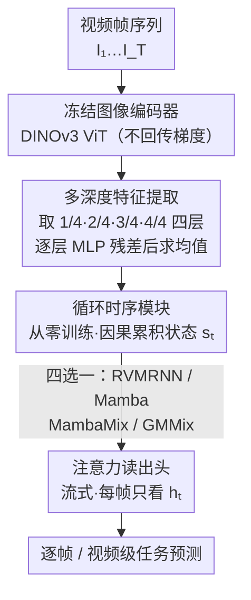

# Towards Data-Efficient Video Pre-training with Frozen Image Foundation Models

**会议**: CVPR 2026  
**arXiv**: [2605.19137](https://arxiv.org/abs/2605.19137)  
**代码**: https://github.com/tue-mps/towards-video-image-frozen (有)  
**领域**: 视频理解 / 自监督表示学习  
**关键词**: 视频基础模型、冻结图像编码器、循环时序模块、数据高效预训练、DINOv3

## 一句话总结
本文提出"冻结一个预训练图像基础模型（DINOv3）当空间编码器、只在其上从零训练一个轻量循环时序模块"的解耦范式，实验证明在 5 个视频理解任务上它能匹配甚至超过在 840 万视频片段上端到端预训练的 RVM，从而论证大规模视频预训练对空间表征并非必需。

## 研究背景与动机

**领域现状**：当前最强的视频基础模型（VideoMAE、V-JEPA、4DS、RVM 等）几乎都走"端到端、在百万到十亿级视频片段上从头联合学习时空表征"的路线。其中 RVM 比较特别——它已经把模型在结构上拆成"逐帧 ViT 空间编码器 + GRU 门控的循环时序核"，但训练时仍把两部分在 ~840 万视频片段上联合端到端预训练。

**现有痛点**：这种端到端视频预训练在数据采集、存储和算力上代价极其高昂。与此同时，图像基础模型（DINOv2/DINOv3、SigLIP2 等）已经在数十亿张图像上训练出极强的空间表征，且作为**冻结**特征提取器就能迁移到分类、分割、深度估计等任务。

**核心矛盾**：既然强空间表征"现成可用"，那大规模视频预训练里到底有多少算力是花在重新学空间、有多少是真正花在学时序？如果空间能力可以白嫖图像模型，视频预训练就只需要补"时序推理"这一块，数据和算力需求可能断崖式下降。

**本文目标**：在真正投入昂贵的视频预训练算力之前，先验证可行性，拆成两个研究问题——(1) 用图像预训练的空间编码器，是否能和视频预训练的编码器竞争？(2) 时序模块到底需不需要大规模视频预训练？

**切入角度**：作者借力 RVM 这种"空间-时序天然解耦"的循环架构——把 RVM 的空间编码器换成冻结的 DINOv3，时序模块从零训练，在多任务上做对照实验。这样能干净地把"空间表征质量"和"时序模块训练"两个变量分开测。

**核心 idea**：冻结图像基础模型当空间编码器，只在上面从零训练一个轻量循环时序头（流式逐帧处理），用"图像预训练 + 少量时序训练"替代"端到端视频预训练"。

## 方法详解

### 整体框架
整篇工作要回答的是"视频理解能不能把空间和时序学习彻底解耦"。框架把一段视频 $V=\{I_1,\ldots,I_T\}$ 拆成三段流水线处理：**冻结图像编码器**逐帧抽空间特征 → **循环时序模块**沿帧维度因果地累积时序状态 → **注意力读出头**产生任务预测。关键约束是：编码器全程冻结、不回传梯度；时序模块和读出头从零训练；而且读出头采用**流式协议**——每帧只能看当前帧时序模块的输出 $\mathbf{h}_t$，逼着所有时序上下文必须沉淀在循环状态 $\mathbf{s}_t$ 里，从而成为对"时序表征质量"最严格的考验。

为了把"空间表征质量"和"时序模块训练"两个变量分别拷问，框架沿两条轴做对照：换不同预训练范式的冻结编码器（图像 vs 视频），以及换不同的时序架构 / 用 RVM 预训练权重初始化时序模块。

### 关键设计

**1. 解耦的"冻结图像编码器 + 从零时序模块"范式：把空间能力从视频预训练里剥离**

针对"端到端视频预训练既学空间又学时序、算力浪费在重学空间"这个痛点，本文把空间和时序彻底解耦。每帧 $I_t$ 独立过一个**完全冻结**的预训练图像编码器 $\mathcal{E}$（主用 DINOv3，但框架是编码器无关的），得到逐帧特征；时序模块 $\mathcal{S}$ 维护跨帧隐状态 $\mathbf{h}_t,\mathbf{s}_t=\mathcal{S}(\mathbf{X}_t,\mathbf{s}_{t-1})$，状态初始化为零、**因果处理**（永不访问未来帧）。由于参数和算力绝大部分都压在视觉编码器上、时序模块很轻，这套设计天然支持"一个共享冻结编码器 + 多个按任务定制的小时序头"的高效服务范式：空间编码器完全不需要视频数据，只有轻量时序模块需要见视频序列，数据和算力需求大幅下降。

**2. 多深度特征提取：把冻结编码器各层散落的空间信息重新聚合**

这一步针对"冻结编码器没法像微调那样把任务相关信息收敛到最后一层"的问题。端到端微调时编码器会学着把有用信息固化进末层；而冻结编码器的有用空间信息是**沿深度分布**的——浅层抓低级结构、深层抓高级语义。于是从四个等距 ViT 深度（相对深度 $1/4, 1/2, 3/4, 1$）各取 patch token $\mathbf{F}_{t,j}$，每层用一个可训练的逐层 MLP 加残差适配，再跨深度求均值：

$$\hat{\mathbf{F}}_{t,j}=\mathbf{F}_{t,j}+\mathrm{MLP}_j(\mathrm{BN}(\mathbf{F}_{t,j})),\qquad \mathbf{X}_t=\frac{1}{4}\sum_{j=1}^{4}\hat{\mathbf{F}}_{t,j}$$

末层的 CLS 和 register token 再拼到 $\mathbf{X}_t$ 上一起喂给时序模块。这样拿到比"只用末层特征"更丰富的多尺度空间信息，实验里对所有时序架构、所有任务都稳定涨点（Waymo 上 RVMRNN 变体从 89.8 涨到 94.9 mIoU）。

**3. 四种可互换的循环时序架构：用统一接口分离"时序设计 vs 空间质量"的影响**

作者要验证"性能由谁主导"，于是给出四个共享同一循环接口（Eq. 11）、可在框架里随意替换的时序模块，复杂度递增：
- **RVMRNN**：直接搬 RVM 的门控核，最复杂——GRU 风格的更新/重置门 + 跨注意力 transformer + 自注意力融在一个模块里，状态 $\mathbf{s}_t$ 每个空间 token 存一个向量。
- **Mamba**：最简单，对每个空间 token 沿时间独立跑选择性 SSM（pre-norm 残差 $\mathbf{x}^{k+1}=\mathbf{x}^k+\mathrm{Mamba}(\mathrm{LN}(\mathbf{x}^k))$），patch 之间无空间交互。
- **MambaMix**：在 Mamba 前插一个 SpatialBlock（帧内对 $N$ 个 patch 做自注意力 + MLP），让 patch 在帧内先互通信息，再做时序 Mamba。
- **GMMix (GatedMambaMix)**：在 MambaMix 基础上加一个学习门控 $\mathbf{g}^k=\sigma(\mathrm{Gate}([\mathbf{z}^k;\tilde{\mathbf{z}}^k]))$，在"做时序前/后"的表征间插值 $\mathbf{x}^{k+1}=(1-\mathbf{g}^k)\odot\mathbf{z}^k+\mathbf{g}^k\odot\tilde{\mathbf{z}}^k$，显式控制吸收多少时序信息——这是最贴近 RVMRNN（GRU 门控）的 Mamba 版类比。

实验结论很关键：四种架构配 DINOv3 都大幅超过冻结 RVM，且没有单一架构在所有任务上全面碾压。这说明**主导因素是空间编码器质量，而非具体时序设计**，反过来支撑了解耦范式——一个共享冻结编码器可以挂不同的轻量时序头按任务特化。

**4. 时序模块的视频预训练迁移：不自己预训练，借 RVM 权重侧面验证第二个问题**

第二个研究问题"时序模块需不需要视频预训练"，作者没有真去做昂贵的预训练，而是巧妙借用 RVM 已经在视频上预训练好的时序核权重，对比"从零训练 vs 用 RVM 预训练权重初始化"两种策略。结果显示：即便把 RVM 的时序核迁到一个**不同的**编码器（DINOv3）上，预训练初始化仍稳定带来增益（+1.3 SSv2、+4.9 PT 等）。这说明时序模块学到的动态**部分是编码器无关的**，从而论证"冻结图像编码器 + 视频预训练的时序模块"这条解耦路线既可行又高效——空间编码器完全不碰视频数据，只有轻量时序模块需要见视频。

### 损失函数 / 训练策略
本文不引入新的预训练目标。编码器始终冻结，时序模块和读出头在每个下游数据集上从零监督训练；评测沿用 RVM/4DS 的协议。默认用**流式协议**（读出头每帧只看当前帧 token，$\hat{y}_t=\mathcal{R}_{\mathrm{stream}}(\mathbf{h}_t)$）作为对时序表征的严格考验；与视频基础模型对比时额外用 offline 协议（读出头同时注意所有帧）以公平比较。视频级任务（SSv2）取最后一帧预测 $\hat{y}_T$（累积了全部时序上下文）；逐帧任务每步独立预测。

## 实验关键数据

任务覆盖：动作识别（Something-Something v2，top-1 Acc）、目标跟踪（Waymo Open，mIoU）、点跟踪（Perception Test，AJ；Kubric 合成训练 → 真实视频评测）、深度估计（ScanNet，AbsRel↓）、相机位姿估计（NuScenes，RPEtr↓）。归一化平均（Norm. Avg）：每个分数除以该列最优后取均值。

### 主实验

四种时序模块配冻结 DINOv3-L（流式协议，RVM 为冻结基线）：

| 模型 | 参数(M) | SSv2 Acc↑ | Waymo mIoU↑ | PT AJ↑ | ScanNet AbsRel↓ | NuScenes RPEtr↓(mm) | Norm.Avg↑ |
|------|---------|-----------|-------------|--------|-----------------|----------------------|-----------|
| RVM-L (冻结基线) | 375 | 46.9 | 72.7 | 61.3 | 0.1293 | 36.00 | 77.7 |
| DINOv3-L + RVMRNN | 375 | **67.1** | **85.7** | 63.7 | 0.0900 | 29.37 | 96.8 |
| DINOv3-L + Mamba | 347 | 63.3 | 84.8 | 65.4 | 0.0963 | 28.48 | 95.3 |
| DINOv3-L + MambaMix | 397 | 66.4 | 85.0 | 66.7 | **0.0870** | 28.13 | 98.8 |
| DINOv3-L + GMMix | 405 | 66.9 | 85.0 | **69.4** | 0.0885 | **28.09** | **99.4** |

所有 DINOv3 变体大幅超过冻结 RVM：SSv2 上超 20 分以上，Waymo 上至少超 12 分，ScanNet 误差几乎砍半。

与视频基础模型对比（全部编码器冻结，仅训练读出头；本文额外从零训练轻量时序模块，无任何视频预训练）：

| 模型 | 预训练 | SSv2↑ | Waymo↑ | PT↑ | Norm.Avg↑ |
|------|--------|-------|--------|-----|-----------|
| VideoMAE-L | 视频 | 62.7 | 74.9 | 70.5 | 88.9 |
| V-JEPA-L | 视频 | 66.0 | 73.3 | 67.1 | 88.5 |
| RVM-L | 视频 | 66.7 | 73.2 | 68.1 | 89.3 |
| **DINOv3-L + GMMix** | **图像** | 66.4 | **94.9** | **73.3** | **99.1** |
| RVM-B | 视频 | 61.4 | 71.1 | 68.1 | 85.9 |
| **DINOv3-B + GMMix** | **图像** | 60.7 | **93.9** | **75.1** | **96.7** |

L 和 B 两个规模下，本文模型的归一化平均都明显超过所有视频预训练基线（L: 99.1 vs RVM 89.3；B: 96.7 vs 85.9）。

### 消融实验

| 配置 | 关键指标 | 说明 |
|------|---------|------|
| 多深度特征 vs 仅末层 | SSv2 +1.2~3.0、Waymo +5.1 mIoU(89.8→94.9)、PT 全 +1.0 AJ | 多深度对所有架构/任务稳定涨点 |
| 时序模块从零 vs RVM 预训练初始化（DINOv3 上） | +1.3 SSv2 / +1.1 Waymo / +4.9 PT / −0.003 ScanNet / −4.81mm NuScenes | 跨编码器迁移仍有正向收益 |
| 时序模块从零 vs 预训练初始化（RVM 自身编码器上） | +9.5 SSv2 / +5.1 Waymo / +5.6 PT / −0.032 ScanNet / −20.85mm NuScenes | 同编码器下预训练收益更大 |
| 仅冻结图像编码器、无时序模块（DINOv3-L_dist） | Waymo 78.8 但 SSv2 仅 55.9、PT 仅 38.6 | 证明时序建模仍必需 |
| 编码器范式对比（GMMix 固定） | DINOv3/DINOv2 SSv2 超 RVM 编码器 4.2/2.9 分；监督 ViT-21K 也具竞争力 | 图像甚至纯监督编码器空间特征即竞争力 |

### 关键发现
- **空间编码器质量是主导因素**：换四种差异很大的时序架构都能超过冻结 RVM，且无单一架构全面最优，说明涨点主要来自冻结 DINOv3 的强空间特征而非某个时序设计。
- **数据高效性显著**：DINOv3 + GMMix 仅用 SSv2 训练集 25% 数据（56.5）就超过冻结 RVM 用 100% 数据（46.9），强空间先验让时序模块在少量任务数据上就能学好。
- **时序动态部分编码器无关**：RVM 的时序核迁到 DINOv3 仍有正向迁移，支撑"共享冻结编码器 + 每任务小时序头（先视频预训练再微调）"的服务范式。
- **纯空间不够**：无时序模块的冻结图像编码器在 Waymo 上还行，但在 SSv2、点跟踪这类时序密集任务上明显掉，确认时序建模不可省。

## 亮点与洞察
- **借力 RVM 的解耦结构做对照实验**：作者没钱做端到端视频预训练，就巧用 RVM"空间-时序天然可拆"的特性，把它的编码器/时序核拆开再和自己的组件重组，干净地隔离出"空间表征"和"时序训练"两个变量——这是全文最聪明的实验设计。
- **多深度均值聚合是低成本高收益的 trick**：冻结编码器无法把信息收敛到末层，于是把 1/4、1/2、3/4、1 四层逐层 MLP 适配后求均值，几乎零额外推理代价就稳定涨点，可直接迁移到任何"用冻结 ViT 当特征提取器"的下游任务。
- **GMMix 把 GRU 门控思想移植到 Mamba**：用一个 sigmoid 门在"做时序前/后"表征间插值，等价于给 Mamba 加了 RVMRNN 的门控归纳偏置，是 SSM 时代复刻经典 RNN 设计的一个干净范例。
- **"诚实的 work-in-progress"定位**：论文明确承认还没做时序模块的视频预训练，只给"投资前的可行性证据"，这种坦诚反而让结论更可信。

## 局限性 / 可改进方向
- **作者承认的核心局限**：本文**没有真正做时序模块的视频预训练**，只是用 RVM 现成权重侧面验证，"解耦预训练真能赢"的完整证据留待未来工作。
- 规模只到 Base / Large，未探更大模型；编码器和时序架构家族、预训练目标的覆盖也有限。
- 评测管线是作者自己复现的（[25,4] 无公开实现），可能与原始设置有偏差，跨论文数字对比需留 caveat。
- **自己发现的局限**：Waymo 上本文 94.9 vs 视频基线 ~73 的巨大领先，部分可能源于复现协议差异而非纯粹方法优势，单看这一列结论需谨慎；流式 vs offline 两套协议混用，跨表数字不宜直接比大小。
- 点跟踪是合成（Kubric）训练→真实评测的迁移设置，结论的泛化性受合成-真实 gap 影响。

## 相关工作与启发
- **vs RVM [25]**：同样是"逐帧编码器 + 循环时序核"的解耦架构，但 RVM 把两部分在 ~840 万视频片段上联合端到端预训练；本文冻结编码器、只从零训时序模块，证明空间部分可白嫖图像模型，数据/算力大降。
- **vs VideoMAE / V-JEPA / 4DS**：这些是非因果、需整段时序窗口、在十亿级视频上端到端预训练的 Video ViT；本文用因果流式的循环模块 + 冻结图像编码器，归一化平均反超它们，挑战"必须大规模视频预训练"的共识。
- **vs DINOv3 / DINOv2（纯冻结图像编码器）**：纯空间特征在 Waymo 等任务已具竞争力，但在 SSv2、点跟踪等时序密集任务明显不足，说明本文加的轻量时序模块是把图像模型推到视频 SOTA 的关键补丁。
- **启发**：当一个领域的"基础能力"已被另一个更便宜的预训练范式（图像）解决时，可以只针对"增量能力"（时序）做训练。这套"冻结大编码器 + 多个可热插拔小时序头"的思路可迁移到音频、点云序列、传感器流等任何"空间/单帧已有强 backbone、只缺序列建模"的场景。

## 评分
- 新颖性: ⭐⭐⭐⭐ 范式提法清晰（解耦空间-时序预训练）且对照实验设计巧妙，但单个组件（冻结编码器、Mamba、多深度特征）都不算全新。
- 实验充分度: ⭐⭐⭐⭐ 5 任务 × 多编码器 × 4 时序架构 × 数据效率/迁移消融很全面，扣分在最关键的"时序模块视频预训练"尚未真正做。
- 写作质量: ⭐⭐⭐⭐⭐ 结构清晰、定位诚实（明确标注 work-in-progress），公式与实验对照到位。
- 价值: ⭐⭐⭐⭐ 若结论成立，对视频基础模型的训练成本是颠覆性的；作为可行性研究已给出有力证据，工程上的"共享编码器 + 小时序头"范式也很实用。

<!-- RELATED:START -->

## 相关论文

- [\[CVPR 2026\] UniVBench: Towards Unified Evaluation for Video Foundation Models](univbench_towards_unified_evaluation_for_video_foundation_models.md)
- [\[CVPR 2026\] VAST: Video Ability-Stratified Taxonomy for Data-Efficient Video Reasoning](vast_video_ability-stratified_taxonomy_for_data-efficient_video_reasoning.md)
- [\[CVPR 2026\] Incentivizing Versatile Video Reasoning in MLLMs via Data-Efficient Reinforcement Learning](incentivizing_versatile_video_reasoning_in_mllms_via_data-efficient_reinforcemen.md)
- [\[ICML 2025\] MoMa: Modulating Mamba for Adapting Image Foundation Models to Video Recognition](../../ICML2025/video_understanding/moma_modulating_mamba_for_adapting_image_foundation_models_to_video_recognition.md)
- [\[CVPR 2025\] Efficient Transfer Learning for Video-language Foundation Models](../../CVPR2025/video_understanding/efficient_transfer_learning_for_video-language_foundation_models.md)

<!-- RELATED:END -->
