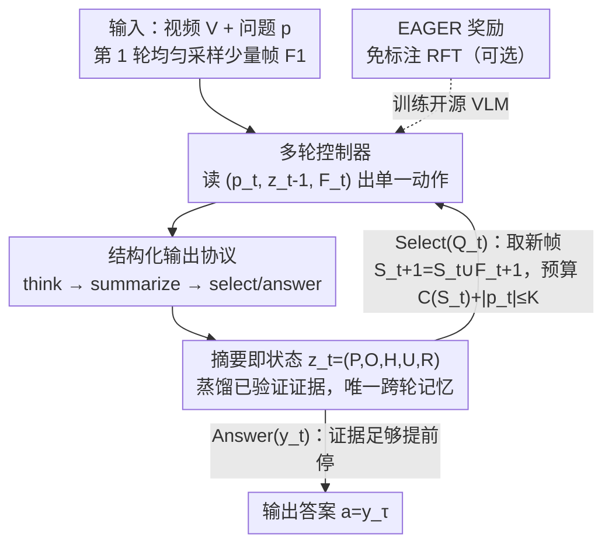

# Towards Sparse Video Understanding and Reasoning

**会议**: CVPR 2026  
**arXiv**: [2602.13602](https://arxiv.org/abs/2602.13602)  
**代码**: https://sparsevideounderstanding.github.io （项目主页，无开源代码）  
**领域**: 视频理解  
**关键词**: 视频问答, 帧选择, 多轮推理, 摘要即状态, 强化微调

## 一句话总结
ReViSe 把视频问答重新建模成"问题驱动的多轮稀疏帧选择"——每轮只挑几帧、把已验证的证据压缩进一个结构化的"摘要即状态"里跨轮传递、足够确信就提前停，既能即插即用包住任何 VLM，也能用免标注奖励 EAGER 做强化微调，在多个 VQA benchmark 上用个位数帧就拿到更高准确率。

## 研究背景与动机
**领域现状**：当前用 LLM/VLM 做视频理解，主流是把视频均匀采样成一串帧，再走两条路线之一：要么用 captioner 把帧转成文字、让 LLM 在文本空间推理（丢失细粒度视觉细节），要么把视觉特征直接喂进 VLM（如 LLaVA、QwenVL）。无论哪条，帧都是**均匀采样**的。

**现有痛点**：均匀采样有两个老问题（沿用 VideoTree 的归纳）。**(L1) 信息过载**：长视频时间冗余极强，塞太多冗余帧会淹没 LLM，既拖慢推理又干扰判断。**(L2) 关键信息感知不足**：视频内容是分层、时序结构化的，不在多个尺度上找出语义显著帧，模型就会漏掉回答问题真正需要的线索。

**核心矛盾**：这两个痛点的共同根源是**语义稀疏性**——对某个具体问题而言，整段视频里真正相关的帧其实只有一小撮。均匀采样既不知道哪几帧重要（漏关键），又被一堆无关帧拖累（冗余），本质是"问题无关"的采样方式撞上了"问题相关"的稀疏证据分布。

**本文目标**：把视频理解拆成两个子问题——(a) 怎么只挑出对当前问题最有信息量的少量帧；(b) 怎么在多轮交互中把已看到的证据**紧凑地累积**起来、避免每轮重读全部历史。

**切入角度**：作者从 RNN 隐状态的类比出发——既然证据是逐步积累的，就该有一个**持续更新的紧凑记忆**，只往前携带"任务关键"的信息，并据此决定"下一步看哪儿"。这把"看什么帧"从一次性的最大覆盖问题，变成了一个由状态驱动的序贯决策问题。

**核心 idea**：用一个跨轮传递的"摘要即状态"（summary-as-state）替代原始对话历史，把多轮帧选择变成"读几帧→更新状态→决定再看哪儿或直接作答"的循环，并用免标注奖励 EAGER 教会模型选得准、停得早。

## 方法详解

### 整体框架
ReViSe（Reasoning with Video Sparsity）把视频问答建成一个**最多 T 轮**的智能体交互过程。给定视频 $V=\{x_i\}_{i=0}^{L-1}$ 和问题 $p$，目标是在视觉 token 预算 $K$ 内产出答案 $a$。它不一次性吞下所有帧，而是迭代地：(i) 选一小批最可能降低答案不确定性的帧，(ii) 把这一轮看到的证据蒸馏进一个结构化摘要状态 $z_t$ 并跨轮携带，(iii) 一旦累积证据足够就提前作答。

整个系统由三个模块协同：**多轮控制器**决定每轮看哪些帧、何时停；**结构化输出协议**用固定标签把模型的思考与状态外显出来；**摘要即状态**是唯一跨轮携带的记忆，累积已验证证据并条件化后续决策。每轮里，VLM 先吐 `<think>` 推理轨迹，然后要么提交 `<summarize>` 状态 + `<select>` 请求（中间轮），要么给 `<answer>`（终轮）。下一轮只带着新帧和更新后的摘要继续。模型可以**冻结地包住任意闭源 VLM**（plug-and-play，§3.2），也可以对开源 VLM 用 EAGER 奖励做强化微调（§3.3）。

### 关键设计

**1. 多轮问题驱动帧选择：把"最大覆盖"换成序贯决策**

针对 L1（信息过载），ReViSe 不再一次性塞入大量均匀采样帧，而是把帧选择拆成最多 $T$ 轮。设 $S_t=\bigcup_{j=1}^{t}F_j$ 是到第 $t$ 轮为止已纳入的所有帧。每轮 $t\geq 2$，智能体基于 $(p_t,z_{t-1},F_t)$ 产出唯一动作 $a_t\in\{\textsc{Select}(Q_t),\textsc{Answer}(y_t)\}$，其中 $Q_t\subseteq\{0,\dots,L-1\}\setminus S_{t-1}$ 是请求的少量**新**帧下标（不重复已看过的）。选 Select 就让环境取回 $F_{t+1}=\{x_i: i\in Q_t\}$、更新 $S_{t+1}=S_t\cup F_{t+1}$；选 Answer 就在停止时刻 $\tau\leq T$ 终止。全程强制 token 预算约束 $C(S_t)+|p_t|\leq K$（$C(F)=\sum_{x\in F}c(x)$ 是帧集合的视觉 token 成本）。

优化目标是在预算内选好选帧序列与停止时刻：
$$\max_{\{Q_t\},\,\tau\leq T}\ \mathcal{R}\bigl(\pi_\theta(p,z_{\tau-1},S_{\tau-1})\bigr)\quad\text{s.t.}\ C(S_{\tau-1})+|p_\tau|\leq K.$$
这一序贯化是关键区别：旧的单次帧选择是"一口气选最优 k 帧"的静态覆盖问题，而 ReViSe 让模型**读几帧→看不够→再定向补几帧**，每次都拿着已有证据去补"缺的那块"，因此用极少帧就能逼近答案。

**2. 摘要即状态 z_t=(P,O,H,U,R)：唯一跨轮记忆，专治 L2**

针对 L2（关键信息感知不足），ReViSe 把跨轮记忆固化成一个五元组、且规定**固定书写顺序 P→O→H→U→R**：$P_t$（Previously seen，已看过什么）、$O_t$（Observations，本轮刚观察到的证据）、$H_t$（belief Hypotheses，这些观察如何更新当前假设，但不直接吐出最终选项字母）、$U_t$（Uncertainties，还剩哪些未知）、$R_t$（Reasons，下一步该去找什么证据，或宣告已可作答）。它写在 `<summarize>` 字段里，是**唯一**跨轮携带的状态。

之所以有效，在于状态的**累积性**：$z_{t-1}$ 被定义为已包含 $\{z_0,\dots,z_{t-2}\}$，所以只条件化 $z_{t-1}$ 就等价于条件化整段状态历史，记忆成本恒定、不必重读冗长原始历史（这同时也缓解 L1）。而 $R_t$ 直接驱动下一轮的提案 $Q_{t+1}$（"我还缺 X，所以去看时间段 Y 的帧"），$H_t/U_t$ 的稳定与否又天然给出"何时该停"的信号——假设不再变、不确定性清空，就作答。这把"看什么 / 何时停"都绑定到了同一个显式状态上，让多轮推理保持连贯且对累积证据忠实。这也是和 VideoAgent 等只做单次选择、靠堆原始历史的方法的根本区别。

**3. 结构化输出协议 + 即插即用：让决策透明、且零改动包住任何 VLM**

每轮回复强制以 `<think>` 推理轨迹开头，再二选一：Select 轮输出 `<think>…</think><summarize>…</summarize><select>…</select>`，Answer 轮输出 `<think>…</think><answer>…</answer>`。关键约定是 `<think>` 轨迹**不持久化**（只是本轮临时思考），只有 Select 轮提交的 `<summarize>` 状态被带到下一轮；终轮复用最近一次提交的摘要直接作答。这样把临时推理与持久状态分开，既压低 prompt 体积、又提升可解释性，还为后续的查询感知选择与提前停止提供了结构化抓手。

正因为所有逻辑（多轮对话、自适应选帧、状态更新、格式校验）都跑在 VLM **外部**，ReViSe 把闭源 VLM 当成冻结黑盒、只通过其公开推理接口（如 API）交互，无需任何参数更新就能即插即用地编排多轮交互——这是它能同时服务 GPT-4o 这类闭源模型和开源模型的工程前提。

### 损失函数 / 训练策略
对开源 VLM，ReViSe 把多轮交互建成有限步 MDP $\mathcal{M}=\langle\mathcal{S},\mathcal{A},\mathcal{T},r,\gamma\rangle$，状态 $s_t=(p_t,z_{t-1},S_{t-1})$，优化期望折扣回报 $J(\theta)=\mathbb{E}_{H\sim\pi_\theta}[\sum_{t=1}^{\tau}\gamma^{t-1}r_t]$，并把 $\pi_\theta$ 分解到 token 级以兼容自回归 VLM。

奖励是本文设计的 **EAGER（Evidence-Adjusted Gain for Efficient Reasoning）**，一个稠密、**免帧级标注**（只需答案标签与模型分数）的奖励，定义当前上下文下的（温度校准）对数几率间隔 $m_t=\log p_\theta(y^\star\mid p_t,z_{t-1},S_t)-\max_{y\neq y^\star}\log p_\theta(y\mid p_t,z_{t-1},S_t)$，含三项：

- **(i) 置信增益** $r_t^{\text{conf}}=[m_{t+1}-m_t]_+$（Select 时生效）：只奖励"加了新帧后确实让正确选项相对最强干扰项的间隔变大"的证据，逼模型选真正有信息量的帧。
- **(ii) 摘要充分性** $r_t^{\text{sum}}=\mathds{1}[\arg\max_{y}p_\theta(y\mid p_\tau,z_{\tau-1})=y^\star]$（Answer 时生效）：作答时**只用最后提交的摘要**重新问一遍，答对才给奖，逼摘要忠实且自足。
- **(iii) 正确且尽早停** $r_t^{\text{stop}}=1+\beta[T_{\text{stop}}-\tau]_+$（仅当在小预算 $T_{\text{stop}}$ 内答对，否则 0）：奖励在少轮内答对，省得磨蹭。

外加一个小的格式奖励 $r_t^{\text{format}}=\alpha\cdot\mathds{1}[\text{合法标签}]$。每步奖励 $r_t=\lambda_1 r_t^{\text{conf}}+\lambda_2 r_t^{\text{sum}}+\lambda_3 r_t^{\text{stop}}+r_t^{\text{format}}$。策略用 **GRPO** 优化：每轮采样 $G$ 条轨迹、标准化回报得轨迹级优势 $\hat A_i=\frac{R(H^i)-\text{mean}}{\text{std}}$（同一轨迹所有 token 共享），再走带 clip 的 GRPO 目标。由于 3B 级 VLM 指令跟随弱，作者先从 GPT-4o 在 plug-and-play 下蒸馏 **8000 条多轮对话**做一段短的格式微调（教模型可靠产出 `<think>/<summarize>/<select>/<answer>` 协议），再做 RL。

## 实验关键数据

### 主实验
评测主干：Qwen2-VL-7B、Qwen2.5-VL(3B/7B)、InternVL2-8B、GPT-4o；数据集 VideoEspresso、NExT-QA、EgoSchema。统一交互预算：每轮最多 3 帧、最多 4 轮。

VideoEspresso（14 类细粒度任务，平均准确率 %，#Frames 为每视频平均处理帧数）：

| 主干 + 方法 | #Frames | Avg Acc | 相对原主干 |
|------|------|------|------|
| InternVL2-8B | FPS=1 | 28.7 | — |
| InternVL2 + ReViSe | 2.87 | 32.1 | +3.4 |
| Qwen2-VL-7B | FPS=1 | 28.5 | — |
| Qwen2-VL + ReViSe | 6.25 | 37.8 | +9.3 |
| GPT-4o | FPS=3 | 26.4 | — |
| **GPT-4o + ReViSe** | 7.99 | **48.9** | **+22.5** |

GPT-4o + ReViSe 在 14 个细粒度类别中 **13 个拿到最佳**，且只用个位数帧，超过 VideoEspresso 等专门系统。

即插即用横向对比（EgoSchema 子集 / NExT-QA，准确率 % + 每视频帧/caption 数）：

| 数据集 | 方法 | Acc (%) | Frames/Caps |
|------|------|------|------|
| EgoSchema | VideoAgent | 60.2 | 8.4 |
| EgoSchema | VideoTree | 66.2 | 62.4 |
| EgoSchema | LLoVi | 57.6 | 180 |
| EgoSchema | **GPT-4o + ReViSe** | 60.6 | **9.8** |
| NExT-QA | VideoTree | 73.5 | 56 |
| NExT-QA | VideoAgent | 71.3 | 8.2 |
| NExT-QA | LVNet | 61.1 | 12 |
| NExT-QA | **GPT-4o + ReViSe** | 63.8 | **8.4** |

ReViSe 始终落在"超低帧预算"区间：比 VideoTree 少约 6–7×帧、比 LLoVi/MC-ViT-L 少 13–18×，且**完全不依赖 captioner**。代价是相比最强 baseline（VideoTree）牺牲一点准确率换取简洁与效率。

强化微调（RFT，Qwen2.5-VL-3B 主干）：

| 数据集 | 方法 | Acc (%) | Frames | Rounds | Time(s) |
|------|------|------|------|------|------|
| VideoEspresso | Direct Reasoning | 12.6 | 8.0 | 1.00 | 1.02 |
| VideoEspresso | Plug-and-Play | 20.1 | 5.2 | 1.86 | 1.73 |
| VideoEspresso | Supervised Format FT | 21.3 | 5.0 | 1.52 | 1.67 |
| VideoEspresso | **Reinforced FT** | **27.8** | 4.1 | 1.37 | 1.02 |
| NExT-QA | Direct Reasoning | 23.6 | 8.0 | 1.00 | 0.88 |
| NExT-QA | Plug-and-Play | 31.7 | 5.3 | 1.74 | 1.22 |
| NExT-QA | Supervised Format FT | 27.3 | 5.1 | 1.65 | 1.13 |
| NExT-QA | **Reinforced FT** | **51.3** | 3.9 | 1.32 | 0.62 |

NExT-QA 上 RFT 比即插即用高近 20 个点（51.3 vs 31.7），同时帧从 5.3 降到 3.9、轮数从 1.74 降到 1.32、推理时间几乎砍半（0.62 vs 1.22s）。

### 消融实验
（VideoEspresso + Qwen2.5-VL-7B）

| 配置 | 关键指标 | 说明 |
|------|---------|------|
| Full model | 最佳准确率，轮数最少、延迟最低 | 完整模型 |
| 增加允许轮数 | 1 轮 38.3%@4.60帧 → 2 轮 39.0%@3.20帧 → 3 轮 41.6%@~4.0帧 → 4 轮 **42.1%@2.89帧** | 多轮越放越准且帧越少，平均实际轮数仅 ≈2.3（提前停） |
| w/o 状态跨轮携带 | 准确率 −18.34%，计算量近翻倍 | 每轮被迫重建上下文 |
| w/o 结构化 P/O/H/U/R 字段 | 大幅掉点，运行时增加最多（+32.14s） | 显式状态传播对稳定多轮推理至关重要 |
| w/o 两者 | 20.24%（最差） | 退化到无状态多轮 |

### 关键发现
- **状态跨轮携带是第一功臣**：去掉它准确率掉 18.34% 且算量翻倍——多轮的价值不在"多看几帧"，而在"把看过的压成状态带下去"。
- **结构化字段不是装饰**：去掉 P/O/H/U/R 结构后运行时反而暴增 32.14s，说明显式状态在抑制反复重建上下文。
- **更多轮 = 又准又省**：准确率-帧数 Pareto 前沿单调，允许越多轮，模型反而用越少帧拿越高准确率，因为它学会了定向补帧 + 提前停（实际平均只用约 2.3 轮）。

## 亮点与洞察
- **把 RNN 隐状态的思想搬进 VLM 多轮推理**：summary-as-state 本质是个"文字版隐状态"，只往前带任务关键信息——这让"长视频要不要塞进长上下文"这个老难题，被转译成"维护一个紧凑可更新的记忆"，记忆成本恒定，很优雅。
- **EAGER 的"摘要充分性"项很巧**：作答时强制只用摘要重问一遍、答对才给奖，等于用奖励逼着模型把证据真正写进状态、而不是偷偷靠原始帧蒙对，直接对齐了"状态自足"这个想要的性质，且全程免帧级标注。
- **置信增益用对数几率间隔做密集奖励**：$[m_{t+1}-m_t]_+$ 只奖励"真的把正确选项推得更开"的帧，给多轮帧选择提供了无需人工标注 keyframe 的稠密信号，可迁移到任何带选项打分的多轮检索任务。
- **即插即用 + RFT 双形态**：同一框架既能零改动包闭源大模型、又能强化微调小开源模型，工程上覆盖面很广。

## 局限与展望
- **作者承认**：(1) 严重依赖主干 VLM 的视觉保真度与时序推理，弱主干会拖垮摘要状态；(2) 多轮查询带来额外 API 调用延迟，严格延迟约束下单次模型可能更快；(3) 当前只选**整帧**、不做空间裁剪，细粒度定位任务上效率受限。
- **自己发现的局限**：主实验在 VideoEspresso 上绝对准确率偏低（GPT-4o+ReViSe 也才 48.9%），更像是"在低帧预算这个受限设定下谁更强"的对比，和 VideoTree 73.5%（NExT-QA）这类高帧 baseline 不在同一工作点，横向比大小要带 caveat。RFT 只在 3B 主干上验证（算力所限），是否能放大到更大开源模型未知；且 8000 条 GPT-4o 蒸馏数据做格式预训练，对最终表现的贡献没单独拆开。
- **改进思路**：作者提到的自适应空间裁剪、更强视觉编码器、扩展到开放式生成（非选择题）都值得做；另外置信增益依赖能拿到选项 log-prob，对纯生成式答案需要替代信号。

## 相关工作与启发
- **vs VideoAgent**：VideoAgent 也做 LLM 驱动的多轮帧选择，但基于 caption 内容、且每轮重读对话历史；ReViSe 直接在视觉空间推理、用紧凑摘要状态替代原始历史，且配 EAGER 奖励可 RL 微调。两者帧预算同处超低区间（NExT-QA 各约 8 帧），但 ReViSe 不依赖 captioner。
- **vs VideoTree**：VideoTree 靠分层树结构选核心帧，准确率更高（NExT-QA 73.5%）但帧预算大（56 帧）；ReViSe 用约 6–7× 更少的帧换简洁与效率，是另一个工作点的取舍。
- **vs 单次帧选择类（MDP3 / Q-Frame / FOCUS / Frame-Voyager）**：这些大多是单趟选择（一次定好 k 帧）；ReViSe 的核心差异是**跨轮维护持久状态**的迭代式问题感知选择，且天然兼容任意 VLM 即插即用。
- **vs RL 帧选择类（TSPO / FrameThinker / RAGEN）**：ReViSe 同样用 GRPO + 多轮 MDP（沿用 RAGEN 设置），但奖励 EAGER 是免标注、面向"置信增益 + 摘要自足 + 早停"三信号定制的，把"选帧质量"和"状态质量"一起对齐。

## 评分
- 新颖性: ⭐⭐⭐⭐ "摘要即状态"+EAGER 三信号免标注奖励的组合在多轮视频问答里是新颖的，但多轮帧选择本身已有不少前作。
- 实验充分度: ⭐⭐⭐⭐ 覆盖 3 个时间尺度 benchmark、开源/闭源主干、即插即用与 RFT 双设定、消融到位；但绝对准确率偏低、RFT 仅 3B 主干。
- 写作质量: ⭐⭐⭐⭐ 问题形式化清晰、状态设计讲得透；部分表格散落在附录、横向对比工作点不一需读者自行甄别。
- 价值: ⭐⭐⭐⭐ 即插即用 + 免标注 RL 的稀疏视频推理框架，工程可用性强，思路可迁移到其他多轮检索式推理。

<!-- RELATED:START -->

## 相关论文

- [\[CVPR 2026\] Thinking with Drafts: Speculative Temporal Reasoning for Efficient Long Video Understanding](thinking_with_drafts_speculative_temporal_reasoning_for_efficient_long_video_und.md)
- [\[ICLR 2026\] VideoNSA: Native Sparse Attention Scales Video Understanding](../../ICLR2026/video_understanding/videonsa_native_sparse_attention_scales_video_understanding.md)
- [\[CVPR 2026\] VideoARM: Agentic Reasoning over Hierarchical Memory for Long-Form Video Understanding](videoarm_agentic_reasoning_over_hierarchical_memory_for_long-form_video_understa.md)
- [\[CVPR 2026\] MINERVA-Cultural: A Benchmark for Cultural and Multilingual Long Video Reasoning](minerva-cultural_a_benchmark_for_cultural_and_multilingual_long_video_reasoning.md)
- [\[CVPR 2026\] VecAttention: Vector-wise Sparse Attention for Accelerating Long Context Inference](vecattention_vector-wise_sparse_attention_for_accelerating_long_context_inferenc.md)

<!-- RELATED:END -->
