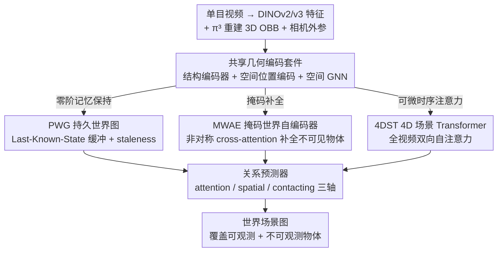

# Towards Spatio-Temporal World Scene Graph Generation from Monocular Videos

**会议**: CVPR 2026  
**arXiv**: [2603.13185](https://arxiv.org/abs/2603.13185)  
**代码**: [有](https://github.com/rohithpeddi/WorldSGG)  
**领域**: 视频理解
**关键词**: 场景图生成, 物体恒存, 3D场景理解, 时空推理, 视觉语言模型

## 一句话总结

提出 World Scene Graph Generation (WSGG) 任务，从单目视频构建包含所有物体（含被遮挡/出画面物体）的时空持久、世界坐标系锚定的场景图，并引入 ActionGenome4D 数据集和三种互补方法（PWG/MWAE/4DST）。

## 研究背景与动机

### 1. 领域现状
场景图生成（SGG）已从静态图像扩展到视频（VidSGG）、3D 点云（3D SGG）、4D 场景等多种形式，但主流方法仍以"帧为中心"：每帧独立推理当前可见物体，生成 2D 平面上的场景图。

### 2. 痛点
- **视角依赖**：所有物体位置基于 2D 图像坐标，缺乏统一的空间参考系
- **观测门控**：物体一旦出画面或被遮挡就从图中消失，没有持久记忆
- **时间碎片化**：即使有时序建模（如 STTran、Tempura），也只处理滑窗内帧，不维护全局一致的世界模型

### 3. 核心矛盾
真实场景中的智能体需要维持"物体恒存"（object permanence）的世界模型——物体即使不可见仍存在于环境中。但现有 SGG 方法的帧中心设计无法满足机器人操作、具身导航、长程活动理解等下游任务对持久世界状态推理的需求。

### 4. 要解决什么
构建一个**时间持久、世界坐标系锚定、覆盖所有物体（含不可见物体）**的场景图表示，包括 observed-observed、observed-unobserved、unobserved-unobserved 三类物体对之间的关系预测。

### 5. 切入角度
将认知科学中的"物体恒存"原则引入场景图生成，将世界状态 $\mathcal{W}^t$ 划分为可观测集 $\mathcal{O}^t$ 和不可观测集 $\mathcal{U}^t$，要求模型在每个时间戳对完整世界状态建图。

### 6. 核心 idea
- 新数据集 ActionGenome4D：将 Action Genome 升级为 4D 表示，提供世界坐标系 OBB、不可见物体的密集关系标注
- 新任务 WSGG：要求在每个时间戳输出覆盖 $\mathcal{W}^t$ 中所有物体的世界场景图
- 三种方法探索不同的不可见物体推理归纳偏置

## 方法详解

### 整体框架

所有方法共享统一的输入和一套几何编码组件：预提取的 DINOv2/v3 视觉特征、π³ 重建的 3D OBB 角点坐标、相机外参矩阵先送入共享套件，再进入三选一的不可见物体推理分支，最后由统一的关系预测器输出世界场景图。共享组件包括：

- **结构编码器（Global Structural Encoder）**：将 OBB 8 个角点编码为 27 维输入，通过 MLP 产生结构 token
- **空间位置编码（Spatial Positional Encoding）**：计算物体对之间的欧氏距离、方向向量、体积比等 5D 特征
- **空间 GNN（Spatial GNN）**：帧内 Transformer Encoder + 空间位置编码，建模物体交互
- **关系预测器（Relationship Predictor）**：融合人/物 token、union RoI 特征和 CLIP 文本嵌入，分别预测 attention (3类)、spatial (6类)、contacting (17类) 关系
- **相机位姿 / 运动编码器（Camera Pose / Motion Encoder）**：编码相机运动和物体 3D 速度/加速度

三种方法（PWG / MWAE / 4DST）就插在「共享几何编码」与「关系预测器」之间，差别只在如何为当下看不见的物体生成表示。

### 关键设计

三种方法共享上面那套几何编码组件，差别只在「如何处理当下看不见的物体」——分别押注三种不同的归纳偏置：直接记忆、掩码重建、可微时序注意力。

**1. PWG（Persistent World Graph）：用一块"最近状态"缓冲区把消失的物体留在图里**

最直白的痛点是：物体一出画面就没特征可用了。PWG 的做法是给每个物体维护一个 Last-Known-State（LKS）记忆缓冲区，做零阶特征保持——物体当前可见就用当前帧特征，一旦不可见就回退到它最近一次可见时的特征，从未出现过则填零向量。为了让模型知道这份"留底"有多旧，PWG 额外记录一个 staleness 量 $\Delta_n^{(t)} = |t - \tau^*|$（当前时刻与最近可见时刻 $\tau^*$ 的间隔），把它一起喂进融合。这等于把认知科学里的"物体恒存"直接写成了一条工程规则：看不见不等于不存在，先拿最后一次的样子顶着。它的代价是这块缓冲区不可微，没法端到端学到时序上下文；但因为 3D OBB 几何先验本身已经很强，光靠零阶保持就足以撑起一个有竞争力的世界场景图。

**2. MWAE（Masked World Auto-Encoder）：把"推断看不见的物体"当成掩码补全来学**

PWG 只是机械地复制旧特征，并没有真正"推断"不可见物体此刻该是什么样。MWAE 换了个视角：遮挡和相机运动本身就是天然的"掩码"——可见物体是露出来的 patch，不可见物体是被遮住的 patch，模型的任务就是从可见物体把不可见物体的表示补回来，这正好是 MAE 范式从图像 patch 域搬到物体/关系域。为了不让模型偷懒，训练时还会额外随机掩掉一部分本来可见的物体，逼它学会真正的补全而非记忆。关键的结构细节是它用了非对称 cross-attention：query 端包含全部物体 token，但 key/value 端只保留可见物体 token，这样不可见 token 只能从可见物体处取信息、彼此之间不能互相"对答案"，避免凭空脑补出一致但错误的结构。

**3. 4DST（4D Scene Transformer）：把静态缓冲区换成全视频可微的时序注意力**

PWG 的 LKS 不可微，等于把时序上下文这件事排除在了梯度之外。4DST 要把这块补上：它为每个物体沿时间轴拼出一条 token 序列（每个 token 融合视觉、结构、相机位姿、物体运动、自运动等特征），再用双向 Transformer 在整段视频上做自注意力，让一个物体此刻的表示能直接吸收它过去和未来的所有可见证据。在此基础上加入正弦位置编码标记时间、以及一个可学习的 visibility embedding 区分该时刻物体是否可见。本质上它把 2D VidSGG 里"分解时空注意力只跑可见物体"的范式，扩展到了覆盖不可见物体的完整 4D 设定，因此天然支持端到端学习；代价是要看到整段视频做双向注意力，不适合在线流式推理。

### 损失函数 / 训练策略

三种方法共享统一的多轴 BCE 损失结构：将物体对分为 visible pairs（clean GT）和 unobserved pairs（VLM 伪标签，权重 $\lambda_{\text{vlm}}$），分别计算 attention/spatial/contacting 三轴损失加节点分类损失。MWAE 在此基础上叠加重建相关项，总损失为

$$\mathcal{L}_{\text{MWAE}} = \mathcal{L}_{\text{SG}} + \lambda_{\text{recon}} \cdot \lambda_{\text{dom}} \cdot \mathcal{L}_{\text{recon}} + \mathcal{L}_{\text{sim}}$$

其中 $\mathcal{L}_{\text{SG}}$ 是上述场景图损失，$\mathcal{L}_{\text{recon}}$ 是被掩码物体特征的重建 MSE 损失，$\mathcal{L}_{\text{sim}}$ 是被掩码可见物体的关系重预测（相似度）损失。

## 实验关键数据

### 主实验

**Table 2: Recall (R@K) — PredCls & SGDet on ActionGenome4D**

| 方法 | Backbone | PredCls R@10 | PredCls R@20 | SGDet R@10 | SGDet R@50 |
|------|----------|-------------|-------------|-----------|-----------|
| PWG | DINOv2-L | 65.07 | 67.99 | 41.69 | 69.63 |
| MWAE | DINOv2-L | 65.33 | 68.30 | 41.69 | 69.50 |
| 4DST | DINOv2-L | 64.31 | 67.26 | **42.64** | 70.32 |
| PWG | DINOv3-L | 65.58 | 68.57 | 39.96 | 70.93 |
| MWAE | DINOv3-L | 65.57 | 68.58 | 39.67 | 70.90 |
| 4DST | DINOv3-L | **66.11** | **69.11** | 40.84 | **71.95** |

**Table 4: VLM 关系预测 — micro-averaged F1**

| Pipeline | Model | Mode | Attn F1 | Contact F1 | Spatial F1 | Micro F1 |
|----------|-------|------|---------|-----------|-----------|----------|
| Graph RAG | Qwen 2.5-VL | PredCls | 61.4 | 56.9 | 42.5 | **53.3** |
| Graph RAG | InternVL 2.5 | PredCls | 53.8 | 42.7 | 27.2 | 40.8 |
| Subtitle-Only | Qwen 2.5-VL | PredCls | 61.8 | 53.0 | 39.8 | 51.2 |

### 消融实验

**方法间消融发现**：
- **4DST** 在 SGDet 设置下最一致地领先（R@10=42.64 DINOv2-L; R@50=71.95 DINOv3-L），其可微分时序 transformer 提升了端到端传播能力
- **MWAE** 在多标签设置（No Constraint）表现最优，PredCls R@10=81.50、mR@10=55.09 (DINOv3-L)，重建和模拟遮挡损失起到互补正则化作用
- **PWG** 在多数 PredCls 设置下仅落后最佳方法 1–2 点，验证了 3D 几何先验本身就是强有力的结构先验

**VLM 消融发现**：
- Graph RAG 一致优于 Subtitle-Only，但对强 VLM（Qwen) 优势缩小（+2.1 vs InternVL +3.8）
- SGDet 相比 PredCls 召回率约减半，识别出世界级物体检测是主要瓶颈

### 关键发现

1. 仅凭持久 3D 几何先验（PWG 的零阶保持）就能达到极具竞争力的世界场景图生成效果
2. 不可见物体推理确实能通过可微时序建模（4DST）进一步提升,尤其在 SGDet 端到端检测设置下
3. VLM 虽能提供有用的伪标注，但在细粒度空间/接触关系推理方面仍有大幅提升空间（micro F1 53.3 vs macro F1 26.6，长尾严重）
4. 谓词难度递增：Attention > Contacting > Spatial

## 亮点与洞察

1. **任务定义精准且必要**：WSGG 抓住了从帧中心到世界中心的关键转变，清晰定义了 $\mathcal{W}^t = \mathcal{O}^t \cup \mathcal{U}^t$ 和覆盖所有交互对的世界场景图
2. **数据集构建管线完整**：从 π³ 3D 重建 → GDINO+SAM2 几何标注 → VLM 伪标注 + 人工修正 → ActionGenome4D，流程系统且可复现
3. **三方法设计哲学清晰**：PWG（记忆缓冲）、MWAE（掩码补全）、4DST（时序 Transformer）分别对应零阶保持、自编码器、全注意力三种归纳偏置，互补且渐进
4. **实验设计周全**：PredCls/SGDet × With/No Constraint × R@K/mR@K 全矩阵评估 + VLM baseline + 两种推理管线
5. **认知科学启发**：将物体恒存原则引入技术方案设计，PWG 的 staleness 感知和 MWAE 的天然掩码都很自然

## 局限与展望

1. **多阶段管线不够端到端**：3D 重建（π³）→ 几何标注（GDINO+SAM2）→ 特征提取（DINO）→ 关系预测，误差逐级传播
2. **VLM 伪标注质量**：不可见物体的关系标注依赖 VLM 生成 + 人工修正，伪标注的噪声用 $\lambda_{\text{vlm}}$ 权重缓解但未根本解决
3. **长尾分布严重**：macro F1 远低于 micro F1，谓词类别不均衡问题突出
4. **仅限人-物交互**：当前仅预测 person-object 关系对，未扩展到任意物体对
5. **离线处理**：4DST 需要完整视频的双向注意力，不支持在线流式推理
6. **数据集规模受限**：基于 Action Genome 的升级版，场景多样性和泛化能力待验证

## 相关工作与启发

- **与 VidSGG（STTran/Tempura）的关系**：WSGG 是其超集，从帧级图扩展到世界级图，增加了 3D 定位和不可见物体推理两个核心维度
- **与 3D/4D SGG 的关系**：现有 3D SGG 处理静态扫描、4D SGG 通常需要 RGB-D/多视图输入，WSGG 从单目视频出发，且覆盖不可见物体
- **MAE → 物体级 MAE**：MWAE 将掩码自编码器从 patch 级推广到物体/关系级，天然遮挡替代人工掩码，是一种有意义的范式迁移
- **VLM 作为标注器**：Graph RAG pipeline（事件图 → 检索 → 帧级预测 → 判别验证）是利用 VLM 生成结构化标注的实用范式
- **对具身智能的启示**：世界场景图是连接视觉感知与具身行动的关键中间表示，4DST 的时序建模思路对可部署系统有参考价值

## 评分

⭐⭐⭐⭐ 任务定义有远见、数据集构建扎实、方法设计系统且渐进，实验全面覆盖多协议和 VLM baseline。但多阶段管线的端到端性和长尾问题仍待突破。

<!-- RELATED:START -->

## 相关论文

- [\[CVPR 2026\] OmniGround: A Comprehensive Spatio-Temporal Grounding Benchmark for Real-World Complex Scenarios](omniground_a_comprehensive_spatio-temporal_grounding_benchmark_for_real-world_co.md)
- [\[CVPR 2026\] Streaming Video Crime Anticipation with Spatio-Temporal Causal Reasoning](streaming_video_crime_anticipation_with_spatio-temporal_causal_reasoning.md)
- [\[CVPR 2025\] HyperGLM: HyperGraph for Video Scene Graph Generation and Anticipation](../../CVPR2025/video_understanding/hyperglm_hypergraph_for_video_scene_graph_generation_and_anticipation.md)
- [\[CVPR 2026\] VISTA: Video Interaction Spatio-Temporal Analysis Benchmark](vista_video_interaction_spatio-temporal_analysis_benchmark.md)
- [\[CVPR 2026\] Cluster-Wise Spatio-Temporal Masking for Efficient Video-Language Pretraining](cluster-wise_spatio-temporal_masking_for_efficient_video-language_pretraining.md)

<!-- RELATED:END -->
