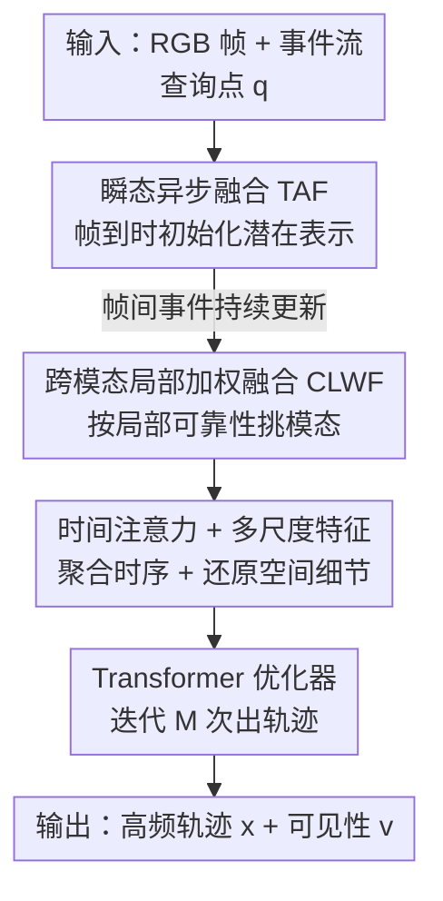

# TAPFormer: Robust Arbitrary Point Tracking via Transient Asynchronous Fusion of Frames and Events

**会议**: CVPR 2026  
**论文**: [CVF Open Access](https://openaccess.thecvf.com/content/CVPR2026/html/Liu_TTAPFormer_Robust_Arbitrary_Point_Tracking_via_Transient_Asynchronous_Fusion_of_CVPR_2026_paper.html)  
**领域**: 视频理解  
**关键词**: 任意点跟踪、帧-事件融合、事件相机、异步融合、Transformer

## 一句话总结
TAPFormer 用一套"瞬态异步融合"机制，把低帧率 RGB 帧和高频事件流融成一个随事件持续更新的连续潜在表示，让任意点跟踪在运动模糊、低光、高速场景下都保持高频稳定，在自建真实帧-事件数据集上把阈值内平均像素误差提升了 28.2%。

## 研究背景与动机

**领域现状**：任意点跟踪（Tracking Any Point, TAP）要在整段视频里估计任意一个查询点的运动轨迹与可见性，是 AR、自动驾驶等系统的底层能力。主流方法（CoTracker、TAPTR、PIPs++ 等）都建立在普通 RGB 帧上，用 Transformer 在时间窗内迭代优化轨迹。

**现有痛点**：普通相机有两个硬伤——帧率固定（20–30 Hz）跟不上快速运动，动态范围有限在过曝/低光下细节崩溃，于是出现运动模糊和轨迹漂移。事件相机正好互补：它以微秒级精度异步记录每个像素的亮度变化，动态范围极宽，适合高速、高对比场景；但事件流和运动强耦合——同一场景在不同运动下产生完全不同的事件模式，且静止或慢速时事件稀疏、缺少颜色纹理，单独用事件做跟踪精度上不去。

**核心矛盾**：两种模态天然互补，融合是自然选择，但现有融合方法几乎都做"同步融合"——把事件下采样到帧率，或直接把异步事件流拼到"最近一帧"上。前者牺牲了事件最宝贵的时间分辨率，后者因为帧和事件之间存在时间滞后会造成严重的空间错位。更糟的是，当某一模态在某时刻失效（如帧模糊）时，非自适应的融合会被坏模态拖累而整体退化。

**本文目标**：构建一个既能跨越"低帧率帧 vs 高频事件"频率鸿沟、又能在某模态退化时自适应取舍的统一融合框架，实现高频、长时一致、像素级精度的任意点跟踪。

**切入角度**：作者借用了生物视觉的"双通路"类比——腹侧通路处理颜色纹理等静态属性，背侧通路编码运动与空间关系；RGB 帧像腹侧（擅长空间结构），事件像背侧（擅长时间动态）。关键观察是：不要把事件"对齐到离散帧"，而要把场景看成一个**时间连续的潜在表示**，帧只负责在到来时刻"重置/锚定"它，事件负责在帧与帧之间持续"推动"它演化。

**核心 idea**：用"帧初始化 + 事件持续更新"的瞬态异步融合（TAF）取代"事件对齐到帧"的同步融合，再用一个按局部可靠性加权的跨模态融合模块（CLWF）做模态自适应，从而把特征更新频率拉到远高于帧率的事件速率。

## 方法详解

### 整体框架
输入是一段同步的 RGB 帧序列 $\mathcal{I}=\{I_t\}$ 和事件流 $\mathcal{E}$，外加一个初始查询点 $\mathbf{q}=(t_q, x, y)$；输出是该点在每个离散查询时刻 $\tau_t$（频率 $f_e\approx100\text{–}200$ Hz，远高于帧率 $f_i\approx20\text{–}30$ Hz）的轨迹 $\boldsymbol{x}_{\tau_t}$ 和可见性 $v_{\tau_t}$。事件先按时间 bin 切分并用基于时间戳的 SBT 堆叠编码成事件帧 $I^{ev}_t=\mathcal{F}(E_t)\in\mathbb{R}^{H\times W\times B}$。

整条 pipeline 是：每来一帧，TAF 用 CLWF 把这一帧和它曝光窗内的事件融合，**初始化**一个瞬态表示 $\mathcal{R}_t$；在两帧之间，后续到来的事件通过一个轻量交叉注意力更新器把 $\mathcal{R}_t$ 持续刷新，得到事件速率的高频瞬态特征；这些瞬态 token 再经一个时间自注意力块聚合相邻时刻信息、并在解码时逐级上采样得到多尺度融合特征；最后把多尺度特征连同初始查询点喂进一个基于 Transformer 的优化器，迭代 $M$ 次预测轨迹和遮挡状态。

### 关键设计

**1. 瞬态异步融合 TAF：把场景当成连续潜在表示，帧锚定、事件推进**

针对"频率失配 + 同步对齐造成空间错位"这个根本痛点，TAF 不再把异步事件对齐到离散帧，而是维护一个时间连续的瞬态表示 $\mathcal{R}_t$。它的理论依据是事件双重积分（EDI）模型——一张模糊图 $\tilde{\mathbf{B}}$ 可以看成一串潜在清晰图 $\tilde{\mathbf{L}}(t')$ 的时间积分：

$$\tilde{\mathbf{L}}(t') = \tilde{\mathbf{B}} - \log\!\left(\frac{1}{T}\!\int_{t'-T/2}^{t'+T/2}\!\exp(c\,\mathbf{E}(t))\,dt\right)$$

这说明一帧观测其实编码了曝光区间内连续亮度变化的积分，于是"一帧 + 它曝光窗 $\mathcal{W}_t=(t-\delta, t]$ 内的事件"联合就能恢复一个瞬时场景状态。每来一帧就用 CLWF 算子 $\mathcal{G}$ 把帧编码和事件编码融合，初始化瞬态表示：$\mathcal{R}_t=\mathcal{G}\big(\Phi_I(I_t),\,\Phi_E(\mathcal{F}(\mathcal{E}\cap\mathcal{W}_t))\big)$。

帧间则做"事件驱动的残差精修"：不直接按事件生成模型 $I(\boldsymbol{x}_k,t_k)=\exp(p_kc)\cdot I(\boldsymbol{x}_k,t_k-\Delta t_k)$ 去重建像素强度（这对传感器噪声和硬件非理想极其敏感），而是用一个交叉注意力更新器 $\mathcal{U}$ 增量刷新：$\mathcal{R}_{t+\Delta}\leftarrow\mathcal{U}\big(\mathcal{R}_{t+\Delta-1},\,\Phi_E(\mathcal{F}(E_{t+\Delta}))\big)$。这样既注入了细粒度事件线索，又保留了最近帧的空间一致性，把特征更新频率拉到事件速率，从而在高速运动下也能给出平滑准确的轨迹——这是它跟"下采样事件对齐帧率"类方法的本质区别：后者丢掉了帧间的时间信息，TAF 把帧间补成了连续过程。

**2. 跨模态局部加权融合 CLWF：让事件 token 在局部邻域里挑更可靠的模态**

针对"某模态在某时空局部失效会拖累融合"的痛点，CLWF 做的是模态自适应的局部跨注意力。给定图像 token $\Phi_I(I_t)\in\mathbb{R}^{N\times d}$ 和事件 token $\Phi_E(\cdot)\in\mathbb{R}^{M\times d}$，每个事件 token 当 query，只在其空间邻域 $\mathcal{N}(j)$ 内向图像 token 聚合信息，融合权重为：

$$A_{j,i}=\frac{\exp\big(\langle q_j, k_i\rangle/\sqrt{d}+\mathcal{M}_{j,i}\big)}{\sum_{i'\in\mathcal{N}(j)}\exp\big(\langle q_j, k_{i'}\rangle/\sqrt{d}+\mathcal{M}_{j,i'}\big)}$$

其中 $\mathcal{M}_{j,i}$ 是可学习的局部性偏置，鼓励空间相邻的 token 影响更大。每个事件 token 再用残差融合更新：$\mathbf{f}^{tra}_j=\mathbf{f}^E_j+\sum_{i\in\mathcal{N}(j)}A_{j,i}\,v_i$，既保住事件驱动的时间动态，又注入互补的图像线索。因为注意力权重是数据驱动学出来的，当某个空间邻域里图像更可靠（如清晰静态区域）就给图像更高权重，事件更可靠（如模糊或快速运动区）就偏向事件，于是即便一侧因运动模糊或稀疏退化，融合特征在空间上仍然稳定且有判别力。

**3. 时间注意力 + 多尺度语义特征：把瞬态 token 补成时空连贯的多尺度表示**

单帧/单时刻融合还不够，TAP 需要长时一致性。融合后的瞬态 token $\mathcal{R}_t=\{\mathbf{f}^{tra}_j\}$ 先加上空间与时间位置编码，再经一个时间自注意力块（TAM）聚合相邻时间步的信息，提升时序连贯性；解码阶段用跳连逐级上采样回编码器特征，产出多尺度语义融合特征（MSSF），把细粒度时间细节和全局语义上下文结合起来。消融显示这两个组件各自都带来稳定增益（见下表），是把"瞬态点特征"升级为"可供优化器迭代的时空表示"的关键缝合层。

**4. FE-FastKub 合成训练集 + 首个真实帧-事件 TAP 基准**

方法之外的一大贡献是数据。训练用 Kubric 引擎渲染了高帧率合成集 FE-FastKub（512×512、48 FPS、每段 2 s，共 10,953 样本，每样本 96 帧 RGB + 1024 条 48 FPS 轨迹 + v2e 生成的事件流），并额外掺入 2,878 个高速样本制造运动模糊，逼模型少依赖高质量 RGB、多依赖事件时间线索；训练时只采 12 Hz 图像输入却用 48 Hz 轨迹监督，强迫网络学会帧间的瞬态特征变化。评测则自建了首个真实帧-事件 TAP 基准：InivTAP（DAVIS346，346×260，20 FPS，8 段，含快速运动/低光/过曝/静止/双运动等）和 DrivTAP（自研同步系统 Prophesee EVK4 + AR0231 RGB，5 段驾驶序列，10 Hz 输入、20 Hz GT），合计 13 段、20,450 个标注点，且 GT 标注以两倍 RGB 帧率给出以凸显事件相机的时间分辨率优势。

### 损失函数 / 训练策略
四张 RTX 4090、512×512 分辨率、batch size 1、AdamW、初始学习率 $5\times10^{-4}$；每样本 96 时间步、1024 条 GT 轨迹，训练时每样本随机抽 150 条组成 24 步连续序列，并给持续时间更长的轨迹更高采样概率以鼓励长时一致性学习。测试在单张 RTX 3090 笔记本上完成。

## 实验关键数据

### 主实验（Task 1：TAP，真实数据集）
δvis_avg 为阈值内平均可见点跟踪时长、AJ 为 Average Jaccard、OA 为遮挡精度（均越高越好），Time 为每时间步毫秒数（越低越好）。

| 方法 | 输入 | InivTAP AJ↑ | InivTAP δvis↑ | InivTAP OA↑ | DrivTAP AJ↑ | DrivTAP δvis↑ | DrivTAP OA↑ |
|------|------|------|------|------|------|------|------|
| CoTracker3 | 帧 | 41.8 | 53.2 | 72.8 | 37.1 | 46.5 | 95.4 |
| TAPFormer-F（本文单帧） | 帧 | 44.6 | 54.5 | 74.7 | 36.6 | 46.7 | 93.8 |
| ETAP | 事件 | 12.8 | 22.3 | 86.3 | 13.5 | 27.8 | 68.1 |
| TAPFormer-E（本文单事件） | 事件 | 20.9 | 29.8 | 79.0 | 28.9 | 37.6 | 90.2 |
| FETAP（同数据重训） | 帧+事件 | 42.2 | 54.9 | 83.9 | 36.8 | 46.4 | 95.2 |
| **TAPFormer（本文）** | 帧+事件 | **57.0** | **69.9** | **95.2** | **48.8** | **60.1** | **97.8** |

在 InivTAP 上 AJ 比帧基 CoTracker3 高 36.4%、比融合基 FETAP 高 35.1%；在更难的 DrivTAP（驾驶、低相对运动、频繁模糊）上 AJ 比事件基 ETAP 高 261.5%、比 CoTracker3 高 31.5%、比 FETAP 高 32.6%，且推理速度与主流跟踪器相当甚至快于自家单模态变体。

特征点跟踪（Task 2，EDS/EC，指标 FA / EFA，越高越好）上 TAPFormer 同样全面最优：EDS FA 82.3 / EFA 70.4、EC FA 93.3 / EFA 92.6，均超过 PIPs++、CoTracker3、ETAP、MATE、EKLT、DeepEvT、FETAP 等帧/事件/融合三类基线。

### 消融实验（EDS 数据集，逐项叠加，指标 FA / EFA）

| 配置 | FA↑ | EFA↑ | 说明 |
|------|------|------|------|
| Baseline（MultiFlow，无遮挡标注） | 0.646 | 0.535 | 起点，融合用通道拼接+卷积 |
| + FE-FastKub | 0.701 | 0.585 | 换上高帧率训练集 |
| + CLWF | 0.763 | 0.647 | 加跨模态局部加权融合 |
| + TAF | 0.803 | 0.685 | 加瞬态异步融合 |
| + MSSF | 0.814 | 0.698 | 加多尺度语义特征 |
| + TAM | 0.807 | 0.691 | 单加时间注意力（相对上一行） |
| **Full（全开）** | **0.823** | **0.704** | 完整模型 |

### 关键发现
- 训练数据和融合策略是两大主力：换上 FE-FastKub 就把 FA 从 0.646 提到 0.701，加 CLWF 再提到 0.763，加 TAF 到 0.803——融合的两个核心模块各自都带来明显增益，验证了"瞬态异步特征聚合"的有效性。
- 帧率敏感性最能说明 TAF 的价值：随输入帧率从 75 FPS 降到 9.375 FPS，CoTracker3 的 FA 从 83.9 崩到 13.2（10 Hz 附近近乎失效），而 TAPFormer 仍稳在 85.1→75.8，仅降约 6.5%，对应帧基方法 75.3% 的暴跌——这正是事件驱动连续更新撑住了低帧率/高速场景。
- PCA 可视化显示融合特征对同一点形成更紧的簇、不同点之间间隔更大，时序一致性与判别性都优于单模态，解释了 CLWF 为何能稳。
- 单模态变体（TAPFormer-F / -E）也普遍超过同类单模态基线，说明高帧率训练集和特征提取骨干本身就有贡献，融合是在好底座上再加分。

## 亮点与洞察
- **"帧锚定 + 事件推进"的连续潜在表示**是最漂亮的一笔：把"对齐到帧"的离散思路换成"帧间持续演化"的连续思路，从根上绕开了时间滞后造成的空间错位，且把更新频率解放到事件速率——这套思路可迁移到任何"低频强模态 + 高频弱模态"的异步传感融合（深度、SLAM、机器人感知）。
- **用 EDI 模型为融合提供物理先验**而不是纯黑盒，但又聪明地避开直接重建像素（对噪声敏感），改成在特征空间做残差精修，是"借物理直觉、走数据驱动稳态"的好范例。
- **CLWF 的局部可靠性加权**给"模态失效就被拖累"提供了一个轻量解：让事件 token 在局部邻域里学着挑更可靠的模态，比全局门控更细粒度，对空间不均匀的退化（局部模糊/局部过曝）特别合适。
- 数据贡献含金量高：首个真实同步帧-事件 TAP 基准 + 高帧率合成训练集，且故意掺高速模糊样本逼模型依赖事件，为后续帧-事件 TAP 研究铺了路。

## 局限与展望
- 曝光窗 $\delta$ 在拿不到真实曝光时被当常数超参，慢门/变曝光相机上这个近似可能不准，影响 TAF 初始化质量。
- 真实评测集规模仍偏小（13 段、20k 点），DrivTAP 仅 5 段驾驶序列，跨域泛化（不同事件相机型号、不同分辨率）还需更大规模验证；标注成本极高（5 s 序列约 2 小时）限制了基准扩展。
- 高频事件更新器在事件极密（剧烈运动）时的算力/延迟开销，论文报告速度与主流相当但未给极端高速下的实时性边界。
- 仍依赖帧-事件**同步标定**的硬件系统，无标定/松标定场景下的鲁棒性未探讨。

## 相关工作与启发
- **vs CoTracker3 / TAPTR（帧基 TAP）**：它们在静态良光场景精度高，但帧率固定，低帧率/快速运动下急剧退化（10 Hz 近乎失效）；TAPFormer 用事件把帧间补成连续过程，帧率敏感性几乎拉平，是对帧基方法时间分辨率短板的直接补强。
- **vs ETAP / MATE（事件基 TAP）**：纯事件缺颜色纹理、静止时事件稀疏，精度上不去；TAPFormer 保留事件的高时间分辨率同时用 RGB 注入空间细节，在 InivTAP 上 AJ 大幅反超。
- **vs FETAP（首个帧-事件 TAP 融合）**：FETAP 用光流数据训练、做同步聚合，既不能显式建模遮挡，又受帧率约束、某模态失效时退化；TAPFormer 改为异步时间建模 + 局部可靠性加权，并显式输出可见性，同数据公平重训下 AJ 高 30%+。
- 启发：把"同步聚合"换成"异步时间建模"这一视角转变，可能对所有事件相机 + 常规传感器的多模态感知（线段检测、深度估计、目标跟踪）都成立，是构建连续、事件驱动感知系统的一个通用模板。

## 评分
- 新颖性: ⭐⭐⭐⭐⭐ 把帧-事件融合从同步聚合换成"帧锚定+事件推进"的连续潜在表示，视角转变干净且有物理依据。
- 实验充分度: ⭐⭐⭐⭐ 两任务多基线 + 逐项消融 + 帧率敏感性 + PCA 分析很完整，但真实基准规模偏小、缺极端高速实时性边界。
- 写作质量: ⭐⭐⭐⭐⭐ 动机的生物双通路类比和 EDI 物理推导讲得清楚，方法与实验衔接顺畅。
- 价值: ⭐⭐⭐⭐⭐ 方法可迁移到广义异步传感融合，且贡献了首个真实帧-事件 TAP 基准，对社区有实打实的推动。

<!-- RELATED:START -->

## 相关论文

- [\[CVPR 2026\] MV-TAP: Tracking Any Point in Multi-View Videos](mv-tap_tracking_any_point_in_multi-view_videos.md)
- [\[CVPR 2025\] ETAP: Event-based Tracking of Any Point](../../CVPR2025/video_understanding/etap_event-based_tracking_of_any_point.md)
- [\[CVPR 2026\] Real-World Point Tracking with Verifier-Guided Pseudo-Labeling](realworld_point_tracking_with_verifierguided_pseud.md)
- [\[CVPR 2026\] Matching Every Pair to Track Every Point: PairFormer for All-Pairs Tracking and Video Trajectory Fields](matching_every_pair_to_track_every_point_pairformer_for_all-pairs_tracking_and_v.md)
- [\[CVPR 2026\] MER-Tracker: Towards High-Speed 3D Point Tracking via Multi-View Event-RGB Hybrid Cameras](mer-tracker_towards_high-speed_3d_point_tracking_via_multi-view_event-rgb_hybrid.md)

<!-- RELATED:END -->
