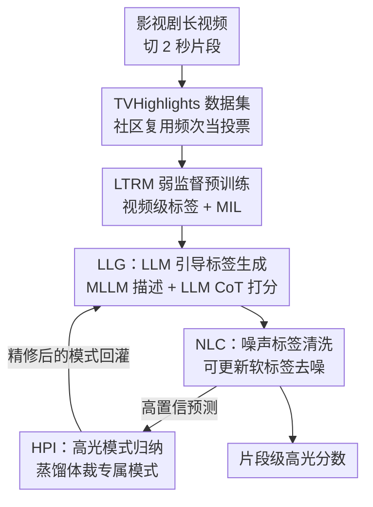

# TVHighlights: LLM-Guided Human-Free Collaborative Training for Video Highlight Detection in Movies and TV Dramas

**会议**: CVPR 2026  
**论文**: [CVF Open Access](https://openaccess.thecvf.com/content/CVPR2026/html/Qiu_TVHighlights_LLM-Guided_Human-Free_Collaborative_Training_for_Video_Highlight_Detection_in_CVPR_2026_paper.html)  
**领域**: 视频理解  
**关键词**: 视频高光检测, 影视剧, 弱监督, LLM伪标签, 噪声标签学习

## 一句话总结
针对影视剧高光片段「没有统一定义、人工标注又贵又主观」的难题，作者先用社区二创复用行为自动造出无人工标注的 TVHighlights 数据集，再提出 LTV-HD：用视频级弱标签预训练一个轻量多模态网络，然后让它和 LLM 在一个自改进闭环里互相纠错，最终在全无人工标注的情况下做到 92.74% AUC / 71.20% AP 的 SOTA。

## 研究背景与动机
**领域现状**：视频高光检测（VHD）要在长视频里挑出最吸引人的片段，已有方法在体育（进球、特技）和 vlog 这类「高光模式结构化」的场景上做得不错——动作有套路，标注也好统一。

**现有痛点**：影视剧完全是另一回事。一部武侠剧的高光是「激烈打斗」，言情剧是「浪漫亲吻」，科幻片是「CGI 大场面」，跨体裁根本没有统一定义（论文 Figure 1）。这导致两个连锁问题：一是没法设计一刀切的模型；二是人工逐片段标注既贵、又慢、还因为主观性带来强烈的标注者偏差。结果是整个领域缺一个大规模、多样、可靠的影视剧高光基准。

**核心矛盾**：想训练好检测器就需要细粒度（片段级）监督，但片段级人工标注在影视剧上既不可扩展也不可靠。一个看似省事的捷径是直接拿 LLM/MLLM 来打标签，但 LLM 会幻觉、推理不一致，直接用会引入大量噪声。于是矛盾收敛成：**如何既借用 LLM 的语义推理能力，又把它输出的噪声压下去，做到完全无人工标注的训练？**

**切入角度**：作者注意到一个被忽视的「隐式标注源」——短视频平台上用户疯狂二创复用的影视剪辑。一个片段被反复搬运，本身就是大众在「投票」说它是高光。这是天然的、零人工成本的社区标注信号。

**核心 idea**：用「社区复用频次」造数据集替代人工标注，再让轻量模型与 LLM 组成自改进闭环——LLM 生成带噪伪标签，轻量模型在抗噪策略下学习，模型的高置信预测又反过来教 LLM 提炼体裁专属的高光「模式」，逐轮把噪声标签洗干净。

## 方法详解

### 整体框架
LTV-HD 的输入是一段影视剧长视频，先切成 $T$ 个不重叠的 2 秒片段 $\{c_t\}_{t=1}^T$，提取视觉与音频特征 $\{v_t\}, \{a_t\}$，输出是每个片段的高光分数 $\{s_t\}_{t=1}^T \in [0,1]$。整条管线分两大阶段：**Stage 1 用视频级弱标签预训练**一个轻量多模态网络 LTRM（拿到一个还不错的起点），**Stage 2 用 LTRM 和 LLM 的协作闭环迭代精修**。闭环里三个组件首尾相接、自我改进：LLG 生成细粒度但带噪的伪标签，NLC 让模型在噪声下稳健学习，HPI 把模型的高置信预测蒸馏成体裁专属高光模式、回头指导下一轮 LLG——整个过程零人工标注，标签质量逐轮提升。

### 关键设计

**1. TVHighlights：用社区二创复用行为代替人工标注，造出影视剧高光基准**

痛点直击「影视剧没有可靠片段级标注、人工标又贵又偏」。作者的解法是把短视频平台上的用户剪辑复用当成「隐式投票」：先从平台收集约 5,000 条来自影视剧的高互动视频，用 LLM 按标题打视频级标签并过滤掉无关片段，再切成 2 秒非重叠片段做细粒度处理。关键一步是**视频指纹**——把被频繁二创复用的热门剪辑回溯到原始影视剧，统计其出现频次作为每个片段的「投票分」，分高的片段就被认定为大众公认的高光。训练集（1,368 个视频）就由这些高分、被群体验证过的片段构成，**全程没有人工逐片段标注**。测试集（353 条）则反过来请多名标注者按 2 秒粒度标注、多数投票生成可靠 ground truth，并细分成动作、破坏、CGI、情感、其他五类做细粒度评估。整个数据集覆盖武侠、科幻、言情等 15+ 体裁，是首个面向影视剧的大规模、无人工标注高光基准。这一设计的巧妙在于：它把「标注成本」转嫁给了已经天然发生的用户行为，规模可扩展且自带多样性。

**2. LTRM + MIL：轻量多模态网络 + 视频级弱监督，先拿一个稳健起点**

Stage 1 要解决「只有视频级标签、没有片段级标签」下怎么训练片段检测器。网络 LTRM（Local Temporal Relation Multimodal Network）由两个单模态编码器、一个跨模态编码器、一个局部时序关系 Transformer 层和若干全连接检测头组成。跨模态编码借鉴瓶颈 token 思路：引入数量远小于片段数 $T$ 的瓶颈 token $\{z_i\}$ 作为跨模态信息桥，先用 $z_i$ 当 query 把各模态特征聚合进瓶颈：

$$z'_i = z_i + w_z \sum_{t=1}^{T} \frac{\exp(w_q z_i \cdot w_k x_t)}{\sum_{n=1}^{T}\exp(w_q z_i \cdot w_k x_n)}\, w_v x_t,\quad x\in\{v,a\}$$

再用聚合后的 $z'_i$ 当 key/value 把信息回灌到每个模态，得到跨模态增强后的 $x'_i$。考虑到一个片段是不是高光受相邻上下文影响、但远处片段是干扰，作者仿 Swin Transformer 引入**局部自注意力窗口**，把注意力限制在局部时序范围内，专注建模邻近片段关系。在没有片段级标签时，用多示例学习（MIL）训练：把整段视频当「包」、片段当「示例」，取分数最高的 top-K 个片段的平均分作为视频预测：

$$\hat{y} = \frac{1}{K}\sum_{i\in\text{top-}K(s)} s_i$$

再与视频级标签 $y\in\{0,1\}$ 算二元交叉熵。这一步只用粗粒度监督就让模型学会给片段排序，AP 已能超过 Qwen、Gemini 这类通用 MLLM，证明专用架构在弱监督下的优势，也为 Stage 2 提供了抗噪的初始化。

**3. LLG + NLC：从 LLM 噪声标签里稳健学习，靠「可更新软标签」自我去噪**

这是把 LLM 推理能力安全引入训练的关键。**LLG（LLM-guided Label Generation）** 先把视频切成 $T$ 个片段喂给 MLLM 生成文字描述 $\{d_t\}$，再让 LLM 用链式思维（CoT）三步走：推断视频体裁 → 结合体裁评估高光程度并给理由 → 输出 0.1 粒度的高光软分数 $s_n$。这样得到带噪软标签 $Y_{llm}$，并用 Stage 1 模型的高置信伪标签增广，得到优化后的噪声标签 $Y_n$。但直接拿 $Y_n$ 上交叉熵会过拟合噪声，于是 **NLC（Noisy Label Cleaning）** 借用噪声标签学习里的「标签修整」思想：把 $Y_n$ 转成可求梯度、可更新的概率分布 $Y_a^p$（$p=2$，高光/非高光两类），模型用 Stage 1 权重初始化以压住早期噪声。分类损失用 KL 散度衡量模型输出与软标签分布的差距：

$$L_{cls} = \frac{1}{n}\sum_{i=1}^{n} D_{KL}\big(f(x_i;\theta)\,\|\,y_a^p\big)$$

反向传播时**对标签 $Y_a^p$ 也算梯度、并用更高学习率更新**，让标签更快被「洗干净」、模型同时学到更可靠表示。为防止标签被改飘，加一个兼容性损失把更新后的 $Y_a^p$ 拉回原噪声标签 $Y_n$ 附近：$L_{cp} = -\frac{1}{n}\sum_i y_{n,i}\log y^p_{a,i}$；又为避免输出与标签都早早收敛到中间模糊值，加一个锐度损失逼输出趋向 0/1 极值：$L_s = -\frac{1}{n}\sum_i f(x;\theta)\log f(x;\theta)$。总损失为

$$L_{total} = L_{cls} + \lambda_{cp}L_{cp} + \lambda_s L_s$$

这套「标签和模型一起更新、又互相约束」的机制，是它能在 LLM 噪声标签上不崩、反而越练越准的根本。

**4. HPI：把模型高置信预测蒸馏成体裁专属高光模式，闭环回灌 LLG**

闭环要「自我改进」，光让模型学 LLM 还不够——还得让模型反过来教 LLM。**HPI（Highlight Pattern Induction）** 取模型预测出的高置信伪标签片段，连同 MLLM 描述、视频体裁、伪标签等元数据，分三步蒸馏成结构化、体裁专属的高光/非高光模式：① **模式生成**——LLM 分析这些片段，归纳出某体裁的高光与非高光模式（如历史剧的「激烈打斗」）；② **模式聚合**——同体裁内合并语义相近的模式、删掉低频冗余的，形成代表性模式集；③ **模式纠错**——再按逻辑一致性和常识过滤，剪掉潜在错误。精修后的模式回灌给 LLG，让 LLM 下一轮打标签更准更一致。这一步的意义在于：它把 LLM 从「逐片段打分的标注工」升格为「高光模式的发现者」，让闭环每转一圈、标签质量和模型表征双双提升，把无结构的噪声输出转成可复用的结构化知识。

### 损失函数 / 训练策略
Stage 1：top-K = 6，学习率 0.001，早停防噪声过拟合。Stage 2：NLC 损失权重 $\lambda_{cp}=0.1$、$\lambda_s=0.4$，执行 2 轮精修，训练 100 epoch、batch 32、学习率 0.0001、Adam 优化器。特征上 TVHighlights 用 CLIP(ViT-L-14)+SlowFast(R-50) 视觉特征、Imagebind 音频特征；MLLM 用 MiniCPM-V 2.6，LLM 用 DeepSeek-R1-Distill-Qwen。注意 TVHighlights 上训练的是**单个统一检测器**，而非按体裁分别训练。

## 实验关键数据

### 主实验
在 TVHighlights 上对比 VHD baseline 与先进 MLLM（两种提示策略：直接时刻检索 MR、逐片段打分 CS）。下表节选总体（Total）结果：

| 方法 | AUC (%) | AP (%) |
|------|---------|--------|
| UMT | 60.50 | 45.13 |
| UniVTG | 55.20 | 31.71 |
| Qwen-vl-max (CS) | 88.40 | 47.42 |
| Gemini-2.5-flash (CS) | 87.52 | 46.10 |
| **LTV-HD (Stage 1)** | 87.34 | 62.39 |
| **LTV-HD (Stage 2)** | **92.74** | **71.20** |

Stage 2 全面 SOTA，AUC/AP 比最强 baseline（Qwen-vl-max CS）高 +4.34 / +23.78 个点；连 Stage 1 的 AP（62.39）就已超过所有 baseline。Stage 1→Stage 2 带来 +5.40 AUC、+8.81 AP，验证两阶段精修的有效性。在最难的「情感高潮」类，LTV-HD 拿 60.00 AP，比最佳 MLLM 高出 +18.62，说明从数据里学多样模式比依赖预设语义类别更鲁棒。

### 消融实验
Table 5 拆解训练阶段与模块（s：训练阶段，r：精修轮）：

| 配置 | AUC (%) | AP (%) | 说明 |
|------|---------|--------|------|
| 全去掉 | 89.12 | 63.45 | 无弱监督、无 NLC/HPI |
| 仅 Weak Sup. | 90.20 | 67.69 | 只 Stage 1，AP +4.24 |
| 仅 NLC(r1) | 90.36 | 66.72 | 跳过弱监督，AP 反而低 |
| NLC+HPI（无弱监督） | 91.85 | 70.01 | 缺 Stage 1 起点 |
| **完整模型** | **92.74** | **71.20** | 全开 |

NLC 内部损失消融（Table 6）也显示：**不更新标签**时性能明显下降（过拟合噪声）；去掉锐度损失会因过早收敛掉点；兼容性损失再给一点额外提升——三项损失缺一不可。

### 关键发现
- **弱监督起点至关重要**：跳过 Stage 1 即使开了后续组件也会掉点（Row 3 vs Row 5），它给闭环提供了抗噪初始化。
- **HPI 的模式精修是核心**：用未精修伪标签训练会显著退化（Row 4 vs Row 5），说明「让模型反哺 LLM 提炼模式」才是闭环持续改进的引擎。
- **抗噪能力突出**：YouTube Highlights 三档加噪设置下，MTurk 噪声里 UMT 掉 1.54%，本方法只掉 0.32%，且干净集上 75.8% mAP 与 SOTA（UVCOM2 77.4%、UniVTG 75.2%）相当——证明 NLC 能从噪声标签里稳定蒸出可靠信号。
- **标签质量随轮次演化**：Cohen's Kappa 从 s1 的 52.41 升到 s2-r2 的 60.54，片段 AP +8.81，直接证据表明闭环确实在去噪。

## 亮点与洞察
- **把用户二创行为变成零成本标注**：用视频指纹回溯复用频次当「社区投票」，绕开了影视剧高光「无统一定义、人工标注又贵又偏」的死结，思路可迁移到任何「有大量用户复用/转发信号」的内容标注场景（表情包、热门梗片段、电商爆款短视频）。
- **模型与 LLM 互为师生的自改进闭环**：不是单向蒸馏，而是 LLM 教模型（LLG→NLC）、模型再教 LLM（高置信预测→HPI→回灌 LLG），双向纠错让噪声逐轮收敛，这个「让小模型反哺大模型提炼结构化知识」的范式很有启发性。
- **标签和模型同步更新的去噪机制**：NLC 把噪声标签做成可求梯度的分布、用更高学习率更新，再用兼容性/锐度损失约束，是处理 LLM 噪声伪标签的一个干净可复用模板。

## 局限与展望
- **依赖平台二创数据**：训练信号来自短视频平台的复用行为，存在平台/地域/题材的流行度偏差，冷门体裁或新上线内容缺乏复用信号时数据可能稀疏。
- **闭环成本与收敛性**：每轮都要跑 MLLM 描述 + LLM 推理 + 模式归纳，论文只跑 2 轮精修，更多轮是否持续收益、计算开销如何权衡未充分探讨。
- **2 秒固定切片粒度**：把视频切成固定 2 秒片段做检测，对跨度更长或更短的高光事件（如一个连贯长镜头）可能不够灵活；边界定位精度也受片段粒度限制。
- **测试集规模偏小**：353 条测试数据相对训练集（1,368）偏少，五类细分后每类样本更有限，类间结论（尤其「其他」类）需谨慎看待。

## 相关工作与启发
- **vs UMT / UniVTG（多模态/统一时序定位 VHD）**：它们针对结构化或 query-guided 场景、依赖固定 query 或人工标签；本文面向无统一定义的影视剧、完全无人工标注，且在抗噪上明显更稳（MTurk 噪声只掉 0.32% vs UMT 1.54%）。
- **vs TimeChat（MLLM 微调做 VHD）**：TimeChat 用 LoRA 微调 MLLM，但专用模型零样本性能仍远落后通用大 MLLM；本文不直接用 MLLM 当检测器，而是把 LLM 当「带噪标注器 + 模式发现者」，让轻量专用网络承担最终检测，兼顾精度与成本。
- **vs 噪声标签学习（LNL）方法**：本文复用了 LNL 里的标签修整、鲁棒损失思想，但创新在于把「噪声来源」具体化为 LLM 伪标签，并用模型预测反过来精修标签生成，形成 LNL 之外的协作闭环。

## 评分
- 新颖性: ⭐⭐⭐⭐⭐ 「社区复用当标注 + 模型与 LLM 双向自改进闭环」两个点都很巧，且切中影视剧高光这一真实空白。
- 实验充分度: ⭐⭐⭐⭐ 主实验 + 跨域 YouTube + 三档噪声 + 双消融 + 标签质量演化都覆盖到了，仅测试集规模偏小、闭环轮次分析略浅。
- 写作质量: ⭐⭐⭐⭐ 动机链条清晰、三组件闭环讲得明白，公式与图配合到位。
- 价值: ⭐⭐⭐⭐⭐ 给出首个影视剧高光基准 + 一套可复用的无人工标注训练范式，对内容编辑/推荐有直接落地价值。

<!-- RELATED:START -->

## 相关论文

- [\[CVPR 2026\] MoVie: Broaden Your Views with Human Motion for Action Detection](movie_broaden_your_views_with_human_motion_for_action_detection.md)
- [\[NeurIPS 2025\] VADTree: Explainable Training-Free Video Anomaly Detection via Hierarchical Granularity](../../NeurIPS2025/video_understanding/vadtree_explainable_training-free_video_anomaly_detection_via_hierarchical_granu.md)
- [\[CVPR 2026\] Memory Matters: Boosting Training-Free Zero-Shot Temporal Action Localization with a Learnable Lookup Table](memory_matters_boosting_training-free_zero-shot_temporal_action_localization_wit.md)
- [\[CVPR 2026\] Hypergraph-State Collaborative Reasoning for Multi-Object Tracking](hypergraph-state_collaborative_reasoning_for_multi-object_tracking.md)
- [\[CVPR 2026\] VideoChat-M1: Collaborative Policy Planning for Video Understanding via Multi-Agent Reinforcement Learning](videochatm1_collaborative_policy_planning_for_vide.md)

<!-- RELATED:END -->
