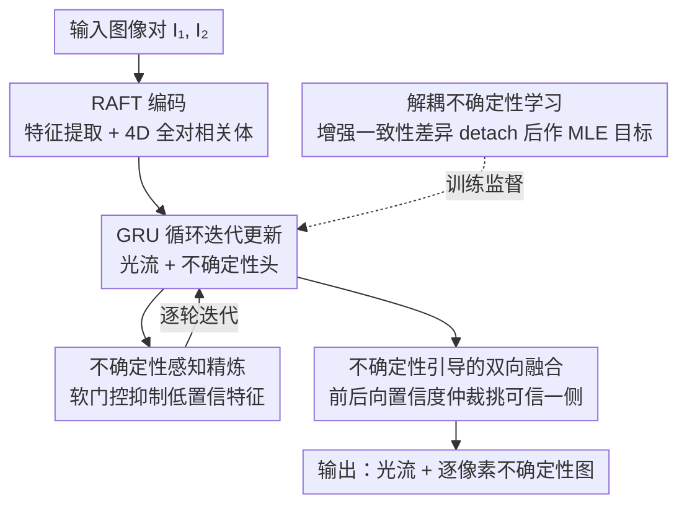

# U2Flow: Uncertainty-Aware Unsupervised Optical Flow Estimation

**会议**: CVPR 2026 Oral  
**arXiv**: [2604.10056](https://arxiv.org/abs/2604.10056)  
**代码**: [https://github.com/sunzunyi/U2FLOW](https://github.com/sunzunyi/U2FLOW)  
**领域**: 视频理解/光流估计  
**关键词**: 光流估计, 不确定性估计, 无监督学习, 循环网络, 增强一致性

## 一句话总结

U2Flow是首个联合估计光流和逐像素不确定性的循环无监督框架，通过基于增强一致性的解耦不确定性学习和不确定性引导的双向光流融合，在KITTI和Sintel上实现无监督SOTA。

## 研究背景与动机

**领域现状**：基于全对相关的深度循环模型（如RAFT）在全监督下达到SOTA，但获取大规模精确的光流标注成本高昂，推动了无监督研究。

**现有痛点**：(1) 无监督模型在遮挡、无纹理区域和大位移下产生不准确估计，这些误差对下游任务是灾难性的；(2) 不确定性估计在无监督设置下严重不足——缺乏直接监督信号且不清楚如何有效利用不确定性改进光流。

**核心矛盾**：模型不仅需要预测运动是什么，还需要量化对预测的信心——但在没有真值的情况下如何教会模型评估自己的可靠性？

**本文目标**：在纯自监督框架中实现光流和不确定性的联合估计，并用不确定性反馈改进光流。

**切入角度**：利用模型在数据增强下的预测不一致性作为不确定性的自监督信号。

**核心idea**：当模型在不同扰动下给出不一致的预测时，暴露了低置信度区域——这种不一致性本身就是不确定性的强信号。

## 方法详解

### 整体框架

U2Flow 要解决的是无监督光流的两个痛点：模型在遮挡、无纹理和大位移区域会出错，却没有任何机制告诉下游"这个像素的运动别信"。它的做法是在 RAFT 的骨架上（特征提取 → 构建 4D 全对相关体 → GRU 循环迭代更新光流）额外挂一个不确定性估计头，让网络在吐出每个像素运动的同时，吐出一张逐像素的置信度图。整条链路自洽地用上这张图：训练时用增强一致性给不确定性提供监督信号，迭代精炼时用它去抑制不可靠区域的特征，推理时再用它在前后向光流之间挑可信的一侧融合。全程没有任何光流真值，监督完全来自光度重建、平滑约束和增强一致性。

### 关键设计

**1. 解耦不确定性学习：把"没真值的不确定性"变成一个可监督的目标**

无监督设置最棘手的一点是：不确定性本身没有标签，模型凭什么知道哪里该没把握？U2Flow 的回答是——让模型在扰动下"自己跟自己打架"。先对原图前向估一遍光流 $\mathbf{F}_{1\to 2}$，再对图像施加强外观/空间增强得到 $(\hat{I}_1, \hat{I}_2)$ 重新估一遍 $\hat{\mathbf{F}}'_{1\to 2}$；两次预测在同一像素上的差异 $\hat{D}^{(k)} = \|\hat{\mathbf{F}} - \hat{\mathbf{F}}'^{(k)}\|_1$ 就直接当作不确定性的回归目标——模型对增强越敏感、两次结果差得越多的地方，恰恰就是它本就没把握的低置信度区域。网络用一个 Laplace 似然的 MLE 目标去拟合这个差异：

$$\tilde{\ell}_{unc} = \sqrt{2}\exp\!\left(-\tfrac{1}{2}\alpha^{(k)}\right)\hat{D}^{(k)} + \tfrac{1}{2}\alpha^{(k)}, \qquad \alpha = \log\sigma^2$$

这里真正关键、也是"解耦"二字的来源，是把 $\hat{D}$ 从计算图里 detach 掉。监督方法习惯把光流和不确定性塞进同一个 MLE 目标里联合优化，结果不确定性损失会反过来污染光流分支的梯度、让训练不稳；U2Flow 把差异目标当成一个不回传梯度的常量，不确定性头只负责拟合它、不去拽动光流估计，两条分支互不干扰，这也是消融里"无解耦设计 → 训练不稳定"的直接原因。

**2. 不确定性感知精炼：让网络在迭代时主动避开自己不信的区域**

光流是 GRU 一轮轮迭代精炼出来的，但每一轮的特征里都混着遮挡、无纹理这些不可靠区域的噪声，如果一视同仁地参与残差计算，错误会被反复放大。U2Flow 的做法是把刚学到的不确定性当成一张软门控：先由 $\alpha^{(k)}$ 算出权重 $\mathbf{s}^{(k)} = \phi(-\alpha^{(k)})$（不确定性越高、权重越低），再逐元素乘到光流特征上得到缩放后的特征 $\tilde{\mathbf{f}}^{(k)} = \mathbf{f}^{(k)} \odot \mathbf{s}^{(k)*}$，然后把原始特征、这份被抑制过的特征、以及不确定性图一起拼起来送进卷积头去预测光流残差。相当于在每一步更新前，先把"我没把握的地方"的话语权调低，让精炼更多地依赖高置信区域的证据——这是连续权重而非硬掩码，所以抑制是平滑的、不会在边界处生硬切断。

**3. 不确定性引导的双向融合：用连续置信度替代二值遮挡掩码**

前向光流在遮挡区往往是错的，传统无监督方法靠前后向一致性算一张二值遮挡掩码，掩掉这些像素再用反向光流补。问题是遮挡掩码是 0/1 的硬判断，阈值附近极不稳定，也无法表达"半可信"的灰度地带。U2Flow 直接拿前向和后向各自的不确定性图来做仲裁：在每个像素上比较两个方向的置信度，挑更可信的那一侧的光流来融合。因为不确定性是连续值，它既能识别经典的遮挡，也能捕捉无纹理、大位移这些遮挡掩码根本判断不了的高误差区域，融合粒度比二值掩码精细得多——消融里"无双向融合 → 遮挡区域差"印证了这一点。

### 损失函数 / 训练策略

总损失 = 光度损失(census+SSIM+L1) + 边缘感知平滑性损失 + 不确定性引导区域平滑性损失 + 增强一致性不确定性损失。KITTI上额外使用不确定性引导的单应性平滑损失。

## 实验关键数据

### 主实验

| 数据集 | 指标 | U2Flow | 之前无监督SOTA | 提升 |
|--------|------|--------|---------------|------|
| KITTI 2015 | Fl-all | SOTA | - | 显著 |
| Sintel Clean | EPE | SOTA | - | 显著 |
| Sintel Final | EPE | SOTA | - | 显著 |

### 消融实验

| 配置 | 关键指标 | 说明 |
|------|---------|------|
| 无不确定性估计 | 精度下降 | 基线RAFT |
| 无解耦设计 | 训练不稳定 | 梯度泄漏 |
| 无不确定性精炼 | 精度下降 | 未利用不确定性 |
| 无双向融合 | 遮挡区域差 | 传统掩码不如不确定性 |
| 完整U2Flow | 最优 | 所有组件协同 |

### 关键发现

- 解耦设计对训练稳定性至关重要——detach操作防止不确定性损失干扰光流分支
- 不确定性map比传统前后一致性遮挡掩码更准确地标识高误差区域
- 不确定性引导的区域平滑性在KITTI上效果显著（平面刚性运动场景）

## 亮点与洞察

- **"模型自我评估"范式**：在无真值条件下通过增强一致性让模型自己暴露不确定区域，设计巧妙
- **解耦设计的重要性**：将不确定性学习与光流回归显式分离，避免了耦合目标的不稳定性
- **不确定性作为通用信号**：不仅用于最终输出，还在训练中动态调节损失权重和精炼过程

## 局限与展望

- 增强一致性策略假设增强是合理的，极端增强可能产生噪声监督
- KITTI上的单应性平滑损失依赖平面刚性假设，泛化性有限
- 不确定性标定的绝对准确性未验证（无真值对比）

## 相关工作与启发

- **vs ARFlow**: ARFlow用增强实现知识蒸馏但不估计不确定性，U2Flow将增强一致性用于不确定性学习
- **vs ProbFlow**: ProbFlow使用变分推理联合估计但需要监督，U2Flow实现了无监督的联合估计

## 评分

- 新颖性: ⭐⭐⭐⭐ 无监督联合光流-不确定性估计的首次实现
- 实验充分度: ⭐⭐⭐⭐ KITTI+Sintel双基准+详细消融
- 写作质量: ⭐⭐⭐⭐ 方法描述清晰
- 价值: ⭐⭐⭐⭐ 不确定性估计对安全关键应用有重要意义

<!-- RELATED:START -->

## 相关论文

- [\[ICCV 2025\] Unsupervised Joint Learning of Optical Flow and Intensity with Event Cameras](../../ICCV2025/video_understanding/unsupervised_joint_learning_of_optical_flow_and_intensity_with_event_cameras.md)
- [\[CVPR 2026\] Efficient All-Pairs Correlation Volume Sampling for Optical Flow Estimation](efficient_all-pairs_correlation_volume_sampling_for_optical_flow_estimation.md)
- [\[CVPR 2025\] DPFlow: Adaptive Optical Flow Estimation with a Dual-Pyramid Framework](../../CVPR2025/video_understanding/dpflow_adaptive_optical_flow_estimation_with_a_dual-pyramid_framework.md)
- [\[CVPR 2026\] From Contrast to Consistency: Rethinking Event-based Continuous-Time Optical Flow Estimation](from_contrast_to_consistency_rethinking_event-based_continuous-time_optical_flow.md)
- [\[CVPR 2026\] Enhancing Accuracy of Uncertainty Estimation in Appearance-based Gaze Tracking with Probabilistic Evaluation and Calibration](enhancing_accuracy_of_uncertainty_estimation_in_appearance-based_gaze_tracking_w.md)

<!-- RELATED:END -->
