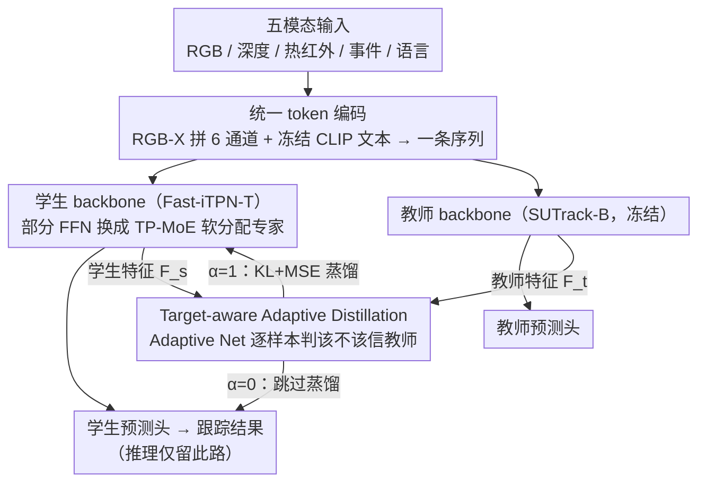

# UETrack: A Unified and Efficient Framework for Single Object Tracking

**会议**: CVPR 2026  
**arXiv**: [2603.01412](https://arxiv.org/abs/2603.01412)  
**代码**: [https://github.com/kangben258/UETrack](https://github.com/kangben258/UETrack)  
**领域**: 视频理解  
**关键词**: single object tracking, multi-modal tracking, mixture of experts, knowledge distillation, efficient inference

## 总结

本文提出 UETrack，一个统一高效的单目标跟踪框架，能同时处理 RGB、深度（Depth）、热红外（Thermal）、事件相机（Event）和语言（Language）五种模态。UETrack 填补了高效多模态跟踪的空白：现有高效跟踪器仅限 RGB，而多模态跟踪器因复杂设计导致速度过慢。核心创新包括：(1) Token-Pooling-based Mixture-of-Experts (TP-MoE)——通过基于相似度的软分配替代传统门控机制，实现高效的专家协作与特化；(2) Target-aware Adaptive Distillation (TAD)——自适应判断每个样本是否适合蒸馏，过滤不可靠的教师信号。在 12 个基准、3 个硬件平台上，UETrack 实现了速度-精度的最优平衡，如 UETrack-B 在 LaSOT 上 69.2% AUC，GPU/CPU/AGX 分别 163/56/60 FPS。

## 动机

1. **高效跟踪器仅限 RGB 模态**：现有高效跟踪方法（HiT、MixFormerV2-S 等）几乎全部针对 RGB 场景设计，在复杂环境中（遮挡、光照变化等）单模态信息不足
2. **多模态跟踪器计算开销大**：SDSTrack、OneTracker、ViPT 等多模态方法依赖复杂的模态融合模块和大模型，推理速度无法满足实时部署需求
3. **模态异质性建模困难**：有限参数的高效模型难以捕获多模态间的互补信息和共享表示，需要新的架构设计来提升建模能力
4. **传统 MoE 门控机制带来延迟**：跟踪中的 MoE 方法（MoETrack、eMoE-Tracker）使用离散门控路由，引入 token 排序和专家间通信的额外开销
5. **知识蒸馏的负面转移问题**：在遮挡、干扰或形变等困难样本上，教师模型的预测可能不可靠，直接蒸馏会将错误信息传递给学生模型
6. **实际部署对速度要求高**：边缘设备（如 Jetson AGX Xavier）资源受限，需要在多种硬件平台上都能实时运行的跟踪方案

## 方法详解

### 整体框架

UETrack 要填的空白是"高效跟踪器只会 RGB、多模态跟踪器又太慢"——做一个能实时跑、还能统一处理 RGB / 深度 / 热红外 / 事件 / 语言五种模态的单目标跟踪框架。它基于 Fast-iTPN-T 的轻量 backbone，沿用 SUTrack 的统一 token 编码：Depth/Thermal/Event 与 RGB 沿通道拼成 6 通道复合图像，语言走冻结 CLIP 文本编码器，所有 token 拼成一条序列进 Transformer。训练时有教师（SUTrack-B，冻结）、学生和 Adaptive Net 三方协同，推理时只留学生模型——学生 backbone 里用 **TP-MoE** 强化多模态建模，**TAD** 则在训练阶段逐样本判断要不要从教师那里学。

### 关键设计

**1. Token-Pooling-based MoE (TP-MoE)：用相似度软分配替掉会拖慢速度的离散门控**

针对"传统 MoE 门控要 token 排序和专家间通信、带来延迟"，TP-MoE 改成注意力式软分配：先把输入 token $\mathbf{T}_{in} \in \mathbb{R}^{L_1 \times D}$ 按 $L_1/E$（$E$ 为专家数）切成子空间做平均池化做局部聚合，经线性投影 + reshape 生成紧凑的专家 token $\mathbf{T}_e \in \mathbb{R}^{L_2 \times D}$；再算输入与专家 token 的相似矩阵 $\mathbf{S} \in \mathbb{R}^{L_1 \times L_2}$、softmax 出连续路由权重，按权重把输入分给各专家独立处理，最后用相似矩阵加权合并回原 token 空间。全程是可微矩阵操作、无需排序和跨专家通信，能全并行、梯度也稳，正好适合实时跟踪。

**2. Target-aware Adaptive Distillation (TAD)：逐样本判断该不该信教师，挡住负迁移**

针对"困难样本（遮挡/干扰/形变）上教师预测不可靠、硬蒸馏会把错误传给学生"，TAD 用一个 Adaptive Net 吃学生和教师的搜索区域特征，各自全局平均池化后拼成融合向量、过 MLP 降到 2D，再用 Gumbel-Softmax 输出二值决策 $\alpha \in \{0, 1\}$：$\alpha=1$ 才做蒸馏（KL 散度 + MSE），$\alpha=0$ 直接跳过。Adaptive Net 用替代预测策略训练——拿教师或学生预测当代理目标与 ground truth 算损失，从而自动学会判断每个样本的蒸馏可靠性。

### 损失函数 / 训练策略

学生损失包括分类（Focal）、回归（GIoU + L1）、任务损失、以及自适应蒸馏损失。Adaptive Net 和学生模型分别更新，避免梯度冲突。

## 实验

### 表1：RGB 基准上的 SOTA 对比（实时方法）

| 方法 | LaSOT AUC | TrackingNet AUC | GOT-10k AO | GPU FPS | CPU FPS | AGX FPS | 参数量(M) |
|------|:---------:|:---------------:|:----------:|:-------:|:-------:|:-------:|:---------:|
| **UETrack-B** | **69.2** | **82.7** | **72.6** | 163 | 56 | 60 | 13 |
| **UETrack-S** | 66.9 | 81.4 | 71.1 | 183 | 68 | 67 | 9 |
| **UETrack-T** | 63.4 | 78.9 | 65.3 | **221** | **83** | **77** | 6 |
| AsymTrack-B | 64.7 | 80.0 | 67.7 | 197 | 38 | 64 | – |
| HiT-Base | 64.6 | 80.0 | 64.0 | 175 | 33 | 61 | – |
| MixFormerV2-S | 60.6 | 75.8 | 61.9 | 299 | 47 | 70 | – |
| OSTrack-256* | 69.1 | 83.1 | 71.0 | 105 | 11 | 19 | – |

*OSTrack 为非实时方法但列出作为参考。UETrack-B 相比 AsymTrack-B 在 LaSOT/TrackingNet/GOT-10k 分别提升 4.5%/2.7%/4.9%。

### 表2：多模态跟踪性能对比

| 模态 | 基准 | 指标 | UETrack-B | SUTrack-T | ViPT(-Tiny) | SDSTrack | AGX FPS 对比 |
|------|------|------|:---------:|:---------:|:-----------:|:--------:|:------------:|
| RGB-D | VOT-RGBD22 | EAO | 68.3 | 68.1 | 68.5 | 72.8 | 60 vs 34/20/7 |
| RGB-D | DepthTrack | F-score | 60.6 | 61.7 | 53.9 | 61.9 | 60 vs 34/20/7 |
| RGB-T | LasHeR | AUC | **55.5** | 53.9 | 47.5 | 53.1 | 60 vs 34/20/7 |
| RGB-T | RGBT234 | MSR | **64.2** | 63.8 | 58.8 | 62.5 | 60 vs 34/20/7 |

UETrack-B 在保持实时速度（AGX 60 FPS）的同时，在热红外模态上超越大多数非实时方法。RGB-Depth 上与非实时 SOTA 仍有差距但速度快 4-8 倍。

## 亮点

- **首个高效多模态跟踪框架**：填补了高效跟踪（实时 + 轻量）与多模态跟踪之间的空白，5 种模态统一处理无需额外模态专用模块
- **TP-MoE 设计精巧**：用基于相似度的连续软分配替代离散门控，消除 token 排序开销，支持全并行计算，既提升了多模态建模能力又控制了延迟
- **TAD 策略实用有效**：通过 Gumbel-Softmax 实现样本级自适应蒸馏，自动过滤困难样本上的不可靠教师信号，解决了蒸馏中的负面转移问题
- **跨平台部署验证充分**：在 GPU（2080Ti）、CPU（i9-14900KF）和边缘设备（Jetson AGX Xavier）三个平台上测速，展示了真实部署价值

## 局限

- **多模态性能仍有差距**：在 RGB-Depth（VOT-RGBD22）和 RGB-Thermal 上，UETrack-B 仍未超越某些非实时方法（如 SeqTrackv2、BAT），精度-速度的 trade-off 在高精度场景仍有改进空间
- **语言模态依赖冻结 CLIP**：语言编码使用冻结的 CLIP，无法端到端优化，可能限制了语言跟踪性能
- **TP-MoE 专家数量较为固定**：专家数设置为 2/4/8，未探讨动态专家分配或根据模态自适应选择专家数
- **教师模型选择单一**：仅使用 SUTrack-B 作为教师，未研究不同教师模型或教师集成对蒸馏效果的影响
- **缺乏长视频和在线更新评估**：跟踪实验以标准基准为主，未在超长视频或动态场景（目标外观剧烈变化）中测试鲁棒性

## 相关工作

- **高效跟踪器**：HiT (Kang et al.)、MixFormerV2 (Cui et al.)、AsymTrack (Li et al.) 在 RGB 场景下追求速度-精度平衡——UETrack 拓展到多模态并在精度和速度上全面领先
- **多模态跟踪**：SUTrack (Chen et al.) 用统一 token 处理多模态但速度不够快；ViPT (Zhu et al.)、SDSTrack (Hou et al.)、OneTracker (Lin et al.) 添加模态适配模块但计算开销大——UETrack 兼顾统一建模与高效推理
- **知识蒸馏**：传统方法（Hinton et al., Romero et al.）对所有样本统一施加蒸馏——TAD 通过样本级自适应选择性蒸馏，更适合跟踪中样本难度差异大的场景
- **Mixture of Experts**：MoETrack、SPMTrack 等在跟踪中使用 MoE 但引入门控延迟——TP-MoE 的无门控软分配设计更适合实时视觉跟踪

## 评分

| 维度 | 分数 (1-10) |
|------|:-----------:|
| 新颖性 | 7 |
| 理论深度 | 5 |
| 实验充分性 | 9 |
| 写作质量 | 8 |
| 实用价值 | 9 |
| **总分** | **7.6** |

<!-- RELATED:START -->

## 相关论文

- [\[CVPR 2026\] TGTrack: Temporal Generative Learning for Unified Single Object Tracking](tgtrack_temporal_generative_learning_for_unified_single_object_tracking.md)
- [\[CVPR 2026\] An Efficient Token Compression Framework for Visual Object Tracking](an_efficient_token_compression_framework_for_visual_object_tracking.md)
- [\[CVPR 2025\] MUST: The First Dataset and Unified Framework for Multispectral UAV Single Object Tracking](../../CVPR2025/video_understanding/must_the_first_dataset_and_unified_framework_for_multispectral_uav_single_object.md)
- [\[CVPR 2026\] SpikeTrack: A Spike-driven Framework for Efficient Visual Tracking](spiketrack_a_spike-driven_framework_for_efficient_visual_tracking.md)
- [\[CVPR 2026\] Temporally Consistent Long-Term Memory for 3D Single Object Tracking](chronotrack_temporally_consistent_long_term_memory_for_3d_single_object_tracking.md)

<!-- RELATED:END -->
