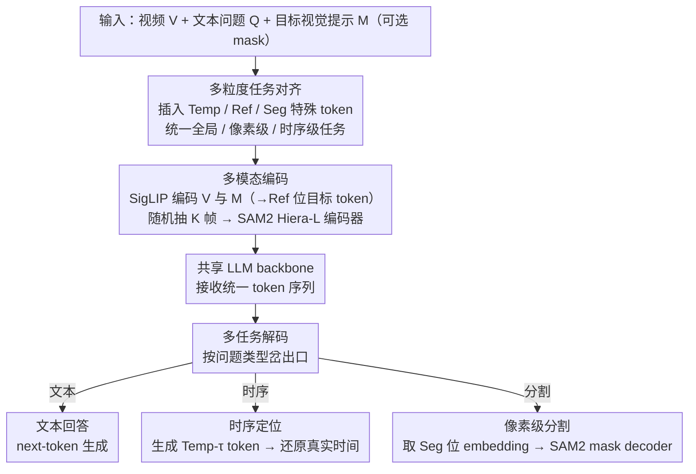

# UFVideo: Towards Unified Fine-Grained Video Cooperative Understanding with Large Language Models

**会议**: CVPR 2026  
**arXiv**: [2512.11336](https://arxiv.org/abs/2512.11336)  
**代码**: [https://github.com/Heven-Pan/UFVideo](https://github.com/Heven-Pan/UFVideo)  
**领域**: 视频理解 / 多模态VLM  
**关键词**: 统一视频理解, 多粒度协同, 像素级分割, 时序定位, Video LLM

## 一句话总结
UFVideo 是首个统一全局、像素级和时序级三种粒度视频理解能力的 Video LLM，通过视觉-语言引导对齐策略和 SAM2 mask decoder，在单一模型内同时支持视频问答、目标引用、视频分割和时序定位，并构建了多粒度协同理解基准 UFVideo-Bench。

## 研究背景与动机

1. **领域现状**：当前 Video LLM 已从通用视频问答扩展到多种细粒度理解任务，包括视频目标引用（video referring）、视频分割（video segmentation）、时序定位（temporal grounding）等。这些任务分别对应像素级和时序级的视频理解。

2. **现有痛点**：现有方法各自专注于单一粒度的理解任务，彼此独立训练和推理，无法有效整合不同粒度的感知和推理能力来实现互相增强。例如，擅长目标引用的模型无法处理事件时间定位，专注时序定位的模型无法进行像素级分割。

3. **核心矛盾**：不同粒度的视频知识实际上可以互补——细粒度时序知识能增强对引用目标的理解，全局视频知识能为细粒度任务提供语义支持。但现有模型在生成时各粒度是隔离的，没有显式关联。

4. **本文目标** 如何在单一模型中统一全局（global）、像素级（pixel-level）、时序级（temporal-level）三种粒度的视频理解，并且让它们协同工作。

5. **切入角度**：设计统一的视觉-语言引导对齐策略，通过特殊 token 区分不同任务的输入输出，共享 LLM backbone 实现多任务联合训练。

6. **核心 idea**：用统一的 token 设计（`<Ref>` / `<Seg>` / `<Temp>`）将全局问答、像素级分割、时序定位三类任务统一到同一个 Video LLM 中，实现多粒度协同视频理解。

## 方法详解

### 整体框架
UFVideo 想解决的是：让一个 Video LLM 同时具备全局问答、像素级分割、时序定位三种粒度的能力，并让它们在同一次生成里互相借力。整条链路以 LLM 为骨架——视觉编码器先把视频压成离散 token，与文本 token 拼到同一序列里送进 LLM。模型一次性接收视频 $V$、文本问题 $Q$ 和可选的目标视觉提示 $M$（mask），再根据问题类型从 hidden state 里岔出三种出口：文本回答 $A$ 走普通 next-token 生成、时序定位 $T$ 编码成可生成的时间 token、分割 mask $S$ 则把特定 token 的 embedding 转交给 SAM2 的 mask decoder。所有任务共享同一套 LLM 参数，靠几个特殊 token 来切换粒度，而不是各搭一套独立模型。

### 关键设计

**1. 多粒度任务对齐：用三类特殊 token 把不同粒度的任务统一进同一序列**

痛点是现有模型各做各的粒度——引用模型不会做时序、时序模型不会做分割，知识彼此隔离。UFVideo 的做法是不为每个任务单开模块，而是在词表里加三类特殊 token 来承担「任务路由」：`<Temp-τ>` 表示相对时间戳，把视频时长归一化到固定长度 $N_t$ 后编码为 $\tau = \frac{t}{T_n} \times N_t$，这样不同长度视频的时间都落到同一刻度、可以像普通文本一样被生成；`<Ref>` 是目标视觉提示的注入占位符，用于目标引用任务；`<Seg>` 则标记「这里要输出分割」，供后续从 LLM 输出里抽取分割相关的 language embedding。文本指令 tokenize 为 $\mathcal{T}_i$、时序 token 为 $\mathcal{T}_t$，和视觉 token 一起拼成统一输入。因为任务区分只靠 token 而不靠结构分叉，三种粒度的知识全部沉淀在共享参数里，训练时天然互相增强——这正是「协同理解」的来源。

**2. 多模态编码：把视频内容和目标级提示统一塞进 token 空间**

LLM 只懂 token，所以视频和「指哪个目标」的视觉提示都得先变成 token。视频 $V$ 和目标视觉提示 $M$ 各自过预训练视觉编码器 $\Phi_v$（SigLIP-so400m）得到 $F_V$ 和 $F_M$；再借 VideoRefer 的做法从 $F_M$ 里抽出目标空间特征 $S_M$，投影成目标视觉 token $\mathcal{T}_r$ 填到序列里的 `<Ref>` 位置。这样 LLM 既看到整段视频，又知道用户具体在问哪个物体。分割任务另需像素级细节，于是再随机选 $K$ 帧用 SAM2 的 Hiera-L 编码器单独编码，作为后面 mask decoder 的视觉输入——视觉编码器负责语义、SAM2 编码器负责像素，两路特征各司其职。

**3. 多任务解码：从同一份 hidden state 里岔出文本、时间、分割三种结果**

难点在于：文本和时间能用 token 直接生成，但像素级 mask 没法塞进词表。UFVideo 对三种输出分两条路处理。文本回答和时序定位都走 text-form token——时序生成出来后再用 $\mathcal{Y}_m = p_\theta(H) \times \frac{T_n}{N_t}$ 把归一化刻度还原成真实时间。像素级分割则单独桥接：用 `<Seg>` token 的位置 mask $\rho_s$ 把对应位置的 hidden state $H$ 挑出来，过投影层 $\theta$ 并与位置 mask 逐元素相乘，得到一段携带分割意图的 language embedding，再喂给 SAM2 的 mask decoder 生成最终 mask。由于一条样本里要分割的目标数不固定，`<Seg>` 的数量和对应 embedding 也是动态的，需要按目标数动态训练。这样既保留了 LLM 生成文本/时间的便利，又借 SAM2 补上了 LLM 天生做不了的像素输出。

### 一个完整示例

以一条协同任务为例：输入一段街景视频，目标视觉提示 $M$ 圈出画面里的一辆红色汽车，问题是「这辆车什么时候开始转弯，并把它分割出来」。编码阶段，视频过 SigLIP 得到 $F_V$，圈出的红车区域过 $F_M$ 抽出目标特征并投影成 $\mathcal{T}_r$ 填进 `<Ref>`，同时随机抽 $K$ 帧送 SAM2 编码器备用。LLM 拿到这条混合序列后开始生成：先吐出文本描述这辆车的动作，接着吐出一串 `<Temp-τ>` token，解码端用 $\frac{T_n}{N_t}$ 把 $\tau$ 还原成「第 4.2 秒起转弯」这样的真实时间；当生成到该输出 mask 的位置时吐出 `<Seg>`，系统据 $\rho_s$ 取出该位置 embedding、过投影层送进 SAM2 decoder，逐帧画出红车的像素 mask。一次前向里，文本、时间、分割三种粒度的结果在同一序列上依次产出，且共享对「红色汽车」这个目标的理解——这就是单模型协同的具体形态。

### 损失函数 / 训练策略

总损失为 $\mathcal{L} = \gamma \cdot \mathcal{L}_{text} + \mathcal{L}_{mask}$。其中 $\mathcal{L}_{text}$ 是标准 next-token prediction 的负对数似然损失；$\mathcal{L}_{mask} = \alpha \cdot \text{BCE}(S_p, S_t) + \beta \cdot \text{DICE}(S_p, S_t)$ 包含二值交叉熵和 DICE 损失。超参数设置为 $\alpha=2.0, \beta=0.5, \gamma=1.0$。训练分两阶段：Stage 1 全局 batch size 512 训练 2 epoch，Stage 2 batch size 256 训练 1 epoch。使用 32 张 A800 GPU，视觉编码器为 SigLIP-so400m-patch14-384，预训练模型为 VideoRefer 7B。

## 实验关键数据

### 主实验

**通用视频理解（MVBench）**:

| 模型 | 参数量 | 平均得分 |
|------|--------|----------|
| GPT-4V | - | 43.5 |
| Qwen2-VL | 7B | 67.0 |
| LLaVA-ST | 7B | 64.2 |
| UniPixel | 3B | 62.5 |
| **UFVideo** | **7B** | **67.3** |

**视频引用描述（VideoRefer-Bench-D）**:

| 模型 | Single-Frame Avg | Multi-Frame Avg |
|------|-----------------|-----------------|
| GPT-4o | 2.95 | 3.25 |
| VideoRefer | 3.42 | 3.46 |
| UniPixel | 3.47 | 3.48 |
| **UFVideo** | **3.59** | **3.61** |

**视频引用问答（VideoRefer-Bench-Q）**:

| 模型 | 平均得分 |
|------|----------|
| GPT-4o | 71.3 |
| RGA3 | 74.0 |
| UniPixel | 73.8 |
| **UFVideo** | **77.9**（Multi-Frame） |

### 消融实验

| 配置 | MVBench Avg | VideoRefer-D (MF) | VideoRefer-Q (MF) |
|------|------------|-------------------|-------------------|
| Full model (UFVideo) | 67.3 | 3.61 | 77.9 |
| w/o 时序级任务 | 性能下降 | - | - |
| w/o 像素级任务 | - | 性能下降 | 性能下降 |

### 关键发现
- UFVideo 在 9 个公共基准上均达到 SOTA，在 MVBench 上以 67.3% 超越 Qwen2-VL（67.0%）
- 多粒度联合训练带来的互增强效果显著——在视频引用任务上大幅超越仅做引用的 VideoRefer
- 在视频分割任务（MeViS、Ref-YouTube-VOS 等）上也超越专门的分割模型
- UFVideo-Bench 三种协同任务（PixRQA/PixHQA/PixTRQA）展示了模型在需要同时输出文本+时序+分割时的综合能力

## 亮点与洞察
- **统一特殊 token 设计是关键 trick**：用 `<Ref>`、`<Seg>`、`<Temp>` 三种 token 实现任务区分而非独立模块，优雅且高效，使得一个 7B 模型能覆盖 4+ 种视频理解任务
- **SAM2 decoder 作为分割桥梁**：直接让 LLM 输出 mask 不现实，通过提取 `<Seg>` 位置的 embedding 送入 SAM2 decoder，巧妙地在 language space 和 pixel space 之间建立映射
- **相对时序 token 设计**：将视频时长归一化到固定长度后编码，使模型能处理不同长度视频的时序定位，且可与文本 token 统一生成

## 局限与展望
- 当前模型在 UFVideo-Bench 上的表现表明多粒度协同理解仍有很大提升空间，特别是 PixTRQA 同时需要时序检索+分割+问答的任务难度很高
- 视频帧数和分辨率受限于 GPU 内存，对超长视频的处理能力有限
- 分割质量受限于 SAM2 decoder 的能力上界
- 仅在 7B 规模实验，未验证 scaling law

## 相关工作与启发
- **vs RGA3/UniPixel**: 这两个工作统一了像素级的引用和分割，但缺乏时序理解。UFVideo 在此基础上增加了时序粒度，实现了真正的三粒度统一
- **vs LLaVA-ST**: LLaVA-ST 做了空间-时间理解但用 bounding box 而非 mask，粒度较粗。UFVideo 使用像素级 mask 实现更精细的理解
- **vs VideoRefer**: UFVideo 的预训练模型即基于 VideoRefer 7B，在其基础上扩展了分割和时序能力

## 评分
- 新颖性: ⭐⭐⭐⭐ 首个统一三种粒度的 Video LLM，但技术组件多为已有方法的组合
- 实验充分度: ⭐⭐⭐⭐⭐ 覆盖 9 个公共基准 + 自建 benchmark，对比全面
- 写作质量: ⭐⭐⭐⭐ 结构清晰，但符号体系较复杂
- 价值: ⭐⭐⭐⭐ 为多粒度视频统一理解指明了方向，UFVideo-Bench 有一定社区价值

<!-- RELATED:START -->

## 相关论文

- [\[CVPR 2026\] Mistake Attribution: Fine-Grained Mistake Understanding in Egocentric Videos](mistake_attribution_fine-grained_mistake_understanding_in_egocentric_videos.md)
- [\[CVPR 2026\] Text-guided Fine-Grained Video Anomaly Understanding](text-guided_fine-grained_video_anomaly_understanding.md)
- [\[CVPR 2026\] Frame2Freq: Spectral Adapters for Fine-Grained Video Understanding](frame2freq_spectral_adapters_for_fine-grained_video_understanding.md)
- [\[CVPR 2026\] Fine-VAD: Towards Fine-Grained Video Anomaly Detection via Progressive Cross-Granularity Learning](fine-vad_towards_fine-grained_video_anomaly_detection_via_progressive_cross-gran.md)
- [\[CVPR 2026\] UniVBench: Towards Unified Evaluation for Video Foundation Models](univbench_towards_unified_evaluation_for_video_foundation_models.md)

<!-- RELATED:END -->
