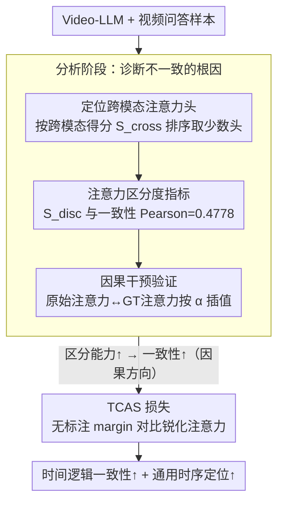

# Understanding Temporal Logic Consistency in Video-Language Models through Cross-Modal Attention Discriminability

**会议**: CVPR 2026  
**arXiv**: [2510.08138](https://arxiv.org/abs/2510.08138)  
**代码**: 无  
**领域**: 视频理解  
**关键词**: 时间逻辑一致性, 视频语言模型, 注意力可解释性, 跨模态注意力, 视频时序定位

## 一句话总结
本文从可解释性角度分析了视频语言模型（Video-LLMs）时间理解逻辑不一致的根本原因——跨模态注意力头无法有效区分不同时间戳的视频token——并提出 TCAS（Temporally Conditioned Attention Sharpening）方法通过优化注意力分布显著提升了时间逻辑一致性和通用时序定位性能。

## 研究背景与动机
1. **领域现状**：Video-LLMs 在视频问答和描述生成等任务上表现优异，许多工作通过额外的时间模块来增强时序理解能力（如 TimeChat、VTG-LLM 等）。
2. **现有痛点**：Jung 等人 (2024) 发现所有 Video-LLMs 无法对重新措辞的问题提供逻辑一致的回答——模型能正确定位事件，但换一种方式问同一件事就会给出矛盾答案。这说明模型并未真正理解时间关系。
3. **核心矛盾**：虽然大量模块化方法被提出来增强时序理解，但模型为何在时间理解上存在逻辑不一致的底层原因一直未被探索。前人工作只发现了现象，未深入诊断机制。
4. **本文目标** (a) 找出影响时间理解一致性的内部因素 (b) 基于诊断结果设计改进方法。
5. **切入角度**：作者从注意力机制的可解释性出发，聚焦跨模态注意力头——这些少数的注意力头负责将事件文本token映射到对应时间段的视频token。
6. **核心 idea**：跨模态注意力头对不同时间戳视频token的区分能力（discriminability）是决定时间逻辑一致性的关键因素，通过对比学习损失增强这种区分能力可以显著改善一致性。

## 方法详解

### 整体框架
工作分为两个部分：(1) 分析阶段——通过头检测、注意力可视化、统计分析和因果干预，揭示跨模态注意力区分能力与时间一致性的因果关系；(2) 方法阶段——提出 TCAS 损失，通过对比学习优化注意力分布，增强模型的时间分辨能力。

### 关键设计

**1. 先把"凶手"找出来：定位负责视觉-文本对齐的跨模态注意力头**

模型里上千个注意力头，真正承担"把事件文本对到对应视频时间段"这件事的只是少数几个。作者给每个头算一个跨模态得分 $S_{cross}^{h,v}$——即所有事件文本token打到视频token上的平均注意力，按这个分数排序就能挑出一小撮（主要落在中间层）的跨模态头。把它们的注意力画出来后规律很清楚：在一致性好的样本上，这些头能把事件文本牢牢聚焦到正确时间段的视频token上；而在一致性差的样本上，注意力要么散开要么偏到别处去。这一步是整篇的立论基础——不急着加模块，而是先确认"区分不同时间戳的能力"就藏在这几个头里。

**2. 给"区分能力"一个可算的数：注意力区分度指标**

光看可视化不够，得有个能和一致性挂钩的量。对头 $h$、样本 $v$，作者定义区分度 $S_{disc}^{h,v}$ 为事件文本token落在 ground-truth 时间范围内那些视频token上的注意力，占其总注意力的比例——比例越高，说明这个头越"知道"该看哪一段。取 top-$t$ 个跨模态头的平均区分度作为样本级指标后，它和一致性性能的 Pearson 相关系数达到 0.4778（$p$-value $\ll 0.05$），把"注意力行为"和"逻辑一致性"这两件原本悬空的事第一次量化地绑在了一起。

**3. 从相关到因果：用注意力干预验证方向**

相关不等于因果——也许是别的因素同时影响了区分度和一致性。为排除这点，作者在推理时直接动手术：把跨模态头的原始注意力和一个理想注意力（在事件时间范围内均匀分布的 ground-truth 注意力）按系数 $\alpha$ 线性插值，

$$A_{q,V} = (1-\alpha)\,A_{q,V}^{orig} + \alpha\,A_{q,V}^{gt}$$

轻微干预（$\alpha=0.2\text{–}0.4$）就能提升一致性，而干预过强反而把性能拖垮。这条曲线说明"提升区分度 → 提升一致性"确实是因果方向，而非巧合，也为后面的训练方法提供了底气。

**4. TCAS 损失：不靠时间标注，把模型自己的偏好锐化**

诊断清楚后，治疗的目标就是让跨模态头天生就更"会分时间段"。难点在于训练时通常没有逐帧的时间标签。TCAS 的巧处是完全绕开标签：对每个跨模态头，先挑出那些已经表现出明确时间偏好的文本token（其最大注意力超过阈值 $thr$），把它们的注意力按时间戳聚合，再以这条分布的均值为界——高于均值的时间戳当正样本 $P_q^h$、低于均值的当负样本 $N_q^h$，然后用一个 margin 对比损失拉开两者：

$$\mathcal{L}_q^h = \max\big(m + \max(N_q^h) - \min(P_q^h),\, 0\big)$$

直觉上就是"模型本来已经隐约知道该看哪段，TCAS 只是把这个模糊信号磨锋利"。因为正负样本完全由模型自身注意力分布划分、不依赖 ground-truth 时间标签，这套锐化在各种视频-语言任务上都能通用，最后和标准 next-token prediction 损失加权组合一起训练。

### 损失函数 / 训练策略
总训练损失 = 标准 SFT 损失 + $w_{ae}$ × TCAS 损失。关键超参数：top 头数量 $t=32$，margin $m=0.2$，阈值 $thr=0.1$，损失权重 $w_{ae}=0.5$。在单块 A100 80GB GPU 上训练约3天，使用 Adam 优化器（lr=$10^{-5}$，batch=4）。

## 实验关键数据

### 主实验（Charades-CON 一致性评估）

| 方法 | 数据 | 微调 | Grounding | R-Ground | S-Ground | H-Verify | C-Verify |
|------|------|------|-----------|----------|----------|----------|----------|
| TimeChat | VTune | SFT | 76.2 | 69.2 (90.8%) | 36.2 (47.5%) | 44.8 (58.8%) | 42.4 (55.7%) |
| TimeChat | VTune | **TCAS** | **83.3** | **75.0 (90.1%)** | **39.5 (47.4%)** | **52.9 (63.5%)** | **50.8 (61.0%)** |
| Qwen2.5-VL | VTune | SFT | 28.3 | 17.5 (62.0%) | 6.0 (21.1%) | 15.1 (53.3%) | 14.8 (52.1%) |
| Qwen2.5-VL | VTune | **TCAS** | **34.0** | **23.0 (67.5%)** | **8.1 (23.7%)** | **19.6 (57.6%)** | **18.5 (54.3%)** |

### 消融实验（超参数敏感性）

| 超参数 | 值 | Grounding | R-Grounding | S-Grounding |
|--------|---|-----------|-------------|-------------|
| $t$ (头数) = 16 | 范围偏小 | 80.91 | 72.14 | 36.77 |
| $t$ = 32 (最优) | 默认 | **83.31** | **75.02** | **39.52** |
| $t$ = 48 | 范围偏大 | 77.37 | 69.66 | 39.04 |
| $thr$ = 0.05 | 阈值低 | 81.90 | 74.95 | **41.45** |
| $thr$ = 0.1 (默认) | 平衡 | 83.31 | 75.02 | 39.52 |

### 关键发现
- **TCAS 同时提升一致性和定位性能**：在 Charades-STA 上 TimeChat 的 R@1,0.5 从 58.4% 提升到 60.2%（通用定位任务），说明不一致性是限制时序理解的潜在因素。
- **跨视频长度的鲁棒性**：在 >40s 的长视频上，TCAS 带来 +17.7 Grounding 和 +14.8 R-Grounding 的提升，表明方法在长视频上优势更大。
- **范围参数比强度参数更敏感**：头数 $t$ 和阈值 $thr$ 对性能影响最大，而 margin $m$ 和权重 $w_{ae}$ 相对鲁棒。过多头或过低阈值会引入噪声。
- **注意力区分度可视化验证**：TCAS 训练后，注意力区分度分布明显右移，确认了一致性提升确实来源于注意力区分能力的增强。

## 亮点与洞察
- **从可解释性到方法的完整闭环**：先诊断（检测+可视化+统计+因果干预），再治疗（TCAS），最后验证治疗确实修复了诊断发现的问题。这种"分析驱动的方法设计"范式非常值得学习。
- **无需时间标注的注意力锐化**：TCAS 利用模型已有的粗糙注意力偏好作为自监督信号，不依赖 ground-truth 时间标签，因此可以在各种视频-语言任务上通用。这个设计比简单的注意力监督更优雅。
- **"不一致性限制了理解能力"的洞察**：TCAS 不仅提升一致性，还意外提升了通用定位性能。这表明逻辑一致性不是独立的问题，而是时序理解难力的本质反映。

## 局限与展望
- 作者自认聚焦于逻辑不一致性可能未涵盖时序理解的所有方面。
- 在 ActivityNet-CON 上改进相对较小，因为该数据集事件描述较长且噪声大。
- 仅分析了 TimeChat 和 Qwen2.5-VL 两个模型的内部机制，更多架构的泛化性需进一步验证。
- TCAS 需要在训练时使用，不能直接作为推理时的免训练增强方案（虽然因果干预实验暗示了推理时干预的可能性）。

## 相关工作与启发
- **vs TimeChat/VTG-LLM**: 这些方法通过添加时间模块来增强时序理解，但不分析为什么模型时序理解不好。本文从可解释性角度找到了根本原因并提出更轻量的解决方案。
- **vs Jung et al. (一致性基准)**: 该工作提出了评估一致性的基准和 VTune 数据集，但未探究不一致的原因。本文在其基础上深入分析了机制并提出改进。
- **vs LLM 可解释性工作**: Nikankin 等研究了图像-文本模型中模态特定电路，Li 等探测了 LLM 解码器是视觉推理瓶颈。本文进一步将瓶颈归因为跨模态注意力头的区分能力不足。

## 评分
- 新颖性: ⭐⭐⭐⭐ 首次从可解释性角度分析 Video-LLM 时间一致性问题，诊断→治疗闭环
- 实验充分度: ⭐⭐⭐⭐ 多模型、多数据集、因果干预验证、超参数分析、长视频鲁棒性
- 写作质量: ⭐⭐⭐⭐⭐ 逻辑链严密，从现象到分析到方法到验证层层递进
- 价值: ⭐⭐⭐⭐ 揭示了时序理解不一致的根本原因，方法简洁有效且通用

<!-- RELATED:START -->

## 相关论文

- [\[CVPR 2025\] On the Consistency of Video Large Language Models in Temporal Comprehension](../../CVPR2025/video_understanding/on_the_consistency_of_video_large_language_models_in_temporal_comprehension.md)
- [\[CVPR 2026\] SVAgent: Storyline-Guided Long Video Understanding via Cross-Modal Multi-Agent Collaboration](svagent_storyline_guided_long_video_understanding_via_cross_modal_multi_agent_collaboration.md)
- [\[CVPR 2026\] Time Blindness: Why Video-Language Models Can't See What Humans Can?](time_blindness_why_video-language_models_cant_see_what_humans_can.md)
- [\[CVPR 2026\] Progressive Cross-Modal Causal Intervention for Long-Term Action Recognition](progressive_cross-modal_causal_intervention_for_long-term_action_recognition.md)
- [\[NeurIPS 2025\] Enhancing Temporal Understanding in Video-LLMs through Stacked Temporal Attention in Vision Encoders](../../NeurIPS2025/video_understanding/enhancing_temporal_understanding_in_videollms_through_stacke.md)

<!-- RELATED:END -->
