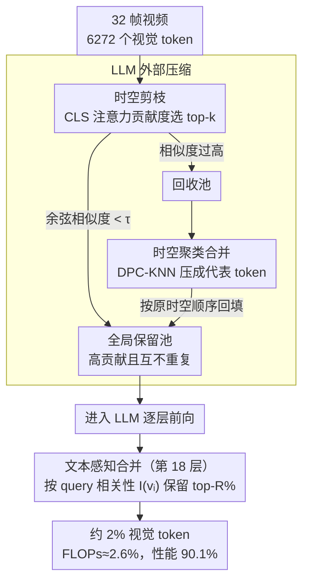

# Unified Spatiotemporal Token Compression for Video-LLMs at Ultra-Low Retention

**会议**: CVPR 2026  
**arXiv**: [2603.21957](https://arxiv.org/abs/2603.21957)  
**代码**: 无  
**领域**: 视频理解 / 多模态VLM / LLM效率  
**关键词**: 视觉token压缩, 视频大语言模型, 时空统一压缩, 推理加速, 无训练

## 一句话总结
提出统一时空token压缩方法，通过全局保留池联合评估token的贡献度和语义冗余度，并在LLM内部引入文本感知合并机制，在仅保留约2%视觉token的极端压缩下仍保留90.1%的基线性能，同时将FLOPs降至约2.6%。

## 研究背景与动机

1. **领域现状**：Video-LLM（如LLaVA-OneVision-7B）在复杂视频理解任务中表现优异，但单帧生成196个视觉token，32帧视频累计可达6272个token，其中大量高度冗余，导致推理延迟和显存消耗巨大。

2. **现有痛点**：当前无训练视频token压缩方法主要分三类——空间剪枝（VisionZip、PruMerge）、时间剪枝（DyCoke、TempMe）、分阶段时空方法（FastVid、HoliTom）。这些方法通常采用两阶段（先时间后空间或先空间后时间）的独立打分策略，隐式假设时空冗余可分离。

3. **核心矛盾**：在极低保留率（≤5%）下，时空可分离假设失效。分阶段决策容易导致时空资源分配不均衡——保留了非关键token却丢弃了关键token。例如FastVid在2%保留率下仅保留83.3%的原始性能。此外，LLM内部剪枝（如FastV、PDrop）仅使用最后一个token的注意力权重作为选择标准，引入位置偏差并削弱了关键查询词的语义影响。

4. **本文目标**：(a) 如何在全局约束下统一分配时空token以最大化信息贡献并最小化冗余？(b) 如何在LLM内部进一步根据查询相关性压缩token？

5. **切入角度**：将token压缩重新定义为全局时空token分配问题，而非分阶段独立处理。利用注意力权重和语义相似度联合评估所有token。

6. **核心 idea**：用统一的全局保留池替代两阶段压缩，结合贡献度-冗余度双指标选择token，配合回收池聚类合并和LLM内部文本感知合并，实现极低比例下的高效压缩。

## 方法详解

### 整体框架
这篇论文要解决的是：32 帧视频喂进 Video-LLM 会膨胀成六千多个视觉 token，绝大多数是冗余的，但在 ≤5% 的极端压缩下，过去那套"先压时间、再压空间"的两阶段做法会把时空预算切歪，导致丢掉关键 token。方法的整体思路是把压缩拆到 LLM 内外两层来做：在 LLM **外部**，先把所有视觉 token 倒进一个全局保留池，用"注意力贡献度 + 余弦冗余度"两个指标联合挑选最值得留下的 token，没选中的不直接扔，而是聚类合并后回填进去，凑齐预算；token 进了 LLM 之后，在某一中间层再做一次 LLM **内部**的文本感知合并，根据当前 query 的语义，把和问题真正相关的视觉 token 再筛一遍。两层各管一件事——外部管"哪些 token 信息量大且不重复"，内部管"哪些 token 跟这道题相关"。

### 关键设计

**1. 时空剪枝：用贡献度和冗余度两个指标全局选 token，而不是分阶段切**

两阶段方法的毛病在于把时间冗余和空间冗余当成可分离的两件事，先后独立打分，在极低保留率下这个假设直接失效、预算分配失衡。这里改成一次性在全部视觉 token 上联合评估。贡献度用 CLS token 的注意力分数 $A_h = \text{Softmax}(Q_h K_h^\top / \sqrt{d})$ 来量化；遇到 SigLIP 这种没有 CLS token 的编码器，就退而用每个 token 对其余所有 token 的平均注意力当替代。光看注意力还不够——高注意力的 token 之间可能彼此高度相似，留下来就是浪费名额。所以选出 top-k 高注意力 token 后，再算每个候选与保留池中已有 token 的最大余弦相似度 $S = \max_{p \in \mathcal{P}} \frac{c \cdot p}{\|c\|\|p\|}$，只有 $S$ 低于阈值 $\tau$（即和池内已有内容足够不像）的候选才真正入池，否则打到回收池。如此迭代直到保留池填满。这样挑出来的 token 既高贡献又互不重复，从根上避开了两阶段切歪预算的问题。

**2. 时空聚类合并：回收池里的 token 不丢，聚类压一压再回填**

被踢进回收池的 token 注意力低，但成片地直接丢掉会整块抹掉语义（比如某段背景虽不抢眼却承载场景信息）。这里用 DPC-KNN 聚类把它们压缩后保留下来：对回收池里每个 token 算局部密度 $\rho_i$ 和到更高密度 token 的最短距离 $\delta_i$，以决策分数 $\gamma_i = \rho_i \times \delta_i$ 挑出聚类中心，其余 token 归到最近中心、取均值合成一个代表 token，最后按原始时空顺序回填进保留池。于是最终保留池里有两种 token：一批是高贡献精选出来的，一批是聚类压缩后的"信息补充"，整体语义结构不至于因为剪枝出现大窟窿。

**3. 文本感知合并：进了 LLM 再按 query 相关性筛一遍，用全部文本 token 的注意力而非最后一个**

像 FastV 那种 LLM 内部剪枝只拿最后一个 token 的注意力当选择标准，在 RoPE 相对位置编码下会偏向相邻 token，引入位置偏差，还削弱了关键查询词的语义影响。这里换成用文本对视觉的整块交叉注意力：从注意力矩阵里取出文本 token 到视觉 token 的子矩阵 $A_{qv}$，对每个视觉 token 取最大交叉注意力分数 $A_m$ 并归一化，同时算它与所有文本 token 的最大余弦相似度 $S_m(v_i)$，两者加权融合成决策分数

$$I(v_i) = (1-\lambda) \cdot A_m^{\text{norm}} + \lambda \cdot S_m^{\text{norm}}$$

保留 top-R% 的视觉 token，被裁掉的按余弦相似度合并进最近的保留 token。用全部文本 token 的注意力是为了在全局范围定位和 query 最相关的视觉信息，再用余弦相似度这一项去稀释位置敏感性——在 token 极少时，这次 query 引导的二次压缩对保住关键信息尤其关键。

### 一个完整示例：一段 32 帧视频怎么从 6272 个 token 压到约 125 个

以 LLaVA-OneVision-7B、2% 保留率为例走一遍。32 帧每帧 196 个视觉 token，进来时共 6272 个。先做时空剪枝：在全部 6272 个 token 上按 CLS 注意力排序选 top-k，逐个用余弦相似度 $\tau=0.7$ 卡冗余，相似度过高的被打进回收池——一轮下来保留池收了一批高贡献、彼此不像的 token，回收池里堆着剩下的大多数。接着对回收池跑 DPC-KNN（聚类比率约 0.3 ⚠️ 以原文为准），把成片的低分 token 压成若干聚类中心代表 token，按原时空顺序回填，凑到外部压缩的目标预算。这批 token 进入 LLM，正常往前算到第 18 层时触发文本感知合并：此时已经能看到 query 文本，按 $I(v_i)$ 对当前视觉 token 重排，保留 top 50%、其余合并，最终留下约 2%（每帧约 4 个、合计约 125 个）视觉 token 继续往后算。整条链路 FLOPs 降到原始的约 2.6%，性能仍保住基线的 90.1%。

### 损失函数 / 训练策略
整个方法完全无训练（training-free），作为即插即用模块兼容现有Video-LLM，无需修改原始模型参数。超参数设置：相似度阈值 $\tau=0.7$，聚类比率0.3，LLM内部从第18层开始激活，保留top 50%视觉token，$\lambda=0.5$。

## 实验关键数据

### 主实验
在LLaVA-OneVision-7B上的对比（5个benchmark平均分）：

| 保留率 | 方法 | FLOPs(T) | MVBench | EgoSchema | MLVU | LVBench | VideoMME | 均分 | Score% |
|--------|------|----------|---------|-----------|------|---------|----------|------|--------|
| 100% | 原始 | 41.4 | 58.3 | 60.4 | 47.7 | 56.4 | 58.6 | 56.3 | 100% |
| 2% | FastVID | 1.2 | 48.0 | 52.3 | 37.6 | 47.3 | 49.2 | 46.9 | 83.3% |
| 2% | HoliTom | 1.1 | 52.6 | 57.2 | 37.4 | 48.5 | 51.1 | 49.4 | 87.7% |
| 2% | **Ours** | **1.1** | **52.8** | **57.6** | **40.3** | **50.8** | **51.8** | **50.7** | **90.1%** |

跨骨干（LLaVA-Video-7B, 2%保留率）：

| 方法 | FLOPs比 | MVBench | MLVU | VideoMME | 均分 | Score% |
|------|---------|---------|------|----------|------|--------|
| HoliTom | 1.7% | 50.2 | 39.9 | 55.3 | 48.5 | 82.5% |
| **Ours** | **1.7%** | **50.1** | **40.8** | **56.2** | **48.8** | **83.0%** |

### 消融实验

| 配置 | 5%保留率均分 | 2%保留率均分 | 说明 |
|------|-------------|-------------|------|
| Full model | 53.7 | 50.7 | 完整方法 |
| w/o 内部合并 | 53.4 | 50.4 | 去掉文本感知合并，掉0.3 |
| HoliTom(两阶段) | 52.9 | 49.4 | 两阶段基线，差距尤其在低保留率更大 |

### 关键发现
- 在极低保留率（2%，相当于每帧约4个token）下，相对于两阶段方法HoliTom提升2.4%（Score%: 87.7→90.1），验证了统一时空分配的优势
- 跨骨干实验（LLaVA-Video-7B、LLaVA-OV-0.5B、Qwen2.5-VL-7B）均有效，证明方法的通用性
- 文本感知合并在低保留率下贡献更明显，说明query引导的二次压缩在token极少时对保留关键信息更重要
- FLOPs可降至原始的约2.6%，实际端到端推理延迟和显存消耗大幅降低

## 亮点与洞察
- **全局保留池设计**：将token压缩从分阶段独立优化变为全局联合优化，类似于将"局部贪心"升级为"全局视角"，这个思路可迁移到任何涉及多维度资源分配的场景
- **回收池的聚类回填**：不是简单丢弃低分token，而是聚类合并后回填，保留信息完整性——这是一个实用的"信息不浪费"原则
- **完全无训练的即插即用设计**：无需微调模型权重，直接兼容多种Video-LLM，降低部署门槛

## 局限与展望
- 依赖视觉编码器的注意力分数质量，如果编码器本身注意力分布不理想，剪枝效果可能受限
- 相似度阈值 $\tau$ 和聚类比率等超参数需要手动设置，未探索自适应调整
- 仅在多选题benchmark上评估，缺少开放式生成任务的评估（如视频描述）
- 文本感知合并需要在LLM内部操作，对于不开放中间层的API模型难以应用

## 相关工作与启发
- **vs HoliTom**: HoliTom用动态规划做帧分割+两阶段剪枝合并，本文用全局保留池统一处理。HoliTom在中等保留率表现不错但极低保留率下退化更快
- **vs FastV**: FastV仅在LLM内部用最后token的attention做剪枝，缺乏外部压缩，且受位置偏差影响。本文在外部和内部双重压缩，且用多token注意力避免偏差
- **vs VisionZip**: VisionZip仅做空间压缩，不处理时间冗余，在视频场景下效果有限

## 评分
- 新颖性: ⭐⭐⭐⭐ 全局统一时空分配的思路比两阶段更优雅，但核心技术组件（注意力选择+聚类合并）较常规
- 实验充分度: ⭐⭐⭐⭐⭐ 多骨干、多benchmark、多保留率的系统评估，消融实验覆盖全面
- 写作质量: ⭐⭐⭐⭐ 论文结构清晰，图示直观
- 价值: ⭐⭐⭐⭐ 对Video-LLM的实际部署有较高实用价值，2%保留率下90%性能对部署场景很有吸引力

<!-- RELATED:START -->

## 相关论文

- [\[CVPR 2026\] EarlyTom: Early Token Compression Completes Fast Video Understanding](earlytom_early_token_compression_completes_fast_video_understanding.md)
- [\[CVPR 2026\] An Efficient Token Compression Framework for Visual Object Tracking](an_efficient_token_compression_framework_for_visual_object_tracking.md)
- [\[CVPR 2026\] StreamingTOM: Streaming Token Compression for Efficient Video Understanding](streamingtom_streaming_token_compression_for_efficient_video_understanding.md)
- [\[ICLR 2026\] FlashVID: Efficient Video Large Language Models via Training-free Tree-Based Spatiotemporal Token Merging](../../ICLR2026/video_understanding/flashvid_efficient_video_large_language_models_via_training-free_tree-based_spat.md)
- [\[CVPR 2026\] UTPTrack: Towards Simple and Unified Token Pruning for Visual Tracking](utptrack_towards_simple_and_unified_token_pruning_for_visual_tracking.md)

<!-- RELATED:END -->
