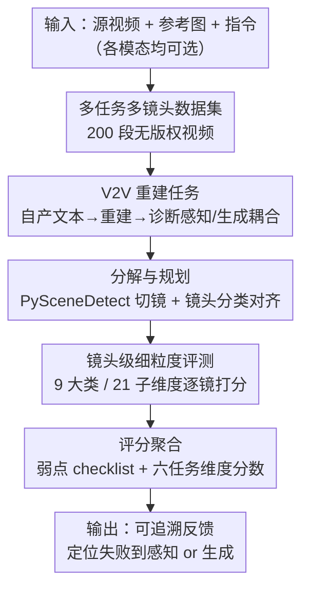

# UniVBench: Towards Unified Evaluation for Video Foundation Models

**会议**: CVPR 2026  
**论文**: [CVF Open Access](https://openaccess.thecvf.com/content/CVPR2026/html/Wei_UniVBench_Towards_Unified_Evaluation_for_Video_Foundation_Models_CVPR_2026_paper.html)  
**代码**: https://github.com/JianhuiWei7/UniVBench  
**领域**: 视频理解 / 视频基础模型评测  
**关键词**: 统一视频模型、评测基准、智能体评测、视频重建、多镜头

## 一句话总结
UniVBench 用 200 段人工创作、无版权的多镜头视频和一套智能体评测系统 UniV-Eval，把视频理解、生成、编辑、以及新提出的"视频重建"四类能力放进同一把尺子里，第一次能在统一框架下回答"统一视频模型到底有没有把感知和生成都做好"。

## 研究背景与动机

**领域现状**：视频基础模型（video foundation models）想把视频理解、生成、编辑、指令跟随都塞进一个架构里，被视为下一代多模态系统的主方向。代表工作如 Chameleon、Show-o、Emu3、BAGEL、Janus-Pro 等，把 LLM、视觉 tokenizer 和视频解码器拼在一起，号称能在一条指令下既看懂视频又生成视频。

**现有痛点**：架构在进步，但**没人能客观说清"统一"到底带来了什么收益**。原因出在评测基准本身是碎的——视频理解 benchmark（AuroraCap、ShotBench）只评 captioning，且大量用爬来的版权视频，存在数据污染风险；生成 benchmark（VBench、AIGVE-60K）只评 text-to-video，不支持理解和编辑；编辑 benchmark（TGVE、VACE-Bench）只覆盖单镜头。每个基准各管一摊、各用各的指标（理解用 BLEU/CIDEr、生成用 FVD/CLIPScore、编辑临时拼几个指标），**跨任务根本没法横向比较**。

**核心矛盾**：统一模型的卖点是"一个模型干所有事"，可评测却是"一个 benchmark 评一件事"。能力定义和度量方式之间的错位，导致一个最关键的问题悬而未决：**统一是真涨点，还是只是把多个半成品缝在一起？** 更糟的是，传统指标只给一个标量分，掩盖了模型在不同维度上的强弱权衡，没法回头指导训练。

**本文目标**：造一个能在同一套数据、同一套协议下，同时评测理解 / 生成 / 编辑 / 重建四类能力的统一基准，并且能把失败归因到"感知"还是"生成"。

**切入角度**：作者抓住两个被忽视的维度——**多镜头（multi-shot）**叙事内容，和**电影级（cinematic）细粒度维度**（风格、主体、动作、背景、相机、光照、色彩、空间关系）。真实视频是多镜头、有叙事的，固定的标量指标抓不住这种复杂性。

**核心 idea**：用"指令驱动的多镜头视频任务"统一六种子任务，配一套**能动态规划、镜头级打分、输出可追溯弱点清单**的智能体评测系统，把"整体生成质量"拆成可解释的多维 checklist，而不是压成一个数。

## 方法详解

### 整体框架

UniVBench 由两块组成：一套**数据集**和一套**评测系统 UniV-Eval**。数据集提供 200 段无版权多镜头视频，每段配详细 caption、多格式编辑指令和参考图，覆盖 8 大电影维度、21 个子维度；UniV-Eval 则把任意输入（源视频、参考图、参考文本）和任意输出（视频或文本）放进统一流程里评分。

整个基准把统一视频模型的能力拆成**六个任务**：视频描述 V2T、文本生成视频 T2V、参考图生成视频 R2V、文本指令编辑 TV2V、参考图编辑 RV2V、以及新提出的视频重建 V2V。其中 V2V 是诊断关键——它先让模型自己理解源视频写出文本，再仅凭这段自产文本重建视频，从而把"感知—生成"的耦合损失暴露出来。

评测时，UniV-Eval 接受一个任务设定下的任意输入，先做规划与分解，再逐镜头细评，最后汇总成一张带分数和弱点反馈的 checklist。流程如下：

### 关键设计

**1. 多任务、多镜头、无版权的数据集构建：先治"数据本身就有病"这个根**

现有理解类 benchmark 用爬来的网络视频，既可能与模型训练集重叠造成污染，又有版权问题，根本不能拿来公平评测编辑和重建。UniVBench 的做法是**全部人工创作、版权干净**。作者先从前人工作里抽取 8 个基础维度并扩展成 21 个细粒度子维度（风格、主体的类别/质量/外观、动作、背景、相机的对焦/景别/运动/视角/角度/高度/技法、光照的方向/亮度/效果、色彩的色相/对比度/饱和度、空间关系等），每个子维度预先分类好取值（如风格分写实/动画/2D，光照分日光/黄金时刻/影棚）。

15 位有视频制作背景的专家先按维度组合写逐镜头剧本、经二次评审，再用商用 API（Hailuo、Kling、Veo3）生成视频，并走三级人在环过滤：① VLM 自动去水印和 IP 内容；② 三位审核员独立核对每段视频是否符合剧本的全部八维、只接受**一致通过**的；③ 质量专家排查伪影、非自然运动和时序不一致。平均每段视频要生成 2.3 次才通过，最终得到 100 段单镜头 + 100 段多镜头（平均 3.72 镜）视频。caption 由 Gemini 2.5 Pro 分维度抽取后合成，再经三人核验、GPT-4o 交叉验证，平均改 1.8 次；参考图用 Gemini 2.5 Flash Image 和 Seedream4.0 生成，分主体/风格/场景三类，共 864 张。这套重流程换来的是"评测数据本身可信"这个前提。

**2. V2V 视频重建任务：用"自产文本重建"把感知和生成的耦合损失逼出来**

统一模型的卖点是理解和生成共用一套表示，但以往任务要么只测理解、要么只测生成，**测不出两者衔接处的损失**。作者新设计的 V2V 重建任务专门打这个点：先让模型理解源视频、生成对应的详细 caption，再**仅凭这段自己生成的文本**去重建视频，最后直接把重建视频和原视频比对。逻辑很直接——一个真正好的统一模型必须两关都过，先靠理解写出优质 caption，再靠生成把 caption 还原成高质量视频；**任意一关掉链子，重建结果都会和原视频明显偏离**。

与之对照，T2V 用的是视频的 ground-truth caption（外部给定的完美文本），V2V 用的是模型自产文本。两者一比，就能把"信息在 V2T→T2V 管线里丢了多少"单独量化出来。实验里 V2V 的不一致明显比 T2V 更严重，正说明当前统一模型在感知—生成衔接处存在系统性损耗，这是单看理解或单看生成都发现不了的。

**3. UniV-Eval 智能体评测系统：把"一个标量分"拆成可规划、镜头级、可追溯的多维 checklist**

传统评测有两个硬伤：单标量分掩盖强弱权衡、给不出训练可用的反馈；固定维度又适配不了多样视频（有的视频看重实例保真，有的看重叙事连贯）。UniV-Eval 用一套**动态自适应的智能体流程**来破：

先做**分解与规划**——由于生成长度受限，长视频先机械切成片段 $V=\{c_i\}_{i=1}^{C}$，再用 PySceneDetect 把每个片段切成镜头级单元 $V=\{v_1,\dots,v_n\}$；镜头分类智能体把参考图 $I$ 和用户指令 $T$ 对齐到各自镜头，得到镜头级三元组 $(v,i,t)$，且所有输入模态都可选、按场景灵活组合。

再做**镜头级细粒度评测**——给定被测模型输出 $o$ 和输入三元组 $(v,i,t)$，镜头评测智能体按 9 大类（主体、相对位置、动作、背景与场景、色彩、光照、视频风格、氛围、相机）、共 21 个子维度逐项比对，产出一张结构化的**弱点 checklist**，标出具体到时间段、问题类型、描述和修复建议的细粒度缺陷。最后由评分智能体把这些诊断信号聚合成六个评测维度的最终分数。整套系统跨所有任务统一了 prompt、指令解析和打分标准，保证分数差异反映的是模型能力而非评测噪声。

## 实验关键数据

### 主实验

评测在 8 张 H100 上完成，统一协议：商用模型走官方 API（GPT-5、Gemini 2.5 Pro、Seed 1.6、Seedance），开源模型用官方 checkpoint，统一 50 步 DDIM、CFG=7.5、原生分辨率，评测 LLM 用 Seed-1.6。下表是各任务上代表模型的平均分（满分 100%）：

| 任务 | 代表模型 | Average | 备注 |
|------|---------|---------|------|
| 理解 V2T | Gemini 2.5 Pro（商用） | 54.1% | 理解任务最强 |
| 理解 V2T | Showo-2（统一模型） | 16.3% | 统一模型感知能力弱 |
| 生成 T2V | Seedance-1.0-Pro（商用） | 77.9% | T2V 最强 |
| 生成 T2V | Wan2.2-14B（开源） | 74.9% | 接近商用 |
| 生成 R2V | Seedance-1.0-Lite | 66.7% | 参考图生成 |
| 编辑 TV2V | Wan2.1-VACE-14B | 65.1% | 文本指令编辑 |
| 编辑 RV2V | Wan2.1-VACE-14B | 66.4% | 参考图编辑 |
| 重建 V2V | Wan2.1-VACE-14B | 62.7% | 重建最强 |
| 重建 V2V | CogVideoX-1.5-5B | 20.7% | 重建最弱 |

### 跨基准对比

UniVBench 相比已有基准的覆盖优势（Table 1 / Table 2 浓缩）：

| 基准 | 适用任务 | 多镜头 | 无版权 | 电影维度覆盖 |
|------|---------|--------|--------|------------|
| AuroraCap（理解） | V2T | ✗ | 存疑 | 仅主体/相机 |
| VBench（生成） | T2V | ✗ | NA | 缺光照/空间 |
| TGVE（编辑） | TV2V | ✗ | 是 | 仅主体/背景 |
| VACE-Bench（编辑） | R2V/TV2V/RV2V | ✗ | 存疑 | 部分 |
| **UniVBench** | **V2T~V2V 全六任务** | **✓** | **是** | **8 维全覆盖** |

### 关键发现

- **没有任何单一模型能横扫全谱**：理解最强的 Gemini 2.5 Pro 在 V2T 拿 54.1%，而擅长统一的 Showo-2 在同一任务只有 16.3%；反过来生成任务又是 Seedance、Wan 这类生成专精模型领先。结果定量证实"统一"目前还停留在架构层面，能力上仍是各管一摊。
- **'动作'维度是公认软肋**：跨所有任务，Action 维度普遍得分最低（尤其理解任务里 Qwen3-VL-30B 仅 6.4%、AuroraCap 6.9%），说明准确解读和合成复杂时序动态仍是大难题；而色彩、光照、视频风格这类静态风格属性，生成模型反而控制得最好。
- **重建暴露感知—生成损耗**：V2V 重建的不一致显著大于用 GT 文本的 T2V，直接指向 V2T→T2V 管线的信息传递损失，这是单任务评测看不到的。
- **UniV-Eval 与人对齐约 85%**：随机抽 10% 数据做三折交叉人工核验，平均一致率近 85%，说明这套智能体打分能可靠反映人类判断；相比之下 BLEU 会因不同模型 caption 长度差异严重失真，普通 LLM-as-a-Judge 又只给少数维度、缺可解释性。

## 亮点与洞察

- **V2V 重建是最巧的设计**：用"自产文本重建"这一招，把统一模型最该被检验、却最难单独测的"感知—生成衔接"变成了可量化的差异。这个思路可迁移到任何 encoder-decoder 共享表示的多模态系统（如图像、音频的理解-生成统一模型）做端到端诊断。
- **把评测当成"可规划的智能体任务"而非"算一个指标"**：先切镜、再对齐、再逐镜出弱点清单、最后聚合打分，输出的是带时间戳和修复建议的结构化反馈，能直接回喂训练——这比单标量分有用得多。
- **从源头治数据污染**：全程人工创作 + 三级人在环 + 平均 2.3 次重生成，虽然贵，但换来"评测数据与训练集无重叠"这个对评测公平性至关重要的前提，对评测类工作是可复用的方法论。

## 局限与展望

- **规模偏小**：作者自己承认 200 段视频虽足够做综合评测，但量级有限，未来核心工作是大幅扩充数据集。对统计显著性和长尾覆盖来说，200 段确实容易让个别模型的排名受样本波动影响。
- **评测依赖商用 LLM/API**：UniV-Eval 用 Seed-1.6 当评测 LLM，数据也靠 Hailuo/Kling/Veo3、Gemini、Seedream 等商用 API 生成。这带来可复现性隐患——API 版本一变，分数基线可能漂移；也让"无版权"主要体现在最终人工筛过的产物上，而非生成链路完全自主。
- **打分绝对值跨任务不可直接比大小**：不同任务难度天然不同（如理解任务整体分数明显低于生成），表格里 V2T 54% 和 T2V 78% 不能简单解读为"生成比理解更接近完成"，横向解读需谨慎。
- **改进方向**：扩库之外，可引入更多开源可控的视频生成链路降低对商用 API 的依赖；并把弱点 checklist 真正接入训练 loop，验证"诊断反馈能否反哺统一模型训练"这一最有价值的下游主张。

## 相关工作与启发

- **vs VBench / AIGVE-60K（生成基准）**：它们建立了 16 维等系统化生成评测，但只管 text-to-video，不支持理解、编辑、重建；UniVBench 把六任务并到一套数据和协议下，优势是跨任务可比，代价是数据规模更小。
- **vs AuroraCap / ShotBench（理解基准）**：前者引入镜头级分析、提升标注质量，但用爬取视频、有污染风险且只评 captioning；UniVBench 用无版权人工视频补上这一短板。
- **vs VACE-Bench（编辑统一尝试）**：VACE-Bench 想统一多种编辑模态，但仍限单镜头；UniVBench 的多镜头叙事内容更贴近真实视频编辑场景。
- **vs LLM-as-a-Judge / BLEU、FVD 等指标**：传统指标无法处理多镜头、无细粒度归因；普通 LLM-as-a-Judge 虽灵活但维度少、缺可解释性。UniV-Eval 同时做到细粒度、多镜头、多维度、跨任务，并与人对齐约 85%。

## 评分
- 新颖性: ⭐⭐⭐⭐ 首个统一六任务评测基准，V2V 重建任务和智能体打分系统都是有价值的新设计，但单项技术（人工标注、智能体评测）多为已有思路的组合。
- 实验充分度: ⭐⭐⭐⭐ 覆盖 6 任务 × 8 维度 × 十余个商用/开源模型，含人对齐验证和案例分析；扣分在数据集仅 200 段、评测依赖商用 API。
- 写作质量: ⭐⭐⭐⭐ 动机、痛点、贡献交代清晰，三张对比表把碎片化问题讲得很直观。
- 价值: ⭐⭐⭐⭐ 为"统一视频模型到底统一了没有"提供了第一把统一的尺子，对该方向的训练评估有实际指导意义。

<!-- RELATED:START -->

## 相关论文

- [\[CVPR 2026\] Towards Data-Efficient Video Pre-training with Frozen Image Foundation Models](towards_data-efficient_video_pre-training_with_frozen_image_foundation_models.md)
- [\[CVPR 2026\] UFVideo: Towards Unified Fine-Grained Video Cooperative Understanding with Large Language Models](ufvideo_towards_unified_fine-grained_video_cooperative_understanding_with_large_.md)
- [\[CVPR 2026\] Enhancing Accuracy of Uncertainty Estimation in Appearance-based Gaze Tracking with Probabilistic Evaluation and Calibration](enhancing_accuracy_of_uncertainty_estimation_in_appearance-based_gaze_tracking_w.md)
- [\[CVPR 2025\] Efficient Transfer Learning for Video-language Foundation Models](../../CVPR2025/video_understanding/efficient_transfer_learning_for_video-language_foundation_models.md)
- [\[NeurIPS 2025\] MimeQA: Towards Socially-Intelligent Nonverbal Foundation Models](../../NeurIPS2025/video_understanding/mimeqa_towards_socially-intelligent_nonverbal_foundation_models.md)

<!-- RELATED:END -->
