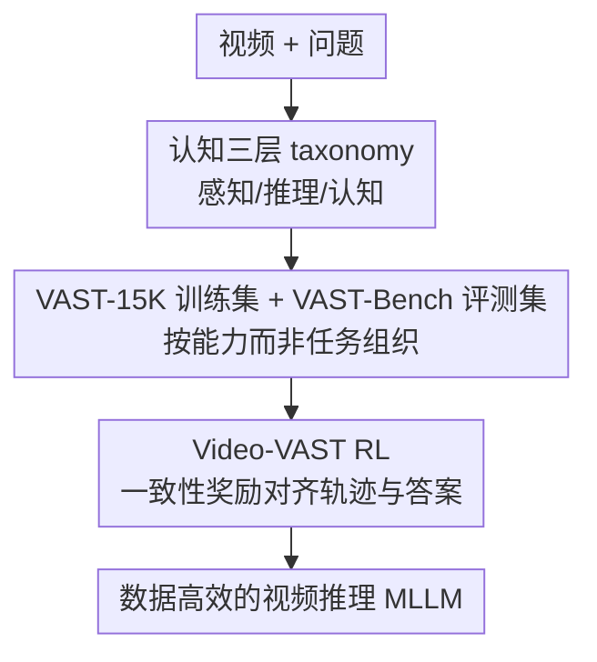

# VAST: Video Ability-Stratified Taxonomy for Data-Efficient Video Reasoning

**会议**: CVPR 2026  
**代码**: [zhongan-wang.github.io/VAST](https://zhongan-wang.github.io/VAST)  
**论文**: [CVF Open Access](https://openaccess.thecvf.com/content/CVPR2026/html/Wang_VAST_Video_Ability-Stratified_Taxonomy_for_Data-Efficient_Video_Reasoning_CVPR_2026_paper.html)  
**领域**: 视频理解 / 视频推理 / 强化学习  
**关键词**: 视频推理, 能力分层taxonomy, 数据高效RL, 一致性奖励, MLLM

## 一句话总结
VAST 主张按"底层推理能力"而非"任务格式"来组织视频推理训练数据，提出 Perception/Reasoning/Cognition 三层认知 taxonomy 与配套 VAST-15K/VAST-Bench，并用只加一致性奖励、不改架构的 Video-VAST 强化学习框架，在 MVBench 上以 66.3% 超过 Video-R1 的 62.7%，却省下约 72% GPU 时与 96% 训练样本。

## 研究背景与动机
**领域现状**：强化学习（RL）已成为提升多模态大模型（MLLM）视频推理能力的有效手段，跟随 reasoning 模型的成功被广泛采用。

**现有痛点**：现有方法效率低，原因有二。① **数据按任务格式组织而非按底层能力**——这导致模型学到的是任务特定模式而非可迁移能力，要提升泛化就得覆盖海量"能力×任务"组合，RL 训练成本极高；② **靠复杂算法设计硬补效率**——专门的时序架构、多目标奖励框架等让训练更复杂。

**核心矛盾**：任务格式 ≠ 推理能力。把数据按任务切分，模型会过拟合任务模式，无法把一种能力迁移到别的任务，于是只能靠堆数据和堆架构补，越补越贵。

**本文目标**：用更少的数据和算力，训出泛化更好的视频推理能力。

**核心 idea**：把视频理解按**认知能力分层**（感知→推理→认知）来组织数据，并用最简单的**一致性奖励** RL（不改架构）对齐推理轨迹与最终答案。

## 方法详解

### 整体框架
VAST 是「认知 taxonomy + 数据/基准 + RL 框架」三件套。taxonomy 把视频理解分成三层；据此构建 VAST-15K 训练集与 VAST-Bench 评测集；再用 Video-VAST（带一致性奖励的 RL）在该数据上训练，无需任何架构改动。

### 关键设计

**1. 三层认知 taxonomy：按能力（感知/推理/认知）而非任务格式组织数据**

VAST 把视频理解结构化为三层递进能力：**Perception（感知）**——看清视频里有什么；**Reasoning（推理）**——基于感知做时序/因果推断；**Cognition（认知）**——更高层的理解与抽象。关键转变是：训练数据按这三层**能力**而非按任务格式（QA/caption/grounding 等）来组织。这样模型学的是"可迁移的能力"而非"任务专属模式"，从而无需覆盖海量"能力×任务"组合就能泛化——这正是数据效率的来源。基于此构建了 VAST-15K（训练）和 VAST-Bench（评测，带逐层诊断）。

**2. Video-VAST 的一致性奖励：不改架构，只对齐推理轨迹与最终答案**

针对"靠复杂时序架构/多目标奖励硬补效率"的痛点，Video-VAST 反其道而行——**不做任何架构修改**，只在 RL 里加一个**一致性奖励**，鼓励模型生成的推理轨迹（reasoning trace）与最终答案保持一致。直觉是：当模型的"想"和"答"对齐时，推理是真实有效的而非事后编造，这种自洽信号本身就是高质量的训练监督。配合按能力组织的数据，一致性奖励让模型用极少样本就学到稳健、可迁移的推理，而无需专门架构或多目标奖励的复杂工程。

## 实验关键数据

### 主实验
与 Video-R1 在相同训练设置下对比：

| 方法 | MVBench | VAST-Bench | GPU 时 | 训练样本 |
|------|---------|-----------|--------|----------|
| Video-R1 | 62.7% | 54.3% | 基线 | 基线 |
| **Video-VAST（本文）** | **66.3%** | **57.4%** | **省 ~72%** | **省 ~96%** |

核心：更高精度 + 大幅更省算力与数据（约 72% 更少 GPU 时、96% 更少样本）。

### 消融/分析
| 配置 | 效果 | 说明 |
|------|------|------|
| 完整 Video-VAST | 最佳 | 能力分层数据 + 一致性奖励 |
| 按任务组织数据 | 泛化变差 | 学到任务模式而非能力 |
| w/o 一致性奖励 | 推理-答案脱节、精度降 | 缺自洽监督 |

### 关键发现
- **数据组织方式 > 算法复杂度**：仅靠按能力分层 + 简单一致性奖励，就用极少数据超过用更多数据的 Video-R1，说明效率瓶颈在数据组织而非架构。
- **能力分层带来可迁移性**：按能力训练让一种能力跨任务泛化，省去覆盖海量组合的成本。
- **一致性奖励是廉价高质量监督**：对齐"想"与"答"无需额外标注或架构，却显著提质。

## 亮点与洞察
- **"按能力而非任务组织数据"**是最有价值的视角转变，可迁移到任何 RL 训练效率低的多模态推理任务（图像推理、文档推理、具身规划）。
- **极致的数据/算力节省**（96% 更少样本仍更强）极具实用价值，降低了视频推理 RL 的门槛。
- **不改架构只加一致性奖励**体现了"简单即有效"，对抗了"靠复杂设计补效率"的趋势。

## 局限与展望
- 三层认知 taxonomy 的划分粒度与边界带主观性，跨数据集迁移时可能需重新定义。
- 一致性奖励依赖推理轨迹质量，若模型生成的轨迹本身低质，自洽信号可能强化错误模式。
- 评测主要在 MVBench/VAST-Bench，更广的视频长时序/多事件推理上的效果待验证。

## 相关工作与启发
- **vs Video-R1**：同为视频推理 RL，VAST 用能力分层数据 + 一致性奖励，以远少的算力/数据反超。
- **vs 专门时序架构 / 多目标奖励方法**：VAST 不改架构、单一致性奖励，证明数据组织比算法复杂度更关键。
- **vs 按任务格式组织的训练范式**：VAST 按能力组织，学到可迁移能力而非任务模式。

## 评分
- 新颖性: ⭐⭐⭐⭐ "按能力分层组织数据"+一致性奖励的视角较新
- 实验充分度: ⭐⭐⭐⭐ 精度与效率双维度对比 + 消融，benchmark 覆盖中等
- 写作质量: ⭐⭐⭐⭐ 两个低效根因—taxonomy—RL 链条清晰
- 价值: ⭐⭐⭐⭐ 大幅降低视频推理 RL 的数据/算力成本，实用性强

<!-- RELATED:START -->

## 相关论文

- [\[CVPR 2026\] Incentivizing Versatile Video Reasoning in MLLMs via Data-Efficient Reinforcement Learning](incentivizing_versatile_video_reasoning_in_mllms_via_data-efficient_reinforcemen.md)
- [\[CVPR 2026\] Towards Data-Efficient Video Pre-training with Frozen Image Foundation Models](towards_data-efficient_video_pre-training_with_frozen_image_foundation_models.md)
- [\[CVPR 2026\] Thinking with Drafts: Speculative Temporal Reasoning for Efficient Long Video Understanding](thinking_with_drafts_speculative_temporal_reasoning_for_efficient_long_video_und.md)
- [\[CVPR 2026\] VideoAuto-R1: Video Auto Reasoning via Thinking Once, Answering Twice](videoauto-r1_video_auto_reasoning_via_thinking_once_answering_twice.md)
- [\[CVPR 2026\] MDS-VQA: Model-Informed Data Selection for Video Quality Assessment](mds-vqa_model-informed_data_selection_for_video_quality_assessment.md)

<!-- RELATED:END -->
