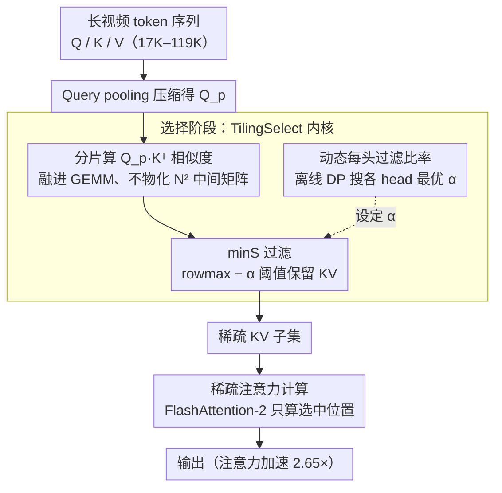

# VecAttention: Vector-wise Sparse Attention for Accelerating Long Context Inference

**会议**: CVPR 2026  
**arXiv**: [2603.29494](https://arxiv.org/abs/2603.29494)  
**代码**: [https://github.com/anminliu/VecAttention](https://github.com/anminliu/VecAttention)  
**领域**: 视频理解  
**关键词**: 稀疏注意力、向量级稀疏、长上下文加速、视频理解、视频生成

## 一句话总结

本文发现视频模型注意力图中存在强烈的"垂直向量"稀疏模式，据此提出 VecAttention 细粒度向量级稀疏注意力框架，通过 TilingSelect + minS 过滤实现高效重要向量选择，在 78%+ 稀疏度下视频理解准确率与全注意力持平，注意力计算加速 2.65 倍。

## 研究背景与动机

1. **领域现状**：视频理解和生成模型的 token 序列极长（17K-119K），注意力计算成为推理瓶颈。稀疏注意力方法（如 FlexPrefill、XAttention）通过跳过不重要的注意力计算来加速推理。
2. **现有痛点**：现有方法使用粗粒度稀疏模式（如块级、行级），虽然计算简单但牺牲精度——因为一个块/行中可能混合重要和不重要的 token，粗粒度跳过会丢失关键信息。
3. **核心矛盾**：更细的粒度能保留更多重要信息，但选择开销也更大——逐 token 选择的通信和计算成本可能反噬加速收益。
4. **本文目标**：找到精度-效率最优的稀疏粒度，并配套设计高效的选择和计算内核。
5. **切入角度**：系统分析视频注意力图的稀疏结构后发现"垂直向量"模式——即重要的 KV token 倾向于在所有 query 头上都重要，呈现整列"亮"的模式。这种结构特性允许用 query pooling 高效选择。
6. **核心 idea**：向量级粒度（P_q=64）+ minS 过滤（比 topK 更高效）+ TilingSelect（融合选择进 GEMM 减少 HBM 访问）。

## 方法详解

### 整体框架

VecAttention 要解决的是：视频模型动辄 17K–119K 个 token，全注意力的 $O(N^2)$ 计算把推理拖垮，而现有块级/行级稀疏又因为粒度太粗、把重要 token 和噪声混在同一块里跳过而掉精度。它的破局点来自一个观察——视频注意力图里重要的 KV 倾向于在所有 query 头上都"亮"，呈整列竖条状（垂直向量模式），因此可以先把 query 压缩，再以"向量"（默认 64 个 query 一组）为单位去挑 KV，既比逐 token 选省事、又比整块跳精细。

整条推理拆成两步走：第一步是**选择**，把全序列的 query 做 pooling 得到压缩后的 $Q_p$，与所有 K 算相似度后用 minS 过滤（过滤比率 $\alpha$ 还按 head 离线自适应）挑出每组真正需要关注的 KV 向量，这一步由 TilingSelect 内核完成，把选择动作直接嵌进 GEMM；第二步是**计算**，只对选中的稀疏 KV 子集做一遍 FlashAttention-2 风格的注意力，跳过其余位置，最终输出。整个过程无需训练，是纯推理期方法。

### 关键设计

**1. minS 过滤：用一次 rowmax 替掉整行排序来挑 KV**

粗粒度稀疏掉精度，但最直接的细粒度选择——对每行相似度做 topK——又太贵：排序是 $O(N\log N)$，在几万 token 的序列上反噬加速收益。minS 换了个判据：先对 query pooling 得 $Q_p$，算它与所有 K 的相似度 $s_i$，再用每行最大值 $m_i^s=\text{rowmax}(s_i)$ 做参照，凡是落在最大值附近 $\alpha$ 范围内的 KV 都保留：

$$M_i = \big(s_i \geq (m_i^s - \alpha)\big)$$

直觉是"只要这个 KV 的相似度跟该行峰值差得不多，就值得算"。这样选择只需一次 rowmax 加一遍阈值比较，复杂度降到 $O(N)$，且天然适配按行流式处理。消融里 minS 比同类的 topP 选择快 3.77 倍，正是省掉排序的结果。

**2. TilingSelect：把选择融进 GEMM，省掉 $N^2$ 的中间张量**

minS 判据虽轻，但若先老老实实算出完整的 $Q_p\cdot K^T$ 相似度矩阵再过滤，就得把这个 $N^2$ 量级的中间矩阵写回 HBM——由此产生的访存流量在 N=64K 时高达 18.3GB，显存带宽直接成为新瓶颈。TilingSelect 的做法是在分片（tiled）计算 $Q_p\cdot K^T$ 的同时就地完成 minS 过滤、只保留重要元素的索引，并跨 tile 累积 rowmax，算完一块就判完一块，绝不把估计出的相似度矩阵写回 HBM。这样 HBM 访存从 $\Theta(N^2 P_q^{-1})$ 降到 $\Theta(N^2 P_q^{-1}(1-\rho))$（$\rho$ 为稀疏度），同样 N=64K、稀疏度 0.9 下从 18.3GB 压到 1.8GB，选择延迟降 2.42 倍。这一步本质是把"选择"从一个独立的访存密集算子，改写成嵌在 GEMM 里的融合操作，让稀疏选择的代价不再吃掉稀疏计算省下的收益。

**3. 动态每头过滤比率：不同 head 给不同的 $\alpha$**

用统一稀疏度对所有 head 一刀切并不合理——不同 head 的稀疏度与重要性差异很大，有些天然集中、可以激进过滤，有些分布平坦、激进过滤就会丢信息。本文据此用动态规划**离线**为每个 head 搜出各自的最优 $\alpha$：先离线采样、记录每个 head 在不同 $\alpha$ 下的稀疏度 $\text{sp}_h(\alpha)$ 与性能 $\text{Perf}_h(\alpha)$，再以"目标平均稀疏度 $\rho_T$ 下整体性能最大"为目标按 head 逐个递推 DP 表——$\text{DP}[h][\rho]=\max_{\alpha\ge 0}\{\text{DP}[h-1][\tfrac{\rho\cdot h-\text{sp}_h(\alpha)}{h-1}]+\text{Perf}_h(\alpha)\}$，最终取 $\text{DP}[H][\rho_T]$ 反推出每个 head 的 $\alpha$ 分配。这样在同一目标稀疏度下把"该省的 head 省到位、该保的 head 留够 KV"，且整个搜索离线完成、不增加推理开销。

### 损失函数 / 训练策略

无需训练，纯推理期方法。关键超参包括向量大小 $P_q=64$（消融显示 32 更精但开销大、128 过粗掉精度，64 是平衡点）、K tile 大小 $B_k=16$、以及 group 大小 $G_k$（理解任务取 16，生成任务取 8192）。

## 实验关键数据

### 主实验

| 方法 | 稀疏度 | VideoMME↑ | LongVideoBench↑ | VCRBench↑ | 平均↑ |
|------|--------|-----------|-----------------|-----------|-------|
| Full Attention | 0% | 65.7 | 59.4 | 32.9 | 52.7 |
| FlexPrefill | 76.5% | 52.3 | 59.0 | 30.0 | 47.1 |
| XAttention | 78.1% | 56.0 | 59.9 | 32.5 | 49.5 |
| AnchorAttention | 78.6% | 57.4 | 59.4 | 31.3 | 49.4 |
| **VecAttention** | **78.6%** | **60.6** | **59.0** | **33.8** | **51.1** |

### 消融实验

| 配置 | 关键指标 | 说明 |
|------|---------|------|
| 向量大小 P_q=32 | 精度更高但开销增加 | 过细粒度 |
| 向量大小 P_q=64 | 最优平衡 | 默认值 |
| 向量大小 P_q=128 | 精度下降 | 过粗粒度 |
| minS vs topP | 3.77× 加速 | minS 更高效 |
| TilingSelect | 10.2× 显存节省 | 18.3GB→1.8GB |

### 关键发现

- 在 78.6% 稀疏度下 VecAttention 平均 51.1%，仅比全注意力 52.7% 低 1.6%，远超同稀疏度的其他方法（47.1-49.5%）
- 最大可用稀疏度达 93%，远超竞品的 85-88%
- 视频生成上同样有效：在 Wan2.1-T2V 上以 52.3% 稀疏度实现与全注意力相当的 PSNR/SSIM
- 注意力加速 2.65 倍，端到端 TTFT 加速 1.17 倍

## 亮点与洞察

- **垂直向量稀疏模式的发现**：这个经验观察为细粒度稀疏提供了理论基础——KV 的重要性在 query 间高度一致，这使得 query pooling 后的选择几乎无损
- **minS vs topK 的效率差距**：从 $O(N \log N)$ 降到 $O(N)$ 的选择复杂度，这个小创新带来了 3.77 倍的实际加速
- **视频理解+生成统一适用**：同一框架在 VLM 和 DiT 上都有效，说明垂直向量模式是视频注意力的通用特性

## 局限与展望

- 垂直向量模式是否在所有模态（如纯文本、音频）上都成立尚未验证
- 细粒度选择的额外开销在序列较短时可能不划算
- 仅评估了视频理解和生成，复杂推理任务（如 Agent、RAG）未测试
- 后续可探索其他细粒度模式（水平、对角线）在特定任务上的优势

## 相关工作与启发

- **vs FlexPrefill**: 块级稀疏方法在相同稀疏度下 VideoMME 仅 52.3%，VecAttention 60.6%——精度差距源于粒度差异
- **vs XAttention**: 也是视频稀疏注意力方法，但在理解任务上精度不如 VecAttention，且最大稀疏度受限
- **vs FlashAttention-2**: VecAttention 的计算内核直接基于 FlashAttention-2 的分片策略，可视为其稀疏扩展

## 评分

- 新颖性: ⭐⭐⭐⭐ 向量级稀疏粒度和minS选择策略有新意
- 实验充分度: ⭐⭐⭐⭐⭐ 视频理解+生成双验证，多模型多benchmark，详细微基准测试
- 写作质量: ⭐⭐⭐⭐ 系统性强，从观察到设计到实现逻辑清晰
- 价值: ⭐⭐⭐⭐⭐ 长视频推理加速是刚需，2.65倍加速有直接产业价值

<!-- RELATED:START -->

## 相关论文

- [\[ACL 2026\] APB-V: Accelerating Long-Video Understanding via Sequence-Parallelism-aware Approximate Attention](../../ACL2026/video_understanding/apb-v_accelerating_long-video_understanding_via_sequence-parallelism-aware_appro.md)
- [\[ICLR 2026\] VideoNSA: Native Sparse Attention Scales Video Understanding](../../ICLR2026/video_understanding/videonsa_native_sparse_attention_scales_video_understanding.md)
- [\[CVPR 2026\] Cluster-Wise Spatio-Temporal Masking for Efficient Video-Language Pretraining](cluster-wise_spatio-temporal_masking_for_efficient_video-language_pretraining.md)
- [\[CVPR 2026\] CVA: Context-aware Video-text Alignment for Video Temporal Grounding](cva_context-aware_video-text_alignment_for_video_temporal_grounding.md)
- [\[CVPR 2026\] SkeletonContext: Skeleton-side Context Prompt Learning for Zero-Shot Skeleton-based Action Recognition](skeletoncontext_skeleton-side_context_prompt_learning_for_zero-shot_skeleton-bas.md)

<!-- RELATED:END -->
