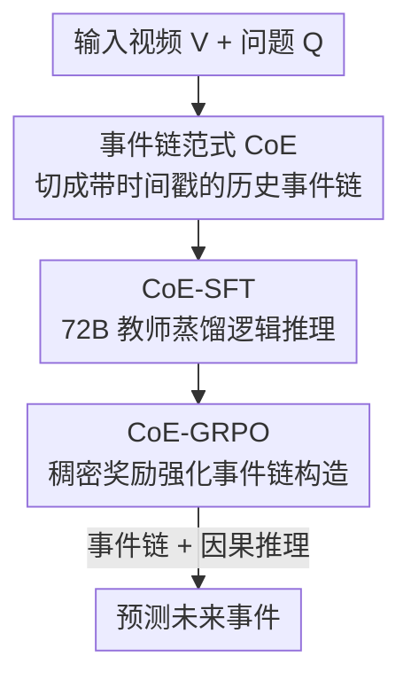

# Video-CoE: Reinforcing Video Event Prediction via Chain of Events

**会议**: CVPR 2026  
**论文**: [CVF Open Access](https://openaccess.thecvf.com/content/CVPR2026/html/Su_Video-CoE_Reinforcing_Video_Event_Prediction_via_Chain_of_Events_CVPR_2026_paper.html)  
**关键词**: 视频事件预测, 多模态大模型, 事件链, GRPO, 时序建模

## 一句话总结
针对多模态大模型在"看视频预测未来事件"（VEP）上既缺乏逻辑推理、又不看画面只猜选项的两大毛病，本文提出 Chain of Events（CoE）范式——让模型先把视频切成带时间戳的历史事件链、再基于事件链做因果推理，并用一套两阶段训练（CoE-SFT 注入推理 + CoE-GRPO 用稠密奖励强化事件链构造）把 Qwen2.5-VL-7B 在 FutureBench 上从 52.9% 拉到 75.0%，刷新 VEP 的 SOTA。

## 研究背景与动机
**领域现状**：多模态大模型（MLLM）在视频理解、问答、推理上已经很强，但这些任务都是在"解释已经看到的内容"。而像危机预警这类真实场景需要的是从已观测视频**预测尚未发生的未来事件**（Video Event Prediction, VEP），这个能力一直没人系统研究。

**现有痛点**：作者先把一票开源/商用 MLLM（GLM-4.1V、Kimi-VL、InternVL3、Qwen 系列、GPT-4o/5）拉到 VEP 上系统评测，发现它们在 VEP 上明显比在常规视觉任务上差——最强的 Qwen3-VL 平均准确率也只有 66.9%。进一步分析定位出**两个失败根因**：

- **缺乏对未来事件的逻辑推理能力**：VEP 要预测的事件并不在视频里直接可见，需要模型从画面内容外推。但现有模型常常走捷径——先生成一段视频概述，再逐个分析文字选项，挑一个"最相关"的，整个过程根本没有"从视频内容推导未来"的逻辑链，自然容易错。而且真实 VEP 是开放集问题，未来事件不限于固定选项，这种选项依赖更没法用。
- **对视觉信息利用不足**：作者可视化注意力分布发现，模型在做 VEP 时分配给视觉 token 的注意力远低于文字 token，过度依赖选项文字这种"文本捷径"。但已有研究表明，细粒度时序建模才是预测未来的关键，这种文本中心的模态偏置直接拖垮了预测。

**核心矛盾**：直接把 VEP 当目标塞进预训练需要大规模标注和算力，代价太高；而推理期强行放大视觉注意力、用提示词逼模型描述画面这些现成 trick，作者实测在 VEP 上不仅没用反而掉点。

**本文目标**：在不做大规模标注、不重训的前提下，让 MLLM 既"看得进画面"又"推得出未来"。

**核心 idea**：用一条显式的**时序事件链**（Chain of Events）做支架——先强制模型把视频拆成带时间戳的历史事件、再让它在事件链上做因果推理预测未来，从而同时治好"不看画面"和"不推理"两个病。

## 方法详解

### 整体框架
CoE 把 VEP 从"看视频 → 直接猜选项"改写成"看视频 → 构造历史事件链 → 在事件链上逻辑推理 → 预测未来事件"两步走。

普通模型的推理记为 $R = \text{MLLM}_{\text{reason}}(V, Q)$，预测过程是 $P = P(\hat{E}\mid V, Q, R)$。CoE 把一个事件定义为时间戳和描述的二元组 $E=(\mathcal{T}, \mathcal{D})$，按时间排成事件链 $EC=[E_1, E_2, \dots, E_n]$。模型先做细粒度时序建模构造事件链 $EC = \text{MLLM}_{\text{CoE}}(V)$，再基于视频和事件链推理 $R' = \text{MLLM}_{\text{reason}}(V, Q, EC)$，最终预测为：

$$P = P(\hat{E}\mid V, Q, R', EC).$$

落到训练上是两阶段：**CoE-SFT** 先用小规模高质量数据给模型注入"从视频内容推导未来"的逻辑推理习惯（冷启动之上的能力，而非单纯冷启），**CoE-GRPO** 再用强化学习解锁模型的时序定位能力、学会自己构造细粒度事件链。基座是 Qwen2.5-VL-3B/7B。

### 关键设计

**1. Chain of Events 范式：用事件链当视觉支架，逼模型既看画面又推因果**

针对"模型不看画面、不做逻辑推理"这两个根因，CoE 的做法是引入一个显式中间表示——按时间排序的历史事件链。以前的工作也用链/树/图做视频建模，但大多是动作中心、为定位或理解服务，且结构过于复杂给 MLLM 带来不必要的学习负担。CoE 刻意选了最轻的表示：每个事件就是"时间段 + 文字描述"。这一步先把视频拆成细粒度的历史事件，相当于强制模型把注意力落回视觉内容、缓解视觉-文本利用偏置；构造好事件链后再做推理，就有了可靠的视觉依据去外推未来，而不是从选项文字里找捷径。范式本身通过两个机制起效：(i) 推理过程显式包含"视频内容 → 未来事件"的逻辑连接；(ii) 通过事件链构造实现细粒度时序建模。

**2. CoE-SFT：用 72B 大模型蒸馏出"逻辑推理"而非"选项分析"的冷启动数据**

VEP 要预测不可见的未来，必须在已观测视频和未观测未来之间建立逻辑链。但现有 vanilla SFT 数据（如 NEP）是按顺序逐个分析选项构造的，根本没有逻辑推理过程——这也是为什么前人用了 3 万+样本微调，提升仍很有限。CoE-SFT 反其道而行：把视频、问题和**正确的未来事件**一起喂给 Qwen2.5-VL-72B，让它倒推出"如何从视频内容推导出这个未来事件"的逻辑推理过程，并明确禁止它分析其他选项；再人工质检（通过率 90%+）得到小规模高质量数据。值得注意的是，作者**没有**在 SFT 数据里构造事件链 $EC$——因为大模型构造事件链的质量不达标，反而可能干扰训练；但实验发现模型仍保留了基于视频内容的推理能力，并在后续 GRPO 中补齐了事件链构造。所以 CoE-SFT 的定位是"注入推理习惯"，不只是冷启动。

**3. CoE-GRPO 与稠密事件链奖励：用强化学习解锁时序定位、学会自建事件链**

事件预测的根基是历史事件的时序建模，而 MLLM 视觉利用不足正卡在这一步。CoE-GRPO 在 GRPO 框架上为 VEP 定制了奖励信号。它先引入特殊标签 `<event>...</event>` 显式标记事件边界，每个事件含起止时间戳和细粒度描述 $E=$`<event>Time:`$t_{\text{start}}-t_{\text{end}}$`,Des:`$\mathcal{D}$`</event>`，模型在 CoT 里增量构造按时序排列的事件链。由于这种表示足够简单、不需要冷启数据，可以直接上 RL。

奖励由三部分加权组成。**稠密 CoE 奖励 $r_e$** 同时管"格式正确"和"长度合适"：

$$r_e^{(i)} = \lambda \mathbb{I}(o_i) + (1-\lambda)[L - |\text{len}(o_i) - L| + b],$$

其中 $\mathbb{I}(o_i)$ 在输出包含全部所需标签时取 1，$\text{len}(o_i)$ 是事件链里的事件数，$L$ 是理想长度超参，$b$ 是让 $r_e$ 最大值为 1 的偏置项——之所以要长度约束，是因为实验发现事件链太长太短都会损害模型能力。**相似度奖励 $r_s$** 防止模型为刷奖励瞎编描述：把视频按每个事件的时间戳裁成片段 $[\text{clip}_1, \dots, \text{clip}_n]$，用相似度模型算事件描述和对应片段的跨模态余弦相似度并取平均：

$$r_s = \frac{1}{n}\sum_{j=1}^{n} s_j,\quad s_j = \cos(v_j, t_j),$$

保证事件链描述和视频内容对得上。再加上可验证的**准确率奖励 $r_a$**（预测对了为 1），最终奖励为 $r_i = \alpha r_a^{(i)} + \beta r_e^{(i)} + (1-\alpha-\beta) r_s^{(i)}$。优势按组内归一化 $A_i = (r_i - \text{mean})/(\text{std} + \delta)$，策略更新沿用 DeepSeek-R1 的带 KL 约束的裁剪目标。整套方法不需要额外标注，靠模型自身能力就能解锁时序定位，是个低成本路线。

### 损失函数 / 训练策略
两阶段：先 CoE-SFT 用小规模推理数据微调，再 CoE-GRPO 在各 benchmark 的 RL 数据上继续训练。实现细节：基座 Qwen2.5-VL-3B/7B，最多 16 张 H20，视频帧数上限 32、分辨率上限 128×28×28；GRPO 组大小 $G=4$、KL 系数 $\beta=0.04$、裁剪 $\epsilon=0.2$、学习率 $1\text{e}{-6}$，训练 150 步。

## 实验关键数据

### 主实验
在 FutureBench（按 1/2/3-Hop 和 Interp. 分预测类型）和 AVEP（按 verb/noun/action 评 F1）两个公开 VEP benchmark 上评测，基座为 Qwen2.5-VL。

| 模型 / 方法 | FutureBench AVG ↑ |
|------|------|
| Qwen2.5-VL-7B Instruct | 52.94 |
| GPT-4o | 59.04 |
| Qwen3-VL-30B-A3B（最强基线） | 66.86 |
| NEP-SFT (7B) | 64.39 |
| NEP-GRPO (7B) | 67.28 |
| **CoE-SFT (7B, Ours)** | 65.72 |
| **CoE-GRPO (7B, Ours)** | **75.00** |
| CoE-GRPO (3B, Ours) | 68.28 |

7B 模型 CoE-GRPO 把基座从 52.94 拉到 75.00（+22 点），不仅碾压同尺寸 NEP-GRPO（67.28），还显著超过 30B 的 Qwen3-VL 和商用 GPT-4o/GPT-5。在 AVEP 上，CoE-GRPO-7B 的 Action F1（Test）8.29 也优于 Qwen2.5-VL-7B-GRPO 的 6.48，Verb 精度从 9.64 提到 12.24。

### 消融实验
| 配置 | FutureBench AVG | 说明 |
|------|---------|------|
| CoE (完整) | 75.00 | 完整方法 |
| Prompt-guided（提示放大视觉） | 45.74 | 现成 trick 反而掉点 |
| Constant-Bias（推理期加视觉注意力偏置） | 52.57 | 同样掉点 |
| 组大小 $G=2$ | 60.61 | rollout 太少 |
| 组大小 $G=4$ | 74.61 | 性能/成本折中（推荐） |
| 组大小 $G=8$ | 77.20 | 更高但训练贵 |
| 事件链长度 $L=1$ | 73.90 | 太短，细节不足 |
| 事件链长度 $L=3$ | 74.61 | 最佳 |
| 事件链长度 $L=5$ | 71.40 | 太长，冗余干扰推理 |
| w/o 相似度奖励 $r_s$ | 72.00 | 去掉后全指标下降 |

注：消融表里完整 CoE（$G=4, L=3$）记为 74.61，与主表 75.00 略有出入，应为不同设置下的数值，以原文为准。

### 关键发现
- **视觉注意力被实打实拉回来了**：CoE-GRPO 相对基座的注意力提升胜率（WR）达 0.77、CoE-SFT 更高到 0.93，而 vanilla SFT 反而把视觉注意力压到 0.32（IR −3.33%）——印证"事件链支架确实让模型去看画面"。
- **现成的视觉增强 trick 在 VEP 上失效**：Prompt-guided 和 Constant-Bias 两种放大视觉注意力的常见手段都掉点（45.74 / 52.57 vs 75.00），说明 VEP 的瓶颈不是"注意力不够大"而是"缺逻辑推理结构"。
- **事件链长度非单调**：太短抓不到足够视觉细节、太长引入冗余干扰推理，$L=3$ 最优——这也是为什么奖励里要加长度约束项。
- **裁判模型评测的有趣反转**：开放集裁判评测里 CoE-SFT 胜率（38.13%）反而略高于 CoE-GRPO（32.42%），作者解释为裁判模型更熟悉 SFT 风格的推理，而非 CoE 范式本身更差；两者接近说明 GRPO 保住了推理能力。

## 亮点与洞察
- **把"看画面"这件事工程化成了可优化信号**：以前抱怨 MLLM 不看视频只能靠提示或硬加注意力偏置，本文用"事件链 + 跨模态相似度奖励"把视觉 grounding 变成 RL 可优化的稠密奖励，注意力胜率从 0.32 拉到 0.77，是很漂亮的"用奖励塑造行为"案例。
- **轻量事件表示是关键取舍**：作者明确放弃了链/树/图等复杂结构，只用"时间戳+描述"，理由是复杂表示给 MLLM 带来学习负担——这个"够用就好"的判断让方法能直接上 RL、不依赖事件链冷启数据。
- **数据构造的反直觉细节**：SFT 阶段故意不构造事件链（因为大模型造的事件链质量不够好会干扰训练），把事件链构造完全留给 GRPO，这种"哪个阶段擅长干什么"的分工值得借鉴。
- **稠密奖励防 reward hacking 的设计**：长度约束项 + 相似度约束项一起，既防模型输出超长无意义事件链刷格式奖励，又防它瞎编描述对不上画面，可迁移到其他需要结构化中间输出的 RL 任务。

## 局限与展望
- **强依赖相似度模型质量**：$r_s$ 用 VideoCLIP-XL 等外部模型算对齐，但作者自己也提到即便描述很准，相似度也只在 0.2–0.3 区间——这个信号噪声较大，换不同相似度模型结果有波动（73.01–74.61）。
- **裁判模型评测偏置未根治**：开放集评测用 Qwen2.5-VL-72B 当裁判，作者承认它对 SFT 风格推理更熟，导致 CoE-GRPO 胜率被低估，开放集 VEP 的客观度量仍是开放问题。
- **规模与帧数受限**：训练时帧数上限 32、分辨率受限，对需要长时序、高分辨率细节的预测场景能否泛化未验证；只在 3B/7B 上做，更大规模是否还有同等增益未知。
- **事件链长度需逐 benchmark 调**：$L$ 的最优值依赖数据，非单调关系意味着换数据集要重调。

## 相关工作与启发
- **vs NEP / VidEvent / AVEP（VEP 已有方法）**：前人提出并评测了 VEP，但没系统分析"为什么 MLLM 做不好"，SFT 数据是逐选项分析、缺逻辑链；本文先做归因（缺推理 + 不看画面），再用 CoE 范式针对性解决，同尺寸下 CoE-GRPO（75.00）大幅超过 NEP-GRPO（67.28）。
- **vs vanilla GRPO / DeepSeek-R1 式 RL**：标准 GRPO 只给准确率奖励、做帧级或局部感知，不为事件预测定制；本文在 GRPO 上加了事件链格式奖励 $r_e$ 和跨模态相似度奖励 $r_s$，把"构造细粒度时序事件链"显式纳入优化目标。
- **vs 推理期视觉增强 trick（放大视觉注意力 / 提示引导）**：这些方法在常规任务有用，但本文实测在 VEP 上反而掉点，说明 VEP 的核心障碍是推理结构缺失而非注意力幅度，给"该治标还是治本"提供了反例。

## 评分
- 新颖性: ⭐⭐⭐⭐ 首次系统归因 MLLM 在 VEP 上的失败，并用事件链 + 定制 GRPO 奖励对症下药，思路清晰
- 实验充分度: ⭐⭐⭐⭐ 两个 benchmark、覆盖 3B/7B、注意力可视化 + 裁判评测 + 多维消融，较扎实；但只到 7B、帧数受限
- 写作质量: ⭐⭐⭐⭐ 动机-归因-方法逻辑顺畅，奖励设计讲得清楚；个别数值（消融 74.61 vs 主表 75.00）有小出入
- 价值: ⭐⭐⭐⭐ VEP 是被低估的实用方向，本文建了较全的基线并把 SOTA 推高一大截，为后续研究打了地基

<!-- RELATED:START -->

## 相关论文

- [\[ICLR 2026\] Video-KTR: Reinforcing Video Reasoning via Key Token Attribution](../../ICLR2026/video_understanding/video-ktr_reinforcing_video_reasoning_via_key_token_attribution.md)
- [\[CVPR 2026\] CaST-Bench: Benchmarking Causal Chain-Grounded Spatio-Temporal Reasoning for Video Question Answering](cast-bench_benchmarking_causal_chain-grounded_spatio-temporal_reasoning_for_vide.md)
- [\[CVPR 2026\] VidTAG: Temporally Aligned Video to GPS Geolocalization with Denoising Sequence Prediction at a Global Scale](vidtag_temporally_aligned_video_to_gps_geolocalization_with_denoising_sequence_p.md)
- [\[CVPR 2026\] Self-Paced and Self-Corrective Masked Prediction for Movie Trailer Generation](self-paced_and_self-corrective_masked_prediction_for_movie_trailer_generation.md)
- [\[CVPR 2026\] Seeing Motion Through Polarity for Event-based Action Recognition](seeing_motion_through_polarity_for_event-based_action_recognition.md)

<!-- RELATED:END -->
