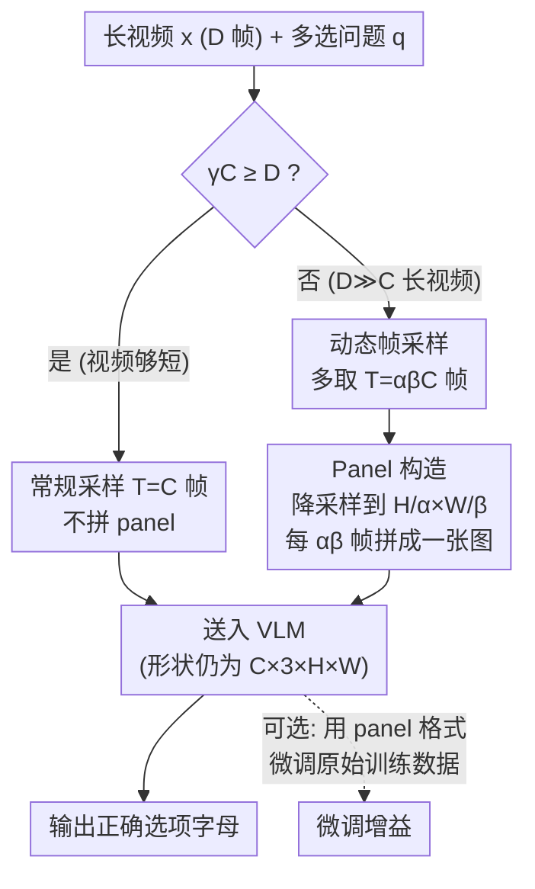

# Video Panels for Long Video Understanding

**会议**: CVPR 2026  
**arXiv**: [2509.23724](https://arxiv.org/abs/2509.23724)  
**代码**: https://fedespu.github.io/Video-Panels  
**领域**: 视频理解 / 多模态VLM  
**关键词**: 长视频理解, 视觉提示, 时间分辨率, 训练无关, 视频问答

## 一句话总结
把视频里相邻的多帧像漫画分镜一样拼进同一张图片，用空间分辨率换时间分辨率，从而在不改架构、不训练、不加参数的前提下提升现有 VLM 的长视频理解能力——在最长视频的 TimeScope(Long) 上把 VideoLLaMA 3 的问答准确率提升了 19.4%。

## 研究背景与动机

**领域现状**：视频-语言模型（VLM）在图像和短视频任务上已经很强，主流做法是用采样函数从视频里抽 $T$ 帧喂给模型。但视频长度一长，性能就断崖式下跌——比如 Qwen2.5-VL 处理超过三分钟的视频时准确率明显下滑。

**现有痛点**：问题的直接根源是**时间分辨率不足**。VLM 的上下文窗口 $C$ 有限，决定了它最多能"看"多少帧。当视频时长 $D \gg C$ 时，采样函数 $\phi$ 必须把大量帧丢掉才能塞进窗口，模型根本没法稠密地扫描整段视频。最近的工作要么压缩每帧的 token、要么扩展 LLM 的序列长度、要么引入记忆/摘要 token，但这些方法普遍**模型专用**、复杂度高，而且很多时候连干净的 base 模型都打不过。

**核心矛盾**：作者点出一个被忽略的失衡——VLM 主要是在图像和短视频上训练的，那时空间和时间分辨率采样后都还很高。可一旦换成长视频，**时间分辨率被压得很低，空间分辨率却原封不动**，于是模型的算力被不成比例地分给了空间关系，而真正稀缺的时间关系反而吃不饱。

**本文目标**：不微调、不加模块，只问一句话——有没有一种简单高效、且对各种现有 VLM 都通用的办法，把长视频理解能力榨出来？

**切入角度**：既然失衡的本质是"空间太多、时间太少"，那就把一部分空间预算让给时间。作者借鉴视觉提示（visual prompting）的思路：不动模型，只改输入。

**核心 idea**：把视频里连续的若干帧**缩小后拼成一张漫画式的多分镜图片（panel）**，再把这些 panel 序列喂给 VLM——用每帧损失一点空间细节，换来同样 token 预算下覆盖到 $\alpha\beta$ 倍多的帧，把"时间信息投影到空间维度"。

## 方法详解

### 整体框架

方法围绕一个朴素观察展开：VLM 的视觉编码器本就很强，能从一张图里推断元素之间的关系；那么把多帧拼成一张图，模型就能顺带把"帧与帧之间的时间关系"当成"图内的空间关系"来推理。整个流程只有两步——**先按视频时长动态决定采样多少帧，再把这些帧降采样后拼成 panel 图片**，最终送进 VLM 的张量形状和单帧时完全一样，因此可以无缝接入任何现成 VLM，训练无关、参数无关、模型无关。在零样本推理之外，作者还补了一条可选支路：用同样的 panel 格式去微调模型的原始训练数据，进一步提升效果。

记输入视频 $\mathbf{x}\in\mathbb{R}^{D\times 3\times H\times W}$（$D$ 帧），上下文窗口为 $C$，水平/垂直方向各拼 $\alpha$、$\beta$ 帧（默认 $\alpha=\beta=2$，即 2×2 共 4 帧拼一张），$\gamma$ 是触发 paneling 的时长阈值（默认取输入视频的帧率 fps）。

### 关键设计

**1. 动态帧采样：只在真长的视频上才换时间分辨率**

短视频和长视频的需求不同——短视频空间细节够用，硬拼 panel 反而白白损失分辨率。作者用一个分段函数按"上下文窗口能否覆盖整段视频"来决定采样帧数：

$$T=\begin{cases} C, & \text{if } \gamma C \ge D,\\ \alpha\beta C, & \text{otherwise.}\end{cases}$$

含义是：当 $\gamma C \ge D$（视频相对够短、采样帧间距足够密）就老实采 $C$ 帧、不拼 panel；只有当 $\gamma C < D$（采样后帧与帧之间至少隔了 $\gamma$ 帧、信息稀疏）才启动 paneling，一口气采 $\alpha\beta C$ 帧。$\gamma$ 越小，越早触发拼图。消融显示对最短的视频跳过 paneling 效果更好（$\gamma$ 取得大一点），但整体对 $\gamma$ 取值相当鲁棒。这个开关让方法"该省细节时才省"，避免短视频被误伤。

**2. Panel 构造：把 αβ 帧降采样后拼成一张标准尺寸的分镜图**

触发 paneling 后，采到的 $\alpha\beta C$ 帧太多塞不进窗口。做法是先把每帧降采样到 $\mathbf{x}'\in\mathbb{R}^{\alpha\beta C\times 3\times H/\alpha\times W/\beta}$，再**按从左到右、从上到下的顺序，每 $\alpha\beta$ 帧拼成一张 panel 图**。以默认 2×2 为例：

$$\mathbf{x}''_i=\begin{pmatrix}\mathbf{x}'_{4i} & \mathbf{x}'_{4i+1}\\ \mathbf{x}'_{4i+2} & \mathbf{x}'_{4i+3}\end{pmatrix}.$$

拼完后最终输入 $\mathbf{x}''\in\mathbb{R}^{C\times 3\times H\times W}$ 又回到视觉编码器期待的标准形状——这是整个方法能"无缝接入"的关键：VLM 完全不知道自己收到的是拼接图，token 数也没变，但**时间覆盖范围扩大了 $\alpha\beta$ 倍**。本质是把时间维折叠进空间维，让强大的预训练视觉编码器去推断帧间关系。作者发现 $\alpha=\beta$（方阵拼接）效果最好，不对称拼接（如 1×2、2×1）反而更差；2×2 在长视频上最优，继续放大到 3×3、4×4 会过度牺牲空间分辨率、伤害需要细节的任务。文中也试过在 prompt 里描述 panel 结构，但没有一个文本提示能跨模型普遍生效，因此默认不加任何额外说明。

**3. Panel 格式微调：把拼图当成更优的长视频表示**

零样本下 panel 已经有效，但模型毕竟是在普通视频上训练的。当有算力时，可以用 panel 格式重新表示模型**原始的**视频-问答训练数据（不引入任何新数据），最小化正确选项的负对数似然来微调：

$$\ell_{FT}(\mathbf{x},q,y)=-\log p_\theta(y\mid \mathbf{x},q).$$

实验把 LLaVA-OneVision 7B 在 LLaVA-Video-178K 上微调一个 epoch，结果显示：用 panel 微调比用标准输入微调更强，且相比零样本 paneling 还能再涨 0.4–0.6 点。这说明 panel 不只是个推理 trick，而是长视频的一种本质上更好的表示——训练和推理两侧都受益，与训练类改进互补而非互斥。

### 损失函数 / 训练策略
零样本主方法**无任何损失函数**（纯输入侧改造）。可选微调用标准多选答案的负对数似然 $\ell_{FT}=-\log p_\theta(y\mid\mathbf{x},q)$，仅微调投影层（Proj）+ LLM，batch size 2、梯度累积 4、训练 1 个 epoch。

## 实验关键数据

5 个长视频问答 benchmark（VideoMME、TimeScope、MLVU、MF2、VNBench）× 8 个 VLM（上下文 8–180 帧，含商用 GPT-4o-mini / GPT-4.1），统一用 lmms-eval 评测准确率。默认 $\alpha=\beta=2$、$\gamma=$ fps、均匀采样。

### 主实验

各模型加上 panel 后的平均准确率（节选，括号为相对 base 的平均提升）：

| 模型 | 上下文帧 | base 平均 | + panel 平均 | 提升 |
|------|---------|-----------|--------------|------|
| Video-LLaVA 7B | 8 | 33.8 | 34.8 | +1.0 |
| LLaVA-OV 7B | 32 | 52.8 | 56.2 | +3.4 |
| LLaVA-OV 72B | 32 | 49.4 | 52.5 | +3.1 |
| Qwen-2.5VL 7B | 32 | 51.9 | 55.3 | +3.4 |
| LLaVA-Video 7B | 64 | 56.6 | 60.7 | +4.1 |
| VideoLLaMA 3 7B | 180 | 58.2 | 60.9 | +2.7 |

单项最亮眼的是 **TimeScope(Long)**（最长视频）：VideoLLaMA 3 7B 从 39.1 → 46.7，**+7.6 点 = +19.4%**。商用模型上，GPT-4o-mini 在 VMME 上 +2.5、GPT-4.1 +1.1。一个有意思的现象：64 帧的 LLaVA-Video 7B 加 panel 后（60.7）几乎追平甚至超过 180 帧的长上下文 base 模型，反衬出"现有 VLM 是否真的高效利用了大上下文"是个问号。

### 微调实验（LLaVA-OV 7B，Table 2）

| 配置 | VMME overall | TimeScope Long |
|------|--------------|----------------|
| 无 panel，无微调 | 58.5 | 30.2 |
| 无 panel，Proj+LLM 微调 | 58.5 | 30.9 |
| 有 panel，无微调（零样本） | 58.9 | 33.8 |
| 有 panel，Proj+LLM 微调 | 59.3 | 34.4 |

不用 panel 时微调几乎不涨；用 panel 微调则在零样本基础上再进一步，证明 panel 是更优的长视频表示。

### 消融实验

| 配置 | VMME overall | TimeScope Long | 说明 |
|------|--------------|----------------|------|
| 1×1（无 panel） | 58.5 | 30.2 | 基线 |
| **2×2** | **58.9** | **33.8** | 默认配置，长视频最佳 |
| 3×3 | 58.7 | 33.8 | 更多帧但空间细节损失大 |
| 4×4 | 58.4 | 30.9 | 过度牺牲分辨率，VMME 掉回基线 |
| 2×1 / 1×2（不对称） | 58.1 / 58.6 | — | 比 $\alpha=\beta$ 差 |

### 关键发现
- **拼图（frame-level）优于 token pooling**：与"在投影前对视觉 token 做平均池化（low-res，token 数还略多于 panel：25088 vs 23328）"对比，panel 在几乎所有模型上都更好；且 pooling 表示拿去微调会很快过拟合掉点。这与"提升分辨率比堆 token 更有效"的已有结论一致——panel 相当于其逆操作：把多张高清帧合成一张，而非把一张高清图切成多块。
- **越长的视频收益越大**：在 TimeScope 13 档时长上，panel 对长视频持续提升；在"大海捞针"（needle）类任务（TimeScope、VNBench）上尤其突出。
- **省算力**：LLaVA-OV 7B 用 8 帧 + panel 就能达到 16 帧 base 的效果，视觉 token 直接减半。
- **意外亮点**：MLVU 上 counting 任务从 23.3% → 39.8%——即便牺牲了空间分辨率，panel 在需要细节的计数任务上反而大涨。唯一稳定吃亏的是 ordering 任务（-1.2%），因为 panel 保留了时间顺序但没显式编码时间信息。

## 亮点与洞察
- **把时间问题"翻译"成空间问题**：核心洞察是 VLM 的视觉编码器擅长图内空间推理，那就把帧间时间关系折叠进一张图，借力打力——这是个非常优雅的"免费午餐"，因为输入张量形状、token 数都不变，模型零感知。
- **真正的即插即用**：训练无关 + 参数无关 + 模型无关，从 8 帧的小模型到 180 帧的长上下文模型、从开源到 GPT-4.1 全都能套，几行采样+拼接代码即可，几乎没有落地门槛。
- **重新定义 baseline**：作者明说自己不提升 VLM 的"理解能力上限"，而是**抬高了 long video 新方法必须先跨过的及格线**——以后任何带额外复杂度的新模块，得先证明自己比"免费拼个图"更强才值得。
- **可迁移性**：这个"空间换时间/折叠维度"的思路可推广到任何受限上下文下的密集序列输入（如长文档截图、传感器时序的可视化拼接）。

## 局限性 / 可改进方向
- **不提升模型本身能力**：作者坦承 panel 只是更好地利用现有 VLM，并没增强其底层理解力；空间细节的损失对 fine-grained 任务始终是隐患（4×4 时 VMME 掉回基线即是证据）。
- **时间顺序未显式编码**：panel 保留了帧的排列顺序，但模型并不知道哪格在前哪格在后，导致 ordering 任务掉点；作者提到可借 NumPro（帧上加数字标签）的思路补救，但留到附录。
- **prompt 描述不通用**：在 prompt 里描述 panel 结构能对特定模型加分，却找不到跨模型普适的文本提示，说明效果对提示工程仍有依赖。
- **超参需按数据集调**：$\gamma$ 在低帧率数据集（如 2 fps 的 TimeScope）上影响更明显，$\alpha\beta$ 的最优值也随任务（NIAH vs 细节任务）权衡，不存在一刀切。

## 相关工作与启发
- **vs token 压缩/重采样类（Video-XL、VideoLLaMB 等）**：它们在 **token 级**做压缩/记忆/摘要，且大多模型专用；本文在 **输入/帧级**做拼接，模型无关，且消融证明 frame pooling 优于 token pooling。
- **vs 长上下文扩展类（LongVA 等）**：它们把 LLM backbone 的长上下文能力迁移到多模态，需要训练；本文不训练就让模型"等效"处理远超训练时上下文的帧数，64 帧 + panel 即可逼平 180 帧 base。
- **vs 图像视觉提示（红圈、bbox、NumPro 帧上数字标签）**：前人用几何线索/数字标签引导注意力；本文把视觉提示从"标注单图"推进到"把多帧投影进单图来表征时间"，是首个面向**长视频**的视觉提示方法。
- **vs 短视频拼图（action recognition、QA 用图像模型拼帧）**：思路同源（空间排布多帧），但本文首次用于长视频、首次在 VLM（而非图像模型）上验证、且首次用拼图格式微调 VLM。

## 评分
- 新颖性: ⭐⭐⭐⭐ 思路极简却是首个面向长视频的视觉提示，"折叠时间进空间"的视角很巧
- 实验充分度: ⭐⭐⭐⭐⭐ 5 benchmark × 8 模型（含商用）+ 微调 + 多组消融，覆盖面非常广
- 写作质量: ⭐⭐⭐⭐ 动机清晰、公式简洁、消融到位，图主要在附录略可惜
- 价值: ⭐⭐⭐⭐⭐ 零成本即插即用、重定义 baseline，对长视频社区有很强的实用与标尺意义

## 评分
- 新颖性: 待评
- 实验充分度: 待评
- 写作质量: 待评
- 价值: 待评

<!-- RELATED:START -->

## 相关论文

- [\[CVPR 2026\] Efficient Frame Selection for Long Video Understanding via Reinforcement Learning](efficient_frame_selection_for_long_video_understanding_via_reinforcement_learnin.md)
- [\[CVPR 2026\] VirtueBench: Evaluating Trustworthiness under Uncertainty in Long Video Understanding](virtuebench_evaluating_trustworthiness_under_uncertainty_in_long_video_understan.md)
- [\[CVPR 2026\] Thinking with Drafts: Speculative Temporal Reasoning for Efficient Long Video Understanding](thinking_with_drafts_speculative_temporal_reasoning_for_efficient_long_video_und.md)
- [\[CVPR 2026\] META: Meta Evolution of Tool Trajectory Adaptation for Long-Video Understanding](meta_meta_evolution_of_tool_trajectory_adaptation_for_long-video_understanding.md)
- [\[CVPR 2026\] VideoARM: Agentic Reasoning over Hierarchical Memory for Long-Form Video Understanding](videoarm_agentic_reasoning_over_hierarchical_memory_for_long-form_video_understa.md)

<!-- RELATED:END -->
