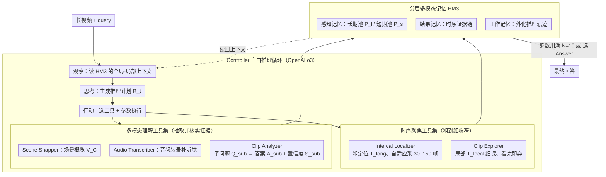

# VideoARM: Agentic Reasoning over Hierarchical Memory for Long-Form Video Understanding

**会议**: CVPR 2026  
**arXiv**: [2512.12360](https://arxiv.org/abs/2512.12360)  
**代码**: [https://milvlg.github.io/videoarm/](https://milvlg.github.io/videoarm/)  
**领域**: 视频理解 / LLM Agent  
**关键词**: 长视频理解, Agent推理, 分层记忆, 粗到细推理, Token效率

## 一句话总结
VideoARM 提出了一种基于分层多模态记忆（HM3）的 Agent 推理范式，通过"观察-思考-行动-记忆"的自适应循环和粗到细的工具调用策略，在长视频理解基准上超越 SOTA 的同时将 token 消耗降低到 DVD 的 1/34。

## 研究背景与动机

1. **领域现状**：长视频理解需要在数十分钟到数小时的视频中捕捉细粒度时空细节并推理长程依赖。近年来 MLLM 的长上下文能力和跨模态对齐为此提供了基础。现有 LLM 驱动方法分两类：手工推理流程（如 LLoVi、VideoTree）和 Agent 自主推理（如 DVD）。

2. **现有痛点**：(a) 手工方法（VideoTree）将视频分段→聚类→打分→建树→推理，流程固定限制了自主性，无法充分利用更强基座模型的推理能力。(b) Agent 方法（DVD）先对所有 10 秒片段做详尽预处理建数据库，token 消耗极高（30 分钟视频 ~400 万 token），且数据库是静态的无法在推理中更新。

3. **核心矛盾**：穷举式预处理既浪费 token 又引入与 query 无关的冗余信息；而手工流程限制了模型自主推理的潜力。如何在保持推理质量的同时大幅降低 token 消耗？

4. **本文目标** 设计一种自适应的、按需的 Agent 推理范式，替代静态穷举预处理，实现高效且灵活的长视频理解。

5. **切入角度**：用分层记忆（感知→结果→工作）替代预构建数据库，让 Agent 按需动态构建记忆；用粗到细的工具集替代检索范式，让 Agent 通过时序聚焦和局部分析逐步缩小搜索范围。

6. **核心 idea**：用动态构建的三层记忆（HM3）替代静态数据库，让 MLLM Agent 在"观察-思考-行动-记忆"循环中按需探索视频，实现 token 高效的长视频推理。

## 方法详解

### 整体框架
VideoARM 要解决的是：长视频里 query 相关的信息往往只占很小一段，但 DVD 那类 Agent 为了能检索，先把整段视频每 10 秒切片全部预处理进数据库，30 分钟视频要烧掉约 400 万 token，且数据库建好就固定了，推理时无法再补料。VideoARM 反过来做——不预处理，让一个 MLLM Agent 边推理边按需取料。

整篇的运转分两层。一层是**分层多模态记忆（HM3）**，三层结构（感知 / 结果 / 工作记忆）随推理动态记录 Agent 看到了什么、做过什么、在想什么；另一层是**粗到细的推理 Agent**，由一个 Controller（OpenAI o3）驱动，手里握着时序聚焦工具集和多模态理解工具集，在 observe-think-act-memorize 循环里自己决定下一步看哪段、用哪个工具，最多走 $N=10$ 步就给答案。整个过程像在一段长视频里"先定位再放大"，token 只花在跟问题相关的局部上。

### 关键设计

**1. 分层多模态记忆 HM3：用动态记忆替代静态数据库**

DVD 的痛点是穷举预处理——既贵又塞进大量与 query 无关的冗余。HM3 把 Agent 的上下文拆成三层、随推理增量构建，而不是一次性建满。**感知记忆**（Sensory Memory）存视觉素材，又分长期感知池 $P_l$（当前正在处理的时间段的帧，用 3×2 网格拼图压缩以省 token）和短期感知池 $P_s$（局部探测拉来的帧和音频，分析完立刻清掉，不占长期上下文）。**结果记忆**（Result Memory）按时间顺序记录每一轮工具的输出和对应区间，构成一条有序的证据链，让 Agent 能回看历史、避免重复去看同一段。**工作记忆**（Working Memory）记录 Controller 每次调工具前的推理轨迹和意图，把推理链外化出去。

这三层从感知→语义→认知逐级抽象，各自解决一个具体麻烦：感知记忆给当前的视觉上下文，结果记忆让 Agent 反思避免空转，工作记忆把推理过程挪出主上下文、缓解 LLM 的上下文长度压力。因为是按需写入，token 只花在被真正探索过的片段上，这正是它比 DVD 省 34 倍 token 的根。

**2. 时序聚焦工具集：粗到细地把搜索范围逐步收窄**

长视频的搜索空间太大，直接细看每一帧不现实。这套工具实现"时序漏斗"。**Interval Localizer** 读取 HM3 里的上下文信号，定位与 query 最相关的帧区间 $T_{long}$，并自适应决定在这段里采多少帧 $N_1$（30–150 帧之间，信息密的段多采、稀的段少采），再把这些帧合成紧凑的 3×2 网格图、刷新长期感知池——这是粗粒度的"缩小关注范围"。**Clip Explorer** 则在长期焦点内部的局部区间 $T_{local}$ 做一次短暂的细粒度探测，用固定帧数 $N_2$ 采样存进短期感知池、同时抓取该段音频，但**不改动全局焦点**——这是细粒度的"假设验证"，看完即弃。

二者配合，Agent 先用 Interval Localizer 把镜头推到大致区域，再用 Clip Explorer 在局部快速取证，从而把"哪里值得细看"这件事交给推理逐步逼近，而不是一上来就全量预处理。

**3. 多模态理解工具集：从三个互补角度抽取并核实证据**

光有帧还不够，得把像素转成 Controller 能推理的语义。这里有三个互补工具，各管一个维度。**Scene Snapper** 总结长期感知池里的帧、生成场景描述 $V_C$，给的是全局语义概览（由 GPT-4.1/4o 实现）。**Audio Transcriber** 用 whisper-1 转录短期感知池里的音频，在画面线索不足时补上听觉语义。**Clip Analyzer** 针对一个具体子问题 $Q_{sub}$ 去分析短期感知池里的帧，返回答案 $A_{sub}$ 和置信度 $S_{sub}$，给的是局部细粒度证据；用完后结果写入结果记忆、短期感知池清空。

三者分别覆盖全局概览、听觉补充、局部细节，Controller 可以按当前缺什么证据自由组合调用，在广度（先看个大概）和深度（钻一个细节）之间灵活权衡。

**4. Controller 的自由推理循环：不写死流程，把决策权交给强推理模型**

VideoTree 那类手工方法把"分段→聚类→打分→建树→推理"写死，限制了更强基座的自主性。VideoARM 反其道——Controller（OpenAI o3）只遵循一个精简的 observe-think-act-memorize 循环（类似 ReAct，但背后有 HM3 撑着），不预设刚性的工作流和工具调用规则。每一轮：观察 HM3 里的全局-局部上下文 → 思考并生成推理计划 $R_t$ → 选工具和参数执行 → 把结果写回 HM3。直到步数用满 $N$ 或 Controller 主动选 Answer 动作才终止、给出最终回答。

这种"留白"设计把工具编排的智能完全交给 Controller，因此它对 Controller 的推理力极度敏感——消融里把 o3 换成 GPT-4o 直接从 76.5% 跌到 40.5%，正说明多步自主推理吃强模型。

### 一个完整示例

以一条"30 分钟视频 + 一个细节 query"为例走一遍循环，看三层记忆和工具怎么串起来：

- **第 1 步（观察+思考）**：Controller 看到 HM3 还几乎是空的，先生成计划 $R_1$——"该问题指向某个事件，先大致定位"，写入工作记忆。
- **第 2 步（行动：粗定位）**：调 Interval Localizer，根据 query 锁定相关区间 $T_{long}$，自适应采样约 49.8 帧（论文报告的平均值）合成 3×2 网格图，刷新长期感知池。
- **第 3 步（行动：全局理解）**：调 Scene Snapper 总结这段网格图得到场景描述 $V_C$，结果连同区间写入结果记忆。
- **第 4 步（思考+细看）**：Controller 读结果记忆，发现还缺一个细节，生成新计划 $R_t$，调 Clip Explorer 在局部 $T_{local}$ 取一小段帧+音频进短期感知池。
- **第 5 步（行动：取证）**：调 Clip Analyzer 针对子问题 $Q_{sub}$ 分析这几帧，返回 $A_{sub}$ 和置信度 $S_{sub}$；若画面不够，再调 Audio Transcriber 补音频语义。证据写入结果记忆，短期感知池清空。
- **终止**：当结果记忆里的证据足以回答时，Controller 选 Answer 动作输出（或到 $N=10$ 步强制收尾）。

整条链上，长期感知池始终维持"当前看哪段"的全局焦点，短期感知池只是局部探一下就弃，结果记忆攒下时序证据、工作记忆攒下推理意图——token 始终只花在被探索过的片段上。

## 实验关键数据

### 主实验

| 方法 | Video-MME Overall | Video-MME Long | LongVideoBench | EgoSchema |
|------|-------------------|----------------|----------------|-----------|
| GPT-4o | 71.9 | 65.3 | 66.7 | 72.2 |
| OpenAI o3 | - | 63.2 | 67.5 | 63.2 |
| DVD | - | 67.3 | 71.6 | 76.6 |
| VideoLucy | 72.5 | 66.8 | - | - |
| **VideoARM (o3+GPT-4.1)** | **80.1** | **75.3** | **73.7** | **78.2** |
| **VideoARM (o3+GPT-4o)** | **82.8** | **81.2** | **78.0** | 76.2 |

### Token 效率对比

| 方法 | 理论估算 (30min/1query) | 实测 (10 videos/30 queries) |
|------|------------------------|---------------------------|
| DVD | 3.98M tokens | 64.21M tokens |
| **VideoARM** | **0.08M (1/50 of DVD)** | **1.89M (1/34 of DVD)** |

### 消融实验

| 配置 | Video-MME Long |
|------|----------------|
| Full (o3 + GPT-4.1) | 76.5 |
| w/o 短期感知池 | 72.5 (-4.0) |
| w/o 长期感知池 | 67.0 (-9.5) |
| w/o 结果记忆 | 无效（重复循环） |
| w/o 工作记忆 | 75.5 (-1.0) |
| 仅用 Controller 上下文 | 74.5 (-2.0) |
| Controller: GPT-4o | 40.5 |
| Controller: Qwen3-VL | 54.9 |

### 关键发现
- VideoARM 在 Video-MME Long 上以 81.2% 大幅超越 DVD 的 67.3%（+13.9pp），同时 token 消耗仅为 1/34
- 长期感知池是最关键组件（去掉后下降 9.5%），说明时序聚焦大幅减少了搜索空间
- Controller 的推理能力至关重要——GPT-4o 作为 Controller 仅 40.5%，说明复杂多步推理需要强推理模型（o3/GPT-5）
- 自适应帧采样策略优于固定采样（76.5 vs 74.0），平均只用 49.8 帧
- 步数预算 $N=10$ 在长视频上最佳，短视频不需要太多步

## 亮点与洞察
- **动态记忆 vs 静态数据库是核心创新**：DVD 先花大量 token 预建数据库再检索，VideoARM 按需构建记忆只处理 query 相关内容。这个思路类似于数据库中的 lazy evaluation vs eager evaluation
- **三层记忆设计有认知科学基础**：感知→工作→长期记忆的层级与人类认知模型一致，Working Memory 的外化设计巧妙地解决了 LLM 上下文长度限制
- **Controller 的"自由度"设计理念值得学习**：不预设工具调用顺序而让强推理模型自主决策，充分释放了 o3 的推理潜力

## 局限与展望
- 完全依赖 API 调用（o3 + GPT-4.1/4o + whisper-1），成本不可忽略，且受 API 可用性限制
- 10 步推理预算可能对超长视频（>1h）不够，但增加步数会增加 API 成本
- 帧采样和网格拼接策略可能丢失空间细节
- 未考虑开源模型部署的场景（Qwen3-VL 作 Controller 效果很差说明该方案对模型能力要求高）
- 无法处理实时流式视频

## 相关工作与启发
- **vs DVD**: VideoARM 的改进本质上是将"穷举预处理+检索"替换为"按需推理+记忆"。在 token 效率上 34x 提升，性能上 +13.9pp
- **vs VideoTree**: VideoTree 用固定分层聚类，VideoARM 用自适应工具调用，后者更灵活且不受预定义策略限制
- **vs VideoLucy**: VideoLucy 用固定文本摘要和回溯机制，VideoARM 维持层级化的多模态证据缓冲，信息粒度更丰富
- 思路可推广到长文档理解、多模态 RAG 等需要高效探索大规模信息的场景

## 评分
- 新颖性: ⭐⭐⭐⭐ HM3 分层记忆和按需推理范式有较好创新性，但 observe-think-act 循环并非首创
- 实验充分度: ⭐⭐⭐⭐⭐ 覆盖 5 个基准（Video-MME/LongVideoBench/EgoSchema/MLVU/LVBench），消融非常详细
- 写作质量: ⭐⭐⭐⭐ 结构清晰，工具设计描述详尽，但部分内容稍有冗余
- 价值: ⭐⭐⭐⭐ Token 效率的大幅提升有实际应用价值，但依赖高端 API 限制了可部署性

<!-- RELATED:START -->

## 相关论文

- [\[CVPR 2026\] FluxMem: Adaptive Hierarchical Memory for Streaming Video Understanding](fluxmem_adaptive_hierarchical_memory_for_streaming_video_understanding.md)
- [\[CVPR 2026\] DIvide, then Ground: Adapting Frame Selection to Query Types for Long-Form Video Understanding](divide_then_ground_adapting_frame_selection_to_query_types_for_long-form_video_u.md)
- [\[CVPR 2026\] LensWalk: Agentic Video Understanding by Planning How You See in Videos](lenswalk_agentic_video_understanding_by_planning_how_you_see_in_videos.md)
- [\[CVPR 2026\] Question-guided Visual Compression with Memory Feedback for Long-Term Video Understanding](question-guided_visual_compression_with_memory_feedback_for_long-term_video_unde.md)
- [\[AAAI 2026\] TSPO: Temporal Sampling Policy Optimization for Long-form Video Language Understanding](../../AAAI2026/video_understanding/tspo_temporal_sampling_policy_optimization_for_long-form_video_language_understa.md)

<!-- RELATED:END -->
