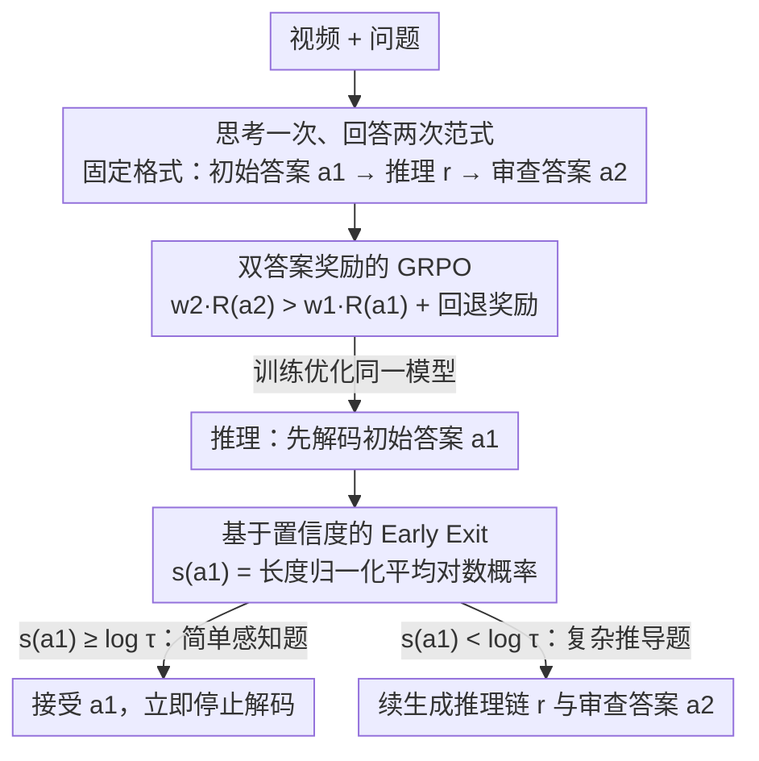

# VideoAuto-R1: Video Auto Reasoning via Thinking Once, Answering Twice

**会议**: CVPR 2026  
**arXiv**: [2601.05175](https://arxiv.org/abs/2601.05175)  
**代码**: [https://ivul-kaust.github.io/projects/videoauto-r1](https://ivul-kaust.github.io/projects/videoauto-r1)  
**领域**: 视频理解 / LLM推理  
**关键词**: 视频推理、自适应思考、链式推理、强化学习、推理效率

## 一句话总结
提出 VideoAuto-R1，一个"按需推理"的视频理解框架：训练时采用"思考一次、回答两次"（answer→think→answer）范式，推理时通过首次回答的置信度决定是否启动 CoT 推理，在保持 SOTA 精度的同时将平均响应长度从 149 降至 44 token（约 3.3 倍压缩）。

## 研究背景与动机

1. **领域现状**：CoT（链式推理）已成为提升多模态大语言模型视频理解能力的主要手段。Video-R1、Time-R1、VideoChat-R1 等模型基于 GRPO 强化学习训练，让模型在回答前进行逐步推理。这些方法在数学/编程等符号化任务上效果显著。

2. **现有痛点**：(a) 视频理解本质上更依赖视觉感知而非逐步推理，一旦感知准确，后续符号推理通常很浅；(b) 强制所有样本都进行 CoT 推理导致大量冗余 token（Video-R1 平均 386 token），显著增加延迟和推理成本；(c) 令人惊讶的是，对于 RL 训练的视频推理模型，直接回答在多个基准上表现与 CoT 持平甚至更好。

3. **核心矛盾**：CoT 推理具有计算开销但在视频理解中收益有限——在感知密集型任务（如物体/动作识别）上冗余甚至有害（过度思考），仅在少数需要多步推导的任务（如 VideoMMMU 中的物理/数学推导）上有明显优势。

4. **本文目标**：设计一个能自适应决定"是否需要推理"的视频理解模型——简单问题直接回答，复杂问题才启动 CoT。

5. **切入角度**：作者首先系统性地证明了现有视频推理模型（Video-R1、Time-R1、VideoChat-R1）在直接回答和 CoT 模式下的表现差异（Table 1），发现 CoT 在 VideoMME、LongVideoBench 上甚至降低精度。这一发现为"按需推理"提供了强有力的动机。

6. **核心 idea**：训练时让模型同时生成直接答案和推理后答案（双答案 GRPO），推理时用首次答案的 token 置信度决定是否继续生成推理链，实现自适应 auto-thinking。

## 方法详解

### 整体框架
这篇论文要解决的是"视频推理模型该不该每道题都先想一遍"的问题。它的做法是把"是否思考"从一个需要预先标注的决策，变成模型自己在生成时顺手暴露的信号。训练时，模型对每个问题都生成同一种固定格式的响应 `\boxed{a1}<think>r</think>\boxed{a2}`：先给出不带任何分析的初始答案 $a_1$，再在 `<think>` 里写推理过程 $r$，最后给出审查后答案 $a_2$，而 $a_1$ 和 $a_2$ 都被可验证奖励监督。推理时则反过来利用这个格式——模型只要先解码出 $a_1$，就能算出它的置信度：高置信度（简单感知题）直接在 $a_1$ 处停下来，低置信度（需要推导的难题）才继续把推理链和 $a_2$ 生成完。训练学的是"两个答案都答对"，推理用的是"看第一个答案有多确定"，二者完全解耦。

### 关键设计

**1. "思考一次、回答两次"训练范式：把 think/no-think 标注问题彻底绕开**

自适应推理最棘手的地方在于：训练时你得告诉模型哪些样本该思考、哪些不该，但这种逐样本标注既贵又容易让模型崩到"永远思考"或"永远不思考"两个极端。本文的办法是干脆不做这个判断——让模型对所有样本都走 answer→think→answer 这一条路。系统提示明确要求第一个 box 只放答案、不含任何分析，中间 `<think>` 放推理，最后一个 box 放审查后的答案；如果模型实在无法在不推理的情况下作答，就允许在第一个 box 里输出一个固定的回退字符串"Let's analyze the problem step by step"，把这一题标记为"需要思考"。这样一来，模型唯一要学的目标就是让两个答案都正确，"该不该思考"被推迟到推理阶段再由置信度决定，训练侧既不需要 switch token，也不需要 mode head 或冷启动 SFT。

**2. 双答案奖励的 GRPO：用权重差让"想了之后更对"被显式奖励**

光是让模型生成两个答案还不够，得让奖励同时盯住这两个答案，否则模型会偷懒只优化其中一个。总奖励写成

$$R = w_1 R_{\text{task}}^{(1)}(a_1) + w_2 R_{\text{task}}^{(2)}(a_2) + \lambda R_{\text{fmt}} + \alpha R_{\text{fallback}}$$

这里关键是 $w_2 > w_1$（本文取 $w_1=0.9,\, w_2=1.1$）：审查后答案权重更高，等于在告诉模型"通过推理把答案改对"这件事更值钱，从而鼓励它在难题上真的去用推理；而 $w_1>0$ 又保证初始答案本身也被训练得足够准，否则推理阶段的早期退出就无从谈起。$R_{\text{fallback}}$ 则补上一块拼图——当 $a_1$ 用了回退字符串、但 $a_2$ 推理后答对时给一笔额外奖励，专门对付数学/符号密集这类无法凭直觉一口答出的题，避免模型在难题上硬猜一个低置信答案。GRPO 每题采 16 个 rollout、温度 1.0。

**3. 基于置信度的 Early Exit：用模型自己的 token 概率决定何时停**

有了会答两次的模型，推理时怎么"按需思考"就只剩一个问题：第一个答案够不够信得过。本文不去训练额外的分类器，而是直接用 $a_1$ 这几个 token 的长度归一化平均对数概率作为置信度分数

$$s(a_1) = \frac{1}{L}\sum_{\ell=1}^L \log p_\theta(t_\ell \mid t_{<\ell}, q)$$

只要 $s(a_1) \geq \log \tau$（$\tau=0.97$）就接受 $a_1$、立刻终止解码，否则继续把推理链和 $a_2$ 生成出来；回退字符串的置信度被强制设为 $-\infty$，保证它一定继续推理。举例来说，一道动作识别题模型对 $a_1$ 几乎笃定、分数远超阈值，于是在十来个 token 后就退出；而一道 VideoMMMU 的物理推导题，$a_1$ 置信度压不过阈值，就自动转入完整 CoT。之所以可行，是因为 token 级置信度和答案正确性强相关（Table 9 验证），而 $a_1$ 通常不超过 10 个 token，这个判断几乎零开销——训练目标（学会双答案）和推理策略（何时思考）由此被干净地解耦开。

### 损失函数 / 训练策略
- 基础模型：Qwen2.5-VL-7B-Instruct 和 Qwen3-VL-8B-Instruct
- 直接 RL 无冷启动 SFT（实验发现在 Video-R1-CoT 数据上做 SFT 反而降低基线性能）
- 训练数据：83K 样本，包含文本/图像数学科学问题 + 视频 QA + 时序定位
- 视觉编码器冻结，只训练 projector 和 LLM
- 32 张 H100 GPU 训练约 35 小时
- 推理：贪心解码，最大响应 4096 token，$\tau=0.97$

## 实验关键数据

### 主实验（视频 QA）

| 模型 | 推理模式 | 响应长度 | VideoMME | MVBench | VideoMMMU | MVP |
|------|---------|---------|----------|---------|-----------|-----|
| Qwen2.5-VL-7B | Direct | 3.0 | 66.0 | 67.1 | 54.7 | 36.5 |
| Video-R1 | Think-Only | 386 | 61.8 | 65.5 | 51.4 | 33.0 |
| VideoChat-R1.5 | Think-Only | 133 | 65.2 | 70.6 | 49.6 | 38.6 |
| **VideoAuto-R1 (2.5VL)** | **AutoThink** | **44** | **67.3** | **71.0** | **58.6** | **39.4** |
| **VideoAuto-R1 (Q3VL)** | **AutoThink** | **52** | **71.7** | **72.0** | **65.0** | **43.0** |

### 时序定位实验

| 模型 | Charades-STA mIoU | ActivityNet mIoU | NExT-GQA Acc |
|------|------------------|-----------------|-------------|
| Qwen2.5-VL-7B | 52.9 | 26.9 | 53.3 |
| Time-R1 | 58.8 | 52.1 | - |
| VideoChat-R1.5 | 60.6 | 35.3 | - |
| **VideoAuto-R1 (2.5VL)** | **60.0** | **47.6** | **80.6** |
| **VideoAuto-R1 (Q3VL)** | **63.7** | **56.1** | **82.6** |

### 关键发现
- **Think ratio 自适应调节**：感知型基准 MVBench 上 think ratio 仅 25%，推理密集型 VideoMMMU 上升到 51%，表明模型确实学会了按需推理。Qwen3-VL 版本的 VideoMMMU think ratio 达 53%。
- **直接回答 vs CoT 的反直觉发现**：现有视频推理模型（Video-R1、Time-R1、VideoChat-R1）在 VideoMME 和 LongVideoBench 上 CoT 推理反而降低 1-2 个点，仅在 VideoMMMU 上 CoT 一致胜出。
- **时序定位任务不需要 CoT**：在 Charades-STA 和 ActivityNet 上，初始 boxed 答案已足够精确，后续 CoT 主要起解释作用，因此默认 early exit。
- **3.3 倍效率提升**：平均响应长度从 Video-R1 的 386 token 降至 44 token（Qwen2.5-VL 版本），显著减少推理延迟。
- **无冷启动 SFT 更优**：早期实验发现在 Video-R1-CoT 数据上做 SFT 反而损害基线性能，直接 RL 更稳定。

## 亮点与洞察
- **"answer→think→answer"模板是核心创新**：通过让模型在同一生成中产出两个答案，优雅地解决了 auto-thinking 中"训练时如何标注样本需要/不需要思考"的难题。无需额外的 switch token、mode head 或冷启动 SFT，训练极为简洁。这种设计可迁移到任何需要自适应推理的场景。
- **置信度 early exit 简单有效**：不需要训练额外的分类器来判断是否推理，直接利用模型自身的 token log probability，几乎零成本。这一思路可用于任何 LLM 的推理效率优化。
- **视频理解中 CoT 的反直觉发现**：系统性证明了视频推理模型 CoT 在多数感知任务上无益甚至有害，这一洞察值得整个领域关注——不是所有任务都需要 System 2 思考。

## 局限与展望
- **阈值 $\tau$ 固定**：当前使用单一固定阈值 $\tau=0.97$ 在所有基准上通用，但可能不是对所有任务类型最优。动态调节阈值可能进一步提升效果。
- **双答案训练增加 token 消耗**：GRPO 训练时每次 rollout 都要生成完整的 answer-think-answer 序列，训练时的 token 消耗高于只训练直接回答。
- **回退机制的设计相对简单**：当前回退字符串是固定文本，更灵活的回退策略（如渐进式推理深度）可能进一步提升。
- **仅验证在 Qwen2.5-VL/Qwen3-VL 上**：是否可推广到其他视频 LLM 架构尚不清楚。

## 相关工作与启发
- **vs Video-R1**: Video-R1 强制所有样本 CoT，平均 386 token，在 VideoMME 上 61.8%；VideoAuto-R1 仅 44 token 即达 67.3%，效率和精度双赢。
- **vs AdaptThink**: AdaptThink 在文本数学任务上训练二元模式切换策略，需要平衡 think/no-think 数据。VideoAuto-R1 通过双答案范式避免了这一困难，且更稳定。
- **vs R-4B（图像域 auto-thinking）**: R-4B 用双模式策略优化（SFT 初始化 + RL 微调），本文完全不需要 SFT 初始化，更简洁。

## 评分
- 新颖性: ⭐⭐⭐⭐⭐ "思考一次回答两次"范式是全新的 auto-thinking 设计，消除了模式标注需求
- 实验充分度: ⭐⭐⭐⭐⭐ 覆盖视频 QA + 时序定位 + 图像推理，消融分析详尽
- 写作质量: ⭐⭐⭐⭐⭐ 动机论证充分（Table 1 的反直觉发现），方法描述清晰
- 价值: ⭐⭐⭐⭐⭐ 在效率和精度上同时取得突破，auto-thinking 范式可广泛复用

<!-- RELATED:START -->

## 相关论文

- [\[CVPR 2026\] Thinking with Drafts: Speculative Temporal Reasoning for Efficient Long Video Understanding](thinking_with_drafts_speculative_temporal_reasoning_for_efficient_long_video_und.md)
- [\[NeurIPS 2025\] When Thinking Drifts: Evidential Grounding for Robust Video Reasoning](../../NeurIPS2025/video_understanding/when_thinking_drifts_evidential_grounding_for_robust_video_reasoning.md)
- [\[CVPR 2026\] CaST-Bench: Benchmarking Causal Chain-Grounded Spatio-Temporal Reasoning for Video Question Answering](cast-bench_benchmarking_causal_chain-grounded_spatio-temporal_reasoning_for_vide.md)
- [\[CVPR 2026\] Incentivizing Versatile Video Reasoning in MLLMs via Data-Efficient Reinforcement Learning](incentivizing_versatile_video_reasoning_in_mllms_via_data-efficient_reinforcemen.md)
- [\[CVPR 2026\] LongVideo-R1: Smart Navigation for Low-cost Long Video Understanding](longvideo-r1_smart_navigation_for_low-cost_long_video_understanding.md)

<!-- RELATED:END -->
