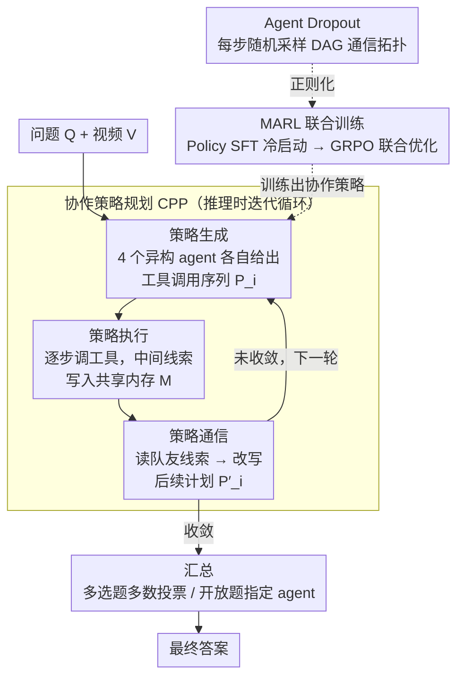

# VideoChat-M1: Collaborative Policy Planning for Video Understanding via Multi-Agent Reinforcement Learning

**会议**: CVPR 2026  
**arXiv**: [2511.19524](https://arxiv.org/abs/2511.19524)  
**代码**: 无  
**领域**: 视频理解  
**关键词**: Multi-Agent, Collaborative Policy Planning, MARL, GRPO, Video Understanding

## 一句话总结

VideoChat-M1 提出协作策略规划（CPP）范式和多智能体强化学习（MARL）训练方法，让 4 个异构 VLM agent 动态生成和更新工具调用策略来理解视频，在 LongVideoBench 上超过 Gemini 2.5 Pro 3.6%、GPT-4o 15.6%。

## 研究背景与动机

**现有问题**：当前 agent-based 视频理解框架普遍使用**静态且不可学习的工具调用策略**，预定义工具选择顺序，不随视频内容和问题动态调整。这限制了对时空复杂视频中多样化线索的发现与利用。

**单 agent 的瓶颈**：单一 agent 难以同时兼顾感知（perception）、检索（retrieval）和综合（synthesis），即使为其配备检索、记忆和搜索工具，通用设计也限制了有效整合与推理。

**无训练多 agent 的不足**：如 LVAgent 等方法仅依赖静态角色分配和固定文本逻辑，缺乏可训练的协作策略，无法通过学习自适应地调整协作模式。此外，现有 RL 方法局限于单模态文本域，无法处理视频的时序和感知挑战。

**核心问题**：如何让多个 agent 动态地生成、执行和协调工具调用策略以应对复杂视频理解任务？如何联合训练多个异构 agent 使其学会有效协作？

## 方法详解

### 整体框架

VideoChat-M1 由两大核心组成：**Collaborative Policy Planning（CPP）** 推理范式 + **Multi-Agent Reinforcement Learning（MARL）** 训练方法。

系统包含 4 个异构 policy agent（Qwen3-8B、Qwen3-4B、Qwen2.5-7B、Qwen2.5-3B，总参数约 37B），一组视频感知工具集 $\mathcal{T}$（含 Global Sampling、Video Retrieval、Image Retrieval、Rough/Fine Browser、Spatial Tool、Grounding Tool 等 7 种），以及一个共享内存缓冲区 $\mathcal{M}$。

推理流程：用户问题 $\mathcal{Q}$ + 视频 $\mathcal{V}$ → 各 agent 独立生成工具调用计划 → 逐步执行工具并通过共享内存交换中间结果 → 各 agent 根据对等信息决定是否更新后续计划 → 迭代多轮后各 agent 汇总答案 → 多数投票（多选题）或指定 agent 汇总（开放题）得出最终答案。

### 关键设计

**1. Collaborative Policy Planning（CPP）：把"一次性定好工具顺序"换成可迭代的生成-执行-通信循环**

以往 agent 框架的工具调用顺序是预先写死的，视频里到底有哪些线索、该先看哪段、该用哪个工具，全凭固定模板，遇到时空复杂的视频就抓瞎。CPP 把策略规划拆成三个交替推进的阶段，让 agent 边看边改。**Policy Generation** 阶段，每个 agent $i$ 先根据问题自主生成一条初始工具调用序列 $\mathcal{P}_i = \{\mathcal{P}_{i,1} \to \mathcal{P}_{i,2} \to \cdots \to \mathcal{P}_{i,N}\}$；**Policy Execution** 阶段逐步执行，第 $n$ 步的输出依赖上一步结果 $\mathcal{A}_{i,n} = \mathcal{P}_{i,n}(\mathcal{V}, \mathcal{T}, \mathcal{A}_{i,n-1})$；**Policy Communication** 阶段则在每步执行后把中间线索写进共享内存 $\mathcal{M}$，各 agent 读取队友信息后决定是否改写自己后续的计划：

$$\mathcal{P}'_i = \mathcal{G}_i(\mathcal{Q}, \mathcal{T}, \mathcal{M}, \mathcal{P}_i)$$

关键在于多个异构 agent 会从不同角度生成不同的初始策略，再通过共享内存互相"看见"彼此挖到的线索——有人定位到了关键帧，别人就能据此调整自己的检索范围。这种"多样化生成 + 通信纠偏"远比单条固定流水线更能覆盖视频内容的多样性。

**2. Multi-Agent Reinforcement Learning（MARL）：让多个 agent 通过联合 RL 学会协作，而不是靠 prompt 临时凑**

光有 CPP 的协作结构还不够——论文发现哪怕把 GPT-4o 组装进 CPP 流程跑零样本，也只有 56.2 分，远低于训练后的 60.5，说明有效的协调模式不会自己冒出来，得训出来。MARL 分两阶段注入这种模式。第一阶段 **Policy SFT** 做冷启动：用 GPT-4o + DeepSeek-R1 自动标注高质量策略数据，只保留那些"答案正确且计划全程不需要修改"的干净样本，对每个 agent 单独 SFT，让它们先学会生成合法、像样的工具调用计划。第二阶段用 **GRPO 联合优化**全部 agent，把它们当成一个整体来更新，奖励来自三路信号——结果奖励 $\mathcal{R}_{res}$、格式奖励 $\mathcal{R}_{format}$、协作奖励 $\mathcal{R}_{col}$（详见下方训练策略）。这是首个面向视频理解、把多个异构 agent 放在同一个 RL 目标下联合训练的框架；过往的视频 RL（如 Video-R1）都只优化单个模型。

**3. Agent Dropout：用随机化通信拓扑防止 agent 之间过度共适应**

如果训练时所有 agent 始终全连接、人人都能读到所有人的中间结果，它们很容易退化成"互相抄作业"——某个 agent 学会了死等某个固定队友的输出，一旦队友状态变了就崩。Agent Dropout 借鉴神经网络 Dropout 的思路：每个训练步从全连接的 agent 图里随机采样一个有向无环图（DAG）当作本步的通信拓扑，谁能读谁、信息往哪流每步都在变。这逼着每个 agent 不能依赖某个特定队友，而要发展出对任意通信结构都鲁棒的协作习惯。消融实验里它被证明是"最重要的正则化器"——去掉后 LongVideoBench 掉 2.4 个点（79.9 vs 82.3）。

### 一个完整示例：四个 agent 协同解一道长视频题

给定一个长视频 $\mathcal{V}$ 和问题 $\mathcal{Q}$（比如"视频里那个人在厨房做的第二道菜用了什么食材"），系统这样转起来：

- **各自生成策略**：4 个异构 agent（Qwen3-8B / Qwen3-4B / Qwen2.5-7B / Qwen2.5-3B）独立给出初始计划。有的 agent 先 Global Sampling 粗采全片再 Video Retrieval 定位厨房片段；有的 agent 直接 Image Retrieval 找"做菜"的关键帧，再上 Grounding Tool 框出锅里的东西——策略天然分叉。
- **逐步执行 + 写内存**：各 agent 按自己的计划调工具，每执行一步就把中间线索（"第 3 分钟出现厨房""第二道菜是炒菜"）写进共享内存 $\mathcal{M}$。
- **读队友信息后改计划**：某个 agent 从内存里看到队友已经定位到"第二道菜"的时间段，就放弃自己原本从头扫的计划，转而把 Fine Browser 和 Spatial Tool 集中投到那一段去看食材——这就是 $\mathcal{P}'_i = \mathcal{G}_i(\cdot)$ 在起作用。
- **多轮迭代后汇总**：迭代若干轮、各 agent 都收敛到答案后，多选题用多数投票、开放题指定一个 agent 汇总，得出最终答案。

整段过程平均只用了 **69.9 帧、19.8s**，却比直接把几百帧喂给单个大模型更准——因为线索是被多个 agent 协同"挖"出来并相互印证的，而不是靠堆帧硬看。

### 损失函数 / 训练策略

**SFT 阶段**：交叉熵损失，最大化生成 ground-truth 策略计划的似然。学习率 1e-6，batch size 32，1 epoch。

**MARL 阶段**：GRPO 目标函数，包含奖励寻求项和 KL 散度正则化项：

$$\max_{\pi_\theta} \mathbb{E}_{o \sim \pi_{\theta_{\text{old}}}} \left[ \sum_{k=1}^{K} \frac{\pi_\theta(o_k)}{\pi_{\theta_{\text{old}}}(o_k)} \cdot A_R^{(k)} - \beta \, D_{KL}(\pi_\theta \| \pi_{\text{ref}}) \right]$$

三种奖励信号：$\mathcal{R}_{res}$（答案正确正奖励，错误负惩罚）、$\mathcal{R}_{format}$（工具调用是否合法可执行）、$\mathcal{R}_{col}$（GPT-4o 评估中间协作轨迹质量，binary 奖励，超过 5 次工具调用强惩罚）。学习率 1e-7，4 rollouts，batch size 8，仅需 200 步即达最佳性能。

## 实验关键数据

### 主实验

| 数据集 | 指标 | VideoChat-M1 (37B) | GPT-4o | Gemini 2.5 Pro | Qwen3-VL-235B | 最佳 Agent 方法 |
|--------|------|:---:|:---:|:---:|:---:|:---:|
| LongVideoBench | Acc | **82.3** | 66.7 | 78.7 | - | 71.6 (DeepVideoDiscovery) |
| Video-MME (Avg) | Acc | **83.2** | 71.9 | 84.3 | 79.2 | 75.7 (VideoRAG-72B) |
| MLVU (M-avg/G-avg) | Acc | **84.2/76.7** | 70.3/65.3 | - | - | 72.9/73.1 (VideoRAG-72B) |
| VideoMMMU | Acc | **83.4** | 61.2 | 83.6 | 74.7 | 76.2 (VideoChat-A1) |
| Video-Holmes | Acc | **60.5** | 42.0 | 45.7 | - | - |
| MMR-V (CoT) | Acc | **5.92** | 5.80 | - | - | - |
| VSIBench (Avg) | Acc | **71.9** | 34.0 | - | 62.6 | - |
| Charades-STA | mIOU | **67.7** | - | - | 64.8 | 65.9 (Eagle-2.5) |

### 效率对比

| 模型 | 平均帧数 | 推理时间 | LongVideoBench | Video-MME |
|------|:---:|:---:|:---:|:---:|
| Qwen2-VL-72B | 568 | 90.5s | 55.6 | 71.2 |
| GPT-4o | 384 | 153.6s | 66.7 | 71.9 |
| Gemini-1.5-Pro | 568 | 227.2s | 64.0 | 75.0 |
| **VideoChat-M1** | **69.9** | **19.8s** | **82.3** | **83.2** |

### 消融实验

**Agent 数量与组合（Table 3）**：

| Agent 数量 | 组合 | Video-Holmes | LongVideoBench |
|:---:|------|:---:|:---:|
| 1 | Qwen3-8B | 31.2 | 61.9 |
| 2 | Qwen3-4B + Qwen3-8B | 43.5 | 67.9 |
| 3 | Qwen2.5-7B + Qwen3-4B + Qwen3-8B | 55.9 | 78.9 |
| 4 | 全部 4 个异构 agent | **60.5** | **82.3** |

**异构 vs 同构（Table 4）**：

| 配置 | Video-Holmes | LongVideoBench |
|------|:---:|:---:|
| 4× Qwen2.5-3B（同构） | 55.8 | 79.2 |
| 2× Qwen2.5-3B + 2× Qwen2.5-7B | 55.9 | 79.3 |
| 2× Qwen3-4B + 2× Qwen3-8B | 58.8 | 80.9 |
| 全异构（4 种不同模型） | **60.5** | **82.3** |

**MARL 组件消融（Table 6）**：

| $\mathcal{R}_{format}$ | $\mathcal{R}_{col}$ | $\mathcal{R}_{res}$ | Agent Dropout | Video-Holmes | LongVideoBench |
|:---:|:---:|:---:|:---:|:---:|:---:|
| ✓ | ✓ | ✗ | ✓ | 32.4 | 63.8 |
| ✓ | ✗ | ✓ | ✓ | 59.4 | 81.1 |
| ✗ | ✓ | ✓ | ✓ | 60.2 | 82.0 |
| ✓ | ✓ | ✓ | ✗ | 58.5 | 79.9 |
| ✓ | ✓ | ✓ | ✓ | **60.5** | **82.3** |

**SFT + MARL 缺一不可（Table 7）**：

| SFT | MARL | Video-Holmes | LongVideoBench |
|:---:|:---:|:---:|:---:|
| ✗ | ✗ | 52.1 | 69.3 |
| ✓ | ✗ | 55.2 | 75.9 |
| ✗ | ✓ | 57.9 | 80.2 |
| ✓ | ✓ | **60.5** | **82.3** |

**vs 闭源 LLM Agent 组（Table 5）**：

| Agent 组 | Video-Holmes | LongVideoBench |
|----------|:---:|:---:|
| 4× GPT-4o | 52.7 | 72.9 |
| 4× DeepSeek-R1 | 51.8 | 71.4 |
| 2× GPT-4o + 2× DeepSeek-R1 | 56.2 | 75.9 |
| **VideoChat-M1 (37B)** | **60.5** | **82.3** |

### 关键发现

- 结果奖励 $\mathcal{R}_{res}$ 是 MARL 中最关键的信号，去掉后 Video-Holmes 从 60.5 暴跌至 32.4
- Agent Dropout 是"最重要的正则化器"，去掉后 LongVideoBench 掉 2.4 个点（79.9 vs 82.3）
- 异构 agent 组（4 种不同架构）显著优于同构组（如 4× 同一模型），结构多样性带来讨论多样性
- 即使用 GPT-4o 组走 CPP 流程也只有 56.2/75.9，远低于经 MARL 训练的 VideoChat-M1（60.5/82.3），说明零样本推理无法发现有效协调模式
- 多数投票（60.5/82.3）> 指定 agent 决策（60.2/81.6）> 打分选择（59.9/81.2）
- 仅需 69.9 帧和 19.8s 推理时间，效率远超直接喂大量帧给单模型

## 亮点与洞察

- **CPP 范式新颖**：生成→执行→通信的迭代循环非常自然，agent 可根据同伴信息动态修改策略，不同于以往固定策略或无训练多 agent 方案
- **首创多 agent 联合 RL 视频理解框架**：设计了结果/格式/协作三重奖励信号，特别是协作奖励评估中间过程质量（process reward），而非仅看最终结果
- **Agent Dropout 优雅的正则化**：随机化通信拓扑避免共适应，灵感来源于神经网络 Dropout，简单有效
- **极致效率**：37B 总参数（4 个小模型 + 工具模型），仅用 69.9 帧和 19.8s 推理时间，在多个 benchmark 上匹敌或超越 235B 级模型和 GPT-4o

## 局限与展望

- 需要 4 个模型并行推理 + 多个工具模型，**部署复杂度高**，实际应用中的工程挑战不小
- 协作奖励依赖 GPT-4o 作为评判者，**训练成本不低**且引入外部依赖
- 当前工具集固定为 7 种预定义工具，**未探索让 agent 自主发现或创建新工具**
- 对于简单视频问题，多 agent 框架可能是**过度设计**
- 同构 agent 数量超过 4 后性能饱和，**可扩展性有限**

## 相关工作与启发

- **vs VideoChat-A1/VideoRAG**：这些方法用单 agent 或无训练多 agent，策略固定；VideoChat-M1 的 CPP 范式使策略动态可学习
- **vs Video-R1/VideoChat-R1**：这些用 RL 优化单模型推理；VideoChat-M1 是首个多 agent 联合 RL 训练框架
- **vs GPT-4o/Gemini**：即使用 GPT-4o 组走 CPP 流程（56.2/75.9），也远低于经 MARL 训练的 VideoChat-M1（60.5/82.3），说明 MARL 注入了零样本推理无法发现的协调模式
- **启发**：多 agent 协作 + RL 的范式可迁移到其他多模态任务；Agent Dropout 随机化通信拓扑的思想对其他 multi-agent 系统有借鉴价值；CPP 中的工具集可考虑做成可扩展的，让 agent 在 RL 过程中学会组合新工具

## 评分

- 新颖性: ⭐⭐⭐⭐⭐ 首个多 agent RL 视频理解框架，CPP 范式 + MARL 训练都是新贡献
- 实验充分度: ⭐⭐⭐⭐⭐ 8 个 benchmark × 4 个任务类型 + 丰富消融（agent 数量/异构性/奖励组件/训练阶段/决策机制）
- 写作质量: ⭐⭐⭐⭐ 整体清晰，方法-实验逻辑连贯，表格略多但信息量大
- 价值: ⭐⭐⭐⭐⭐ 37B 参数超越 GPT-4o 和 235B 级模型，提供了多 agent 视频理解的新范式

<!-- RELATED:START -->

## 相关论文

- [\[CVPR 2026\] Learning to Assist: Physics-Grounded Human-Human Control via Multi-Agent Reinforcement Learning](learning_to_assist_physics-grounded_human-human_control_via_multi-agent_reinforc.md)
- [\[CVPR 2026\] Efficient Frame Selection for Long Video Understanding via Reinforcement Learning](efficient_frame_selection_for_long_video_understanding_via_reinforcement_learnin.md)
- [\[CVPR 2026\] SVAgent: Storyline-Guided Long Video Understanding via Cross-Modal Multi-Agent Collaboration](svagent_storyline_guided_long_video_understanding_via_cross_modal_multi_agent_collaboration.md)
- [\[CVPR 2026\] Incentivizing Versatile Video Reasoning in MLLMs via Data-Efficient Reinforcement Learning](incentivizing_versatile_video_reasoning_in_mllms_via_data-efficient_reinforcemen.md)
- [\[CVPR 2026\] Learning to Refuse: Refusal-Aware Reinforcement Fine-Tuning for Hard-Irrelevant Queries in Video Temporal Grounding](learning_to_refuse_refusal-aware_reinforcement_fine-tuning_for_hard-irrelevant_q.md)

<!-- RELATED:END -->
