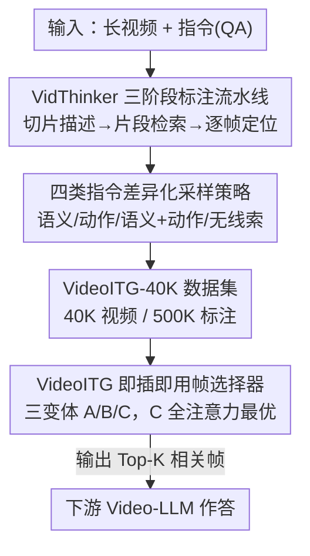

# VideoITG: Multimodal Video Understanding with Instructed Temporal Grounding

**会议**: CVPR 2026  
**论文**: [CVF Open Access](https://openaccess.thecvf.com/content/CVPR2026/html/Wang_VideoITG_Multimodal_Video_Understanding_with_Instructed_Temporal_Grounding_CVPR_2026_paper.html)  
**代码**: https://nvlabs.github.io/VideoITG/ （项目页）  
**领域**: 视频理解  
**关键词**: 视频大模型, 帧采样, 指令时序定位, 数据标注流水线, 即插即用

## 一句话总结
VideoITG 把"根据用户指令挑帧"做成一个独立的时序定位任务：先用 GPT-4o 驱动的 VidThinker 三阶段流水线自动标出 40K 视频里"哪些帧和这条指令相关"，造出 50 万条指令对齐标注，再训练一个即插即用的帧选择器接到各种 Video-LLM 前面，用 16~32 帧就追平甚至超过均匀采样 64 帧的效果。

## 研究背景与动机

**领域现状**：Video-LLM 处理长视频时，受显存和算力限制没法把所有帧都喂进去，最常见的做法是"均匀采样"——每隔固定时间抽一帧。为了挑得更聪明，已有工作要么压缩时空冗余（池化、相似度剪枝、聚类），要么扩大模型序列长度，要么用"问题相关"的线索去检索帧（如 SeViLA 用 BLIP-2 逐帧打分挑关键帧）。

**现有痛点**：均匀采样简单但常常漏掉对语义和时序推理至关重要的关键帧；而像 SeViLA 这类逐帧独立打分的检索方法**缺乏跨帧的时序建模**，碰到"多事件""时间敏感"的问题（如"他上车之前做了什么"）就力不从心。更根本的是，现有方法基本只支持**单一描述性 query**的检索，无法适配真实场景里千变万化的指令类型。

**核心矛盾**：短视频和长视频之间存在明显的性能鸿沟，根因是**缺乏大规模、指令引导的时序定位数据**——没有数据，模型就学不会"针对这条具体指令该看哪几帧"。

**本文目标**：让帧采样策略**随用户指令自适应变化**——同一段视频，问"语义"问题时挑差异大的代表帧，问"动作"问题时密集均匀采，问开放问题时全局铺一遍。这要求同时解决两件事：(1) 哪来的指令对齐标注数据？(2) 用什么模型结构把"指令"和"视觉证据"对齐起来做帧选择？

**切入角度**：作者借鉴人类看长视频找信息的方式——先略读全局、再定位问题相关线索、最后放大判别性瞬间（一种"大海捞针"过程），把这套三步推理流程自动化。

**核心 idea**：提出 **Instructed Temporal Grounding（指令时序定位）**——把"挑帧"从均匀采样升级成一个由指令驱动的判别任务；用自动化标注流水线 VidThinker 造数据，再训练一个即插即用的帧选择器，前置到任意 Video-LLM 之前。

## 方法详解

### 整体框架

VideoITG 由两大块组成，前者造数据、后者用数据训模型：

1. **VidThinker 标注流水线（造数据）**：输入一段长视频 + 一对 QA（指令），输出"哪些帧与这条指令相关"的精细标注。它模仿人类三步推理——把视频切成 5 秒短片做指令条件下的描述、用 LLM 链式推理检索相关片段、再逐帧二分类筛选关键帧。用它在 LLaVA-Video 视频上跑出 **VideoITG-40K**（40K 视频、500K 标注）。

2. **VideoITG 帧选择模型（用数据）**：一个即插即用模块，接在 Video-LLM 前面。给定视频帧的视觉特征 $F$ 和问题 $q$，输出相关帧索引 $I_{rel}$，下游 Video-LLM 只对选中的帧 $F_{I_{rel}}$ 作答。整条推理链是 $F=\text{ViT}(v)$，$I_{rel}=\text{VideoITG}(F,q)$，$a=\text{VideoLLM}(F_{I_{rel}},q)$。模型从预训练 Video-LLM 初始化，探索了三种注意力/解码变体（文本生成式 / anchor 因果注意力 / 池化全注意力）。

### 关键设计

**1. VidThinker 三阶段标注流水线：把"人怎么在长视频里找线索"拆成可自动化的三步**

痛点是没有指令对齐的时序定位数据，而人工逐帧标注 40K 视频不现实。VidThinker 用一条全自动、可解释的流水线模仿人类三步推理，逐级缩小搜索空间：

- **指令条件切片描述（Instructed Clip Captioning）**：视频按 5 秒切成短片 $\{v_i\}$。先用 LLM 从 QA 里蒸出关键动作短语 $k=\text{LLM}(q,a)$（如把"打鼓的人用脚做了什么"+"移动脚"蒸成"打鼓的人移动双脚并用手击鼓"），再让 VLM 以 $k$ 为注意力线索逐片生成描述 $c_i=\text{VLM}(k,v_i)$。关键约束是：VLM 只在线索**在当前片段可见**时才采纳它，避免凭线索幻觉出实际没出现的内容，保证描述扎根于视觉证据。
- **指令引导片段检索（Instructed Clip Retrieval）**：把所有片段描述按时序排好喂给 LLM，要求它做**链式推理**——同时考虑关键词匹配和时序关系，直接输出相关片段索引 $I_{rel\text{-}clip}=\text{LLM}(\{c_i\},q,a)$，而非简单的二值打分。这让选择有据可依、可解释，避免只靠 trivial 的关键词匹配。
- **指令引导逐帧定位（Instructed Frame Localization）**：在粗定位的候选片段内，对每帧做二分类 $y_i=\text{LLM}(f_i,q,a)\in\{\text{yes},\text{no}\}$，只保留 yes 的帧作为最终时序定位结果，实现高精度的关键帧筛选。

三步层层收窄、互相依赖，把"指令→相关帧"这件事变成可批量自动跑的数据工厂。

**2. 四类指令的差异化采样策略：不同问题需要看的"帧"本质不同**

光定位到相关片段还不够——问"外观"和问"动作"该挑的帧完全不一样。作者按指令对视觉理解的需求把它分成四类，每类配一套采样策略，让视觉证据精确匹配推理需求：

- **语义型（Semantic only）**：查静态外观（人、物、场景），如"他上车前做了什么"。在相关片段里挑**差异大的代表帧**——逐帧抽 CLIP 特征，算相邻帧余弦相似度，当某帧与上一个关键帧的相似度低于"场景变化阈值"时才保留，保证覆盖多样语义线索。
- **动作型（Motion only）**：关注动态模式（类型、速度、方向），如"他怎么从跳板跳下"。在定位片段内**固定频率密集采样**，覆盖起跳—腾空—入水的完整动作进程。
- **语义+动作型（Semantic & Motion）**：两者都要，如"描述视频里的镜头运动"。在动作相关区域固定频率采样的同时，保留语义信息量大的帧，二者兼顾。
- **无线索型（Non-Clues）**：整段视频级、无明确锚点的开放指令，如"详细描述这个视频"。在全片**铺一组紧凑但多样的帧**（首—中—尾），以最小冗余保证全局覆盖。

这套分类让同一条流水线产出的标注天然带上"该怎么看"的策略先验，而不是一刀切。

**3. VideoITG 帧选择器与三种变体：把"指令"和"视觉 token"对齐到能判别每帧是否相关**

有了数据，还要一个能把指令语义与每帧视觉证据对齐的模型。VideoITG 从预训练 Video-LLM 初始化，目标是增强视觉-语言 token 对齐 + 强化跨帧上下文建模，作者系统对比了三种实现：

- **变体 A·文本生成式分类**：把时序定位重构成 next-token 预测，按序输出"相关帧"的文本 token。它最贴合 Video-LLM 原生训练范式、保留强对齐能力，但实测**最差**——teacher forcing 下监督稀疏、前面的帧选择会影响后面，训练效率低。
- **变体 B·anchor 因果注意力分类**：改成判别式，直接在帧级对视觉 token 二分类，保留因果注意力以维持时序一致性。但因果掩码让视觉 token 看不到后面的指令、早期帧用不上后续时序线索；为此在指令后插入一个 **anchor token** 作"时序中介"——对时刻 $t$ 的帧，anchor 由该帧所有空间位置全局平均得到 $A_t=\frac{1}{M}\sum_{i,j}F^t_{ij}$，让 $\{A_t\}_{t=1}^{T}$ 在因果注意力下桥接跨帧依赖。
- **变体 C·池化全注意力分类**：直接去掉因果掩码，开放视觉与文本 token 间的**双向全注意力**，每帧视觉 token 平均池化后过分类头判定相关性，无需 anchor。它感受野更大、能做全局时序关系建模、所有 token 都能访问文本 query，实测**最优**，作为后续默认配置。

### 损失函数 / 训练策略
视觉编码器用 SigLIP，语言模型用 Qwen2，从 LLaVA-Video 预训练权重初始化。先在图文 caption 数据上训 MLP projector（batch 256、lr $1\times10^{-3}$），再在 LLaVA-OV-SI 和 LLaVA-Video 上全参微调（采样率 64 帧、最大序列 16K）。最后在 VideoITG-40K 上训帧选择，采样率调到 1 fps；LLM 学习率 $2\times10^{-5}$、分类头 $2\times10^{-4}$。推理时最多输入 512 帧（每帧 16 个视觉 token），默认按分数选 Top-32 帧。

## 实验关键数据

### 主实验：不同帧选择方法对比

| 选择方法 | Answering LMM | 帧数 | LongVideoBench | MLVU | VideoMME-Avg |
|----------|---------------|------|----------------|------|--------------|
| Uniform | LLaVA-OneVision-7B | 8 | 54.2 | 58.9 | 54.9 |
| BOLT | LLaVA-OneVision-7B | 8 | 56.1 | 63.4 | 57.6 |
| Frame-VOYAGER | LLaVA-OneVision-7B | 8 | — | 65.6 | 59.5 |
| **VideoITG-8B** | LLaVA-OneVision-7B | 8 | **60.1** | **68.7** | **61.6** |
| Uniform | LLaVA-Video-7B | 64 | 59.9 | 70.2 | 64.7 |
| AKS | LLaVA-Video-7B | 32 | 59.6 | 74.3 | 64.9 |
| QuoTA | LLaVA-Video-7B | 64 | 59.0 | 71.9 | 65.9 |
| **VideoITG-8B** | LLaVA-Video-7B | 32 | **61.6** | **74.6** | **66.9** |

VideoITG 在 LLaVA-OneVision-7B 上把均匀采样平均分从 54.9 拉到 61.6（**+6.7**），在 Qwen2-VL 上 +6.2；在 LLaVA-Video-7B 上仅用 32 帧（66.9）就超过别人用 50~64 帧的结果。Figure 1 更直观：VideoMME 上 **16 帧 VideoITG ≈ 64 帧均匀采样**。

### 跨 Video-LLM 泛化（Top-32 vs 均匀 32）

| Video-LLM | 均匀 32 平均 | VideoITG 32 平均 | 提升 |
|-----------|-------------|------------------|------|
| InternVL2.5-8B | 58.7 | 64.3 | +5.6 |
| InternVL2.5-26B | 61.6 | 66.7 | +5.1 |
| Qwen3-VL | 59.2 | 65.8 | +6.6 |
| LLaVA-Video-7B | 58.4 | 62.9 | +4.5 |
| Eagle2.5-8B | 61.8 | 66.7 | +4.9 |

值得注意：InternVL2.5-8B + VideoITG（64.3）反超 InternVL2.5-26B 均匀采样基线（61.6），说明**好的帧选择带来的增益可能比单纯堆模型规模更划算**。

### 消融实验

| 配置 | VideoMME-Long | MLVU | LongVideoBench | 平均 | 说明 |
|------|---------------|------|----------------|------|------|
| Variant-A-7B | 44.4 | 44.8 | 56.8 | 48.5 | 文本生成式，最差 |
| Variant-B-7B | 56.2 | 66.0 | 61.3 | 67.2 | anchor 因果注意力 |
| **Variant-C-7B** | **56.9** | **67.1** | **61.9** | **67.8** | 全注意力，默认 |
| Variant-C-3B | 56.0 | 64.8 | 61.5 | 66.8 | 规模缩小掉 1 点 |
| No Clip Captioning | 53.4 | 63.1 | 61.7 | 65.8 | 去掉切片描述 |
| No Frame Localization | 56.8 | 65.8 | 61.5 | 67.2 | 去掉逐帧定位 |
| No Images & Videos | 54.4 | 63.0 | 58.6 | 64.3 | 纯文本初始化，崩 |

### 关键发现
- **变体选择**：A（文本生成）远逊于 B/C 判别式，原因是 teacher forcing 下监督稀疏、前序选择干扰后序；C 的全注意力感受野最大、能全局建模时序关系，比 B 的因果注意力更好。
- **数据流水线两阶段都重要**：去掉 Instructed Clip Captioning，VideoMME-Long 从 56.9 掉到 53.4、MLVU 从 75.0 掉到 73.2，说明信息多样性对完整特征表征关键；去掉 Frame Localization 在 VideoMME-Medium 上从 67.1 掉到 65.8。
- **视觉-语言对齐预训练是地基**：去掉视频预训练影响不大，但同时去掉图像+视频、从纯文本 LLM 起步则**崩盘**——MLVU 75.0→69.1、LongVideoBench 61.9→58.6，证明对齐质量比视频上下文长度更决定性。
- **LongVideoBench 增帧收益小**：可能因为很多任务是"文本指代"型，且 VideoITG 采样分辨率偏低，留有更细粒度内容识别的空间。

## 亮点与洞察
- **把"挑帧"提升为一个独立可监督的任务**：以前帧选择要么无监督、要么靠逐帧打分，本文用 VidThinker 造出 50 万条指令对齐标注，第一次让"该看哪几帧"有了大规模显式监督，这是性能跃升的根本来源。
- **指令分四类配采样策略**这一点很实用：意识到"语义问题该挑差异帧、动作问题该密集采、开放问题该全局铺"，把人类直觉编码进数据标注，是个可迁移到任何检索/采样任务的思路。
- **anchor token 全局平均当时序中介**是处理因果掩码限制的巧解——既保留时序一致性又让早期帧能"预知"指令；虽然最终全注意力更好，但这个设计本身对"必须保因果结构"的场景仍有借鉴价值。
- **"选帧增益 > 扩模型增益"**的发现很有冲击力：8B+VideoITG 反超 26B 均匀采样，提醒社区在堆参数之外，输入侧的信息选择同样是高性价比的杠杆。

## 局限性 / 可改进方向
- **依赖 GPT-4o 等强 LLM 做标注**：VidThinker 的描述、检索、定位三步都靠 LLM，标注质量受限于这些黑盒模型，且大规模调用有成本；流水线的错误会沉淀进数据集。
- **采样分辨率偏低**：作者自己指出 VideoITG 在低分辨率下采样，细粒度内容识别还有提升空间；LongVideoBench 上增帧收益有限也部分源于此。
- **额外的前置推理开销**：帧选择器是一个独立 Video-LLM（最多输入 512 帧），虽然下游只喂 Top-32 帧省了算力，但选帧本身引入了一次前向，端到端延迟的净收益论文未充分量化。
- **指令分类的粒度**：四类指令是人为划定的，真实指令可能跨类或更复杂；自动判定指令类型、以及类间边界模糊时的策略选择，值得进一步研究。

## 相关工作与启发
- **vs SeViLA / 逐帧打分检索**：它们用 BLIP-2 逐帧独立处理再挑关键帧，**缺乏跨帧时序建模**，对多事件/时间敏感问题乏力；VideoITG 用全注意力做全局时序关系建模，且帧选择由指令驱动。
- **vs AKS / Q-Frame / Frame-Voyager**：这些是 query 自适应的帧选择/重要性估计方法，但多为单一描述性 query；VideoITG 用 40K 指令对齐数据训练，在相同设置下把平均分从 57.6（Q-Frame）/59.5（Frame-Voyager）提到 60+，且只用更少帧。
- **vs 传统时序定位（DiDeMo / QVHighlights）**：传统时序定位用单条描述性 query 定位事件、数据集无指令属性；VideoITG-40K 显式指令引导、规模约为这些数据集的 4×，支持 query 条件下的精确定位。
- **vs 时序敏感生成模型（TimeChat / Grounded-VideoLLM）**：变体 A 的文本生成范式与它们同源，但本文实验表明判别式分类（变体 C）在帧选择任务上明显更优。

## 评分
- 新颖性: ⭐⭐⭐⭐ 把指令时序定位独立成任务 + VidThinker 自动标注流水线，思路清晰且填补了数据空白，但单点机制（anchor、全注意力）多为已有组件组合。
- 实验充分度: ⭐⭐⭐⭐⭐ 跨 6 个 Video-LLM、多个长视频 benchmark、完整的架构/数据/预训练三维消融，证据扎实。
- 写作质量: ⭐⭐⭐⭐ 结构清楚、图表到位，VidThinker 三阶段讲得明白；部分实现细节（如场景变化阈值）下放附录。
- 价值: ⭐⭐⭐⭐⭐ 即插即用、对多种 Video-LLM 一致涨点、用更少帧达到更优，且开源数据集，实用价值和可复用性都高。

<!-- RELATED:START -->

## 相关论文

- [\[CVPR 2026\] T2SGrid: Temporal-to-Spatial Gridification for Video Temporal Grounding](t2sgrid_temporal-to-spatial_gridification_for_video_temporal_grounding.md)
- [\[CVPR 2026\] MTLLFM: Multimodal-Temporal Laughter Localization](mtllfm_multimodal-temporal_laughter_localization_ur-funny-temporal_and_smile-tem.md)
- [\[CVPR 2026\] HieraMamba: Video Temporal Grounding via Hierarchical Anchor-Mamba Pooling](hieramamba_video_temporal_grounding_via_hierarchical_anchor-mamba_pooling.md)
- [\[CVPR 2026\] CVA: Context-aware Video-text Alignment for Video Temporal Grounding](cva_context-aware_video-text_alignment_for_video_temporal_grounding.md)
- [\[CVPR 2026\] OmniVTG: A Large-Scale Dataset and Training Paradigm for Open-World Video Temporal Grounding](omnivtg_a_large-scale_dataset_and_training_paradigm_for_open-world_video_tempora.md)

<!-- RELATED:END -->
