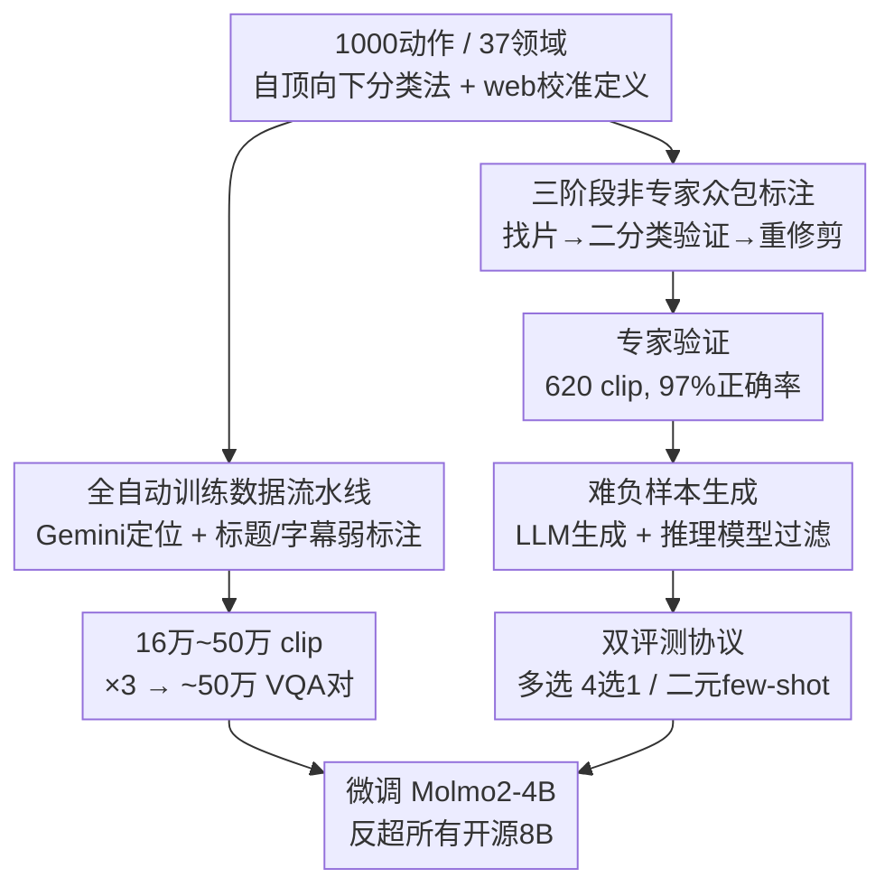

# VideoNet: A Large-Scale Dataset for Domain-Specific Action Recognition

**会议**: CVPR 2026  
**arXiv**: [2605.02834](https://arxiv.org/abs/2605.02834)  
**代码**: https://tanu.sh/research/videonet (项目主页，评测/标注代码待开源)  
**领域**: 视频理解 / 多模态VLM  
**关键词**: 动作识别, 领域专用动作, VLM基准, few-shot学习, 难负样本

## 一句话总结
VideoNet 构建了一个覆盖 37 个领域、1000 个细粒度"领域专用动作"的视频动作识别基准（多选 + 二元 few-shot 两套协议），用全自动流水线收集近 50 万条 VQA 训练对，把领域专用动作识别这个"被遗忘的任务"重新拉回 VLM 评测视野——结果是开源 8B VLM 多选准确率不足 50%，而在该数据上微调的 4B 模型反超所有 8B 开源模型。

## 研究背景与动机

**领域现状**：动作识别一度是视频理解的旗舰任务，但在 VLM 时代它几乎被边缘化。现有动作数据集分三类：① Kinetics、ActivityNet 等粗粒度标签（"rock climbing" 一个类），基础模型早已刷爆（InternVideo2 在 Kinetics-400 上 92.1%）；② FineDiving、FineSports 等只覆盖少数体育项目，无法检验泛化；③ TemporalBench、ToMATo 等只测"物体向左还是向右"这类细粒度时序属性，真实用户根本不会就此咨询大模型。

**现有痛点**：领域专用动作（如花样滑冰的"three flip jump"、滑板的"laser flip"、转笔的"thumbaround reverse"）数据极难采集——传统做法依赖领域专家逐条标注，成本高、覆盖窄。最接近的工作 Ego-Exo4D 只有 8 个领域且视觉多样性差（728 条抱石视频只拍自 2 个攀岩馆）；ActionAtlas 只聚焦体育、不提供训练数据、规模也只有 VideoNet 的 1/5。

**核心矛盾**：领域专用动作既考验**感知**（细微动作差异，如脚尖刀 toepick 区分 flip jump 和 Salchow jump），又考验**组合推理**（动作的所有要素是否都在、顺序对不对），但缺乏跨领域、有真实应用价值的大规模数据，导致 VLM 既没法被评测、也没法被训练。

**本文目标**：拆成三个子问题——(1) 如何在**不雇佣领域专家**的前提下采集到高质量、跨领域的领域专用动作标注？(2) 现有 VLM 在这类任务上到底差在哪、能否靠 test-time few-shot 弥补？(3) 能否靠 post-training 把这个缺口补上？

**切入角度**：作者发现非专家众包标注的关键障碍是"k 选 1 太难"，于是把它**降维成二分类的异常检测**；同时观察到视频的标题+字幕本身就是天然弱监督信号，可绕开"用 VLM 蒸馏 VLM"（而 VLM 本身就不会做这个任务）的死循环。

**核心 idea**：用"非专家众包 + web 检索校准定义 + 二分类异常检测"造高质量测试集，用"Gemini 定位 + 标题/字幕弱标注"造大规模训练集，把领域专用动作识别重新做成 VLM 时代可评测、可训练的任务。

## 方法详解

### 整体框架
VideoNet 不是一个模型，而是一套**数据资产 + 评测协议**，由三条管线组成。**基准构建管线**（人工，产出 5000 条精修测试 clip）：先自顶向下定义动作分类法并用 web 检索校准动作定义 → 三阶段非专家众包标注收集"修剪干净"的 clip → 抽样做专家验证（97% 正确率）→ 为每个动作生成 3 个"难负样本"文本标签 → 组装成多选（4000 题 + 1000 验证）和二元 few-shot（4000 题）两套评测。**训练数据管线**（全自动，产出 16 万~50 万 clip）：按领域爬视频 → 用 Gemini 2.5 Flash 做动作定位（它会定位但不会标注）→ 用 WhisperX 取词级时间戳，靠视频标题/字幕做弱标注与过滤 → 每 clip 生成 3 条 VQA 对。**训练与评测**：在该数据上微调 Molmo2-4B，在两套协议上评测一众开/闭源 VLM 与人类。

下面这张图把两条数据管线（共享同一份动作分类法）画到一起：

### 关键设计

**1. 自顶向下动作分类法 + web 检索校准的动作定义：让非专家也能标对**

领域专用动作的第一道坎是"标注员不懂这个领域"。作者先**自顶向下**定义 7 大类（覆盖日常如 food、需专业知识如 medical、需高帧率如 sports），每类下挑选"网上有足够视频且有可信专家内容"的领域，从专家撰写的来源（如权威滑板博客）收集动作列表，再用 LLM 扩充、并剔除网上视频量不足的动作，最终得到 1000 个动作。关键在于**动作定义**：定义贯穿整个项目，用来帮人和模型在没有专业知识时分类。作者一开始用 LLM 直接生成定义，但专业领域里 LLM 常编码过时/错误知识；于是让 LLM 带 **web 搜索**去权威社区检索专家信息、交叉核对并纠错，最终定义聚焦"视觉线索 + 与相似动作的关键区别"，成为标注员的独立参考资料。消融显示提供定义能显著提升非专家标注质量。

**2. 三阶段非专家众包标注流水线：把 k 分类降成二分类异常检测**

这是绕开领域专家的核心。流水线三阶段、每条 clip 经 5 名标注员审核：**(a) 视频收集**——给标注员动作名/领域/定义，让其上网找 7 条来自不同视频的 clip（强制不同源以增多样性）；**(b) clip 验证**——这里是点睛之笔：FineSports/MultiSports 的做法是给专家一条随机 clip、问"是 k 个动作里的哪一个"，而本文把它**降维成二分类**——只问非专家"这条 clip 含不含目标动作"。由于 7 条 clip 里通常 5~6 条确实含目标动作，问题进一步退化成**异常检测**（挑出不含的那一两条），对非专家极其简单；再取 3 人多数投票提升置信度。**(c) clip 重修剪**——用已确认良好修剪的样例先"训练"标注员成为该动作的"专家"，再让其修正那些含动作但修剪不佳的 clip 的时间边界。最终每个动作得到 ≥5 条精修 clip，共 5000 条（平均/典型时长 12.2s / 5.0s），并设 5 分钟上限以防 3-shot 时上下文爆掉。

**3. 难负样本生成：从"靠场景作弊"逼向"真看动作"**

多选/二元评测的干扰项怎么造决定了基准难度。"随机负样本"（同领域随机选别的动作）有致命缺陷：不同动作往往有不同背景/场景/静态线索，模型可只靠场景作弊（如 alley-oop dunk vs. free throw 背景就不同）。作者改造**难负样本**——选与正样本高度相似、只在细微视觉或运动上有差别的动作（如 alley-oop dunk vs. put-back dunk）。先用 LLM（gpt-4.5-preview）生成候选难负样本，**再用推理模型（o3）迭代精炼**：过滤掉可能与正动作共现或本身模糊的候选、增加视觉相似类型的多样性、平衡每个动作作为难负样本出现的频率。实验（Table 5）证明：从随机负换到难负，人类和模型都明显掉点，且**人类掉得比模型多**，说明 VideoNet 的难度来自需要专业知识的细粒度视觉区分，而非数据噪声。

**4. 双评测协议：多选测核心识别，二元 few-shot 测"会不会学"**

为每个动作配齐 5 条 clip + 3 个难负标签后组装两套评测。**多选**：每条 clip 用 1 个正确标签 + 3 个难负标签组成 4 选 1（随机基线略高于 25%），共 5000 题（留 1000 做验证），这是核心识别任务。**二元 few-shot**：用动作前 3 条 clip 作 in-context 示例，剩 2 条作正测试 clip，再选 2 个难负标签各取 2 条作负测试 clip，组成"问视频含不含某动作"的二元判断（随机基线 50%），共 4000 题。二元设定的意义在于：多选下做 few-shot 会把 12 段视频（4 动作 × 3 示例）塞进上下文，远超多数模型的承受范围；二元设定才能干净地测 VLM 的**视觉 in-context learning** 能力（k∈{1,2,3}）。

**5. 全自动训练数据流水线：用标题/字幕做弱标注，绕开"VLM 蒸馏 VLM"死循环**

人工管线质量高但太贵，无法扩到训练规模；而直接用最强 VLM 蒸馏标签也不行（VLM 本身就不会标这类动作）。作者改用**视频自带的弱信号**——标题和字幕。逐领域处理 37 个领域：从动作列表构造检索词（"laser flip"→"skateboarding laser flip"/"how to laser flip"）爬视频 → 用 Gemini 2.5 Flash 做**定位器**（Gemini 标不准动作、但很会切出动作发生的起止时间戳）→ 用 WhisperX 取词级时间戳。然后用三种过滤/标注策略（强度递增）：① 动作名在定位 clip 的 ±$T{=}1$ 秒字幕内出现即打标；② 在 ① 基础上要求动作也出现在视频标题；③ 动作出现在标题、且全视频只定位出一个 clip，则用标题动作打标。总计爬 800 万视频 → 定位 150 万视频 → 6 百万 clip → 过滤成 16 万~50 万 clip，每 clip 生成 3 条 VQA → 近 50 万训练对。

### 损失函数 / 训练策略
微调 instruction-tuned 的 Molmo2-4B（ViT + MLP connector + LLM）。帧采样 $S{=}4$ fps、最多 $F{=}64$ 帧；视频时长超过 $F/S$ 秒时改为均匀采 64 帧。为保留时序信息，在每帧前把该帧时间戳（秒）编码成文本喂给 LLM。训练 8000 步、batch size 128。结论是**数据质量比数量更重要**——最严格的过滤策略 ③ 选出的样本最少却带来最高准确率；但长尾领域里覆盖度变得关键（juggling 上 ① 给 1582 clip、③ 只给 348 clip，前者反而更准 49.0% vs. 45.2%）。

## 实验关键数据

### 主实验

**多选设定（4 选 1，随机基线 ~25%）**

| 模型 | 类型 | 多选准确率 |
|------|------|-----------|
| Gemini 3.1 Pro | 闭源 | 69.9% |
| Qwen3-VL-8B | 开源 8B | 45.0% |
| 现有最佳开源 8B | 开源 8B | 45.0% |
| **VideoNet 微调 Molmo2-4B** | 开源 4B | **53.5%（+8.5pp 超下一名开源）** |
| 随机基线 | — | ~25% |

**二元 0-shot 设定（随机基线 50%）**

| 模型 | 类型 | 二元准确率 |
|------|------|-----------|
| GPT-5 | 闭源 | 72.9% |
| Qwen3-VL-8B | 开源 8B | 59.2% |
| **VideoNet 微调 Molmo2-4B** | 开源 4B | **66.6%（超所有 8B）** |
| 非专家人类（带定义） | 人类 | 69.1% |
| 随机基线 | — | 50% |

开闭源模型分别聚成两簇：开源 8B 互相在 1pp 内、闭源在 2.5pp 内，难以分辨簇内差异是能力还是噪声。微调 4B 在两套协议上都反超所有开源 8B，直接坐实"开源模型缺的是领域专用训练数据"。

### 消融实验

| 配置 / 维度 | 关键指标 | 说明 |
|------|---------|------|
| 单中间帧 → 整段视频 | 开源模型几乎不涨 | 开源 VLM 依赖静态视觉偏置、不会从运动线索接地动作 |
| 单帧 → 整段视频（GPT/微调模型） | 明显提升 | 强模型才真正用上视频信息 |
| 加动作定义 | 增益极小（尤其闭源） | VLM 已具备动作知识，瓶颈在"把知识映射到细微运动" |
| 提高 fps（如至 4fps） | 收益递减 | 即便 Sports 这类运动密集类，更高时序分辨率也用不上 |
| 训练过滤策略 ③（最严） | 多选 +11.5pp（vs. 基模） | 质量 > 数量，但长尾领域覆盖度也重要 |
| 难负 → 随机负 | 人类/模型均涨（人类涨更多） | 难负样本是基准难度真正来源 |

**few-shot 表现（二元，k∈{1,2,3}）**

| 主体 | 0→3-shot 变化 |
|------|--------------|
| 非专家人类（带定义） | 69.1% → 82.7%（**+13.6pp**） |
| Qwen3-VL-8B | 59.3% → 66.2%（+6.9pp，最佳情形） |
| Gemini 3.1 Pro | 72.0% → 67.2%（**−4.8pp**，最差情形） |
| Gemini 3 Flash | 70.3% → 75.0%（+4.7pp，反超更新的 Pro） |
| 模型平均 | +2.95pp |

### 关键发现
- **人类是远强于 VLM 的视觉 few-shot 学习者**：3-shot 下人类涨 13.6pp 到 82.7%，而模型平均只涨 2.95pp，部分前沿模型（Gemini 3.1 Pro）甚至**倒退**——说明当前 VLM 还没学会"从视觉示例中学习"。这是本文最关键的诊断。
- **几乎所有模型最大跳变发生在 k=0→1**，再加示例几乎无用，暗示模型无法有效利用多个视觉示例。
- **难负 vs. 随机负的人类掉点最猛**：人类在正样本上 94.4%、在难负上仅 71.9%，证明 VideoNet 的难度是真·细粒度专业区分。
- **Food 类全员高分**：很多动作（如 Air-Frying）靠物体检测即可识别、难造真难负样本，作者建议未来出"hard subset"。
- 模型在不同领域专长各异（Molmo2-8B 在 Beauty 上比 Qwen 高 11.2pp，Qwen 在 Crafts 上反超 9.5%），系统评测能定位各模型的领域短板。

## 亮点与洞察
- **"k 分类降维成二分类异常检测"是绕开领域专家的关键 trick**：传统做法要专家在 k 个动作里指认，本文只问非专家"含不含"，再利用"7 条里 5~6 条都含"的统计先验把它退化成挑异常值——既便宜又准（97% 专家验证通过率，超过 MMLU-Pro 专家的 85.4%）。这套思路可迁移到任何"标注难但验证易"的众包场景。
- **"定位器 vs. 标注器解耦"很巧**：明知 Gemini 标不准动作，却只用它的"定位"能力切片，把"标注"这步交给视频自带的标题/字幕弱信号——避开了"VLM 蒸馏 VLM"在该任务上根本不成立的死结。
- **few-shot 诊断揭示了 VLM 的真实短板**：把"领域知识不足"和"视觉 in-context learning 能力不足"拆开测，发现加定义没用、加视觉示例也没用，瓶颈是"把已有知识映射到细微运动"——这对设计下一代视频 VLM 是很强的方向指引。
- **质量 > 数量的训练数据规律 + 长尾覆盖的例外**，对做 VQA 数据工程有直接参考价值。

## 局限与展望
- **训练数据靠标题/字幕弱标注，必然带噪**：标题党、字幕错位、"how to X" 视频里其实没演 X 等都会引入错标，论文未给出训练集本身的标签正确率。
- **Food 等类别难造真难负样本**，导致部分领域偏易、拉高整体表现却不真正考验视频理解；作者自己也建议未来出 hard subset。
- **专家验证只覆盖 7 类各 1 个领域（620 clip）**，"同类内领域准确率相近"是个未充分检验的假设，长尾领域（suturing、crochet）的标签质量缺独立验证。
- **基准聚焦"识别动作是什么"，未触及动作质量分析**（squat 姿势对不对、lutz jump 好不好）——而后者才是作者描绘的杀手级应用，本文只是其前置任务。
- 代码/标注 UI 尚未开源，复现门槛待降低。

## 相关工作与启发
- **vs Ego-Exo4D**: 它只覆盖 8 个领域、视觉多样性差（同馆拍摄）；VideoNet 覆盖 37 领域、视频源自网络多样性强，训练数据量是其 30×。
- **vs ActionAtlas**: 风格相似但只聚焦体育（56 项）、不提供训练数据、基准规模仅 VideoNet 的 1/5；VideoNet 跨日常/医学/体育/工艺等更泛化。
- **vs Kinetics/ActivityNet（粗粒度）**: 它们标签太粗、基础模型已刷爆（92%+）；VideoNet 把细粒度运动嵌入真实应用场景，重新拉开模型差距。
- **vs ToMATo/TemporalBench（细粒度时序）**: 它们只问"物体往左还是往右"这类用户不会咨询大模型的细节、只测感知；VideoNet 的领域专用动作天然内含细粒度运动、又有真实应用价值，且额外考验组合推理。
- **启发**：① "k 分类→二分类异常检测"的众包降维范式可推广到细粒度图像/音频标注；② "强模型只用其某一项能力（定位）+ 弱信号补标注"是低成本造大规模数据的通用配方；③ 视觉 few-shot learning 是当前 VLM 的明确软肋，值得专门设计感知机制去攻。

## 评分
- 新颖性: ⭐⭐⭐⭐ 任务本身是"复兴老任务"，但两条数据流水线（二分类众包 + 定位器解耦弱标注）和 few-shot 诊断都有实打实的方法创新。
- 实验充分度: ⭐⭐⭐⭐⭐ 开闭源多模型 × 多选/二元/few-shot × 视觉文本输入消融 × 人类基线 × 训练过滤策略，覆盖极全。
- 写作质量: ⭐⭐⭐⭐ 逻辑清晰、动机递进（多选→二元→few-shot→训练）层层深入，叙事感强。
- 价值: ⭐⭐⭐⭐⭐ 提供可评测可训练的领域专用动作基准 + 近 50 万训练对，并精准诊断出"VLM 不会视觉 few-shot"这一短板，对视频 VLM 社区是高价值基础设施。

<!-- RELATED:START -->

## 相关论文

- [\[CVPR 2026\] OmniVTG: A Large-Scale Dataset and Training Paradigm for Open-World Video Temporal Grounding](omnivtg_a_large-scale_dataset_and_training_paradigm_for_open-world_video_tempora.md)
- [\[CVPR 2026\] OpenMarcie: Dataset for Multimodal Action Recognition in Industrial Environments](openmarcie_dataset_for_multimodal_action_recognition_in_industrial_environments.md)
- [\[CVPR 2026\] DarkAct: A RGB-Thermal Dataset and Fusion Framework for Multimodal Low-Light Action Recognition](darkact_a_rgb-thermal_dataset_and_fusion_framework_for_multimodal_low-light_acti.md)
- [\[CVPR 2026\] Seeing Motion Through Polarity for Event-based Action Recognition](seeing_motion_through_polarity_for_event-based_action_recognition.md)
- [\[ECCV 2024\] SemTrack: A Large-Scale Dataset for Semantic Tracking in the Wild](../../ECCV2024/video_understanding/semtrack_a_large-scale_dataset_for_semantic_tracking_in_the_wild.md)

<!-- RELATED:END -->
