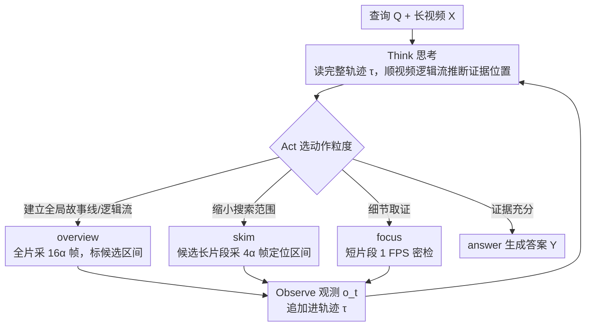

# VideoSeek: Long-Horizon Video Agent with Tool-Guided Seeking

**会议**: CVPR 2026  
**arXiv**: [2603.20185](https://arxiv.org/abs/2603.20185)  
**代码**: [https://github.com/jylins/videoseek](https://github.com/jylins/videoseek)  
**领域**: 视频理解 / Agent  
**关键词**: 视频Agent, 长视频理解, 工具调用, 逻辑流, think-act-observe

## 一句话总结
VideoSeek 提出一种长程视频 Agent，利用视频逻辑流主动"寻找"关键证据而非穷举解析所有帧，通过 think-act-observe 循环和多粒度工具包（overview/skim/focus），在 LVBench 上比基座模型 GPT-5 提升 10.2 个点的同时减少 93% 的帧使用量。

## 研究背景与动机
1. **领域现状**：视频语言理解近年因 LMM 进步而迅速发展。但主流方法（包括 Qwen2.5-VL、GPT-4o 等）仍采用单次推理范式——输入固定帧数后直接生成答案，在长视频和复杂推理场景下力不从心。视频 Agent 方法（如 DrVideo、DVD）虽引入迭代推理，但严重依赖密集视频预处理。
2. **现有痛点**：现有视频 Agent 以 0.2-2 FPS 密集采样并逐帧生成详细文本描述或结构化记忆，计算开销随视频长度线性增长。例如 DVD 在 LVBench 上需处理 8074 帧，MR.Video 也用了 8074 帧。然而在 LVBench 上超过 80% 的问题只需查看不到 5% 的视频即可回答——穷举解析极其浪费。
3. **核心矛盾**：详尽的视频预处理虽能提升准确率但代价极高且不可扩展。如何在极稀疏的视觉预算下实现甚至超越密集解析的效果？
4. **本文目标** 设计一种高效的视频 Agent，通过主动寻找关键证据而非暴力穷举来回答视频问题。
5. **切入角度**：人类不会逐帧观看视频来回答问题——他们利用时间和因果结构推断有用证据可能出现的位置，快速建立粗略故事线，检查有望的时间段，只在需要细节时才仔细观看。
6. **核心 idea**：用 ReAct 式 think-act-observe 循环和三层粒度工具（全局概览→粗略浏览→精细聚焦），基于视频逻辑流主动导航到答案关键帧。

## 方法详解

### 整体框架
VideoSeek 的出发点是把"回答一个长视频问题"从单步推理改写成一个长程探索问题：与其一次性塞进固定帧数让模型硬答，不如让一个 Agent 像人一样先扫一眼建立故事线、再翻到可疑的段落、最后在关键处定格细看。给定查询 $\mathbf{Q}$ 和视频 $\mathbf{X}$，Agent 在每个推理步 $t$ 产生一个 think-act-observe 三元组 $\langle z_t, a_t, o_t \rangle$——先想（$z_t$）、再调一个工具去看（$a_t$）、拿到新观测（$o_t$）——这些三元组串成轨迹 $\tau$，最终答案由 $p(\mathbf{Y}\mid\mathbf{X}, \mathbf{Q}, \tau)$ 生成。整个框架的目标是让探索过程 $p(\tau\mid\mathbf{X}, \mathbf{Q})$ 集中在少量高信息量的观测上，而非把帧铺满。Agent 默认用 GPT-5 当思考 LLM，最大推理轮次 $N=20$，全程无需训练。

### 关键设计

**1. 多粒度工具包：把"看视频"拆成三种由粗到细的动作**

视频 Agent 最大的浪费在于不分场合地密采样——无论问题难易都按固定 FPS 逐帧解析。VideoSeek 转而提供三个操作在不同时间粒度上的工具，让 Agent 自己决定每一步该用哪种"看法"。`<overview>` 从全视频均匀采样 $16\alpha$ 帧（LVBench 取 $\alpha=4$，即 64 帧），生成粗略故事线并标出值得关注的关键区间，通常在开头调用一次，给 Agent 一张全局认知地图；`<skim>` 对某个候选长片段均匀采样 $4\alpha$ 帧（片段最短 $4\alpha$ 秒），用来快速判断"查询相关的时刻大概落在这段的哪里"，可以反复在不同片段上调用、一层层把搜索范围缩窄；`<focus>` 则以 1 FPS 高帧率密检一个短片段（最长 $4\alpha$ 秒），专门对付需要逐字读、数物体、认人脸这类细节，作为最终定格确认答案。三者互补——概览发现结构、浏览定位区间、聚焦取证，缺任一层都会让导航在某个尺度上失明（消融里去掉 `<overview>` 直接掉 13.3 个点）。

**2. Think-Act-Observe 循环：在完整轨迹上动态决策，而非按固定脚本走**

人看视频不会机械地"先全看一遍再逐段细看"，而是边看边改主意。VideoSeek 用 ReAct 架构实现这种自适应：每一步 thinking LLM 都读入到目前为止的完整轨迹（所有历史思考、动作、观测），输出新的推理 $z_t$ 和一个工具调用计划 $a_t$；若 $a_t$ 是 `<answer>` 就解析答案并停止，否则执行工具拿到新观测 $o_t$ 追加进轨迹，进入下一轮。关键不在于工具本身，而在于 Agent 是基于不断累积的观测临场决定下一步看哪里、用多细的粒度看，而不是按预定义的"粗到细"规则照本宣科。相比 DrVideo/DVD 那种先把整段视频预建成数据库再检索、或 VCA 维护一个固定记忆缓冲区的做法，直接在完整对话历史上推理让 Agent 能回溯早先的观测、修正之前的误判、甚至掉头换一个搜索方向。

**3. 利用视频逻辑流：靠时间-因果结构推断证据在哪，而不是盲扫**

视频不是一堆无序的帧，而是带着场景因果、时间顺序、角色关系的内在逻辑流；VideoSeek 的核心赌注就是让 Agent 顺着这条逻辑流去推断"答案大概出现在什么位置"。当视频带字幕时，这条逻辑流以文本故事线的形式被直接暴露出来，Agent 几乎可以读着字幕就跳到相关片段；没有字幕时，则由 `<overview>` 的视觉摘要现场构建一条粗略的逻辑流来替代。逻辑流是否被显式暴露，直接决定了导航效率——LVBench 上加入字幕后，帧使用量从 92.3 降到 27.2、准确率反而从 68.4 升到 76.7，说明把逻辑流摆到明面上能让 Agent 用更少的观测找到更准的证据。

### 一个完整示例

设想在一段约一小时的长视频上回答"主角在结尾的颁奖典礼上把奖杯递给了谁"。Agent 第一步调 `<overview>`，从全片均匀采到 64 帧，建立故事线并标记出几个候选区间——开场、中段冲突、片尾典礼；它在 $z_t$ 里推理"颁奖典礼应在视频后段"，于是第二步对后 1/4 这个长片段调 `<skim>`，采 $4\alpha$ 帧确认典礼确实在这里、并进一步锁定到典礼内"主角上台"那十几秒；判断已经缩到足够窄后，第三步对这十几秒调 `<focus>`，以 1 FPS 密检，逐帧看清奖杯递到了谁手里，读出对方胸牌上的名字；此时证据已充分，第四步直接输出 `<answer>`。整条轨迹只用了 4 轮、几十帧（LVBench 平均约 4.42 轮、92.3 帧），却把一个需要在上万帧里大海捞针的问题，收敛成"全局→区间→定格"三跳——这正是穷举式密采样（如 DVD 的 8074 帧）所避不开的浪费。

### 训练策略
VideoSeek 是一个无需训练的 Agent 框架（model-agnostic），直接复用 GPT-5 现成的推理与工具使用能力，工具返回的视觉观测也由 GPT-5 解读，没有任何参数更新。

## 实验关键数据

### 主实验

| 方法 | 类型 | LVBench (无字幕) | 帧数 | LVBench (有字幕) | 帧数 |
|------|------|-----------------|------|-----------------|------|
| GPT-5 (Base) | LMM | 60.1 | 384 | 66.5 | 384 |
| Gemini 1.5 Pro | LMM | 33.1 | 3600 | - | - |
| DVD | Agent | 74.2 | 8074 | 76.0 | 8074 |
| MR. Video | Agent | 60.8 | 8074 | - | - |
| **VideoSeek** | **Agent** | **68.4** | **92.3** | **76.7** | **27.2** |

VideoMME Long (有字幕): VideoSeek 81.2% / 15.9帧 vs GPT-5 78.1% / 384帧
LongVideoBench Long: VideoSeek 73.5% / 29.6帧 vs GPT-5 64.5% / 384帧

### 消融实验

| 配置 | LVBench (无字幕) | 说明 |
|------|-----------------|------|
| Full toolkit | **68.4** | 完整模型 |
| w/o overview | 55.1 (-13.3) | 失去全局视角 |
| w/o skim | 62.4 (-6.0) | 失去中间粒度浏览 |
| w/o focus | 63.7 (-4.7) | 失去精细检查 |

| Thinking LLM | 帧数 | 轮次 | LVBench |
|--------------|------|------|---------|
| GPT-5 | 92.3 | 4.42 | **68.4** |
| o4-mini | 112.6 | 5.08 | 58.5 (-9.9) |
| GPT-4.1 | 74.2 | 2.99 | 53.0 (-15.4) |

### 关键发现
- **overview 是最关键的工具**（去掉后降 13.3 个点），因为它提供全局故事线和逻辑流——这是后续所有导航的基础
- **推理能力决定上限**：GPT-4.1（非 thinking model）倾向于过早自信地停止推理（仅 2.99 轮），导致证据不足；o4-mini 虽然多探索但推理质量差，额外计算不能转化为更好性能
- **字幕 = 显式逻辑流**：加入字幕后帧使用量降 70%（92.3→27.2）但准确率升 8.3 个点，证明文本故事线极大地简化了证据搜索
- **vs DVD**：VideoSeek 有字幕时超过 DVD（76.7 vs 76.0），仅使用 0.3% 的帧数（27.2 vs 8074）
- 在 Video-Holmes 复杂推理基准上，VideoSeek 47.3% 超过 Gemini 2.5 Pro 的 45.0%，帧数仅为其 1/4

## 亮点与洞察
- **"主动寻找"vs"穷举解析"**的范式转变：这是本文最深刻的贡献。VideoSeek 证明了在长视频理解中，聪明的导航比暴力的密集采样有效得多——用 1% 的帧就能达到甚至超过密集方法。这符合人类认知的经济性原则
- **工具包设计的层次美感**：overview/skim/focus 三层粒度恰好对应人类的"扫一眼→翻阅→细看"行为，简单直觉却效果显著。特别是 overview 的全局概览价值远超预期（贡献 13.3 个点）
- **thinking model 是核心引擎**：非 thinking 模型无法有效使用这个框架——需要真正的推理能力来判断"证据是否充分"、"下一步应该看哪里"。这暗示了 Agent 系统对底层推理模型的高依赖

## 局限与展望
- 完全依赖闭源模型 GPT-5，无法开源复现和在成本敏感场景中部署
- 对突发或高度局部化的关键时刻（如异常检测）效果可能较差——逻辑流驱动的导航难以预见意外事件
- 每次工具调用都需要 LMM 解读视觉内容，API 调用成本可能很高
- 未探索如何将这种 Agent 框架蒸馏到更小的开源模型中
- 工具的超参数（$\alpha$、最大帧数等）需要针对不同基准调整

## 相关工作与启发
- **vs DVD Agent**: DVD 构建多粒度视频数据库再检索，需要 8074 帧预处理。VideoSeek 按需探索，帧数降两个数量级但性能相当（无字幕）或更好（有字幕）
- **vs DrVideo**: DrVideo 以 0.2 FPS 将视频转为长文档，属于穷举范式。VideoSeek 证明穷举不必要
- **vs 单次推理 LMM**: GPT-5 单次 384 帧得 60.1%，VideoSeek 同一模型通过 Agent 框架提升到 68.4%/76.7%，说明 Agent 范式能释放基座模型的潜力

## 评分
- 新颖性: ⭐⭐⭐⭐ "主动寻找而非穷举"的理念有价值，但 ReAct + 工具调用的框架并非全新
- 实验充分度: ⭐⭐⭐⭐⭐ 四个基准、有无字幕对比、Thinking LLM 消融、工具消融，分析非常深入
- 写作质量: ⭐⭐⭐⭐⭐ 叙事流畅，Figure 1 的效率-性能对比一目了然，case study 清晰
- 价值: ⭐⭐⭐⭐ 对视频 Agent 效率优化有重要启示，但闭源依赖限制了社区影响力

<!-- RELATED:START -->

## 相关论文

- [\[CVPR 2026\] SVAgent: Storyline-Guided Long Video Understanding via Cross-Modal Multi-Agent Collaboration](svagent_storyline_guided_long_video_understanding_via_cross_modal_multi_agent_collaboration.md)
- [\[CVPR 2026\] META: Meta Evolution of Tool Trajectory Adaptation for Long-Video Understanding](meta_meta_evolution_of_tool_trajectory_adaptation_for_long-video_understanding.md)
- [\[CVPR 2026\] LongVT: Incentivizing "Thinking with Long Videos" via Native Tool Calling](longvt_incentivizing_thinking_with_long_videos_via_native_tool_calling.md)
- [\[CVPR 2026\] A Multi-Agent Perception-Action Alliance for Efficient Long Video Reasoning](a_multi-agent_perception-action_alliance_for_efficient_long_video_reasoning.md)
- [\[CVPR 2026\] Question-guided Visual Compression with Memory Feedback for Long-Term Video Understanding](question-guided_visual_compression_with_memory_feedback_for_long-term_video_unde.md)

<!-- RELATED:END -->
